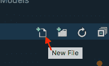

# 使用创建 RazorPage 应用程序。网络核心 CLI

> 原文：<https://dev.to/spboyer/create-razorpage-apps-using-net-core-cli-22e7>

见[tattoocoder.com](https://tattoocoder.com/creating-razorpage-apps-using-the-cli/)的完整帖子

当我最近用 [Razor Pages](https://docs.microsoft.com/aspnet/core/mvc/razor-pages/?view=aspnetcore-2.1&tabs=netcore-cli&WT.mc_id=blog-twitter-shboyer) 创建一个测试应用程序时，我发现当我想添加一个新页面时，我自己在 VS 代码中点击了太多次“新建文件”按钮。

[T2】](https://res.cloudinary.com/practicaldev/image/fetch/s--UYpvYqQX--/c_limit%2Cf_auto%2Cfl_progressive%2Cq_auto%2Cw_880/https://tattoocoder.com/conteimg/2018/05/Screen-Shot-2018-05-03-at-4.08.47-PM.png)

我真的很喜欢。我发现，在每一个版本中，似乎都有一些东西被添加到了核心功能或模板中。运行`dotnet new`这一次，我发现了`page`模板...

[T2】](https://res.cloudinary.com/practicaldev/image/fetch/s--NSYaXATh--/c_limit%2Cf_auto%2Cfl_progressive%2Cq_66%2Cw_880/https://tattoocoder.com/conteimg/2018/05/what.gif)

[Razor Pages](https://docs.microsoft.com/aspnet/core/mvc/razor-pages/?view=aspnetcore-2.1&tabs=netcore-cli&WT.mc_id=blog-twitter-shboyer) 是一个超级简单的网络应用程序，现在使用 CLI 添加附加页面也同样简单。期待一些其他的搭建部分进入 CLI，以及我在测试期帮助构建的先前的`yo aspnet`功能。