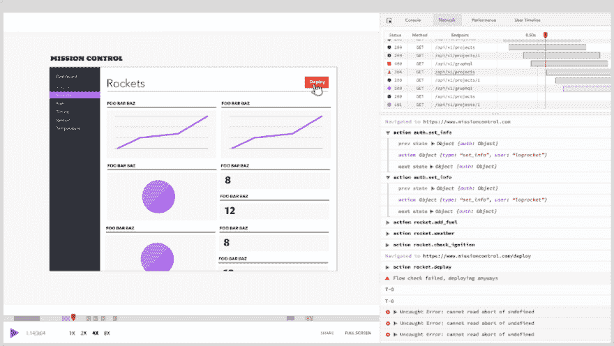

# 创建 React 应用程序:快速设置指南

> 原文：<https://dev.to/bnevilleoneill/create-react-app-a-quick-setup-guide-36cl>

Create React App 是创建 React App 最流行的工具之一。

只需三个依赖项，您就可以获得对 React、JSX、ES6、polyfills、开发服务器、自动前缀 CSS、测试、服务工作者以及许多其他东西的支持。

这篇文章提供了一个快速指南，用这个工具设置一个 React 应用程序，并配置它的一些更重要的特性。

使用此工具的唯一先决条件是安装 Node.js 版本 6 或更高版本。

### 创建 React 应用

使用以下命令之一创建新应用:

```
#Using npx
npx create-react-app app-name

#Using npm init <initializer>
npm init react-app app-name

#Using yarn 0.25+
yarn create react-app app-name 
```

这些命令使用应用程序的给定应用程序名称、初始项目结构(参见模板[此处](https://github.com/facebook/create-react-app/tree/master/packages/react-scripts/template))创建一个目录，并安装数百个包作为依赖项。

现在，如果您查看生成的 package.json 文件，您只会看到三个依赖项:react、react-dom 和 react-scripts。

react-scripts 是处理所有配置的库，并带来了项目的大多数依赖项，如 babel、eslint 和 webpack(如果你好奇，请查看其 [package.json](https://github.com/facebook/create-react-app/blob/next/packages/react-scripts/package.json) 文件中的完整列表)。

理解 React-脚本是理解 Create React 应用程序内部工作的关键。

[T2】](https://logrocket.com/signup/)

### 升级依赖项的版本

依赖关系如此之少的一个好处是它们很容易升级(或降级)。

您只需使用标记--save--save-exact 执行 npm install 来指定确切的版本。将更新 package.json 并下载新版本的依赖项。

例如，要更改到 react-scripts 的版本 1.1.4，请执行:

```
npm install --save --save-exact react-scripts@1.1.4
# or yarn add --exact react-scripts@1.1.4 
```

另外，不要忘记查阅 [react-scripts](https://github.com/facebook/create-react-app/blob/master/CHANGELOG.md) 和 [react](https://github.com/facebook/react/blob/master/CHANGELOG.md) 的变更日志，寻找突破性的变更。

### 配置林挺

ESLint 是默认配置的(你可以在这里看到配置[，它的输出显示在终端和浏览器控制台上。](https://github.com/facebook/create-react-app/blob/next/packages/eslint-config-react-app/index.js)

在撰写本文时，[您不能覆盖这个配置](https://github.com/facebook/create-react-app/issues/808)。如果你想加强一种编码风格，你可以安装并使用[更漂亮的](https://github.com/jlongster/prettier)(现在还没有集成)。

您唯一能做的就是通过为您的编辑器安装一个 ESLint 插件并将一个. eslintrc 文件添加到项目根目录:
来配置您的代码编辑器以报告林挺警告

```
{
  "extends": "react-app"
} 
```

或者，您可以将您的自定义规则添加到该文件中，但是它们只能在您的编辑器中工作。

非正式地，您可以使用类似于 [react-app-rewired 的东西来覆盖默认配置](https://medium.com/@adamdziendziel/custom-eslint-config-with-create-react-app-d6f66e8d61)。

### 启动应用程序

要运行应用程序，请执行 npm start，这是:
的快捷方式

```
react-scripts start 
```

这个脚本执行一个 Webpack 开发服务器:

*   启用热重新加载(如果您对应用程序进行了更改，将在浏览器中重新加载以反映该更改)
*   默认情况下使用端口 3000(如果所选端口被占用，则使用另一个端口)

在 mac 中，如果安装了 Chrome，应用程序会在 Chrome 中打开。否则，像在其他操作系统中一样，使用默认浏览器。

此外，错误会显示在控制台终端和浏览器中。

你可以在这里看到完整的启动脚本[。](https://github.com/facebook/create-react-app/blob/master/packages/react-scripts/scripts/start.js)

### 添加图片和样式

添加图像、样式或其他文件(如字体)时，您有两种选择:

*   src 文件夹，使用模块系统
*   公共文件夹，作为静态资产

放在 src 文件夹中的所有东西都将由 Webpack 处理，这意味着文件将被缩小并包含在构建时生成的包中。

这也意味着资产可以用 JavaScript 导入:

[https://medium . com/media/8d 09 C1 dfe 8698 c 51 b 20 b 275d 34606d 75/href](https://medium.com/media/8d09c1dfe8698c51b20b275d34606d75/href)

导入小于 10，000 字节的图像会返回数据 URI，而不是实际图像的路径，只要它们具有以下扩展名:

*   位图文件的扩展名(Bitmap)
*   GIF 格式
*   JPG 或 JPEG
*   PNG

使用这个文件夹的另一个好处是，如果没有正确引用文件(或者不小心删除了文件)，就会产生编译错误。

另一方面，您也可以将文件添加到 public 文件夹中，但是，您将错过上述优势，因为它们不会被 Webpack 处理，它们只会被复制到 build 文件夹中。

另一件事是，您不能引用公共文件夹中 src 文件夹内的文件。

但是，要引用 public 文件夹中的文件，可以像这样使用变量 PUBLIC_URL:

[https://medium . com/media/824 edbf 058 cf 2c 65 a 74 F3 DD 5 af 2 F5 CDC/href](https://medium.com/media/824edbf058cf2c65a74f3dd5af2f5cdc/href)

或者使用 JavaScript 中的变量 process.env.PUBLIC_URL:

[https://medium . com/media/4f 776182 c 834042 fabccd 299 c 9 D4 C1 c 0/href](https://medium.com/media/4f776182c834042fabccd299c9d4c1c0/href)

### 设置环境变量

除了变量 PUBLIC_URL 之外，还有一个特殊的内置环境变量 NODE_ENV，它不能被覆盖:

*   使用 npm 时，开始重视发展
*   使用 npm 时，运行构建采用生产值
*   当使用 npm 测试时，采用值测试

您还可以定义将在构建时注入的自定义环境变量。它们必须以 REACT_APP_ 开头，否则将被忽略。

您可以使用终端来定义它们:

```
#Windows
set "REACT\_APP\_TITLE=App" && npm start

#Powershell
($env:REACT\_APP\_TITLE = "App") -and (npm start)

#Linux and mac
REACT\_APP\_TITLE=App npm start 
```

或者项目根目录中的下列文件之一(左边的文件比右边的文件优先级高):

*   当使用 NPM start:. env.development . local，. env . development，. env.local .包封/包围（动词 envelop 的简写）
*   使用 npm 时，运行 build: .env.production.local，. env.production，. env.local .包封/包围（动词 envelop 的简写）
*   使用 npm 测试时:. env.test.local，. env.test，.包封/包围（动词 envelop 的简写）

如前所述，所有这些变量都可以在组件内与 process.env 一起使用:

[https://medium . com/media/de 7b 9a 0067 ffad 0331861 D3 AC 4312208/href](https://medium.com/media/de7b9a0067ffad0331861d3ac4312208/href)

或者在 public/index.html 中:

[https://medium . com/media/10 CBE 804 b 6 AC 23 c 24 a1 ca 1 DD 29 EB 31 EC/href](https://medium.com/media/10cbe804b6ac23c24a1ca1dd29eb31ec/href)

除了 NODE_ENV 之外，您还可以为开发设置设置其他预定义的环境变量，如浏览器、主机和端口，以及一些生产设置，如 PUBLIC_URL 和 GENERATE_SOURCEMAP。

点击查看完整列表[。](https://github.com/facebook/create-react-app/blob/master/packages/react-scripts/template/README.md#advanced-configuration)

### 代理服务器请求

在同一个服务器和端口上服务你的应用的前端和后端是很常见的。但是，您不能在开发时这样做，因为 Create React App 在其自己的开发服务器中运行应用程序。

所以你有三个选择。

第一种方法是在另一个端口上运行后端服务器，并发出如下请求:

[https://medium . com/media/f0df 56 e 51008 E5 c 450 ff 383 f 05 AAC 977/href](https://medium.com/media/f0df56e51008e5c450ff383f05aac977/href)

使用这种方法，您需要在您的服务器上设置 [CORS](https://en.wikipedia.org/wiki/Cross-origin_resource_sharing) 头[。](https://enable-cors.org/server_expressjs.html)

第二个是通过向 package.json 文件添加一个代理字段，告诉开发服务器将任何请求代理到您的后端服务器。例如，使用:

[https://medium . com/media/7a 25144 cc3 BC 20 EB 83 f 38997 FD 7d 7 e 04/href](https://medium.com/media/7a25144cc3bc20eb83f38997fd7d7e04/href)

而不是提出这样的请求:

[https://medium . com/media/f0df 56 e 51008 E5 c 450 ff 383 f 05 AAC 977/href](https://medium.com/media/f0df56e51008e5c450ff383f05aac977/href)

重新启动服务器后，您应该像这样设置它们:

[https://medium . com/media/40 add 1 bb 04912 f 819179 cf 374 BD 2 ed 70/href](https://medium.com/media/40add1bb04912f819179cf374bd2ed70/href)

如果这还不够，第三个选项是单独配置每个端点的代理，如下所示:

[https://medium . com/media/04d 7d 00 ede 69 e 2 fa 89 EB 6618 e 5540685/href](https://medium.com/media/04d7d00ede69e2fa89eb6618e5540685/href)

配置属性与 [http-proxy-middleware](https://github.com/chimurai/http-proxy-middleware#options) 或 [http-proxy](https://github.com/nodejitsu/node-http-proxy#options) 支持的属性相同。

### 配置渐进式 web 应用程序

src/index.js 中注册了一个[服务工作者](https://developers.google.com/web/fundamentals/primers/service-workers/)，如果不想启用它，只需移除对 registerServiceWorker()的调用。

服务人员仅在应用程序的生产版本中启用。但是，如果已经执行了应用程序，则服务人员将已经安装在浏览器中，应该使用 unregister()将其移除:

[https://medium . com/media/7 d6d 19 d3d 882 CB 33484 af ddf 258034 e 2/href](https://medium.com/media/7d6d19d3d882cb33484afddf258034e2/href)

服务人员需要 HTTPS(否则注册将失败，尽管应用程序将保持功能)。然而，为了便于本地测试，这并不适用于本地主机。

在 public/manifest.json 中有一个 [web 应用清单](https://developers.google.com/web/fundamentals/web-app-manifest/)，您可以在其中配置应用名称、图标和其他关于您应用的元数据。

### 测试 app

Create React App 使用 [Jest](https://facebook.github.io/jest/) 作为其测试运行器，使用 [jsdom](https://github.com/jsdom/jsdom) 来提供浏览器全局变量，如窗口或文档。

测试文件应该遵循以下命名约定:

*   如果它们以。js/。jsx/。mjs，文件应该位于名为 __tests__(匹配表达式/src/**/__tests__/**/*的目录中。{js，jsx，mjs})
*   它们应该以. test.js 或. specs.js 结尾(匹配表达式/src/**/？(*.)(spec|test)。{js，jsx，mjs})

执行 npm 测试将通过执行脚本来运行测试:

```
react-scripts test --env=jsdom 
```

你可以在这里看到完整的脚本[。](https://github.com/facebook/create-react-app/blob/master/packages/react-scripts/scripts/test.js)

测试将在观察模式下运行。每次保存文件时，测试都会重新运行。然而，这种模式还包括一个交互式命令行界面，可以选择输入测试名称模式，以避免运行所有测试。

如果您只需要在运行测试之前执行或配置一些东西，那么将它添加到文件 src/setupTests.js 中，它将在任何测试之前自动执行。

如果您需要一个覆盖率报告，您可以执行命令 npm test - coverage，可以选择在 package.json 文件中配置选项:

*   [collectCoverageFrom](https://jestjs.io/docs/en/configuration.html#collectcoveragefrom-array) 表示应该为其收集覆盖信息的一组文件。
*   [coverageReporters](https://jestjs.io/docs/en/configuration.html#coveragereporters-array-string) 表示撰写覆盖报告时的格式。
*   [coverageThreshold](https://jestjs.io/docs/en/configuration.html#coveragethreshold-object) 为覆盖率结果配置最小阈值实施。
*   [snapshot serializer](https://jestjs.io/docs/en/configuration.html#snapshotserializers-array-string)指定序列化值的函数的路径列表。

例如:

[https://medium . com/media/ee ABC 062 b 44 ed 8 fcd 1 c 7 e 9d 840544 AFC/href](https://medium.com/media/eeabc062b44ed8fcd1c7e9d840544afc/href)

### 部署 app

您可以使用 npm run build 在构建目录中创建应用程序的生产版本，这是一个快捷方式:

```
react-scripts build 
```

你可以在这里看到完整的脚本[。](https://github.com/facebook/create-react-app/blob/master/packages/react-scripts/scripts/build.js)

在这之后，你可以将这个构建目录的内容复制到一个 web 服务器上，或者使用像 [http-server](https://github.com/indexzero/http-server) 或 [serve](https://github.com/zeit/serve) 这样的包来测试这个目录中的应用程序。

需要考虑的一点是，Create React App 假设您将在服务器根托管您的应用程序。如果不是这样，您需要在 package.json 文件中指定 homepage 字段，以便可以推断出正确的根路径:

[https://medium . com/media/ee5e 5124 db 9 FCC C5 d 79 a 920 ebf 6 DC 558/href](https://medium.com/media/ee5e5124db9fccc5d79a920ebf6dc558/href)

但是，如果您没有使用带有 HTML5 推状态历史 API 的路由器，或者根本没有使用路由，您可以使用点号来确保所有资源路径都相对于 index.html:

[https://medium . com/media/db 11303 EB 0 BC 0 fafc 26 bccf 84d 6 d0a 12/href](https://medium.com/media/db11303eb0bc0fafc26bccf84d6d0a12/href)

在 Create React App 的用户手册中，您可以找到使用以下方法部署应用的说明:

*   [快递](https://github.com/facebook/create-react-app/blob/master/packages/react-scripts/template/README.md#other-solutions)
*   [蔚蓝色](https://github.com/facebook/create-react-app/blob/master/packages/react-scripts/template/README.md#azure)
*   [燃烧基地](https://github.com/facebook/create-react-app/blob/master/packages/react-scripts/template/README.md#firebase)
*   github pages
*   [Heroku](https://github.com/facebook/create-react-app/blob/master/packages/react-scripts/template/README.md#heroku)
*   [Netlify](https://github.com/facebook/create-react-app/blob/master/packages/react-scripts/template/README.md#netlify)
*   [现在](https://github.com/facebook/create-react-app/blob/master/packages/react-scripts/template/README.md#now)
*   [S3 和云锋](https://github.com/facebook/create-react-app/blob/master/packages/react-scripts/template/README.md#s3-and-cloudfront)
*   [浪涌](https://github.com/facebook/create-react-app/blob/master/packages/react-scripts/template/README.md#surge)

### 弹出应用程序

弹出会将所有配置文件、脚本和依赖项复制到您的项目中，同时删除对 react-scripts 的依赖。

执行 npm run eject 以执行此操作。

以下是输出的摘录:

[T2】](https://res.cloudinary.com/practicaldev/image/fetch/s--msed7PyH--/c_limit%2Cf_auto%2Cfl_progressive%2Cq_auto%2Cw_880/https://cdn-images-1.medium.com/max/960/0%2A4msZVtYhbYoIRDo1)

这里你可以看到它执行的整个脚本。

此操作无法恢复。当工具提供的配置选项对您来说不够用时，请使用它。

### 结论

这篇文章介绍了使用 Create React App 时可以配置的最重要的特性。现在你可能想仔细看看 Create React 应用的核心 [react-scripts](https://github.com/facebook/create-react-app/tree/master/packages/react-scripts) ，以深入了解它是如何工作的。

此外，尽管 Create React App 是一个受欢迎的工具，但它并不适合所有人。根据您正在开发的应用程序的类型，可能有更好的选择。比如静态站点的 [Gatsby](https://github.com/gatsbyjs/gatsby) 或者服务器端渲染的 [Next.js](https://github.com/zeit/next.js/) 。在这里咨询[更多选择](https://github.com/facebook/create-react-app#popular-alternatives)。

最后，这里有一些可能对你有帮助的指南:

*   [如何让“创建-反应-应用”与您的 API 一起工作](https://www.fullstackreact.com/articles/using-create-react-app-with-a-server/)
*   [将 create-react-app 项目升级到 SSR +代码分割设置](https://medium.com/bucharestjs/upgrading-a-create-react-app-project-to-a-ssr-code-splitting-setup-9da57df2040a)
*   [定制 create-react-app:如何制作自己的模板](https://auth0.com/blog/how-to-configure-create-react-app/)
*   [使用 VS 代码](https://itnext.io/create-react-app-with-vs-code-1913321b48d)创建-反应-应用程序
*   [使用 create-react-app 编写并反应:设置你的第一个应用程序的逐步指南](https://dev.to/treyhuffine/typescript-and-react-using-create-react-app-a-step-by-step-guide-to-setting-up-your-first-app-1a4b-temp-slug-5016321)

### Plug: [LogRocket](https://logrocket.com/signup/) ，一款适用于网络应用的 DVR

[](https://logrocket.com/signup/)

<figcaption>[https://logrocket.com/signup/](https://logrocket.com/signup/)</figcaption>

LogRocket 是一个前端日志工具，可以让你回放问题，就像它们发生在你自己的浏览器中一样。LogRocket 不需要猜测错误发生的原因，也不需要向用户询问截图和日志转储，而是让您重放会话以快速了解哪里出错了。它可以与任何应用程序完美配合，不管是什么框架，并且有插件可以记录来自 Redux、Vuex 和@ngrx/store 的额外上下文。

除了记录 Redux 操作和状态，LogRocket 还记录控制台日志、JavaScript 错误、堆栈跟踪、带有头+正文的网络请求/响应、浏览器元数据和自定义日志。它还使用 DOM 来记录页面上的 HTML 和 CSS，甚至为最复杂的单页面应用程序重新创建像素级完美视频。

免费试用。

* * *