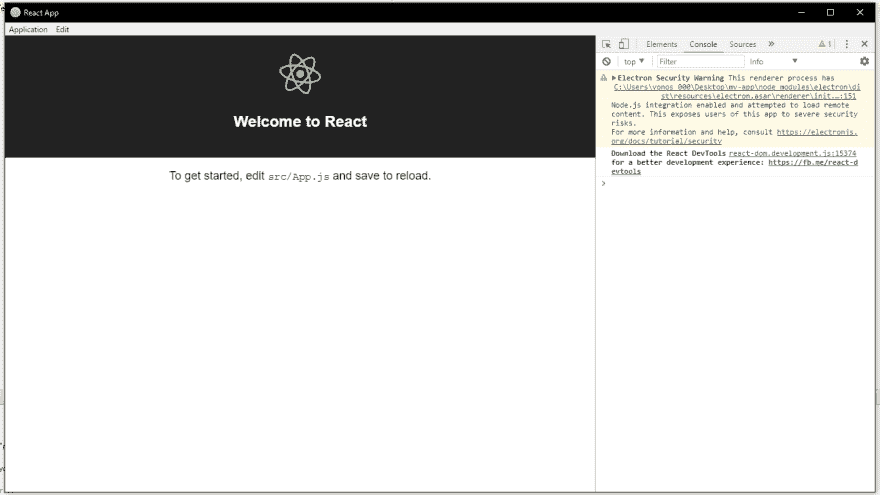
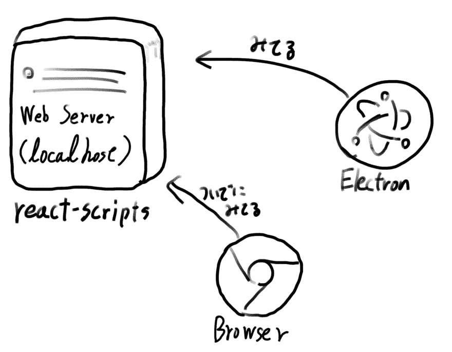
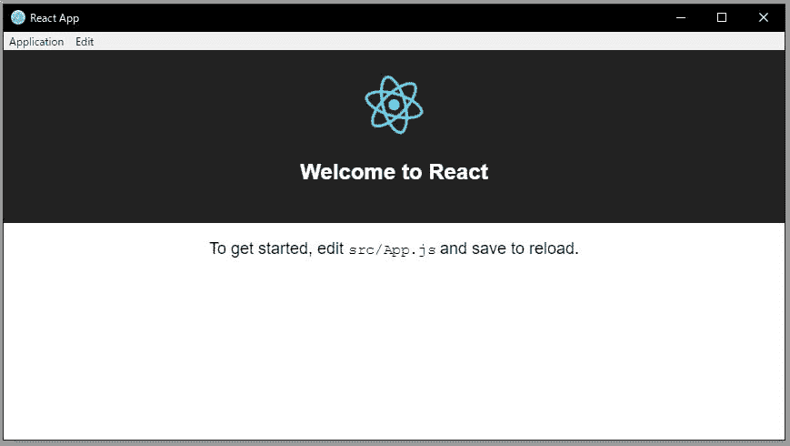
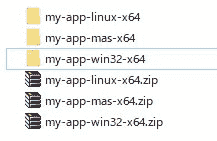

# 试着制作 react + electron APP 吧

> 原文：<https://dev.to/origamium/create-reactelectron-application-in-quickly--36nl>

你好。 省去开场白，马上做。

# 创建应用程序

## 01:创建-反应-应用

首先是创建就绪应用程序。 如果没有的话请做`npm install -g create-react-app`。
如果顺利的话，用`yarn start`启动吧。 做了吗？ 确认顺利后马上停止作业吧。 再也不会执行`yarn start`了。

## 02:安装一些包

请安装以下软件包。 因为是最新的，所以应该没有问题。 请不要忘记在安装时全部加上`--dev-dependencies`。 算了，忘了也行。

*   电子
*   NPM-运行-全部

## 03:设置电子

[请参阅此处的 gist。](https://gist.github.com/origamium/7d8edd3960fa7c3f813a8f3b25d8c5d7)
接下来请将`electron-starter.js`、`electron-wait-react.js`、`application.js`配置在`src/`以下。 写了很多，稍后说明。

## 04: package.json

在`package.json`中追加到 main、homepage、还有 scripts 中。 要是能变成以下这样就好了。

```
{  "name":  "my-app",  "version":  "0.1.0",  "private":  true,  "main":  "src/electron-starter.js",  "homepage":  "./",  "dependencies":  {  "react":  "^16.2.0",  "react-dom":  "^16.2.0",  "react-scripts":  "1.1.1"  },  "scripts":  {  "start":  "react-scripts start",  "build":  "react-scripts build",  "test":  "react-scripts test --env=jsdom",  "eject":  "react-scripts eject",  "electron:dev":  "electron .",  "dev":  "npm-run-all --parallel electron:dev start"  },  "devDependencies":  {  "electron":  "^1.8.2",  "npm-run-all":  "^4.1.3",  }  } 
```

Enter fullscreen mode Exit fullscreen mode

有几个很有意思的地方，稍后再解说。 现在请只是接受这个。 但是名字可以随便改哦。

## 05 开始！

那么，行动的时候终于到了。 执行`yarn dev`或`npm run dev`，确认浏览器和 Electron 启动，显示相同的画面。
[](https://res.cloudinary.com/practicaldev/image/fetch/s--GJmtQy4l--/c_limit%2Cf_auto%2Cfl_progressive%2Cq_auto%2Cw_880/https://thepracticaldev.s3.amazonaws.com/i/wq2igybejlct8djihkwi.jpg)
另外，我们也试试此时热负载已经在 Electron 端发挥作用了。 故意弄错`src/App.js`的语法，确认浏览器和 Electron 的画面都发生错误。

连热道都确认了的话，恭喜你！ 你用 React 成功制作了 electron APP 应用程序。
那么，应该有几个在意的地方。 那些在下一项中说明。

# 解释创建应用程序

## 结构

这次的 electron APP 应用的结构比较简单。 Electron 只是访问并显示由`react-scripts`启动的 Web 服务器。 真的只有这个！ 不用作图，让我们来作图吧。

[T2】](https://res.cloudinary.com/practicaldev/image/fetch/s--giSSURaE--/c_limit%2Cf_auto%2Cfl_progressive%2Cq_auto%2Cw_880/https://thepracticaldev.s3.amazonaws.com/i/tzgkfp6m0fmwkt4jfzfm.jpg)

顺便说一下，`react-scripts`和`electron`分别由`npm-run-all`启动。 此时两个正在同时启动。

## 安全预警？

首先，如果您正在用最新的 Electron 开发，执行`yarn dev`或`npm run dev`时，console 应该会发出以下警告。

```
Electron Security Warning This renderer process has Node.js integration enabled and attempted to load remote content. This exposes users of this app to severe security risks.
For more information and help, consult https://electronjs.org/docs/tutorial/security 
```

Enter fullscreen mode Exit fullscreen mode

总之，这是“总觉得在用 Electron 看网页，如果在这里输入了恶意代码的话会发生很糟糕的事情的！ ”的警告。
为什么会出现这个警告，这是不言自明的吧？ 在此次(开发时的)设定中，由于使用 Electron 访问的不是静态的 HTML 或 Javascript 文件，而是在 localhost 上启动的 Web 服务器`localhost:[port number]`，因此发生了该错误。
当然，构建时会让 Electron 读取构建的静态 html、css、javascript 文件而不是 Web 服务器，因此不会发生该安全警告。 请放心。 您的 electron APP 应用程序(目前)很安全！

## package.json

我刚才什么也没说，一直在`package.json`上添加了以下项目。

```
"homepage":  "./" 
```

Enter fullscreen mode Exit fullscreen mode

如果你没有将这个项目添加到`package.json`中，就应该马上添加。 这个项目在开发的时候完全没有效果，但是在构建的时候是非常重要的项目。
如果暴露了，执行`react-scripts build`时，输出的`index.html`是为了以`package.json`所在的目录为基础，访问同样构建的 Javascript 文件和 CSS 文件而被设定的。
有点难懂吗？ 总之，如果没有这个设定的话，在执行`react-scripts build`的时候，文件们就不能很好地建立关系，只要记住这样的情况就可以了。

# 构建和发布

## 01 设置

好了，时机终于到了，想发布你的 electron APP 应用的时候到了。
因为这次很懒，所以不做 autoupdater 等的解说。 但是，请在 npm 中将`electron-packager`和`asar`作为 devDependencies 安装。
并且，这是相当重要的，现在你的`package.json`的`"dependencies"`中应该有`react`、`react-dom`、`react-scripts`这 3 个内容。 (如果什么都没做的话)
让它全部默默地移动到`"devDependencies"`吧！ 什么，不会被发现的。

```
{  "name":  "my-app",  "version":  "0.1.0",  "private":  true,  "main":  "src/electron-starter.js",  "homepage":  "./",  "dependencies":  {  },  "scripts":  {  "start":  "react-scripts start",  "build":  "react-scripts build",  "test":  "react-scripts test --env=jsdom",  "eject":  "react-scripts eject",  "electron:dev":  "electron .",  "dev":  "npm-run-all --parallel electron:dev start"  },  "devDependencies":  {  "electron":  "^1.8.2",  "npm-run-all":  "^4.1.3",  "react":  "^16.2.0",  "react-dom":  "^16.2.0",  "react-scripts":  "1.1.1"  }  } 
```

Enter fullscreen mode Exit fullscreen mode

啊，天啊… `"dependencies"`空了。 但是请放心。 这是之后生效的、非常有效的、最好的设定。

## 02 打造

请执行`npm run build`或`yarn build`。

## 03 打包器

那么，我忘了设定`electron-packager`。 追加吧。 在`package.json`的 scripts 中添加以下语句。

```
 "package":  "electron-packager . my-app --platform=all --arch=x64 --prune --out=release --overwrite" 
```

Enter fullscreen mode Exit fullscreen mode

好了，试着实行一下吧。 `yarn package`或`npm run package`出场了。
很花时间。 3 分钟左右到 5 分钟之类的。 耐心等待吧。

## 04 快跑！

如果打包顺利的话，`release`目录中应该会发生各种二进制文件！
但是，在 macOS 和 linux 的情况下，没有 wine 就不会发生面向 win32 的内部版本。 同样，在 Windows 上，只有具有管理员权限的控制台才能生成针对 mas(macOS )的内部版本。 (为什么不能建立面向 darwin 的版本)
不假设看这篇文章的各位的操作系统。 请找一个可以在自己环境中工作的二进制文件。

[T2】](https://res.cloudinary.com/practicaldev/image/fetch/s--WSv2CJlD--/c_limit%2Cf_auto%2Cfl_progressive%2Cq_auto%2Cw_880/https://thepracticaldev.s3.amazonaws.com/i/sfnxyvj1kpafhmlpgdzd.jpg)

哇~！ 动了呢！ 并且，即使访问[http://localhost:5000](http://localhost:5000) ，由于 Web 服务器没有启动，所以什么也没有显示，而且在 console 中确认没有发生安全警告 这是正在读取静态文件的证据。
…那么，构建并没有到此结束。 再往前一点看看吧。

# 05 删除不必要的文件

`release`向目录倾诉的各种二进制文件中，隐藏着无用的文件。 特别是你在编辑器中使用的是 Visual Studio Code 的情况下，`.vscode`等直接放入二进制中。
…二进制这个词有点语病。 总之，请关注以下目录。

```
windows : /release/[app-name]-win32-x64/resources/app
darwin  : /release/[app-name]-darwin-x64/[app-name].app/Contents/Resources/app
mas     : /release/[app-name]-mas-x64/[app-name].app/Contents/Resources/app
linux   : /release/[app-name]-linux-x64/ 
```

Enter fullscreen mode Exit fullscreen mode

在 app 目录中。 `.gitignore`啊，居然连`src`目录都直接进入了…这是个问题！ 把它关掉吧。 但是，请注意 src 目录。 不能删除`electron-starter.js`和`electron-starter.js`。 这些文件和开发时一样，构建后的 Electron 也是要访问的文件。 把那之外的关掉吧。

```
app
│ package.json
│
├─build
├─node_modules
└─src
   │   application.js
   └   electron-starter.js 
```

Enter fullscreen mode Exit fullscreen mode

打扫后的目录结构应该是这样的状态。 哎呀，基本上不能对`build`和`node_modules`下手哦。 然后关掉`package.json`也不行。
(补充: build 目录中还输出了各种 map 文件。 如果是实际发布的话，删除`~.js.map`和`~.css.map`文件应该没问题吧)
这样就达到了实际上的最小状态。 请确保在此状态下 APP 应用程序仍能正常启动。

## 06 asar

现在，您可以保留以下版本中的每个 app 目录，但 Electron 建议使用 asar 压缩 app 目录。 在命令行中返回到上一个目录，用 asar 压缩 app。

```
> asar pack app app.asar 
```

Enter fullscreen mode Exit fullscreen mode

然后删除 app 目录。
请确认在这种状态下 APP 应用程序可以正常启动。

## 07 拉链申请

之后，如果用 ZIP 或什么压缩 release 目录以下的各个目录，就已经成为可以分发的二进制文件了。 恭喜你！

[T2】](https://res.cloudinary.com/practicaldev/image/fetch/s--DlTZLKPg--/c_limit%2Cf_auto%2Cfl_progressive%2Cq_auto%2Cw_880/https://thepracticaldev.s3.amazonaws.com/i/gilv3q913e4pnil9afy6.jpg)

但是，darwin(mas )也有在 APP 上签名的重要工序，但这次忽略了。 请各位调查。

# 解释构建和发布

## 为什么把所有的包从依赖项移到依赖项？(很重要！)

这应该看起来是相当奇怪的行动。 为什么要将所有软件包移动到 devDependencies？ 那和分发后的包装的尺寸有关。
先说大前提吧。 特别是这次，`react-scripts`是一个相当大的包装。 `react-scripts`的相关软件包总共超过了 100MB。 如果将此软件包包含在分发二进制文件中，仅这一项就会增加数百 MB 的大小。

顺便问一下，还记得作为 APP 发布时，在打包前执行了`react-scripts build`吗？ 执行 build 时，`react`和`react-dom`将它们全部汇总并打包输出到 build 目录以下的文件中。 这些都是因为`webpack`在背后起作用。
暂且不谈，现在 build 目录中的文件与 node_modules (几乎)无关地移动了。

也就是说，用`electron-packager`打包 electron APP 时，已经不需要`react-scripts`了！ 另外，那也可以说是对`react`和`react-dom`。 对于今后可能引进的`redux`、`react-redux`、`redux-saga`等软件包也是如此。 ***只在开发时和构建时需要的软件包全部放入 devDependencies (开发时的依存关系)中吧。***
冲进 devDependencies 的包装，`electron-packager`会全部去除。

但是，**也有例外**。 您知道 Electron 可以通过 render 进程—即 src/index.js 以下的某个时间—访问 Node.js 和使用它们的包吗？ [指的是 electron.remote.require ( )](https://github.com/electron/electron/blob/master/docs/api/remote.md)。
如果您使用 electron.remote.require 调用了使用 Node.js 的程序包，则***该程序包不能放入 dev dependencies*
为什么这么说，是因为那个包在运行时会从`node_modules`中被调用。**

同样，这次来说`application.js`等，Electron 直接读取的脚本中调用的程序包也同样不能放入***devDependencies 中***。 例如，`electron-about-window`等。
以上内容应该相当注意。 记住吧。

## 电子打包机为什么不用`--ignore`选项？

…这个我真的也不知道，但是从 Windows 开始使用`--ignore`选项的话，无论如何都会出现错误，有无法打包的问题…虽然还不清楚，但是使用 linux 和 macOS 的大家 请每次都用一下。 可以使用正则表达式模式在打包时删除不需要的文件。 另外，如果可以删除所有不需要的文件，用`--asar`选项自动进行到压缩为 asar 为止。
我怎么也做不到，所以自己写了构建脚本。 大家也应该随便写。

# 结论

这次，你注意到没有写任何网络包的设定文件吗？ 你知道了，只要不做相当复杂的事情(除非需要 eject )，就可以不写任何 webpack 的设定文件就能写 electron APP。 此外，在 create-react-app 中，也可以直接使用类型检查工具 Flow。
虽然是宣传，但也用与此大致相同的方法开发了[Tsuru](https://github.com/tsuruclient/tsuru) 。

本文为[how to build an electron app using create-react-app.no web pack configuration or“ejecting”necessary .](https://medium.freecodecamp.org/building-an-electron-application-with-create-react-app-97945861647c) 

# 更新

将 Foreman 替换为 npm-run-all。 这样，即使没有`Procfile`也可以执行，执行脚本全部控制在`package.json`的`scripts`内，容易管理。