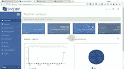

# 免费创建产品的视频演示

> 原文：<https://dev.to/shuhaid/create-video-walkthroughs-of-your-product-for-free-21o4>

最近，我们开始编写我们产品的用户手册，就在我们接近完成的时候，我们的用户开始要求提供产品的视频演示。

[T2】](https://i.giphy.com/media/l3q2K5jinAlChoCLS/giphy.gif)

不用说，我们开始质疑自己是否应该先做视频。那次讨论的结果是改天的话题。现在，这里是我们如何把我们的产品演示视频放在一起。

# 要求/约束

在开始创建演练之前，我们提出了以下要求。

*   音频+视频-尽量减少视频中的文本和注释。我们希望配音能引导用户体验这些功能。使用文本到语音服务，这将保持我们所有视频的声音一致。

*   易于创建-我们(小)团队的任何人都应该能够创建/编辑这些视频。

*   可维护性——当我们不断为产品添加特性或改变功能时。我们应该能够轻松地改变音频和视频内容。

*   预算限制-我们没有分配资金来创建视频演练。因此，需要以很少的成本或零成本来创建它。

# 解

经过几天寻找创建演练所需的工具，我们选定了以下工具。如果有(更好的)替代工具来执行相同的功能，我们将非常高兴收到您的来信。

### 音频

牢记这些要求，我们希望确保音频文件在产品更新时易于重新创建。为了创建我们的音频内容，我们选择了亚马逊波利。亚马逊 Polly 是一项将文本转化为栩栩如生的语音的服务。

以下是我们选择亚马逊 Polly 的原因:

*   我们能够用语音合成标记语言( [SSML](https://www.w3.org/TR/speech-synthesis11/) )创建我们的音频内容。除此之外，SSML 可以很容易地在音频中添加暂停，以允许屏幕加载或执行某个操作。它还使内容易于创建/编辑并添加到我们的源代码控制中。我们的 SSML 文件现在是我们代码文档的一部分。

*   在免费层下，我们每月有 500 万个字符。这超出了我们的需要。

*   它有大量的语言和口音选项。我们选择了“印度英语”,因为目前我们的目标群体主要是印度人。

使用 Amazon Polly，我们为画外音创建了. mp3 音频文件。每个音频文件保持在 2 分钟以内。这样做是为了方便编辑特定的部分，而不影响完整的配音。

### 录像

接下来，我们需要一个突出鼠标指针的屏幕捕捉工具。为此，我们使用了 [CamStudio](http://camstudio.org/) 。CamStudio 是一个开源的桌面屏幕记录器。我们会听创建的音频，并用 CamStudio 录制我们的屏幕。这有助于尽可能保持视频和声音的同步。

### 视频编辑

为了把这些音频和视频放在一起，我们使用了 [OpenShot](https://www.openshot.org/) 。OpenShot 是一款开源视频编辑软件。使用 OpenShot，我们能够合并录制的视频和音频，并创建最终产品。

上面提到的两个工具都有很多在线的帮助内容，并且非常容易使用。

这是我们输出的样子

 [
T4】](http://www.youtube.com/watch?feature=player_embedded&v=Ke0Zc8Iwsqs)

如果能听到您对这一过程的反馈，以及您是否使用了其他工具来简化这一过程，那就太好了。

###### 照片由[塞斯·道尔](https://unsplash.com/photos/3rcT6_NjjbU?utm_source=unsplash&utm_medium=referral&utm_content=creditCopyText)在 [Unsplash](https://unsplash.com/search/photos/film?utm_source=unsplash&utm_medium=referral&utm_content=creditCopyText) 上拍摄