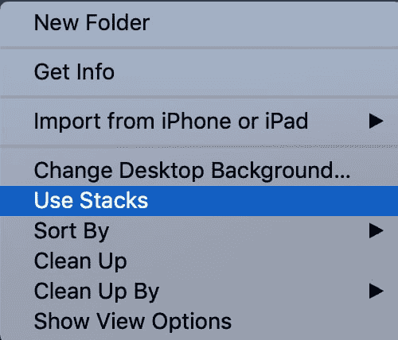
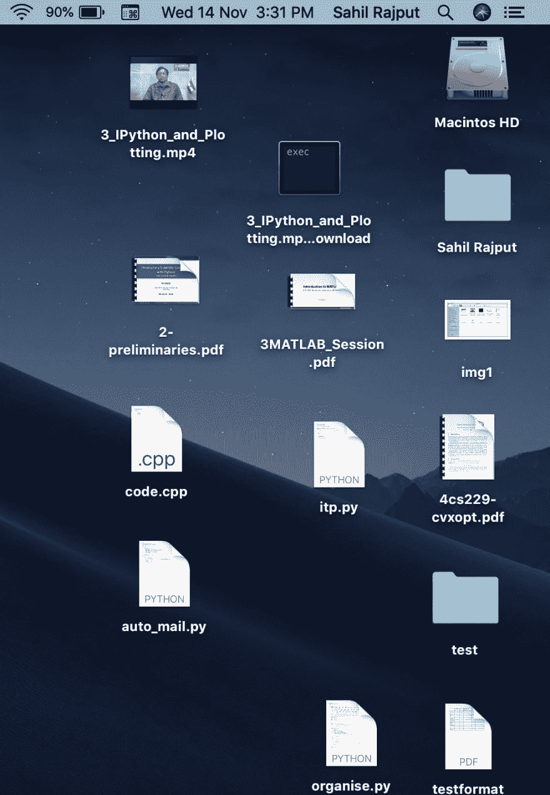
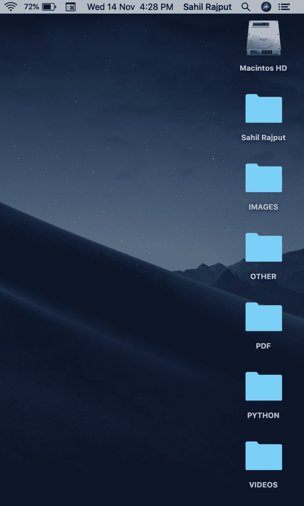

# 用 Python 创建你自己的文件管理器

> 原文：<https://dev.to/sahilrajput/create-your-own-file-organiser-in-python-507i>

在 macOS Mojave 中，有一个名为“使用堆栈”的功能，可以组织你的桌面文件。
[T3】](https://res.cloudinary.com/practicaldev/image/fetch/s--ecgoEbiQ--/c_limit%2Cf_auto%2Cfl_progressive%2Cq_auto%2Cw_880/https://user-images.githubusercontent.com/20112458/48477125-c36e7f00-e826-11e8-855e-80ac048ce39b.png)

我喜欢这个功能，但是你只能用这个功能来组织你桌面上的文件，而不是每个文件夹。因此，我决定制作一个 python 程序，它可以组织我在任何文件夹中的文件。

创建一个文件`organise.py`

```
#import libraries
import os
from pathlib import Path
#Dictionary (Add more if you want)
DIRECTORIES = {
    "HTML": [".html5", ".html", ".htm", ".xhtml"],
    "IMAGES": [".jpeg", ".jpg", ".tiff", ".gif", ".bmp", ".png", ".bpg", "svg",
               ".heif", ".psd"],
    "VIDEOS": [".avi", ".flv", ".wmv", ".mov", ".mp4", ".webm", ".vob", ".mng",
               ".qt", ".mpg", ".mpeg", ".3gp", ".mkv"],
    "DOCUMENTS": [".oxps", ".epub", ".pages", ".docx", ".doc", ".fdf", ".ods",
                  ".odt", ".pwi", ".xsn", ".xps", ".dotx", ".docm", ".dox",
                  ".rvg", ".rtf", ".rtfd", ".wpd", ".xls", ".xlsx", ".ppt",
                  "pptx"],
    "ARCHIVES": [".a", ".ar", ".cpio", ".iso", ".tar", ".gz", ".rz", ".7z",
                 ".dmg", ".rar", ".xar", ".zip"],
    "AUDIO": [".aac", ".aa", ".aac", ".dvf", ".m4a", ".m4b", ".m4p", ".mp3",
              ".msv", "ogg", "oga", ".raw", ".vox", ".wav", ".wma"],
    "PLAINTEXT": [".txt", ".in", ".out"],
    "PDF": [".pdf"],
    "PYTHON": [".py"],
    "XML": [".xml"],
    "EXE": [".exe"],
    "SHELL": [".sh"]
}

FILE_FORMATS = {file_format: directory
                for directory, file_formats in DIRECTORIES.items()
                for file_format in file_formats}
#This will organise your files
def organize():
    for entry in os.scandir():
        if entry.is_dir():
            continue file_path = Path(entry.name)
        file_format = file_path.suffix.lower()
        if file_format in FILE_FORMATS:
            directory_path = Path(FILE_FORMATS[file_format])
            directory_path.mkdir(exist_ok=True)
            file_path.rename(directory_path.joinpath(file_path))
   #if extension not present in the dctionary than create a folder name "OTHER"
    try:
        os.mkdir("OTHER")
    except:
        pass
    for dir in os.scandir():
        try:
            if dir.is_dir():
                os.rmdir(dir)
            else:
                os.rename(os.getcwd() + '/' + str(Path(dir)), os.getcwd() + '/OTHER/' + str(Path(dir)))
        except:
            pass
if __name__ == "__main__":
    organize() 
```

要运行此程序，请打开终端并编写

```
$ python organise.py 
```

运行本程序前我的桌面:
[](https://res.cloudinary.com/practicaldev/image/fetch/s--XHUE7XbD--/c_limit%2Cf_auto%2Cfl_progressive%2Cq_auto%2Cw_880/https://user-images.githubusercontent.com/20112458/48477126-c49fac00-e826-11e8-96eb-20babcc0d7c6.png) 

运行本程序后:
[](https://res.cloudinary.com/practicaldev/image/fetch/s--_BsneJ_---/c_limit%2Cf_auto%2Cfl_progressive%2Cq_auto%2Cw_880/https://user-images.githubusercontent.com/20112458/48478450-55c45200-e82a-11e8-97a6-4e5d2c8b0ef4.png)