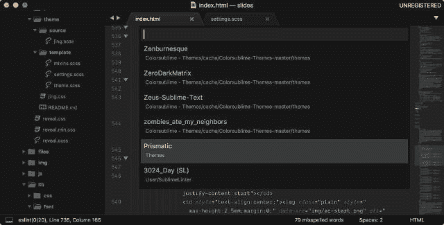

# 创建自定义的崇高文本配色方案

> 原文：<https://dev.to/huijing/creating-a-custom-sublime-text-colour-scheme-7ha>

首先，英式拼写。现在这已经不碍事了，我最近为[崇高的文本](https://www.sublimetext.com/)创建了一个定制的配色方案，我想我应该为任何有兴趣做同样事情的人写一个简短的笔记。

已经有数以千计(我猜)的配色方案了，所以如果你有比挑选颜色更重要的事情要做，那么请继续吧。我个人很喜欢 CodePen 的海洋下一个黑暗主题，但是找不到一个像这样的主题。

由 [Dmitri Voronianski](http://pixelhunter.me/) 创作的原始 [Oceanic Next](https://labs.voronianski.com/oceanic-next-color-scheme/) 主题看起来很棒，但不知何故我的文件并不像截图中那样丰富多彩。可能是因为它是为巴别塔-sublime 而优化的？我不知道… \_(ツ)_/

## 用户界面主题与配色方案

升华文本有两个部分，一部分是你工作和写代码的地方，另一部分是升华文本本身的用户界面，例如侧边栏、标签等。

配色方案适用于工作部分，并决定了源代码的突出显示及其结果颜色，如类、函数、库、常数等。这些方案使用`.tmTheme`(传统)格式或`.sublime-color-scheme`(自构建 3149 以来的新版本)格式。传统的`.tmTheme`文件使用 XML 格式，而新的`.sublime-color-scheme`文件使用 JSON 格式。

UI 主题的扩展名为`.sublime-theme`，是一种 JSON 格式，它指定了匹配元素和修改元素外观的规则。[完整文档](https://www.sublimetext.com/docs/3/themes.html)涵盖了可定制的各种属性和元素。

## 为什么要自创呢？

问得好。我之前简单提到过，我迷恋 CodePen 版本的 Oceanic Next，但在任何地方都找不到类似的版本。

此外，我刚刚购买了菲尔·普吕克图恩(Phil Plückthun)的优秀的 T2(Bernstein)Dank Mono(T3 ),我想知道如何调整才能让我的 HTML 属性、注释和函数参数以斜体显示。

事实证明，大多数搜索结果是为了找到和安装现有的主题，但没有太多的文章谈到实际的创建过程。嗯，我想知道为什么… ( *用令人讨厌的讽刺口吻读*)我能找到的最好的是波波波(又名威廉·谢里夫)的博客[上的这篇关于如何在崇高文本 3](https://bobobobo.wordpress.com/2017/02/27/how-to-create-a-custom-sublime-text-3-color-scheme/) 中创建自定义主题的 4 步文章。

## 第一步:创建`.tmTheme`文件

为什么不使用更新的文件格式？再次，问得好。事实证明，在一头扎进这家企业之前，我的确**而不是**阅读了这些文件。因为使用`.tmTheme`的配色方案比使用`.sublime-color-scheme`的多得多，所以我认为`.tmTheme`才是正确的选择。

有趣的事实:在一些同事询问他们是否也可以拥有主题后，当我试图弄清楚如何将我的主题发布到 Package Control 时，我才发现了`.sublme-color-scheme`。🤦‍♀️

总之，在多逛了一会儿之后，我发现了 [tmTheme 编辑器](https://tmtheme-editor.herokuapp.com/)的存在，这是一个方便的在线 GUI，用于编辑和生成`.tmTheme`文件。就我个人而言，我认为这是一个很好的方法，但是我没有使用这个可爱的小网络应用程序。

相反，我下载了一个`.tmTheme`文件，然后直接通过 Sublime Text 进行定制。有一般的设置和单独的范围样式，所有的样式都是嵌套在`<array>`元素中的`<dict>`元素。

全局设置决定了方案、前景、背景和插入符号颜色的整体颜色。看起来是这样的:

```
<!-- Global settings -->
<dict>
    <key>settings</key>
    <dict>
        <key>background</key>
        <string>#222222</string>
        <key>foreground</key>
        <string>#EEEEEE</string>
        <key>caret</key>
        <string>#FFFFFF</string>
    </dict>
</dict> 
```

Enter fullscreen mode Exit fullscreen mode

以下所有内容都是针对单个作用域的:

```
<!-- Scope styles -->
<dict>
    <key>name</key>
    <string>Comment</string>
    <key>scope</key>
    <string>comment</string>
    <key>settings</key>
    <dict>
        <key>foreground</key>
        <string>#888888</string>
    </dict>
</dict>
<dict>
    <key>name</key>
    <string>String</string>
    <key>scope</key>
    <string>string</string>
    <key>settings</key>
    <dict>
        <key>foreground</key>
        <string>#FFD500</string>
    </dict>
</dict> 
```

Enter fullscreen mode Exit fullscreen mode

每个范围样式规则由一个`<dict>`标签组成，有 3 对`<key>` / `<string>`标签，分别用于*名称*、*范围*和*设置*，其中*设置* `<dict>`标签可以包含*前景*、*背景*和*字体样式*的`<key>`标签。

不要像我一样。阅读文件。他们**优秀**。

要弄清楚`.tmTheme`文件是关于什么的，请转到[。主题配色](https://www.sublimetext.com/docs/3/color_schemes_tmtheme.html)。

要找出你的主题中包含的最小范围，请前往[配色方案中的用法](http://www.sublimetext.com/docs/3/scope_naming.html#color_schemes)。

要确定语法中哪些作用域将样式化哪些标记，请转到[作用域命名](http://www.sublimetext.com/docs/3/scope_naming.html)。

## 第二步:安装你的自定义主题

不管你用的是 Mac 还是 Windows 系统，进入*偏好设置*->-*浏览包…* ，会弹出一个 Finder 窗口，导航到*包*文件夹。如果已经有一个*主题*文件夹，那么把你的`.tmTheme`文件放在那里，否则，创建一个，然后把你的`.tmTheme`文件放在那里。

通过按`Ctrl+Shift+P`(在 Windows 上)或`Command+Shift+P`(在 Mac 上)触发命令面板，并搜索 *UI* 。您的前 2 个结果应该是 *UI:选择主题*和 *UI:选择配色方案*。

[T2】](https://res.cloudinary.com/practicaldev/image/fetch/s--5IGZY0JP--/c_limit%2Cf_auto%2Cfl_progressive%2Cq_auto%2Cw_880/https://www.chenhuijing.com/asseimg/posts/st3-colour-scheme/activate-640.jpg)

选择 *UI:选择配色方案*，你应该能够找到你的自定义主题作为选项之一。

[T2】](https://res.cloudinary.com/practicaldev/image/fetch/s--eXvqtCAf--/c_limit%2Cf_auto%2Cfl_progressive%2Cq_auto%2Cw_880/https://www.chenhuijing.com/asseimg/posts/st3-colour-scheme/activate2-640.jpg)

## 第三步:与朋友分享

我的一些同事也想尝试我的主题，我可以给他们发送`.tmTheme`文件，但是我很好奇包是如何进入包控制的。所以，再次阅读文件。[提交包裹](https://packagecontrol.io/docs/submitting_a_package)页面相当全面。

如果你和我一样，只是对提交一个配色方案感兴趣，你可能会跳过在那里准备存储库的部分。它的要旨是:

1.  将`.tmTheme`托管在某个地方，它可以是一个公共的 git 存储库或者你自己的 web 服务器。
2.  如果您走的是 git 路线，请确保用合适的版本标记每个版本。如果您有自己的主机，请在您的`package.json`文件中使用语义版本控制
3.  分叉[包控制通道](https://github.com/wbond/package_control_channel)并克隆到你自己的机器上。将你的主题添加到*包 _ 控制 _ 文件夹*中合适的文件(按字母顺序排列)
4.  通过包控制安装[通道库工具](https://packagecontrol.io/packages/ChannelRepositoryTools)包并运行测试。确保他们通过。
5.  创建一个拉取请求并保持耐心。

我现在正处于指令的*耐心点*部分，所以希望我的主题最终能进入包控制。

如果您走 git 存储库的路线，请随意写一个好的自述文件，包括截屏和所有内容。我将使我的更全面，如果它曾经使它包控制，并可能开始移植到新的文件格式。

我的主题叫做棱镜，目前由 GitHub 托管。如果你使用的字体支持草书斜体和连字，那就更有趣了。至少对我来说是这样。截图中的字体是 Dank Mono。

[T2】](https://res.cloudinary.com/practicaldev/image/fetch/s--g98H9Pk9--/c_limit%2Cf_auto%2Cfl_progressive%2Cq_auto%2Cw_880/https://www.chenhuijing.com/asseimg/posts/st3-colour-scheme/screenshot-640.jpg)

## 有用的资源

*   [潮湿的单声道](https://dank.sh/)
*   [配色方案](https://www.sublimetext.com/docs/3/color_schemes.html)
*   [。主题配色方案](https://www.sublimetext.com/docs/3/color_schemes_tmtheme.html)
*   [在配色方案中的使用](http://www.sublimetext.com/docs/3/scope_naming.html#color_schemes)
*   [范围命名](http://www.sublimetext.com/docs/3/scope_naming.html)
*   [提交包](https://packagecontrol.io/docs/submitting_a_package)