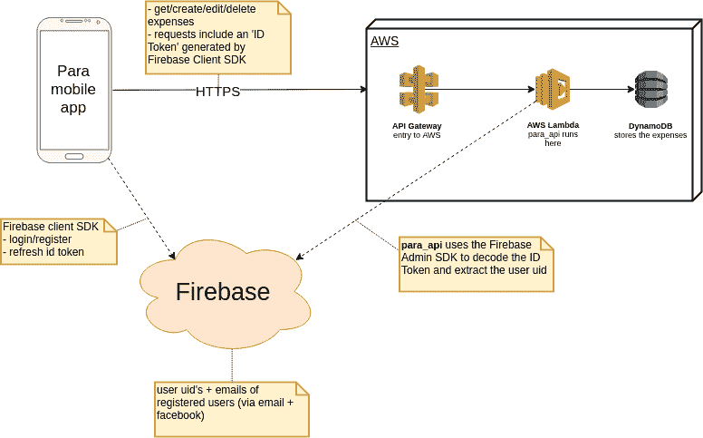
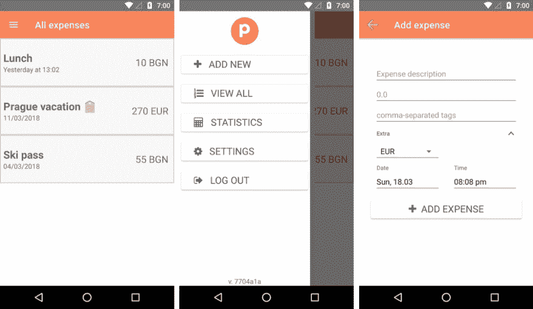

# 使用 NativeScript 创建原生移动应用程序—提示和技巧

> 原文：<https://dev.to/jorotenev/creating-a-native-mobile-app-with-nativescripttips-and-tricks-27o5>

几个月前，我决定写一个应用程序来记录我的开销。我想要一个当代外观的应用程序，没有广告，免费。我想尝试一下移动应用程序开发。一月份我参加了 AWS 培训，所以我也想把我学到的东西应用到后端 API 中。

在这篇文章中，我将分享设计、实现和部署 Para 应用程序的一些过程，以及我在这个过程中遇到的一些困难和错误。

目的是分享我的发现，并最终帮助那些刚接触移动应用开发，尤其是 NativeScript 平台的人。

我将重点关注应用程序本身。我会在另一篇文章中谈到后端 API。API 使用 Python+[Flask](http://flask.pocoo.org/)&dynamo db 开发，通过 [Zappa](https://github.com/Miserlou/Zappa) 部署在 AWS 上。

手机[应用](https://github.com/jorotenev/para)(打字稿)和[后端](https://github.com/jorotenev/para_api) (Python)的代码是开源的。

本文从讨论 Firebase Auth 和我如何使用它开始。如果您只关心特定于原生脚本的陷阱——向下滚动到**有用的特定于原生脚本的插件和陷阱**部分。

# 简介

在规划如何制作 app 的时候，我花了一些时间研究跨平台移动 app 开发的平台。我想写一次代码，然后能够在 Android 和 iOS 上运行 Para。主要的候选平台是 React Native 和 NativeScript。我已经有了一些 JavaScript/TypeScript 的经验，但是没有 React*的经验。NativeScript 允许您使用纯类型脚本，它是由 Telerik 开发的，Telerik 最初是一家保加利亚公司。此外，我在谷歌上找到的大多数对比文章似乎都认为 NativeScript 更好。

所有这些足以让我先尝试 NativeScript。

如果你已经阅读了官方的 native script[Getting Started](https://docs.nativescript.org/)guide，阅读这篇文章肯定会更有效。

*我知道，我知道，这是清单上的下一个。

# 完成的定义

*   帮助我记录支出的应用程序。
*   易于添加新费用和查看现有费用。
*   支持电子邮件和社交登录。
*   提供统计数据(“我这个星期/这个月花了多少钱”)。
*   运行该应用程序每月花费我 0 美元。鉴于它发布在应用商店上，用户比我和我爸还多。
*   原生运行在 Android 和 iOS 上。
*   可以处理 500 个用户同时使用该应用程序。
*   可以处理在多个设备上使用应用程序的用户。

# 10 000 英尺。概观

[](https://res.cloudinary.com/practicaldev/image/fetch/s--p6DLHvZ8--/c_limit%2Cf_auto%2Cfl_progressive%2Cq_auto%2Cw_880/https://thepracticaldev.s3.amazonaws.com/i/hqri3tp4lq1qj8xpk1qe.png) 
该 app 负责:

*   验证和收集用户输入(添加新费用/更新费用时)
*   显示用户的费用+统计数据

API 负责:

*   验证费用并将其存储到数据库中
*   从数据库中检索费用和统计数据

Firebase 负责:
*存储用户敏感的授权数据

*   与身份验证相关的活动，如电子邮件确认、重置密码等。

app 和 API 共享相同的费用表示(声明性地，通过使用 [json 模式](https://spacetelescope.github.io/understanding-json-schema/))。

按照设计，我管理的数据库(DynamoDB)中不会存储任何用户凭证(电子邮件、密码)。

## 认证和 Firebase

难点在于如何以最小的努力向后端 API 认证移动应用，同时提供适当的解决方案。

我在应用程序中使用了 [Firebase](https://firebase.google.com/) 进行认证相关的活动。Firebase 用一个`user uid`(这是一个很长的字符串)来标识给定项目的每个用户。

当用户登录时(通过输入电子邮件+密码或通过脸书)，他的`user uid`可以从应用程序代码中访问。目前，在应用程序的上下文中，所有费用都属于当前登录的用户，因此 uid 不会出现在费用对象的模式中。

当应用程序与后端 API 通信时，uid 是有用的——因为 API 需要在正确用户的上下文中执行 CRUD 操作。

直接发送 uid 是不安全的，因为冒充用户是可能的。Firebase 提供了生成 [ID 令牌](https://firebase.google.com/docs/auth/admin/verify-id-tokens)的能力。这是我对他们的心理模型。这是一个 JSON Web 令牌(JWT)，一个字符串，由 Firebase **客户端** SDK(即运行在手机上的 SDK)生成。该字符串包含当前登录用户的 uid、用户登录的时间和一些其他用户信息(电子邮件等)。)，Firebase 有哪些关于用户的。这个字符串的好处是，当我们的后端接收到它时，服务器可以验证字符串的完整性——也就是说，如果字符串显示 uid 为 XXXYYY 的用户发送了该字符串——我们就可以确定确实是这个用户发送了该字符串。

一般的工作流程是，当手机向我们的后端发出 API 请求时，ID 令牌包含在 HTTP 头中。当服务器收到请求时，它使用 Firebase **Admin** SDK 对令牌进行解码。然后`user uid`对服务器可用，并且可以在正确的上下文中处理请求。

我为什么选择这种方法？它让我从担心存储用户电子邮件、密码、处理电子邮件确认、忘记密码等麻烦中解脱出来。这是一个麻烦。因为很容易搞砸，所以我把它委托给了 Firebase。我所关心的是确保我可以向我的应用程序用户显示登录/注册页面，一旦他们输入了他们应该输入的内容，请 Firebase 给我有关用户的信息(他的 uid 和 id 令牌)。

使用 Firebase 的另一个值得注意的方面是拥有隔离的环境。

我想拥有完全独立的开发和生产环境。也就是说，我可以在本地开发，而不需要接触生产 Firebase 项目——它拥有我的所有用户。要实现这一点，需要创建一个基于环境的 Firebase 项目，并在应用构建(或“[准备](https://docs.nativescript.org/docs-cli/project/configuration/prepare)”)期间选择正确的 Firebase 配置文件。我安全地存储了生产文件，并可以使用它来制作上传到 app/play 商店的生产应用程序版本。我可以与其他合作者共享开发配置，以便他们可以在本地进行开发。

因为后端的 Firebase Admin SDK 需要拥有同一个 Firebase 项目的凭证，所以我将凭证存储为一个环境变量——正确的凭证用于给定的服务器环境。这真的很方便，因为开发应用程序不可能访问生产服务器——如果我错误配置应用程序(例如，当我在本地开发时，指向 prod API)，就会发生这种情况。你可以看出我不太相信自己:)

这就是 10，000 英尺。概述。

我将展示一些我认为有用的特定于 NativeScript 的插件，以及一些与它们相关的问题。

# 有用的特定于脚本的插件和陷阱

使用 NativeScript 时，您可以从 npm 包中受益。例如，我使用了流行的`moment.js`和`underscore` JavaScript 库，没有任何问题。这里有一个[页面](https://market.nativescript.org/)，上面有经过验证的针对本地脚本的包。这里有一个[页面](https://docs.nativescript.org/plugins/plugins)，概述了如何安装和使用它们。

简单地说，从 npm 安装软件包时要小心——有时软件包会假设它们会在浏览器或 Node.js 环境中运行——如果在 NativeScript 中运行，可能会失败(例如，我看到一些软件包无法导入`process`)。

## `nativescript-plugin-firebase`

我没有直接使用官方的 Firebase Android/iOS 客户端 SDK，而是使用了[native script-plugin-Firebase](https://github.com/EddyVerbruggen/nativescript-plugin-firebase)。这样做的好处是，我不需要编写 Java 和 Swift——我只需编写一次 TypeScript。如上所述，我使用 Firebase 做所有授权的事情——注册、登录和注销用户。插件还可以让用户更改密码和恢复密码。最重要的是，获取用户的 uid 和 id 令牌。

有一件事对我来说不是很明显，那就是如何确保一旦用户登录，他就一直保持登录状态，直到他明确地注销。问题是，如果您登录，然后最小化应用程序，并在一个小时后恢复它，自动登录将成功，但 ID 令牌将过期-令牌仅在创建后的一个小时内有效(即上次您输入电子邮件+密码并登录)。如果我试图向后端发送一个过期的令牌，后端就会发出叫声。

对我有效的技巧是在用户自动登录时使用`firebase.getAuthToken({forceRefresh: true})`。这将强制创建一个新的 ID 令牌。这里有一个[用法](https://github.com/jorotenev/para/blob/1693b196bd5dda42bc94f7d3734dd7bf899063d8/app/auth/login/login-view.ts#L23)的例子。在代码中，我检查用户是否已经登录，如果是，立即请求一个新的令牌。登录页面是应用程序的默认首页，当你打开应用程序时，它总是显示。上面的检查确保了如果用户登录，他将被直接重定向到“主页”。

## `nativescript-pro-ui`

[pro-ui 包](https://www.nativescript.org/ui-for-nativescript)(实际上是几周前的一个包包)提供了可重用的 ui 组件。

在我的应用程序中，我用它来做三件不同的事情——所有费用的清单、侧面抽屉和创建/编辑费用的数据表单。

[T2】](https://res.cloudinary.com/practicaldev/image/fetch/s--jHGI2llN--/c_limit%2Cf_auto%2Cfl_progressive%2Cq_auto%2Cw_880/https://thepracticaldev.s3.amazonaws.com/i/omj4f1psrp99s2zg6409.png)

## `RadListView`

为什么用 Pro UI 的 RadListView 确实很 rad？因为要显示上面的费用列表，我需要做的就是:说明应该如何显示列表中的每个费用(例如，给定一个费用数据对象，要显示哪些属性以及将它们放在哪里)。这是通过 XML 完成的，提供一个费用集合来显示(它被称为 ObservableArray，您可以将它看作是一个增强的数组，当您添加/删除它时，它会发出事件)

好在我提供的费用集合和 RadListView 之间有一个绑定，也就是说，如果我在我的集合中添加/删除一笔费用，RadListView 会自动更新。这意味着我只能专注于确保我的数组有正确的项目，而不是 UI。

除此之外，我还得到“免费”[拉刷新](http://docs.telerik.com/devtools/nativescript-ui/Controls/NativeScript/ListView/pull-to-refresh)和[批量加载数据](http://docs.telerik.com/devtools/nativescript-ui/Controls/NativeScript/ListView/load-on-demand)(即每批加载 10 笔费用)。要获得前两个，我只需要提供实际刷新数据/从 API 获得下一批项目并更新 ObservableArray 中的项目的函数。

这里有一个重要的问题。在为“列出所有费用”页面编写 [XML 标记](https://docs.nativescript.org/ui/basics)时，我想根据用户是否有任何费用来显示不同的内容。如果用户没有费用——我会显示一条消息和一个“添加新项”按钮，如果有费用——就显示它们。我通过使用样式(想想 CSS)实现了这个

`RadListView visibility=”{{hasItems ? ‘visible’ : ‘collapse’}}”`。所以我使用一些布尔变量`hasItems`来决定我们是否能看到列表。

诀窍在于，人们可能会认为，由于我们提供的费用集合属于 ObservableArray 类型，因此也观察到了`.length`属性。嗯，它[好像是](https://github.com/NativeScript/NativeScript/issues/5476)其实不是。所以[将](https://docs.nativescript.org/ui/basics#bindings)绑定到表达式`expenses.length !== 0`是不可能的。我的解决方法是订阅 ObservableArray 的事件，并在每次添加/删除时调整`hasExpenses`的值。

如果以上没有多大意义，请确保您已经阅读了[文档](https://docs.nativescript.org/ui/basics#bindings)中关于绑定的部分。

## `RadSideDrawer`

抽屉非常方便——你可以把汉堡放在每个屏幕的左上角，当你按下它或者从左向右滑动时，侧面板抽屉就会出现。

这样很容易产生大量重复的代码——也就是说，在每一页上，你需要一个侧边抽屉，你写的基本上是相同的代码——抽屉的内容和页面的内容。

我将抽屉内容的代码提取到一个单独的组件中。我发现[这篇文章](https://moduscreate.com/blog/custom-components-in-nativescript/)确实提供了关于如何提取 NativeScript UI 组件和减少重复的信息。

坦率地说，我现在在我的大部分页面中有相当于“导入侧抽屉”的代码，这也是一种复制。作为进一步的重构，我计划将`Page`类扩展为`PageWithDrawer`,并将其用作页面的根元素。

## `RadDataForm`

哦，这是我最喜欢的。真的很方便。本质上，您提供了一个普通的旧数据对象，并且可选地提供了对象属性的描述，您得到了一个 UI 数据表单。您可以注册在验证用户输入数据期间调用的回调。您可以选择何时将用户输入的数据提交给输入数据对象。您还可以在提交数据时注册一个回调。您可以选择是立即向数据对象提交输入，还是在用户按下 Submit 按钮之后提交。

您可以获得不同的字段类型(例如，文本、数字、电子邮件等。)—很方便，因为您得到了一些自动验证，并显示了正确的键盘。

配置可见字段、它们的类型(文本、数字)和验证器(MinLength、NonEmpty 等)的最简单方法。)是通过 XML 标记。

```
<RadDataForm.properties>
    <EntityProperty name="name" displayName="Name" index="0" />
    <EntityProperty name="age" displayName="Age" index="1" >
      <EntityProperty.editor>
        <PropertyEditor type="Number" />
    <EntityProperty.validators>
          <RangeValidator minimum="1" maximum="150" /> 
        </EntityProperty.validators>
      </EntityProperty.editor>
    </EntityProperty>
</RadDataForm.properties> 
```

Enter fullscreen mode Exit fullscreen mode

如果你打算使用 RadDataForm，我推荐你阅读 raddata form 上[的所有文档](http://docs.telerik.com/devtools/nativescript-ui/Controls/NativeScript/DataForm/dataform-overview)。时间不长，而且会节省你很多时间。

在开发应用程序的过程中，我发现自己需要非常相似的数据表单，唯一的区别是在提交被按下后执行的操作。主要的例子—创建新的费用或更新现有的费用。从数据表单的角度来看，在两种情况下，输入数据对象具有相同的形状，不同之处在于，在更新费用期间，数据对象具有实际数据。当用户按下表单的提交按钮时，会调用一个不同的 API 端点。但是对于其他部分，形式是相同的——验证、字段类型等。

幸运的是，在创建数据表单时，您可以传递 JSON，而不是仅仅使用 XML 标记来描述属性。因此，不是仅仅传递源数据对象和使用 XML，而是传递数据对象和描述属性的“元数据”JSON。下面是上面的 XML 作为 JSON 元数据的样子:

```
{
    "name":"name",
    "displayName":"Name",
    "index":0
},
{
    "name":"age",
    "displayName":"Age",
    "index":1,
    "editor":"Number",
    "validators":[
        {
            "name":"RangeValidator",
            "params":{
                "minimum":1,
                "maximum":150
            }
        }
    ]
} 
```

Enter fullscreen mode Exit fullscreen mode

NativeScript 的 [ui-samples-repo](https://github.com/telerik/nativescript-ui-samples/tree/release/sdk/app) 中的例子似乎都是从 JSON 中读取元数据并将其直接传递给数据表单。我所做的是有一个生成 JSON 的函数。这给了我在生成元数据时很大的灵活性。与通过 XML 标记相比，文档中有关于 JSON 能做什么和不能做什么的信息。

现在抓到你了！:)我花了好几天时间追踪一个与 RadDataForm 相关的 bug。本质上，我是手动验证表单，并手动将输入提交给数据对象。这样做之后，我就可以访问数据对象的属性，因为我需要它们的值。[错误](https://github.com/telerik/nativescript-ui-feedback/issues/549)是，如果属性在表单的元数据中被标记为数字或小数，获取它的值不会返回数字，而是一些未知类型的对象。解决方法是调用该对象的`toString()`来获取数字的字符串表示，然后将其转换为适当的数字。恶心。

## `i18n`

上周才发现是国际化的意思:)

我想让我的应用程序有保加利亚语和英语版本。我在谷歌上搜索了一个正在积极开发的 NativeScript i18n 包，并偶然发现了— [nativescript-localize](https://github.com/lfabreges/nativescript-localize) 。

唯一的问题是。当进行调试构建时，可以做`L(“natural language in english”)`并只为字符串定义非英语语言的翻译——如果需要，它会自动退回到英语字符串。然而，当进行发布构建时， [lint 会叫](http://www.fasteque.com/missingtranslation-issue-for-release-builds/)。本文提到了一些修复，但是据我所知，它们在使用 nativescript-localize 包时并不适用，因为该包在构建时会生成 string.xml。本质上，您可能希望使用非用户友好的字符串，并为每种支持的语言提供自然语言翻译。

我最近发现流行的 [i18next](https://github.com/mashpie/i18n-node) JavaScript 包似乎也能工作——这可能是因为它对运行时做了非常保守的假设。

在 TypeScript/JavaScript 中使用这个库并没有偏离软件包的建议方式。然而，在 NativeScript 中，我们也想翻译 XML 页面中的字符串。问题是设置应用程序资源(即在 XML 中提供一个可用的函数)。这样做似乎是正确的:

```
app.setResources({
    ‘L’ : (…args) => i18next.t.apply(i18next, args)
}); 
```

Enter fullscreen mode Exit fullscreen mode

这使我们能够做这样的事情:

`<Label text=”{{‘translation for key is ’ + L(‘key’)}}”/>`

## `JSON Schema`

显然，在 NativeScript 应用程序中找到一个包来验证 [JSON 模式](https://spacetelescope.github.io/understanding-json-schema/)并不容易。

经过多次反复试验，我找到了一个运行良好的 JavaScript 包。叫 [tv4](https://github.com/geraintluff/tv4) 。坦白地说，我没有尝试过更高级的用例，比如使用来自不同文件的模式，所以我不能说它在那里的表现如何。

## `Mocking in tests`

测试时我非常喜欢模仿。我尝试使用不同的嘲讽框架。框架最常见的问题是，它们假设测试在节点/浏览器中运行，这在我们的例子中是有问题的。

我只在使用 Jasmine 内置的模仿机制时获得了成功。它能满足我的需要，但是如果你知道一个不同的包，我会非常好奇的去看看:)

## `Misc`

*   如果你喜欢图形用户界面，它会很有帮助。对我来说，它最大的好处是云构建——它让我可以从我的 Linux 主机上构建 Android/iOS。
*   AWS 设备农场(AWS Device Farm)—我在那里测试我的应用程序发布版本。有一系列 iOS/Android 设备可供选择。虽然不是最新的。在 AWS 的免费等级中，您每月可获得 1000 英镑。

* * *

# 结论

总的来说，我很喜欢开发这个应用程序的经历。我很高兴我可以使用 npm 包，而不是为每个问题重新发明轮子。我还没有在 iOS 上测试这个应用程序(还没有一个开发帐户)，但理论上它应该没有代码变化。

我希望我早点开始使用`hooks`——我用它来选择/改变我的应用配置，基于我是在构建一个开发应用还是一个发布应用。我还使用它进行检查，如“我的 API 地址格式是否正确，它是否是我加入白名单的地址”，获取当前 git sha 并将其放入应用程序配置中，以便我知道应用程序运行的确切代码，等等。

感谢你阅读这篇文章。如果您有任何建议或意见，请与我们分享，我将不胜感激。