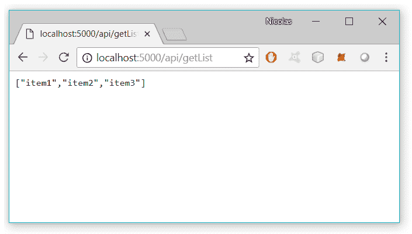
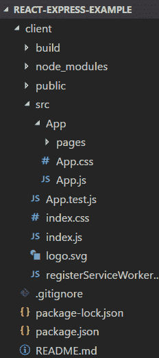
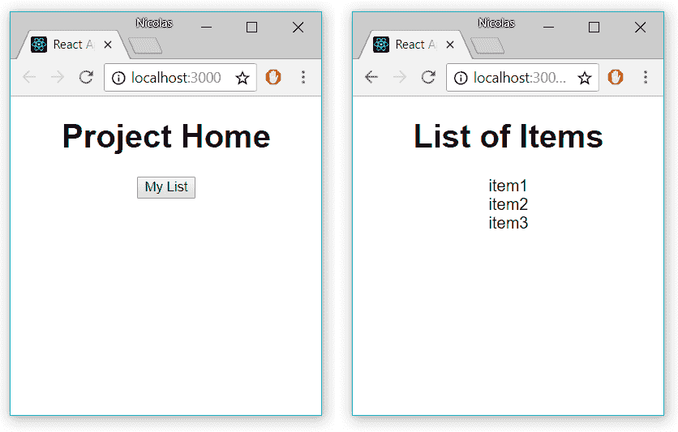

# 使用 React 路由器和 Express 后端部署 React 应用程序

> 原文：<https://dev.to/nburgess/creating-a-react-app-with-react-router-and-an-express-backend-33l3>

在本文中，我们将介绍如何使用 React-Router 创建一个 React 应用程序进行路由和快速后端。然后我们会把它部署到 Heroku。本教程提供了一种设置 API 的简单方法，在创建 React 应用程序时可以快速更新和测试该 API。它也可以帮助那些新反应的人。有几种方法可以实现这个目标，但是我已经介绍了一个我最熟悉的非常简单的方法。如果你有不同的方法或者我犯了什么错误，请随时告诉我。

这个应用程序的源代码可以在[这里](https://github.com/nburgess/react-express-example)找到。

使用的技术:

*   快递。射流研究…
*   做出反应。射流研究…
*   反应路由器

# 创建快递 App 后端

为了开始设置我们的应用程序，node.js 和 npm 都需要安装。

首先，我们需要创建一个父目录，可以随意命名。这里我们将把我们的*称为反应-表达-示例*。

```
mkdir react-express-example
cd react-express-example 
```

用 npm 初始化项目:

```
npm init -y 
```

安装快速软件包:

```
npm add express 
```

创建一个名为 *index.js* 的文件，输入以下代码，这将作为一个最基本的 express app。

```
const express = require('express');
const path = require('path');

const app = express();

// Serve the static files from the React app
app.use(express.static(path.join(__dirname, 'client/build')));

// An api endpoint that returns a short list of items
app.get('/api/getList', (req,res) => {
    var list = ["item1", "item2", "item3"];
    res.json(list);
    console.log('Sent list of items');
});

// Handles any requests that don't match the ones above
app.get('*', (req,res) =>{
    res.sendFile(path.join(__dirname+'/client/build/index.html'));
});

const port = process.env.PORT || 5000;
app.listen(port);

console.log('App is listening on port ' + port); 
```

我们调用 express()来创建我们的 express 应用程序，用 object app 表示。然后我们创建一个方法来处理对 */api/getList* 的 GET 请求，该请求将发送一个 json 响应和一个项目列表。稍后我们将从 React 应用程序中调用它。

在 *package.json* 中添加一个脚本，这样应用程序一旦被放置在适当的服务器上就会启动。我通常在 Heroku 上启动我的示例项目。

```
{
  "name": "react-express-example",
  "version": "1.0.0",
  "description": "",
  "main": "index.js",
  "scripts": {
    "start": "node index.js"
  },
  "keywords": [],
  "author": "",
  "license": "ISC",
  "dependencies": {
    "express": "^4.16.3"
  }
} 
```

### 测试我们的快递服务器

此时，我们可以测试我们的 express 应用程序，以确保到目前为止一切正常。

使用上面创建的脚本运行 express 应用程序:

```
npm start 
```

打开[http://localhost:5000/API/getList](http://localhost:5000/api/getList)，您应该看到以下内容:

[T2】](https://res.cloudinary.com/practicaldev/image/fetch/s--AY6go63O--/c_limit%2Cf_auto%2Cfl_progressive%2Cq_auto%2Cw_880/https://thepracticaldev.s3.amazonaws.com/i/9k700wuogatvegrzlq2j.png)

# 创建 React App

如果您尚未安装 Create-React-App，请运行以下代码行:

```
npm install -g create-react-app 
```

下一步是创建实际的 React 应用程序，我们将它保存在*客户端*文件夹中。为此，我们将在项目目录中运行以下命令:

```
create-react-app client 
```

从客户端文件夹中运行 *npm start* 后，基本的 React 应用程序现在在 [http://localhost:3000/](http://localhost:3000/) 可见。如果您决定将它命名为 client 以外的名称，您将不得不对 Express 文件进行修改，因为它被设置为指向*客户端/构建*。

为了让我们的 React 应用程序将 API 请求代理到我们上面创建的 Express 应用程序，我们需要对 **client/package.json** 进行更改。这是通过添加行" proxy ":"[http://localhost:5000](http://localhost:5000)来完成的

*client/package.json* :

```
{
  "name": "client",
  "version": "0.1.0",
  "private": true,
  "dependencies": {
    "react": "^16.4.1",
    "react-dom": "^16.4.1",
    "react-router-dom": "^4.3.1",
    "react-scripts": "1.1.4"
  },
  "scripts": {
    "start": "react-scripts start",
    "build": "react-scripts build",
    "test": "react-scripts test --env=jsdom",
    "eject": "react-scripts eject"
  },
  "proxy": "http://localhost:5000"
} 
```

### 添加 React-路由器

在这里，我们将 React-Router 添加到我们的项目中，并创建两个页面， *Home.js* 和 *List.js* 。

如果您选择不使用 React-Router，请跳到**调用我们的 Express App** 。过去我在设置一个简单的实现时遇到了一些麻烦，所以我把它包含在本教程中。

为我们的 React 项目安装以下包:

```
npm install -g react-router-dom 
```

将以下代码插入 */client/src/index.js* :

```
import React from 'react';
import { render } from 'react-dom';
import { BrowserRouter } from 'react-router-dom';

import './index.css';
import App from './App/App';

render((
    <BrowserRouter>
        <App/>
    </BrowserRouter>
), document.getElementById('root')); 
```

将以下代码插入 */client/src/App.js* :

```
import React, { Component } from 'react';
import { Route, Switch } from 'react-router-dom';
import './App.css';
import Home from './pages/Home';
import List from './pages/List';

class App extends Component {
  render() {
    const App = () => (
      <div>
        <Switch>
          <Route exact path='/' component={Home}/>
          <Route path='/list' component={List}/>
        </Switch>
      </div>
    )
    return (
      <Switch>
        <App/>
      </Switch>
    );
  }
}

export default App; 
```

在这段代码中，我们为一个主页和一个显示列表的页面创建了路径。接下来，我们需要创建这些页面。

在读了 Alexis Mangin 的一篇文章后，我开始构建我的 React 项目，类似于 how descriptions。在这一点上，我建议重新组织项目，以匹配下图。

[T2】](https://res.cloudinary.com/practicaldev/image/fetch/s--88_P7zbw--/c_limit%2Cf_auto%2Cfl_progressive%2Cq_auto%2Cw_880/https://thepracticaldev.s3.amazonaws.com/i/22ijhttfi14dcfdgc2tl.png)

在 src/App/pages 中创建文件 *Home.js* ，并包含以下代码:

```
import React, { Component } from 'react';
import { Link } from 'react-router-dom';

class Home extends Component {
  render() {
    return (
    <div className="App">
      <h1>Project Home</h1>
      {/* Link to List.js */}
      <Link to={'./list'}>
        <button variant="raised">
            My List
        </button>
      </Link>
    </div>
    );
  }
}
export default Home; 
```

我们已经创建了一个链接到 List.js 的按钮。

### 调用我们的快递 App

在 src/App/pages 中创建文件 *List.js* ，并包含以下代码:

```
import React, { Component } from 'react';

class List extends Component {
  // Initialize the state
  constructor(props){
    super(props);
    this.state = {
      list: []
    }
  }

  // Fetch the list on first mount
  componentDidMount() {
    this.getList();
  }

  // Retrieves the list of items from the Express app
  getList = () => {
    fetch('/api/getList')
    .then(res => res.json())
    .then(list => this.setState({ list }))
  }

  render() {
    const { list } = this.state;

    return (
      <div className="App">
        <h1>List of Items</h1>
        {/* Check to see if any items are found*/}
        {list.length ? (
          <div>
            {/* Render the list of items */}
            {list.map((item) => {
              return(
                <div>
                  {item}
                </div>
              );
            })}
          </div>
        ) : (
          <div>
            <h2>No List Items Found</h2>
          </div>
        )
      }
      </div>
    );
  }
}

export default List; 
```

### 测试我们的最终应用

此时，项目应该已经启动并运行了。为了测试项目，从项目的主目录和客户机目录中运行 *npm start* 。在主页上选择了我的列表后，我们应该可以从我们的 Express 服务器上看到这三个项目。

[T2】](https://res.cloudinary.com/practicaldev/image/fetch/s--ldqaiX8T--/c_limit%2Cf_auto%2Cfl_progressive%2Cq_auto%2Cw_880/https://thepracticaldev.s3.amazonaws.com/i/avbeqcm9p8m9tsgl0y43.png)

# 部署到 Heroku

在上传到 Heroku 之前，我们需要确定如何构建我们的客户端代码。Express 指向 *client/build* ，这是我们在构建 React 应用程序之前没有的。使用 Heroku，我们可以添加一个 *heroku-postbuild* 脚本，这样 React 应用就可以在我们推送代码之后构建，而不必上传编译后的代码。

在父目录下编辑 *package.json* ，添加以下脚本(不是 */client/package.json* ):

```
 "scripts": {
    "start": "node index.js",
    "heroku-postbuild": "cd client && npm install --only=dev && npm install && npm run build"
  } 
```

Heroku 现在将进入客户端目录，为我们创建 React 应用程序的生产版本。

如果您已经安装了 Heroku tool-belt，部署就像运行以下命令一样简单:

```
git init
git add .
git commit -m "Initial commit"
heroku create
git push heroku master 
```