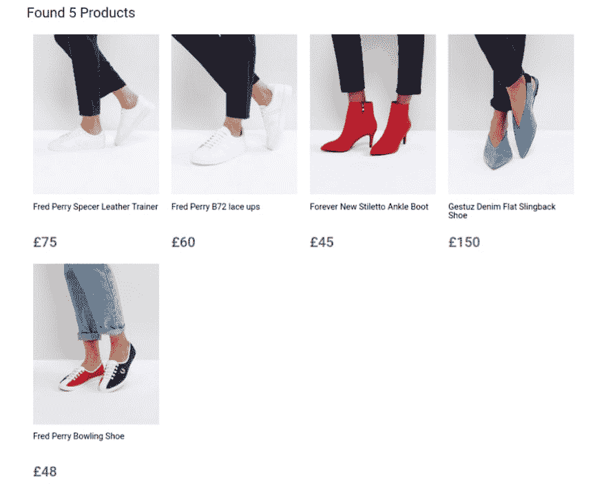
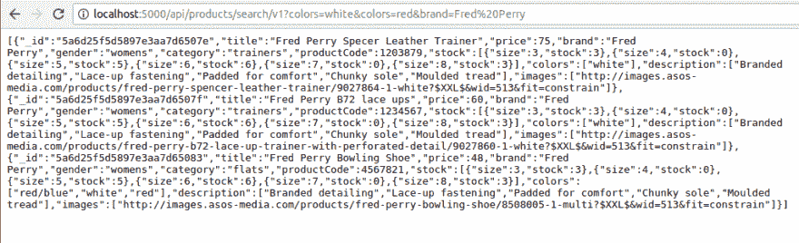
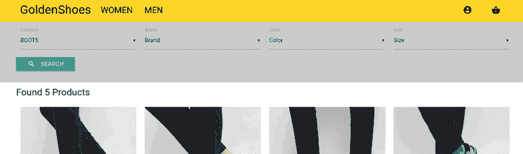
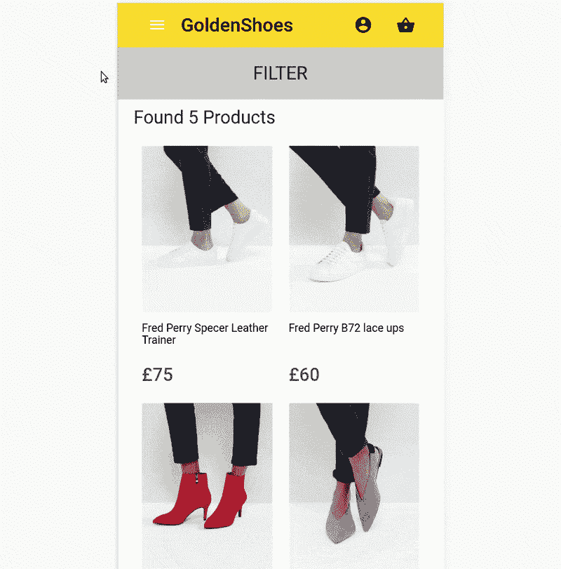
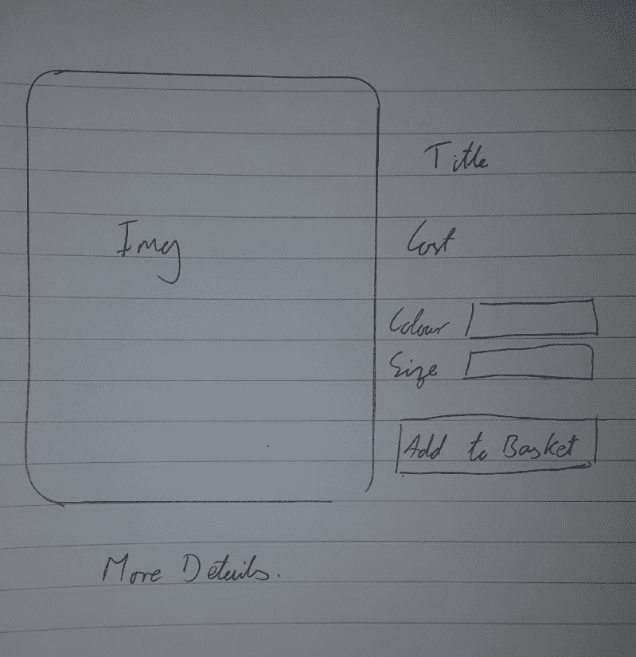
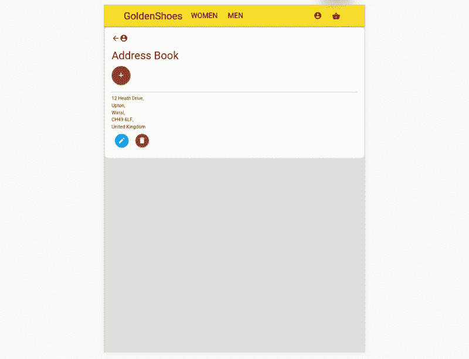

# 从头开始创建购物应用程序(第 2 部分)

> 原文：<https://dev.to/samwsoftware/creating-a-shopping-app-from-scratch-part-2-12pn>

这是为即将到来的面试从头开始创建购物网站系列的第 2 部分。[点击此处](https://medium.com/@samwsoftware/creating-a-shopping-app-from-scratch-part-1-352ebbd78655)阅读第 1 部分，了解更多信息！

### 产品列表

我知道这一点将需要一段时间。我必须创建并填充产品模型，为具有搜索功能的 API 创建 get route，然后创建产品列表、产品预览、产品和过滤标准组件。

基本的后端很快就完成了，前端列表和预览组件也很快完成。我把它设置成/products/:gender/:category，后来我后悔了，但是它工作了。

[T2】](https://res.cloudinary.com/practicaldev/image/fetch/s--xUvBDgYh--/c_limit%2Cf_auto%2Cfl_progressive%2Cq_auto%2Cw_880/https://cdn-images-1.medium.com/max/1024/1%2AJoRrqATWLevBCcsYykwI9Q.png)

### 过滤

这是事情开始慢慢展开的地方。我使用多选下拉菜单创建了一个过滤器组件，它与子标题来自同一个存储。多选效果很好，我设法从它们那里得到了值(通过 Google、console.log 和尝试改进)。

我现在必须解决如何将搜索查询转换成 URL。这是我意识到在 URL 中有一个类别作为参数有一个主要问题的地方——如果他们搜索不止一个类别呢？我曾试图使用/products/:gender/:category/:brand 类型的 URL，但现在这种方法行不通了。

经过一番反复试验，再加上一段时间的沉思，我决定选择/products/:gender？过滤标准。我可以获取过滤标准和性别，并直接将它们传递给 getProducts 操作…或者不传递。

#### 将过滤转换成查询

出于某种原因，我把 API 功能留给了获取所有可用产品。现在，我需要从前端获取过滤器，并将其转换为 MongoDB 的查询。

这样做的问题是，查询是以字符串的形式出现的，需要用$and 和$or 控件分别对多个字段和这些字段的多个值进行编译。

例如，要求所有 5 或 6 码、蓝色或白色的女鞋以如下字符串形式出现:

```
?gender=womens&stock=5&stock=6&colors=blue&colors=white 
```

Enter fullscreen mode Exit fullscreen mode

但是对 mongo 数据库的查询需要采用这种格式:

```
{
  $and: [
    { gender: "womens" },
    {  
      stock: [{ 
        $elemMatch: { 
          size: [5, 6],
          stock: { $gt: 0 } 
        }
      }]
    },
    { $or: [
      { colors: "blue" },
      { colors: "white" }
    ]}
  ]
} 
```

Enter fullscreen mode Exit fullscreen mode

默认情况下，express 将上述查询解析为以下格式:

```
{
    gender: "womens",
    stock: [5, 6],
    colors: ["blue", "white"]
} 
```

Enter fullscreen mode Exit fullscreen mode

这有三个问题:

*   股票参数实际上是一个对象数组。
*   colors 参数是一个字符串数组。
*   我们需要在一个产品中拥有这三个参数。

股票对象是这样的:

```
{ size: 4, stock: 13 },
{ size: 4, stock: 0 } 
```

Enter fullscreen mode Exit fullscreen mode

这意味着我们需要创建一个对象数组，其中一个对象具有所请求的大小，并且还有库存。为此，我们对 size 数组中的 size 和 stock 大于 0 的对象使用$elemMatch。

```
{  
  stock: [{ // create an array of elements
    $elemMatch: { // That match 
      size: [5, 6], // size of 5 or 6
      stock: { $gt: 0 } // and stock greater than 0
    }
  }]
} 
```

Enter fullscreen mode Exit fullscreen mode

为了处理这个问题，我创建了 handleStock 函数。

```
function handleStock(size) {
  return { 
    stock: { $elemMatch: { size: size, stock: { $gt: 0 } } } 
  };
} 
```

Enter fullscreen mode Exit fullscreen mode

颜色稍微简单一点。我们需要找到与蓝色或白色相配的产品。这同样是由 handleColorsArray 函数
完成的

```
{ $or: [
  { colors: "blue" },
  { colors: "white" }
]}

function handleColorsArray(array) {
  return { $or: array.map(col => ({ colors: col })) };
} 
```

Enter fullscreen mode Exit fullscreen mode

最后一个问题是确保产品包含所有属性。为此，如果一个查询有多个参数，我会将它传递给 convertToAnd()。这映射到每个参数。“stock”参数被传递给 handleStock。如果“颜色”参数是一个数组，则将其传递给 handleColorsArray。其他的都只是照原样通过。

一旦每个参数都被映射，查询数组就被包装在一个$and 查询中。

```
function convertToAnd(query) {
  let q = Object.keys(query).map(param => {
    if (param === "stock") {
      return handleStock(query.stock);
    } else if (param === "colors" && typeof query.color !== "string") {
      return handleColorsArray(query.colors);
    } else {
      return { [param]: query[param] };
    }
  });
  return { $and: q };
} 
```

Enter fullscreen mode Exit fullscreen mode

现在，如果我用查询调用 API，它可以处理这些查询并返回所有匹配产品的数组。万岁！

[T2】](https://res.cloudinary.com/practicaldev/image/fetch/s--d_aUw2fw--/c_limit%2Cf_auto%2Cfl_progressive%2Cq_auto%2Cw_880/https://cdn-images-1.medium.com/max/1024/1%2AwKz2bHUSl4uiSIwooCulzQ.png)

### 过滤条件

现在有了能够接收和处理过滤查询的 API，我不得不允许用户选择和更改它们。

我创建了一个 FilterCriteria 组件来映射过滤选项，并为每个选项创建了一个新的选择下拉列表。该选择使用 MaterializeCSS 多选下拉框，以便用户可以选择和取消选择他们想要的选项。由于材料的缘故，这些盒子工作得很好，看起来也很棒。

[T2】](https://res.cloudinary.com/practicaldev/image/fetch/s--gDwxCXN4--/c_limit%2Cf_auto%2Cfl_progressive%2Cq_66%2Cw_880/https://cdn-images-1.medium.com/max/1024/1%2AAxkGH9-Q-KvTkslT5lEYNw.gif)

现在，我必须从表单中获取结果信息，并以某种方式将其发送给 API。我想到的解决方案是让搜索按钮 a 指向与查询相对应的 URL。

我通过映射表单并提取所有下拉列表值来实现这一点。然后，我将它们映射到一个查询字符串中。如果一个值有多个选择的选项，我将它们分别映射到查询字符串的另一部分。

[T2】](https://res.cloudinary.com/practicaldev/image/fetch/s--VfhMr6RP--/c_limit%2Cf_auto%2Cfl_progressive%2Cq_66%2Cw_880/https://cdn-images-1.medium.com/max/800/1%2ADzGkuvaF6BvWZ58p9t1WVg.gif)

对于完整的查询字符串，我生成完整的 URL 并将其推入历史记录中。

#### 几个小嗝

我设置的方式是这样的:

1.  搜索由弗雷德佩里在 5 号运动鞋
2.  重定向至 URL/产品/女性？category = TRAINERS & brand = FRED % 20 Perry & size = 5

问题是*教练*与数据库中的*教练*不匹配。在 URL 中是训练者的原因是我将字符串大写，因为小写看起来很糟糕。

为了解决这个问题，我在处理它们之前把所有的字符串都转换成小写。这带来了两个新问题。

*   默认值本身不相等，因为 select 中的值是小写的→("category" === "Category ")为 false。这意味着它们作为 *category=Category* 添加到查询字符串中
*   品牌不再匹配数据库字符串

经过一些过于复杂的尝试，我意识到我可以改变数据库中的原始值。

“红”成了“红”，“培训师”成了“培训师”。我认为这也比大写字母好看得多。

这意味着我不需要做任何字符串操作，一切都会像以前一样工作。

### 产品页面

现在我有了一个完全可过滤的产品列表，当客户点击产品时，我需要将他们发送到某个地方。

这是一个简单的布局——图片在左边——基本细节在右边——完整细节在下面。

<figure>[](https://res.cloudinary.com/practicaldev/image/fetch/s--KFjIy_Es--/c_limit%2Cf_auto%2Cfl_progressive%2Cq_auto%2Cw_880/https://cdn-images-1.medium.com/max/799/1%2AULtTiuK7jg_XXMz4zKWFQQ.jpeg) 

<figcaption>基本线框</figcaption>

</figure>

构建这个组件很简单，我的大部分时间都花在了设计它的样式上，这样它看起来很好，在桌面和移动设备上都很好用。

这一页我还有一些工作要做。在收到产品信息之前，*选择*框被创建，并且没有用正确的信息更新它们的值。*添加到购物篮*按钮目前不做任何事情，因为我需要先创建用户/购物篮更新方法。

### 账户页面

我决定解决的最后一个 UI 问题是构建一个帐户部分。我再次*借鉴了 Asos 的设计，右边是简单的标签，右边是信息。在手机上，菜单是全屏宽度，打开一个有后退按钮的新页面。*

每个选项(订单、详细信息、地址)都有自己的 UI 组件。这些组件或者在桌面上呈现在菜单的右侧，或者在移动设备上显示为单独的页面。

这些组件非常简单，接受一个 auth (user)属性并呈现相关数据。同样，这些组件目前不支持更新用户信息，因为我已经决定先处理原型的其他部分。

[T2】](https://res.cloudinary.com/practicaldev/image/fetch/s--UnFMsvde--/c_limit%2Cf_auto%2Cfl_progressive%2Cq_66%2Cw_880/https://cdn-images-1.medium.com/max/800/1%2AVMBc63-4iXD-mXg-N-7PYg.gif)

### 事情要注意

看起来好像我正在构建许多组件，但没有完成其中的一些，甚至留下一些不能正常工作。你是对的。我这样做有三个原因:

*   我只有 3 周时间来建造它。让 80%的 it 工作将花费 20%的时间。我只是跳过了最后的 20%,为自己节省了大量时间。
*   这是一个原型。我并不是想做一个完美的产品，我想展示我所有的想法。只要他们工作得相当好，并展示了我的技能和想法，他们就满足了他们的要求。
*   我实际上是在度假。我在为期 6 个月的东南亚之旅的最后几周这样做。我不想整天坐在笔记本电脑前，而我本可以在外面爬山和抽烟。

在下一节中，我将讨论创建一个聊天机器人来辅助网站。我以前从未和聊天机器人一起工作过，所以一起来玩吧！

如果你喜欢这篇文章，一定要做出反应，跟着我去看[第三部分](https://hackernoon.com/shopping-app-from-scratch-part-3-89e631a34361)！