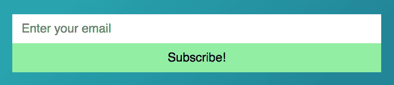

# 用 CSS 网格创建一个简单的表单

> 原文：<https://dev.to/zellwk/creating-a-simple-form-with-css-grid--38dm>

在上一篇文章中，您学习了用 Flexbox 创建一个简单的表单。今天，您将了解如何使用 CSS Grid 创建同样的东西。

这是我们正在建造的:

[T2】](https://res.cloudinary.com/practicaldev/image/fetch/s--NMT7PVb5--/c_limit%2Cf_auto%2Cfl_progressive%2Cq_auto%2Cw_880/https://zellwk.cimg/2018/simple-form-css-grid/form.png)

## 用 CSS 网格构建表单

从上图中，我们知道表单包含两个元素:

1.  电子邮件字段
2.  提交按钮

下面是 HTML:

```
<form>
  <input type="email" name="email"> 
  <button type="submit">Send</button>
</form> 
```

要用 CSS Grid 构建表单，需要将父表单的`display`属性设置为`grid`。

```
form {
  display: grid;
} 
```

以下是您得到的结果:

[T2】](https://res.cloudinary.com/practicaldev/image/fetch/s--IFGZW368--/c_limit%2Cf_auto%2Cfl_progressive%2Cq_auto%2Cw_880/https://zellwk.cimg/2018/simple-form-css-grid/grid1.png)

为什么我们有两排？

我们得到两行，因为我们没有指定网格的列数。浏览器将总是默认为一列。

对于这个表单，我们需要设置两列。

1.  第一列应该扩展以填满所有可用空间
2.  第二列应该根据其内容调整大小

对于第一列，我们可以使用`fr`单位。对于第二列，我们可以使用`auto`。

```
form {
  display: grid;
  grid-template-columns: 1fr auto;
} 
```

至此，您已经完成了表单的布局。这是给你玩的电笔:

参见 [CodePen](https://codepen.io) 上 Zell Liew ( [@zellwk](https://codepen.io/zellwk) )的钢笔[带 CSS 网格的简单表格](https://codepen.io/zellwk/pen/qMLErJ/)。

## 当元素高度不相等时...

我们将通过用 SVG 替换`button`的文本来模拟高度不等的元素。[这和我们在上一篇文章](https://dev.to/blog/simple-form-with-flexbox)中所做的一样。

```
<form action="#">
  <input type="email" placeholder="Enter your email">
  <button type="button"> <!-- a smiley icon --> </button>
</form> 
```

[](https://res.cloudinary.com/practicaldev/image/fetch/s--h1ehl2KA--/c_limit%2Cf_auto%2Cfl_progressive%2Cq_auto%2Cw_880/https://zellwk.cimg/2018/simple-form-css-grid/smiley.png) 

<figure>

<figcaption>向提交按钮添加笑脸图标</figcaption>

</figure>

注意`input`的高度也增加了以适应大的 SVG 图标！同样，我们不必编写任何额外的代码。这是因为网格项被垂直拉伸以填满所有可用空间。

如果您想改变这种行为，您可以将`align-items`属性改为`start`、`end`或`center`。

[](https://res.cloudinary.com/practicaldev/image/fetch/s--vulH41Gj--/c_limit%2Cf_auto%2Cfl_progressive%2Cq_auto%2Cw_880/https://zellwk.cimg/2018/simple-form-css-grid/align-items.png) 

<figure>

<figcaption>如果将`align-itemns`设置为不同的值</figcaption>

</figure>

，项目可以不同的方式对齐

这是给你玩的电笔:

参见 [CodePen](https://codepen.io) 上 Zell Liew ( [@zellwk](https://codepen.io/zellwk) )的[带 CSS 网格的简单表单(带 SVG 按钮)](https://codepen.io/zellwk/pen/jvXEzm/)。

## 包装完毕

CSS 网格使创建布局变得容易。不一定要用于宏观布局。它还可以用于微型布局，如您在这里看到的表单示例。

享受 CSS 网格的乐趣！

* * *

感谢阅读。这篇文章最初发表在我的博客上。如果你想要更多的文章来帮助你成为一个更好的前端开发者，请注册[我的时事通讯](https://zellwk.com)。