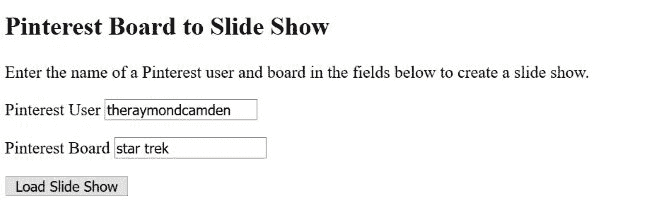
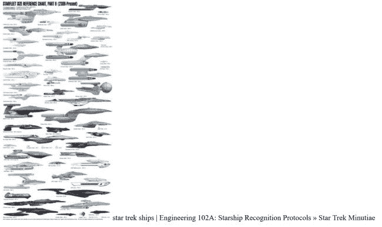

# 在 Vue.js 中为 Pinterest 板创建幻灯片

> 原文：<https://dev.to/raymondcamden/creating-a-slide-show-for-pinterest-boards-in-vuejs-ff6>

我像躲避瘟疫一样避开了 Pinterest，因为我非常讨厌他们让你注册只看基本内容的方式。但是最近一场很好的友谊赛让我产生了兴趣，我决定自己报名。我并没有用它做什么特别有趣的事情，但是我决定试一试。这位朋友最近联系我，问我是否知道用 Pinterest 板制作幻灯片的方法。

对于不使用 Pinterest 的人来说，“boards”就是简单的物品集合。图片、文字等。我做了一些快速谷歌搜索，我找不到任何最近的有帮助的东西。这位朋友非常聪明，但也不是技术人员，所以我认为使用 Vue.js 从头构建一些东西可能会很酷。所有公共 Pinterest 板都有 RSS 提要，所以我需要做的就是解析 RSS，然后一次显示一个项目。如果您只想玩工具，而不关心代码，请访问:

[https://codepen.io/cfjedimaster/full/yRVYJa/](https://codepen.io/cfjedimaster/full/yRVYJa/)

现在还没有很好的错误处理，所以-嗯-不要搞砸了？好的，那么我是如何建造这个的呢？我从一个简单的 Vue 应用程序开始，它有一个初始屏幕，提示您输入用户名和董事会名称:

[T2】](https://res.cloudinary.com/practicaldev/image/fetch/s--lPzgOYQA--/c_limit%2Cf_auto%2Cfl_progressive%2Cq_auto%2Cw_880/https://static.raymondcamden.cimg/2018/10/pint1.jpg)

输入这些信息后，代码解析在以下位置找到的 RSS:

[https://www.pinterest.com/USER/BOARD.rss/](https://www.pinterest.com/USER/BOARD.rss/)

对于我的 RSS 解析，我使用了 [Feednami](https://toolkit.sekando.com/docs/en/feednami) ，这是我在 2015 年[第一次回顾](https://www.raymondcamden.com/2015/12/08/parsing-rss-feeds-in-javascript-options)的服务。它仍然工作得很好，几乎是一个没有大脑的东西。

一旦加载完毕，我就在视图中注入每一项的 HTML，等待六秒钟，然后进入下一项。

[T2】](https://res.cloudinary.com/practicaldev/image/fetch/s--iBDzjDzu--/c_limit%2Cf_auto%2Cfl_progressive%2Cq_auto%2Cw_880/https://static.raymondcamden.cimg/2018/10/pint2.jpg)

我本来可以添加一点 CSS，但我保持简单。让我们从快速浏览 HTML 开始。

```
<div id="app" v-cloak>

  <div v-if="inputMode">
    <h2>Pinterest Board to Slide Show</h2>

    <p>
      Enter the name of a Pinterest user and board in the fields below to create a slide show.
    </p>

    <p>
      <label for="user">Pinterest User</label>
      <input id="user" v-model="user">
    </p>
    <p>
      <label for="board">Pinterest Board</label>
      <input id="board" v-model="board">
    </p>
    <p>
      <button @click="loadSlideShow" :disabled="loadDisabled">Load Slide Show</button>
    </p>
  </div><div v-else>

    <div v-if="loading"><i>Loading content...</i></div>
    <transition name="fade" mode="out-in">
    <div v-if="curItem" v-html="curItem" :key="curItem">
    </div>
    </transition>
  </div>

</div> 
```

Enter fullscreen mode Exit fullscreen mode

我想这里没什么有趣的，但是我可以说这一点对我来说很难做对。不管我在 Vue 中使用了多少次转场，我还是会纠结。

JavaScript 也很短:

```
const SLIDE_DURATION = 6000;

const app = new Vue({
  el:'#app',
  data:{
    inputMode:true,
    user:'theraymondcamden',
    board:'star trek',
    loading:true,
    items:[],
    selected:null,
    curItem:null
  },
  methods:{
    loadSlideShow() {
      this.inputMode = false;
      let board = this.board.replace(/ /g, "-");
      let url = `https://www.pinterest.com/${encodeURIComponent(this.user)}/${encodeURIComponent(board)}.rss/`;
      console.log('url to load is '+url);
      feednami.load(url)
      .then(feed => {
        console.log('total en', feed.entries.length);
        //console.log(feed.entries[0]);
        for(let entry of feed.entries) {
          // add the entries to results, but remove link from desc
          let newItem = entry.description;
          newItem = newItem.replace(/<a.*?>/,'');
          newItem = newItem.replace(/<\/a>/,'');
          this.items.push(newItem);
          //console.log(newItem);
          this.loading = false;
        }
        this.selected = 0;
        this.curItem = this.items[this.selected];
        setInterval(() => {
          this.newItem();
        }, SLIDE_DURATION);
      });

    },
    newItem() {
      console.log('newItem running, current selected ', this.selected);
      this.selected++;
      if(this.selected === this.items.length) this.selected = 0;
      this.curItem = this.items[this.selected];
    }
  },
  computed:{
    loadDisabled() {
      return this.user == '' || this.board == '';
    }
  }
}) 
```

Enter fullscreen mode Exit fullscreen mode

唯一真正酷的部分(在我看来)是 feednami 集成，它之所以有趣主要是因为它非常简单。简单就好！你可以在下面找到完整的代码笔供你欣赏。据我所知，这是我的朋友想要给她的孩子的东西，所以对我来说-这是值得花的时间！

[https://codepen.io/cfjedimaster/embed/yRVYJa?height=600&default-tab=result&embed-version=2](https://codepen.io/cfjedimaster/embed/yRVYJa?height=600&default-tab=result&embed-version=2)