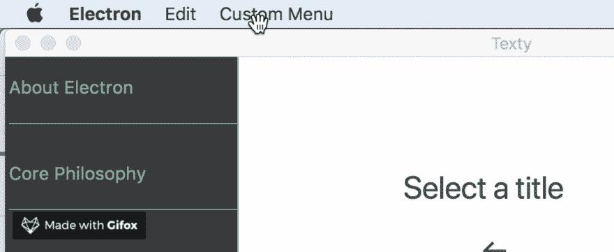

# 在 electronic 中创建文本编辑器:第 2 部分-编写文件

> 原文：<https://dev.to/aurelkurtula/creating-a-text-editor-in-electron-part-2---writing-files-l80>

在[上一课](https://dev.to/aurelkurtula/creating-a-text-editor-in-electron-reading-files-13b8)中，创建了基本结构。我们能够从目录中读取文件，在侧边栏中列出它们的标题，并且能够在屏幕上读取它们的内容。

在本教程中，我们将添加更多的互动。首先让我们谈谈菜单。由于我们没有指定自己的菜单，Electron 默认给了我们一个，但是在`./main.js`里面我们可以创建自己的按钮，让它们做我们需要的事情。让我们看一个例子。

```
const { app, BrowserWindow, Menu } = require('electron')
...
app.on('ready', function(){
    devtools = new BrowserWindow()
    window = new BrowserWindow({ x: 0, y: 0, width:800, height:600})
    window.loadURL(path.join('file://', __dirname, 'static/index.html'))
    window.setTitle('Texty')
    Menu.setApplicationMenu(Menu.buildFromTemplate([
        {
            label: app.getName(),
            submenu: [
                {
                    label: `Hello`,
                    click: () => console.log("Hello world")
                }
            ]
        }
    ]))

}) 
```

Enter fullscreen mode Exit fullscreen mode

我们首先需要来自电子的`Menu`分量。然后我们用它为将要加载的应用程序创建菜单。以上只是一个例子。像往常一样，第一个标签只是打开子菜单。因此，对于标签，我们使用应用程序名称，然后我们创建一个控制消息的`Hello`按钮。

让我们展开菜单。然而，由于对象可能很大，所以让我们将菜单添加到一个单独的组件中。

```
// ./main.js
const menu = require('./components/Menu')
app.on('ready', function(){
    window = new BrowserWindow({ x: 0, y: 0, width:800, height:600})
    ...
    Menu.setApplicationMenu(menu(window))

}) 
```

Enter fullscreen mode Exit fullscreen mode

导航就是这样拆分的。

让我们创建一个返回函数的`./components/Menu.js`文件。

```
const {app, Menu } = require('electron')
module.exports = function(win){
    return Menu.buildFromTemplate([
        {
            label: app.getName(),
            submenu: [
                { label: `Hello`, click: () => console.log("Hello world") }
            ]
        },
        {
            label: 'Edit',
            submenu: [
                {label: 'Undo', role: 'undo'  },
                {label: 'Redo', role: 'redo'  },
                {label: 'Cut', role: 'cut'  },
                {label: 'Copy', role: 'copy'  },
                {label: 'Paste', role:'paste'  },
            ]
        },
        {
            label: 'Custom Menu', 
            submenu: [/* We'll add more actions */]
        }

    ])    
} 
```

Enter fullscreen mode Exit fullscreen mode

电子给了我们一组[角色](https://electronjs.org/docs/api/menu-item#roles)，它们在引擎盖下做着繁重的工作。点击链接查看所有可用的角色。

从现在开始，我们将把所有的导航添加到`Custom Menu`的子菜单中——以保持它的趣味性！

## 创建新文档

到目前为止，我们的应用程序的状态是从磁盘读取文件并显示内容。(这种方法的缺陷将在最后讨论)

让我们添加添加新文档的功能。

我们首先在导航中添加一个按钮。因此，在`./components/Menu.js`中添加以下内容:

```
const { NEW_DOCUMENT_NEEDED } = require('../actions/types')
module.exports = function(window){
...
{
    label: 'Custom Menu', 
    submenu: [
        {
            label: 'New',
            accelerator: 'cmd+N',
            click: () => {
                window.webContents.send(NEW_DOCUMENT_NEEDED, 'Create new document')
            }
        }
    ] 
```

Enter fullscreen mode Exit fullscreen mode

这样就在菜单上创建了一个`New`按钮，`accelerator`属性是给按钮一个快捷方式。然后，在单击按钮时，我们向应用程序的呈现部分发送一条消息！

我读过的一些教程指出这很难掌握，但是想想 [redux](https://dev.to/aurelkurtula/introduction-to-redux-1g3) ，与商店沟通的唯一方式是通过监听和发送消息。这里也完全一样。

`./main.js`处理后端。它让我们可以访问 electron 的模块(比如菜单，如果需要的话可以访问网络摄像头等等)。

`./static/scripts/*.js`中的一切都无法访问上述功能。这部分代码只与操作 DOM 有关。甚至有很强的理由反对在任何 fs 操作中使用这部分代码(更多内容见下文)。

回到`./static/scripts/index.js`，我们会监听`NEW_DOCUMENT_NEEDED`。

```
const { ipcRenderer } = require('electron'); 
const { NEW_DOCUMENT_NEEDED } = require(path.resolve('actions/types'))
ipcRenderer.on(NEW_DOCUMENT_NEEDED, (event , data) => {
    let form = document.getElementById('form')
        form.classList.toggle('show')
    document.getElementById('title_input').focus()
    form.addEventListener('submit', function(e){
        e.preventDefault()
        // write file here ?
    })
}) 
```

Enter fullscreen mode Exit fullscreen mode

我们监听`NEW_DOCUMENT_NEEDED`的传输。当我们听到它时，我们显示一个表单(通常的 CSS 类切换)。

[T2】](https://res.cloudinary.com/practicaldev/image/fetch/s---bt62m2X--/c_limit%2Cf_auto%2Cfl_progressive%2Cq_66%2Cw_880/https://thepracticaldev.s3.amazonaws.com/i/0jc3y1livwh81ef6y6yg.gif)

然后当表单提交后，我们需要写一个新的文件。

对于这个简单的应用程序，我们将在`// write file here ?`下面使用`fs.writeFile`。然而，如果这是一个大项目，我们不希望在渲染端做任何文件系统操作。如果应用程序很大，甚至`./main.js`也无法处理操作(显然你需要一个新窗口，这超出了我们的范围)。然而，主要是为了探索如何做到这一点，我们将让`./main.js`写入系统。

```
const { ipcRenderer } = require('electron'); 
const {  WRITE_NEW_FILE_NEEDED } = require(path.resolve('actions/types'))
...
form.addEventListener('submit', function(e){
    e.preventDefault()
    // write file here ?
    ipcRenderer.send(WRITE_NEW_FILE_NEEDED, {
        dir: `./data/${fileName}.md`
    })
}) 
```

Enter fullscreen mode Exit fullscreen mode

上面我们正在发送一个对象到`WRITE_NEW_FILE_NEEDED`通道(该通道名称可以是你喜欢的任何名称)

前往`./main.js`我们创建文件，然后发回消息:

```
ipcMain.on(WRITE_NEW_FILE_NEEDED, (event, {dir}) => {
    fs.writeFile(dir, `Start editing ${dir}`, function(err){
        if(err){ return console.log('error is writing new file') }
        window.webContents.send(NEW_FILE_WRITTEN, `Start editing ${dir}`)
    });
}) 
```

Enter fullscreen mode Exit fullscreen mode

完全相同的想法，当`WRITE_NEW_FILE_NEEDED`被传输时，获取通过该通道发送的`dir`,将文件写入该目录，并发回一条消息，表明写入过程已经完成。

最后，回到`./statics/scripts/index.js`

```
form.addEventListener('submit', function(e){
    e.preventDefault()
    let fileName = e.target[0].value
    ...
    ipcRenderer.on(NEW_FILE_WRITTEN, function (event, message) {
        handleNewFile(e, `./data/${fileName}.md`, message)
    });
}) 
```

Enter fullscreen mode Exit fullscreen mode

仅此而已。

当然，您应该克隆[库](https://github.com/aurelkurtula/Texty/tree/part2)来获得完整的图片。`handleNewFile`仅隐藏表单，在应用程序打开时处理点击事件。并在页面上显示内容。

```
const handleNewFile = function(form, dir, content){ 
    let fileName =form.target[0].value
    form.target.classList.remove('show')
    let elChild = document.createElement('li')
    elChild.innerText = fileName
    readFileContentOnClick(dir, elChild) // read file on click
    form.target[0].value = ''
    form.target.parentNode.insertBefore(elChild,form.target.nextSibling);
    document.getElementById('content').innerHTML = content;
} 
```

Enter fullscreen mode Exit fullscreen mode

我理解 ipcRenderer 和 ipcMain 之间通信的方式是通过思考 redux 的基础。我们与 redux 商店的沟通方式完全相同。

这是我们目前掌握的代码图表

[T2】](https://res.cloudinary.com/practicaldev/image/fetch/s--oF1lAsnA--/c_limit%2Cf_auto%2Cfl_progressive%2Cq_auto%2Cw_880/https://thepracticaldev.s3.amazonaws.com/i/bsr98gyi3fg34kmangpg.png)

正如您所看到的，两个进程之间的这种舞蹈对于我们正在做的事情来说是多余的，但是为了不阻塞 UI，这种事情必须发生。正如我所说的，在更大的应用程序中，这可能还不够。我觉得不是功能，是 bug。

## 保存修改

最后，对于系列的这一部分，我们需要保存更改。

按照 Mac 模式，我想要一个文件需要保存的视觉指示，并在文件保存后删除该指示。从`./static/scripts/index.js`开始

```
document.getElementById('content').onkeyup = e => { 
    if(!document.title.endsWith("*")){ 
        document.title += ' *' 
    }; 
    ipcRenderer.send(SAVE_NEEDED, { // alerting ./component/Menu.js
        content: e.target.innerHTML,
        fileDir
    })
} 
```

Enter fullscreen mode Exit fullscreen mode

`onkeyup`意味着已经输入了一些东西，如果是这样的话，在标题上加一个星号，然后将`SAVE_NEEDED`传送到主进程。它需要输入的信息和受影响的文件目录。

这次我们不打算在`./main.js`中监听，而是在`./components/Menu.js`中监听(当然这也是同一个过程的一部分)。

```
let contentToSave = ''
ipcMain.on(SAVE_NEEDED, (event, content) => {
    contentToSave = content 
})
module.exports = function(window){
    return Menu.buildFromTemplate([
        ...
        {
            label: 'Save',
            click: () => {
                if(contentToSave != ''){
                    fs.writeFile(contentToSave.fileDir, contentToSave.content, (err) => {
                        if (err) throw err;
                        window.webContents.send(SAVED, 'File Saved')
                    });
                }
            },
            accelerator: 'cmd+S'
        } 
```

Enter fullscreen mode Exit fullscreen mode

在`SAVE_NEEDED`我们传输内容。然后，每次选择`Save`时，我们检查内容，如果存在，我们写入文件。然后，一旦文件被写入，我们就向渲染部分发送一个警报，消息是`File Saved`，我们在`./static/scripts/index.js`
处理它

```
ipcRenderer.on(SAVED, (event , data) => { // when saved show notification on screen
    el = document.createElement("p");
    text = document.createTextNode(data);
    el.appendChild(text)
    el.setAttribute("id", "flash");
    document.querySelector('body').prepend(el)
    setTimeout(function() { // remove notification after 1 second
        document.querySelector('body').removeChild(el);
        document.title = document.title.slice(0,-1) // remove asterisk from title
    }, 1000);
}); 
```

Enter fullscreen mode Exit fullscreen mode

最终结果是:

[T2】](https://res.cloudinary.com/practicaldev/image/fetch/s--HlIK8Dex--/c_limit%2Cf_auto%2Cfl_progressive%2Cq_66%2Cw_880/https://thepracticaldev.s3.amazonaws.com/i/cpq3d0d9yt5pcz3s3aiz.gif)

今天到此为止！

然而，我觉得我需要陈述显而易见的事实。我打算把重点放在电子基础上。因此，正如你已经注意到的，我根本没有关注验证。

为了满足生产的最低标准，我们需要做的事情有很多:

*   检查文件是否已经存在。
*   在文件之间移动时处理未保存的文件。
*   实际上将内容转换为 markdown。
*   使用`innerText`而不是`innerHTML`存储内容(正如 [@simonhaisz](https://dev.to/simonhaisz) 在上一篇教程中指出的)。
*   还有许多比上述更重要的事情。

然而，这些都不是专门针对电子的，因此我选择不花时间写和解释对学习电子没有帮助的代码。

在这个迷你系列中还会有一个教程，我们将会看到添加另一个窗口和处理用户偏好。

同时，在 [github，branch: part2](https://github.com/aurelkurtula/Texty/tree/part2) 查看项目

[](/aurelkurtula) [## 在 electronic 中创建文本编辑器:第 1 部分-读取文件

### aurel Kurt ula 9 月 5 日 182 分钟阅读

#electron #javascript #node](/aurelkurtula/creating-a-text-editor-in-electron-reading-files-13b8)[](/aurelkurtula) [## 在 electronic 中创建文本编辑器:第 3 部分-设置首选项

### aurel Kurt ula 9 月 12 日 187 分钟阅读

#electron #javascript #node](/aurelkurtula/creating-a-text-editor-in-electron-part-3---setting-preferences-584h)