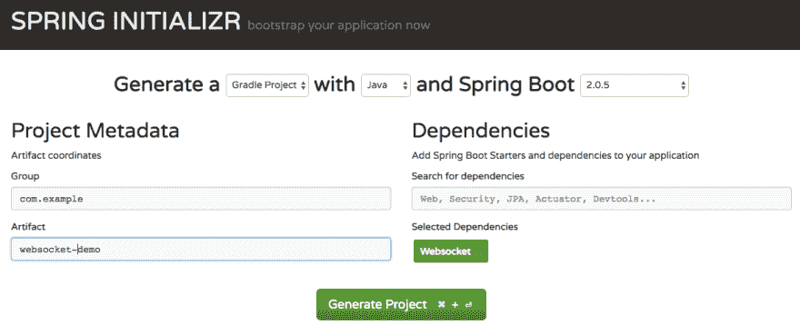
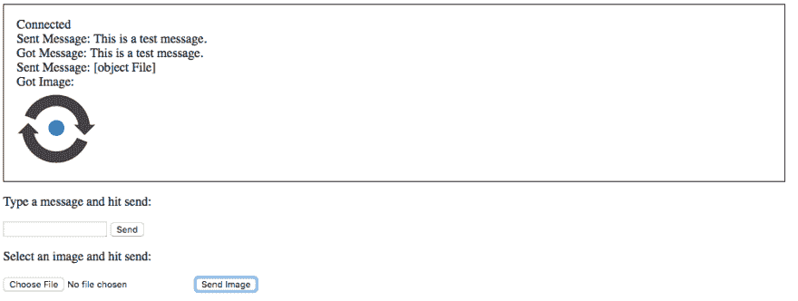

# 用 Spring Boot 创建 WebSocket 服务器

> 原文：<https://dev.to/vonagedev/creating-a-websocket-server-with-spring-boot-424o>

[WebSocket](https://en.wikipedia.org/wiki/WebSocket) 是一种支持服务器和浏览器之间通信的协议。它比 RESTful HTTP 有优势，因为通信是双向和实时的。这允许服务器随时通知客户端，而不是客户端定期轮询更新。

在这一系列文章中，我将向你展示用 Java 创建 WebSocket 服务器的三种不同方法，分别使用 [Spring Boot](http://spring.io/projects/spring-boot) 、 [Spark 框架](http://sparkjava.com/)和【WebSockets 的 Java API。

## 先决条件

您将使用 [Gradle](https://gradle.org/) 来管理您的依赖项并运行您的应用程序。

此外，您需要确保安装了 JDK 的副本。我将在本教程中使用 JDK 8。

## 带 Spring Boot 的 WebSockets

Spring Boot 允许你在一个可运行的 JAR 中创建生产级的 Spring 应用程序。

### 创建项目

您可以使用 [Spring Initializr](https://start.spring.io/) 来引导您的应用程序并选择您需要的包。

对于这个例子，您将需要`Websocket`依赖项。我还将使用 Gradle，所以您将需要更改它来生成一个 Gradle 项目。

[T2】](https://www.nexmo.com/wp-content/uploads/2018/10/Screenshot-2018-10-08-11.14.20.png)

单击生成项目按钮将下载一个 zip 文件。将此文件解压到您选择的目录中。

### 创建 WebSocket 句柄

WebSocket 消息可以是文本和二进制的。您将创建一个可以处理这两种消息的处理程序。

创建一个名为`WebSocketHandler`的新类，它扩展了`com.example.demo`包中的`AbstractWebSocketHandler`。`AbstractWebSocketHandler`要求您实现两个方法，`handleTextMessage`和`handleBinaryMessage`，当接收到一个新的文本或二进制消息时会调用这两个方法。

出于演示目的，您将创建一个 echo 服务器，它将收到的消息回显给发送者。

添加以下实现:

```
@Override
protected void handleTextMessage(WebSocketSession session, TextMessage message) throws IOException {
    System.out.println("New Text Message Received");
    session.sendMessage(message);
}

@Override
protected void handleBinaryMessage(WebSocketSession session, BinaryMessage message) throws IOException {
    System.out.println("New Binary Message Received");
    session.sendMessage(message);
} 
```

### 注册 WebSocket 处理程序

为了使用`WebSocketHandler`，它必须在 Spring 的`WebSocketHandlerRegistry`中注册。下面将完成两件事:

1.  它将在`/socket`路径上注册`WebSocketHandler`。
2.  它将允许所有浏览器客户端向服务器发送消息。他们不会被要求有一个特定的来源。

创建一个名为`WebSocketConfiguration`的新类，它实现了`com.example.websocketdemo`包中的`WebSocketConfigurer`接口。

用`@Configuration`和`@EnableWebSocket`注释`WebSocketConfiguration`。

`WebSocketConfigurer`要求你实现一个`registerWebSocketHandlers`方法。

将以下实现添加到寄存器`WebSocketHandler` :

```
@Override
public void registerWebSocketHandlers(WebSocketHandlerRegistry registry) {
    registry.addHandler(new WebSocketHandler(), "/socket").setAllowedOrigins("*");
} 
```

因为除了文本消息之外，您还将处理二进制消息，所以设置最大二进制消息大小是个好主意。这是存储在服务器容器上的值。您可以通过注入一个新的服务器容器工厂作为您的`WebSocketConfiguration`的一部分来覆盖这个值。

添加以下代码，在先前添加的`registerWebSocketHandlers`方法之上的`WebSocketConfiguration`中注入一个新的【T0:

```
@Bean
public ServletServerContainerFactoryBean createWebSocketContainer() {
    ServletServerContainerFactoryBean container = new ServletServerContainerFactoryBean();
    container.setMaxBinaryMessageBufferSize(1024000);
    return container;
} 
```

这将允许上传最大 1 MB 的图像。

### 创建一个客户端来测试你的应用程序

您需要创建一个客户机来测试您的 WebSocket 服务器。您将需要测试发送文本和二进制消息。这可以用 JavaScript 来完成。

将以下内容添加到`src/main/resources/static`文件夹内的`index.html`:

```
<html>
<head>
    <style>
        #messages {
            text-align: left;
            width: 50%;
            padding: 1em;
            border: 1px solid black;
        }
    </style>
    Sample WebSocket Client
</head>
<body>
<div class="container">
    <div id="messages" class="messages"></div>
    <div class="input-fields">
        <p>Type a message and hit send:</p>
        <input id="message"/>
        <button id="send">Send</button>

        <p>Select an image and hit send:</p>
        <input type="file" id="file" accept="image/*"/>

        <button id="sendImage">Send Image</button>
    </div>
</div>
</body>
<script>
    const messageWindow = document.getElementById("messages");

    const sendButton = document.getElementById("send");
    const messageInput = document.getElementById("message");

    const fileInput = document.getElementById("file");
    const sendImageButton = document.getElementById("sendImage");

    const socket = new WebSocket("ws://localhost:8080/socket");
    socket.binaryType = "arraybuffer";

    socket.onopen = function (event) {
        addMessageToWindow("Connected");
    };

    socket.onmessage = function (event) {
        if (event.data instanceof ArrayBuffer) {
            addMessageToWindow('Got Image:');
            addImageToWindow(event.data);
        } else {
            addMessageToWindow(`Got Message: ${event.data}`);
        }
    };

    sendButton.onclick = function (event) {
        sendMessage(messageInput.value);
        messageInput.value = "";
    };

    sendImageButton.onclick = function (event) {
        let file = fileInput.files[0];
        sendMessage(file);
        fileInput.value = null;
    };

    function sendMessage(message) {
        socket.send(message);
        addMessageToWindow("Sent Message: " + message);
    }

    function addMessageToWindow(message) {
        messageWindow.innerHTML += `<div>${message}</div>`
    }

    function addImageToWindow(image) {
        let url = URL.createObjectURL(new Blob([image]));
        messageWindow.innerHTML += ``
    }
</script>
</html> 
```

### 启动应用程序

您的 WebSocket 服务器现在已经完成了。使用应用程序目录中的`gradle bootRun`命令启动应用程序。

您可以通过 [http://localhost:8080](http://localhost:8080) 访问您的应用程序，您将看到以下页面:

[T2】](https://www.nexmo.com/wp-content/uploads/2018/10/2018-10-01-13-38-05.png)

“connected”消息表示 JavaScript 客户端能够建立连接。

尝试通过在输入字段中键入并点击发送按钮来发送文本消息。也可以试着上传一张图片。在这两种情况下，您应该看到相同的消息和图像回显。

[T2】](https://www.nexmo.com/wp-content/uploads/2018/10/2018-10-01-14-23-40.png)

## 结论

在本教程中，您学习了如何使用 Spring Boot 创建一个 WebSocket 服务器，它可以接收二进制和文本消息。本教程的最终代码可以在[NEX mo-community/web socket-spring-boot](https://github.com/nexmo-community/websocket-spring-boot)资源库中找到。

你试过 Spark 框架吗？您可能想看看如何使用 Spark 框架创建 WebSocket 服务器。

您是否知道可以在 [Nexmo 呼叫控制对象](https://developer.nexmo.com/voice/voice-api/ncco-reference#websocket-the-websocket-to-connect-to)中使用 WebSocket 作为端点？看看这个关于[用语音网络套接字](https://www.nexmo.com/blog/2016/12/19/streaming-calls-to-a-browser-with-voice-websockets-dr/)将呼叫流式传输到浏览器的例子。

有兴趣阅读更多关于 WebSockets 的内容吗？查看[上的这篇文章什么是 WebSockets？他们如何增强数字解决方案？](https://www.nexmo.com/blog/2018/09/05/websockets-enhance-digital-solutions/)