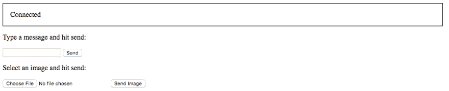
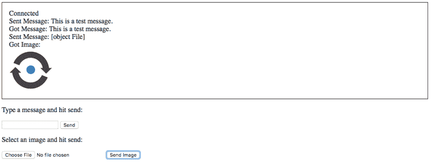

# 用 Spark 框架创建 WebSocket 服务器

> 原文：<https://dev.to/vonagedev/creating-a-websocket-server-with-the-spark-framework-1837>

[WebSocket](https://en.wikipedia.org/wiki/WebSocket) 是一种支持服务器和浏览器之间通信的协议。它比 RESTful HTTP 有优势，因为通信是双向和实时的。这允许服务器随时通知客户端，而不是客户端定期轮询更新。

在这一系列文章中，我将向你展示用 Java 创建 WebSocket 服务器的三种不同方法，分别使用 [Spring Boot](http://spring.io/projects/spring-boot) 、 [Spark 框架](http://sparkjava.com/)和【WebSockets 的 Java API。

## 先决条件

您将使用 [Gradle](https://gradle.org/) 来管理您的依赖项并运行您的应用程序。

此外，您需要确保安装了 JDK 的副本。我将在本教程中使用 JDK 8。

## 采用 Spark 框架的 WebSockets

Spark 是一个用于创建 Java 和 Kotlin web 应用程序的微框架。

### 创建项目

您将使用 Gradle 初始化一个新的 Java 应用程序。您可以使用以下命令为您的项目创建一个目录，导航到该目录，并初始化应用程序:

```
mkdir websocket-spark-framework
cd websocket-spark-framework
gradle init --type=java-application 
```

### 添加火花依赖

将以下依赖项添加到`build.gradle`的`dependencies`块中:

```
compile 'com.sparkjava:spark-core:2.7.2' 
```

与用 Spring Boot 创建 WebSocket 服务器的[不同，使用 Spark 的 WebSockets 只与嵌入式](https://www.nexmo.com/blog/2018/10/08/create-websocket-server-spring-boot-dr/) [Jetty](https://www.eclipse.org/jetty/) 服务器一起工作，并且您需要在任何 HTTP 路由之前定义路径和处理程序。

### 创建 WebSocket 句柄

WebSocket 消息可以是文本和二进制的。您将创建一个可以处理这两种消息的处理程序。

创建一个名为`WebSocketHandler`的新类，并用`@WebSocket` :
对其进行注释

```
import org.eclipse.jetty.websocket.api.annotations.WebSocket;

@WebSocket
public class WebSocketHandler {

} 
```

`WebSocketHandler`处理的每个事件都由一个注释定义。您可以使用`@OnWebSocketMessage`注释来标记用于接收二进制或文本事件的方法。

出于演示目的，您将创建一个 echo 服务器，它将收到的消息回显给发送者。

添加以下方法:

```
@OnWebSocketMessage
public void handleTextMessage(Session session, String message) throws IOException {
    System.out.println("New Text Message Received");
    session.getRemote().sendString(message);
}

@OnWebSocketMessage
public void handleBinaryMessage(Session session, byte[] buffer, int offset, int length) throws IOException {
    System.out.println("New Binary Message Received");
    session.getRemote().sendBytes(ByteBuffer.wrap(buffer));
} 
```

请注意，方法签名决定了该方法将处理哪种类型的消息。参见 [`OnWebSocketMessage`注释文档](https://www.eclipse.org/jetty/javadoc/current/org/eclipse/jetty/websocket/api/annotations/OnWebSocketMessage.html)获取支持的方法签名列表。

### 注册 WebSocket 处理程序

为了使用`WebSocketHandler`，它必须被注册。

打开 Gradle 为您创建的`App`类。删除`getGreeting`方法和`main`方法的内容，因为你也不需要。

在 main 方法内部添加下面的代码来注册`/socket`路径上的`WebSocketHandler`:

```
@Override
public void registerWebSocketHandlers(WebSocketHandlerRegistry registry) {
    webSocket("/socket", WebSocketHandler.class);
} 
```

### 创建一个客户端来测试你的应用程序

您需要创建一个客户机来测试您的 WebSocket 服务器。您将需要测试发送文本和二进制消息。这可以用 JavaScript 来完成。

在`src/main`文件夹中创建`resources`文件夹。在`resources`文件夹中，创建`static`文件夹。

将以下内容添加到`src/main/resources/static`文件夹内的`index.html`:

```
<html>
<head>
    <style>
        #messages {
            text-align: left;
            width: 50%;
            padding: 1em;
            border: 1px solid black;
        }
    </style>
    Sample WebSocket Client
</head>
<body>
<div class="container">
    <div id="messages" class="messages"></div>
    <div class="input-fields">
        <p>Type a message and hit send:</p>
        <input id="message"/>
        <button id="send">Send</button>

        <p>Select an image and hit send:</p>
        <input type="file" id="file" accept="image/*"/>

        <button id="sendImage">Send Image</button>
    </div>
</div>
</body>
<script>
    const messageWindow = document.getElementById("messages");

    const sendButton = document.getElementById("send");
    const messageInput = document.getElementById("message");

    const fileInput = document.getElementById("file");
    const sendImageButton = document.getElementById("sendImage");

    const socket = new WebSocket("ws://localhost:8080/socket");
    socket.binaryType = "arraybuffer";

    socket.onopen = function (event) {
        addMessageToWindow("Connected");
    };

    socket.onmessage = function (event) {
        if (event.data instanceof ArrayBuffer) {
            addMessageToWindow('Got Image:');
            addImageToWindow(event.data);
        } else {
            addMessageToWindow(`Got Message: ${event.data}`);
        }
    };

    sendButton.onclick = function (event) {
        sendMessage(messageInput.value);
        messageInput.value = "";
    };

    sendImageButton.onclick = function (event) {
        let file = fileInput.files[0];
        sendMessage(file);
        fileInput.value = null;
    };

    function sendMessage(message) {
        socket.send(message);
        addMessageToWindow("Sent Message: " + message);
    }

    function addMessageToWindow(message) {
        messageWindow.innerHTML += `<div>${message}</div>`
    }

    function addImageToWindow(image) {
        let url = URL.createObjectURL(new Blob([image]));
        messageWindow.innerHTML += ``
    }
</script>
</html> 
```

现在您需要配置 Spark 来寻找您的`index.html`,并在应用程序运行时初始化服务器。您还可以定义服务器监听连接的端口。

在`App`类的`main`方法中，在`webSocket`下面添加以下内容:

```
staticFileLocation("static");
port(8080)
init(); 
```

### 启动应用程序

您的 WebSocket 服务器现在已经完成了。使用应用程序目录中的`gradle run`命令启动应用程序。

您可以通过 [http://localhost:8080](http://localhost:8080) 访问您的应用程序，您将看到以下页面:

[T2】](https://www.nexmo.com/wp-content/uploads/2018/10/2018-10-01-13-38-05.png)

“connected”消息表示 JavaScript 客户端能够建立连接。

尝试通过在输入字段中键入并点击发送按钮来发送文本消息。也可以试着上传一张图片。在这两种情况下，您应该看到相同的消息和图像回显。

[T2】](https://www.nexmo.com/wp-content/uploads/2018/10/2018-10-01-14-23-40.png)

## 结论

在本教程中，您学习了如何使用 Spark 创建一个可以接收二进制和文本消息的 WebSocket 服务器。本教程的最终代码可以在[NEX mo-community/web socket-spark-framework](https://github.com/nexmo-community/websocket-spark-framework)资源库中找到。

想要在您现有的 [Spring](https://spring.io/) 应用程序中实现 WebSockets 吗？也许你想了解一下[用 Spring Boot](https://www.nexmo.com/blog/2018/10/08/create-websocket-server-spring-boot-dr/) 创建一个 WebSocket 服务器？

没有框架？没问题！请继续关注下一篇教程，我将向您展示如何使用 WebSockets 的 Java API 创建 WebSocket 服务器。

您是否知道可以在 [Nexmo 呼叫控制对象](https://developer.nexmo.com/voice/voice-api/ncco-reference#websocket-the-websocket-to-connect-to)中使用 WebSocket 作为端点？看看这个关于[用语音网络套接字](https://www.nexmo.com/blog/2016/12/19/streaming-calls-to-a-browser-with-voice-websockets-dr/)将呼叫流式传输到浏览器的例子。

想看看 WebSockets 的有趣用法吗？查看[NEX mo-community/DTMF-snake](https://github.com/nexmo-community/dtmf-snake)存储库，了解一些让您使用双音多频信号玩贪吃蛇游戏的代码。