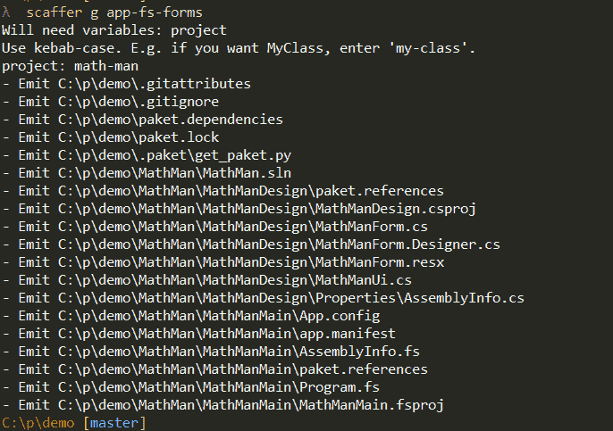
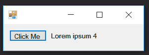
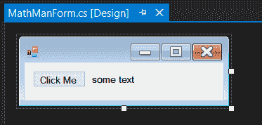

# 用 F#创建 Windows 窗体 GUI

> 原文：<https://dev.to/vivainio/creating-a-windows-forms-gui-with-f-337m>

[T2】](https://res.cloudinary.com/practicaldev/image/fetch/s--ze5I1uv6--/c_limit%2Cf_auto%2Cfl_progressive%2Cq_auto%2Cw_880/https://cdn-images-1.medium.com/max/559/1%2AjAJoDLM4IRmo3EEls2IavA.jpeg)

Windows 窗体并没有死——自从微软宣布他们将在[支持它以来，它现在比过去几年更有活力。NET Core 3.0](https://blogs.msdn.microsoft.com/dotnet/2018/05/07/net-core-3-and-support-for-windows-desktop-applications/) ，你将能够[在表单应用中嵌入“现代”UWP 控件](https://docs.microsoft.com/en-us/windows/uwp/xaml-platform/xaml-host-controls)。

除了没死，它还有其他优势:

*   从 F#中很容易使用，你会从这篇文章中看到。WPF 需要更复杂的改编工作(例如，有一个 [XAML 类型的提供者](https://fsprojects.github.io/FsXaml/))，而 Forms 几乎是直截了当的. NET
*   。NET Native(即“完整的”UWP 堆栈)根本不能与 F#一起工作，而且可能永远也不会——所以它可能与您的选择无关。
*   Windows Forms 使用 Qt 和其他 UI 工具包中熟悉的编程模式，因此您几乎可以在一天内上手。
*   它并不特别适合“丰富的”或定制的 UI，但无论如何你都不会写这些。当有人付钱让你在桌面上做一个丰富的用户界面时，他们是付钱让你在网络上做。
*   它是真正的 Windows 原生工具包，所以应用程序可以非常小。一个做某件事的应用可以发生在 20kB(没有 F#当然 F#加 ca。重量的 3MB)。
*   与 WPF 或 UWP 不同，Windows 窗体有一个跨平台的故事，可以在 Linux/Mac 下的 Mono 中运行。

#### 你说用 F#吗？

用 F#进行 GUI 编程的问题是，UI 设计工具是为 C#和 VB 程序员编写的。推荐的方法通常是:

*   使用窗体 UI 设计器在 C#中创建 GUI 逻辑。
*   使用 F#创建库，并从 GUI 中调用它们。

这样做的一个明显问题是，你并不真的想在不必要的情况下使用 C#，并希望将语言上下文切换保持在最低限度——更不用说你被限制在边界上的 C#端得到良好支持的结构。

另一种方法可能只适合经验丰富的表单开发人员，那就是不用设计器，用 F#编写所有内容。这一点至少在(优秀)“*专家 F#* ”这本书里有所概述，如果你好奇怎么做的话。

我在这里建议的另一种方法是，也用 F#编写所有的 GUI 逻辑，只有当您想在窗体设计器中移动东西时，才使用 C#语言。您的主要入口点是 F#应用程序，然后它实例化主表单(和后续表单)。表单用一个“behind”类注册它们所有的 UI 组件，然后这个类绑定事件处理程序，并用一种更美观的语言(如果你是新手，那就是 F#)实现所有复杂的 GUI 逻辑。

我将采用一种快捷方式，使用一个 [Scaffer 模板](https://github.com/vivainio/scaffer-templates)来创建应用程序框架:

[T2】](https://res.cloudinary.com/practicaldev/image/fetch/s--gF04dcn5--/c_limit%2Cf_auto%2Cfl_progressive%2Cq_auto%2Cw_880/https://cdn-images-1.medium.com/max/686/1%2Azhmw1J5UeS3fId7uN_-xQw.png)

呀！那是一大堆东西。恐惧，不，你只需要关心他们中的少数人。如果你点击文件，你会注意到:

*   MathManDesign 是一个用 C#编写的项目(DLL)。这是您将在 VS 中打开并在设计器周围单击的文件。
*   MathManMain 是“主”应用程序(“EXE”)。它包含启动 Windows 窗体、实例化 MathManForm 和挂接“behind”类的入口点。它接受对 MathManDesign 项目的项目引用，但 MathManDesign 没有任何对 MathManMain 的引用。因此，当暴露在 C#中时，你可以大胆地使用有可用性问题的 F#构造(例如 DU 的)。这种依赖“反转”是由 nuget 中可用的微 DI 库 [TrivialBehinds](https://github.com/vivainio/TrivialBehinds) 完成的。

当您构建并启动应用程序时，您将看到最小的默认功能在运行:

[T2】](https://res.cloudinary.com/practicaldev/image/fetch/s--GOEj-I2Q--/c_limit%2Cf_auto%2Cfl_progressive%2Cq_auto%2Cw_880/https://cdn-images-1.medium.com/max/301/1%2A_vT2FfVc10uxKW_SzxV36g.png)

(为了验证这种行为，我建议单击几次按钮，观察标签中“Lorem ipsum”后面的数字在每次单击时是如何递增的)。

在设计器中是这样的(双击 MathManForm.cs 查看设计视图):

[T2】](https://res.cloudinary.com/practicaldev/image/fetch/s--FPn295IH--/c_limit%2Cf_auto%2Cfl_progressive%2Cq_auto%2Cw_880/https://cdn-images-1.medium.com/max/373/1%2AVcBCTfXg-N9bVWorBO3SqA.png)

并按 f7 键进入代码: