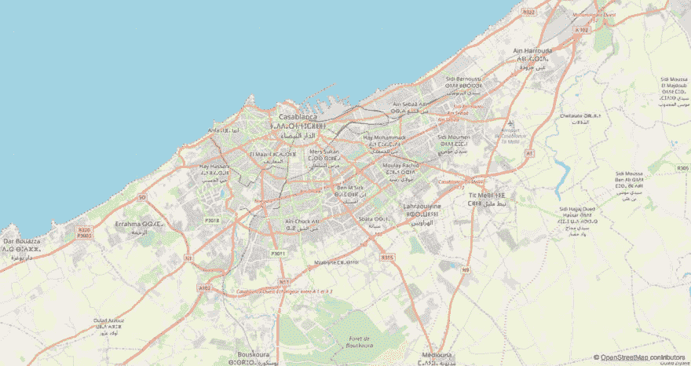

# 用 D3 和 Vue 创建交互式地图

> 原文：<https://dev.to/denisinvader/creating-an-interactive-map-with-d3-and-vue-4158>

[源代码](https://github.com/denisinvader/vue-d3-map) | [现场预告](https://denisinvader.github.io/vue-d3-map/)

## 为什么我需要它

有很多方法可以在你的网站或应用程序中加入地图:谷歌地图、地图盒、传单等。很简单。有些服务让你只需点击几下就能完成。

但是，当你需要定制设计、显示一些数据集或做任何你想做的事情时，情况就变得糟糕了。此外，在 Vue 或 React 中，你不能使用 JSX，必须使用命令式抽象 javascript API(但我使用 Vue，因为我对模板和反应性非常感兴趣)。

此外，一些图书馆对私人项目不免费。

因此，我不得不再次在地图上显示一些数据，我决定:我想完全控制我的代码，我将创建自己的二十一点和妓女地图。

## 第一步:创建静态地图。

先说简单的 vue-cli 3 app，带 Babel 和 sass。

我们需要 D3 和 [d3-tile](https://github.com/d3/d3-tile) (不包含在 d3 npm 包中)来渲染地图瓦片。

```
yarn add d3 d3-tile 
```

实际上我们不需要完整的 d3 代码。对于一个简单的地图，我们只需要 d3-geo 用于地图投影，d3-tile 用于生成切片，所以我们将只包含这些包。

接下来，我们应该定义一些设置，如规模，宽度，高度和初始坐标。通常我通过计算元素的大小来使我的所有图表响应它的容器。

```
<script>
const d3 = {
  ...require('d3-geo'),
  ...require('d3-tile'),
};

export default {
  props: {
    center: {
      type: Array,
      default: () => [33.561041, -7.584838],
    },
    scale: {
      type: [Number, String],
      default: 1 << 20,
    },
  },
  data () {
    return {
      width: 0,
      height: 0,
    };
  },
  mounted () {
    const rect = this.$el.getBoundingClientRect();

    this.width = rect.width;
    this.height = rect.height;
  },
  render () {
    if (this.width <= 0 || this.height <= 0) {
      // the dummy for calculating element size
      return <div class="map" />;
    }

    return (
      <div class="map">our map will be here</div>
    );
  },
};
</script>

<style lang="scss" scoped>
.map {
  width: 100%;
  height: 100%;
}
</style> 
```

现在定义投影和平铺生成器。

```
export default {
  // ... 
  computed: {
    projection () {
      return d3.geoMercator()
        .scale(+this.scale / (2 * Math.PI))
        .translate([this.width / 2, this.height / 2])
        .center(this.center)
      ;
    },
    tiles () {
      return d3.tile()
        .size([this.width, this.height])
        .scale(+this.scale)
        .translate(this.projection([0, 0]))()
      ;
    },
  },
  // ...
}; 
```

我总是将 d3 辅助函数定义为计算属性，所以当一些参数改变时，Vue 会重新计算它们并更新我们的组件。

现在我们有了显示地图所需的一切，我们只需渲染生成的图块:

```
export default {
  render () {
    if (this.width <= 0 || this.height <= 0) {
      return <div class="map" />;
    }

    return (
      <div class="map">
        
          <g>
            {this.tiles.map(t => (
              <image
                key={`${t.x}_${t.y}_${t.z}`}
                class="map__tile"
                xlinkHref={`https://a.tile.openstreetmap.org/${t.z}/${t.x}/${t.y}.png `}
                x={(t.x + this.tiles.translate[0]) * this.tiles.scale}
                y={(t.y + this.tiles.translate[1]) * this.tiles.scale}
                width={this.tiles.scale}
                height={this.tiles.scale}
              />
            ))}
          </g>
        
      </div>
    );
  },
}; 
```

在这里，我们浏览由 d3-tile 生成的图块，并从图块服务器请求图像。

你可以在这里找到其他服务器[或者你甚至可以托管你自己的](https://wiki.openstreetmap.org/wiki/Tile_servers)[定制风格的磁贴服务器](https://openmaptiles.org)。

别忘了加个版权。

```
<div class="map__copyright">
  ©&nbsp;
  <a
    href="https://www.openstreetmap.org/copyright"
    target="_blank"
  >OpenStreetMap&nbsp;</a>
  contributors
</div> 
```

```
.map {
  // ...
  position: relative;
  font-family: Arial, sans, sans-serif;

  &__copyright {
    position: absolute;
    bottom: 8px;
    right: 8px;
    padding: 2px 4px;
    background-color: rgba(#ffffff, .6);
    font-size: 14px;
  }
} 
```

现在我们有了卡萨布兰卡的静态地图。还不是很刺激。

[T2】](https://res.cloudinary.com/practicaldev/image/fetch/s--F7-yd3U---/c_limit%2Cf_auto%2Cfl_progressive%2Cq_auto%2Cw_880/https://thepracticaldev.s3.amazonaws.com/i/i5xqgdvy0qobkeyjffob.png)

## 第二步:添加地图控件。

最让我兴奋的是 Vue 如何简化了创建交互式地图的方式。我们只是更新投影参数和地图更新。第一次就像是简单的魔法！

我们将通过拖动地图来制作缩放按钮和位置控件。

先说拖。我们需要在组件数据中定义投影转换属性，并在 svg 元素上定义一些鼠标事件监听器(或者您可以在 tiles 组上监听它们)。

```
<script>
// ...

export default {
  // ...
  data () {
    return {
      // ...
      translateX: 0,
      translateY: 0,

      touchStarted: false,
      touchLastX: 0,
      touchLastY: 0,
    };
  },
  computed: {
    projection () {
      return d3.geoMercator()
        .scale(+this.scale / (2 * Math.PI))
        .translate([this.translateX, this.translateY])
        .center(this.center)
      ;
    },
    // ...
  },
  mounted () {
    // ...
    this.translateX = this.width / 2;
    this.translateY = this.height / 2;
  },
  methods: {
    onTouchStart (e) {
      this.touchStarted = true;

      this.touchLastX = e.clientX;
      this.touchLastY = e.clientY;
    },
    onTouchEnd () {
      this.touchStarted = false;
    },
    onTouchMove (e) {
      if (this.touchStarted) {
        this.translateX = this.translateX + e.clientX - this.touchLastX;
        this.translateY = this.translateY + e.clientY - this.touchLastY;

        this.touchLastX = e.clientX;
        this.touchLastY = e.clientY;
      }
    },
  },
  render () {
    // ...
    return (
      <div class="map">
        
          // ...
        
        // ...
      </div>
    );
  },
};
</script>

<style lang="scss" scoped>
.map {
  // ...

  &__tile {
    // reset pointer events on images to prevent image dragging in Firefox
    pointer-events: none;
  }
  // ...
}
</style> 
```

哇！我们只需更新翻译值和加载新的瓷砖，这样我们就可以探索世界。但是如果没有缩放控件，这样做就不太舒服，所以让我们来实现它。

我们需要在组件的数据中移动`scale` prop，添加`zoom`属性并呈现缩放按钮。

根据我的经验，最小和最大的磁贴缩放级别是 10 和 27(老实说，我不太确定这是否适用于所有的磁贴提供商)。

```
<script>
// ...

const MIN_ZOOM = 10;
const MAX_ZOOM = 27;

export default {
  props: {
    center: {
      type: Array,
      default: () => [-7.584838, 33.561041],
    },
    initialZoom: {
      type: [Number, String],
      default: 20,
    },
  },
  data () {
    return {
      // ...
      zoom: +this.initialZoom,
      scale: 1 << +this.initialZoom,
    };
  },
  // ...
  watch: {
    zoom (zoom, prevZoom) {
      const k = zoom - prevZoom > 0 ? 2 : .5;

      this.scale = 1 << zoom;
      this.translateY = this.height / 2 - k * (this.height / 2 - this.translateY);
      this.translateX = this.width / 2 - k * (this.width / 2 - this.translateX);
    },
  },
  // ...
  methods: {
    // ...
    zoomIn () {
      this.zoom = Math.min(this.zoom + 1, MAX_ZOOM);
    },
    zoomOut () {
      this.zoom = Math.max(this.zoom - 1, MIN_ZOOM);
    },
  },
  render () {
    // ...
    return (
      <div class="map">
        <div class="map__controls">
          <button
            class="map__button"
            disabled={this.zoom >= MAX_ZOOM}
            onClick={this.zoomIn}
          >+</button>
          <button
            class="map__button"
            disabled={this.zoom <= MIN_ZOOM}
            onClick={this.zoomOut}
          >-</button>
        </div>
        //...
      </div>
    );
  },
};
</script>

<style lang="scss" scoped>
.map {
  // ...
  &__controls {
    position: absolute;
    left: 16px;
    top: 16px;
    display: flex;
    flex-direction: column;
    justify-content: space-between;
    height: 56px;
  }
  &__button {
    border: 0;
    padding: 0;
    width: 24px;
    height: 24px;
    line-height: 24px;
    border-radius: 50%;
    font-size: 18px;
    background-color: #ffffff;
    color: #343434;
    box-shadow: 0 1px 4px rgba(0, 0, 0, .4);

    &:hover,
    &:focus {
      background-color: #eeeeee;
    }

    &:disabled {
      background-color: rgba(#eeeeee, .4);
    }
  }
  // ...
}
</style> 
```

在这里。仅仅两步，我们就用 Vue、D3 和 OpenStreetMap 创建了简单的交互式地图。

## 结论

利用 D3 和 Vue 的反应能力，创建自己的地图视图组件并不困难。我认为最重要的事情之一是完全控制 DOM，而不是使用一些抽象的地图渲染器的 API，这些 API 会对我可爱的元素做一些模糊的事情。

当然，为了制作一个好的强大的地图，我们需要实现更多的功能，如平滑缩放，最大边界等。但是所有的东西都是完全可定制的，所以你可以做任何你想做或需要做的事情。

如果你觉得这篇文章有用，我可以写更多关于如何改进这张地图并在上面显示数据。

请随意提问。