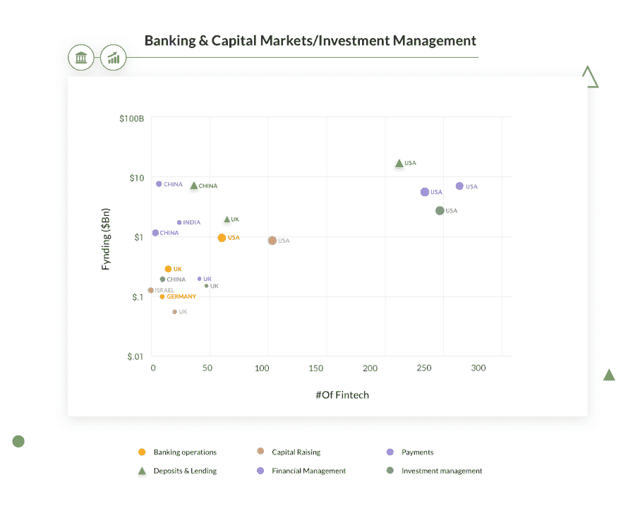
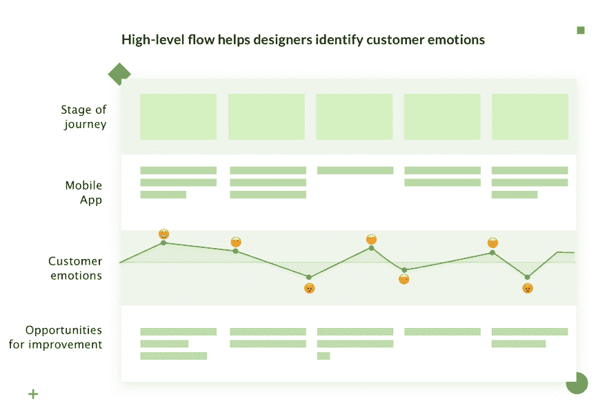
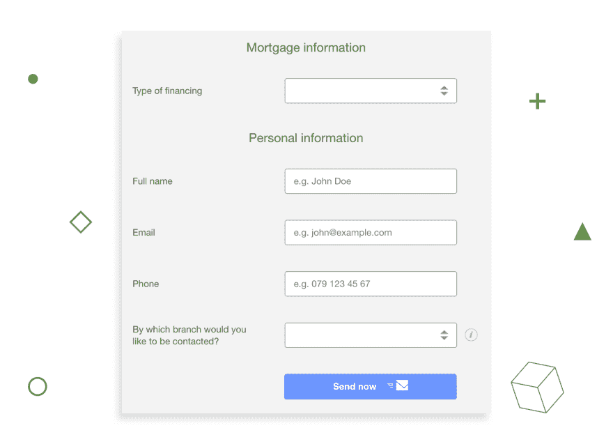
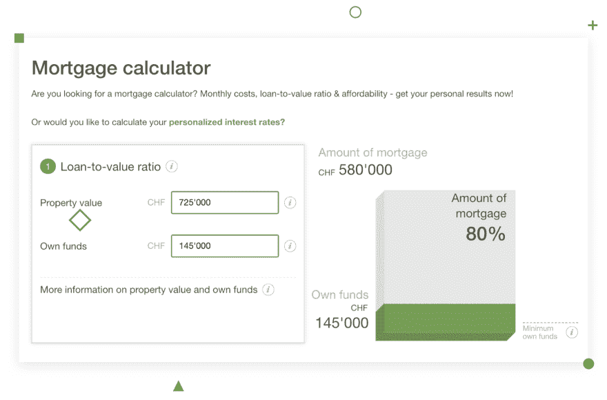
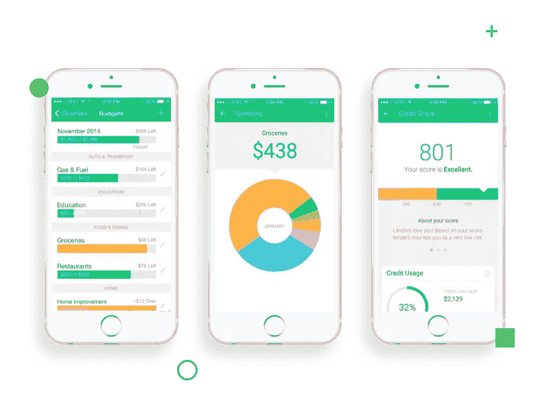

# 创建在线抵押贷款服务:提示和见解

> 原文：<https://dev.to/django_stars/creating-an-online-mortgage-service-tips-and-insights-1eoo>

金融科技在 2010 年代开始崛起，改变了传统金融服务的形象。由于网上银行、网上投资和网上支付已经存在，抵押贷款成为数字产品只是时间问题。它们变得比传统版本更方便，更面向客户，更省时。所有这些好处都伴随着这样一个事实，即推动金融科技崛起的力量之一千禧一代已经准备好成为房地产市场的[目标客户。](https://www.forbes.com/sites/forbesfinancecouncil/2018/02/05/a-truly-digital-mortgage-are-we-there-yet/#6dc49f037100)随着抵押贷款需求的增长和市场面向数字用户，在线抵押贷款服务旨在满足当前需求并取代传统贷款服务。

在这里，建立一个在线抵押贷款服务的要点揭示:陷阱，建议和最佳做法。

## 网上抵押贷款为何兴盛

我的同事曾经写道，金融科技的出现是金融活动的日常需求与我们开展金融活动的难度之间永无止境的斗争的结果。我们可以得出结论，推动金融科技发展的众多因素之一是，人们不愿意与不方便且高度官僚化的传统金融机构打交道。

在抵押贷款自动化软件方面，被称为千禧一代的整整一代人影响了全球数字贷款服务的升级。这种情况正在发生，部分原因是 1980 年至 1999 年出生的千禧一代现在已经足够成熟，可以成为这种服务的客户，部分原因是千禧一代构成了大多数购买人口。因此，企业正在改变策略，通过提供即时购买、更低的价格和易懂的产品来满足千禧一代的购物习惯。

[T2】](https://res.cloudinary.com/practicaldev/image/fetch/s--tBE-9NFc--/c_limit%2Cf_auto%2Cfl_progressive%2Cq_auto%2Cw_880/https://djangostars.com/blog/conteimg/2018/10/Img-1--12-.png)

在线抵押贷款平台(1)比传统的实体抵押贷款服务(经纪人、银行等)更容易理解。)、(2)可能比银行行动更快，以及(3)可能更便宜。
[JD Power&Associates](https://www.rehmann.com/resources-insights/business-wisdom-2/item/1399-online-mortgage-origination-key-to-future-success)表示，与传统机构相比，在线贷款服务的贷款增长率高出 30%。发放 30%以上贷款的可能性应该足以激励公司重新评估他们的方法，转向更加以客户为中心的经营方式。

但这并不意味着开始网上抵押贷款服务会立即让你变得富有。在创建这样的服务之前和期间，有许多事情需要考虑。在本文中，我将分享我和我的团队在 Django Stars 为客户开发在线抵押贷款服务时的经历。

我将从你的开发团队应该事先知道什么，以及在设计用户流时应该关注什么开始。然后我将讨论与第三方服务的集成，在最后一部分，我将告诉你金融科技产品中 UI/UX 的特性。

## 与技术伙伴一起组织工作流程

以下是您的开发团队应该知道的，以建立一个成功的抵押贷款平台，以及如果您有一个国际团队，如何组织工作流程。**我将关注开发前阶段**——也就是说，在真正的工作开始之前，哪些输入是重要的。

### 定义最终用户

在“抵押贷款平台”中，*平台*暗示服务将对许多类型的用户可用。可以是想获得抵押贷款的个人，也可以是发放抵押贷款的公司(或个体商贩)。无论哪种方式，定义您平台中的角色，并创建您客户的形象。

一旦你有了它们，你将回答两个基本问题:

*   我们这样做是为了谁？
*   这些用户之间是如何互动的？

### 创建高层流

当你知道*谁*将使用这个平台时，你就能看到他们将如何使用它。创建高级用户流，以标记使用抵押贷款服务的阶段，并预测与第三方服务的可能集成。在这种情况下，大多数这样的服务是银行。你可能需要用它们来识别客户并获取他们的信用记录。

[T2】](https://res.cloudinary.com/practicaldev/image/fetch/s--K8VLZZHO--/c_limit%2Cf_auto%2Cfl_progressive%2Cq_auto%2Cw_880/https://djangostars.com/blog/conteimg/2018/10/Img-3--4-.png)

**基于流量，可以看到用户的痛点，考虑如何修补。**例如，许多用户不喜欢透露他们的个人和银行信息。当你确定了这是必要的步骤后，你可以思考如何转化一个负面的体验——“有人会看到我的信用记录！”—变成积极的—“我一定会拿到房贷的！”

记住银行还是传统的金融机构，所以有些流程必然充满拖后腿的官僚主义。在估计流程中某些操作所需的时间时，要考虑到这一点。

### 组织国际团队的工作

如果你正在为美国建立一个在线抵押贷款，这并不总是意味着开发团队会在那里。这个简短的部分是关于与国际开发团队合作的。

为了高效工作，你需要记住以下几点:

*   第三方服务通常只在当地时间 9 点到 5 点工作。因此，如果你需要巴克莱银行的 API，你只能在英国夏令时 9 点到 5 点访问它。当你计划每周的活动时，提前安排与第三方的会议以避免延误。

*   时区差异最多可达 8 小时。这是与国际团队合作时的痛苦。从我的经验来看，安排会议和计划活动最好让你至少有三个工作时间重叠。

*   国家法定假日可以在工作日庆祝。向您的技术团队询问此类日期。根据墨菲定律，它们通常发生在第一次发布的那一周。

关于方法，有许多管理软件开发生命周期(SDLC)的方法。最著名的是敏捷。我写过一篇文章，介绍为什么[敏捷 SDLC 模型最适合你的初创公司。它会让你对 Scrum 和看板有一个基本的了解，以及什么时候应用其中的一个。](https://producttribe.com/project-management/agile-sdlc-guide)

现在让我们更深入地研究用户流和与第三方的集成。

## 流程、第三方集成和服务器

### 如何轻松收集信息

经过深思熟虑的用户流预示着更高的用户参与度。与我稍后将提到的其他因素一起，流量定义了用户是否会变成客户。如果你的高层流程看起来太复杂，你需要优化它。
抵押贷款软件开发的一个特点是，用户必须提供大量的个人信息，开发者必须想办法让这个过程变得轻松。填写在线表格的过程既耗时又令人沮丧。大多数用户在被要求填写表格时会退出网站。

[T2】](https://res.cloudinary.com/practicaldev/image/fetch/s--w-U1_H1J--/c_limit%2Cf_auto%2Cfl_progressive%2Cq_auto%2Cw_880/https://djangostars.com/blog/conteimg/2018/10/Img-4--6-.png)

*描述:在制作[金钱公园](https://moneypark.ch/en/)的时候，我们强调了在第一步*只收集基本信息的重要性

为了简化这个过程，在最初的步骤中只询问必要的信息。在他们得到早期反馈(例如，对抵押贷款的粗略估计)并准备好继续后，你可以询问更详细的信息。如果你把一个大步骤(收集信息)分成几个小步骤，你的用户会感觉到较少的压力。表单应该按照从最重要到最不重要的顺序组织。如果有些字段是可选的，让用户知道。

### 银行 APIs |用户流量

大多数整合到在线抵押贷款中的第三方服务是银行。平台提出检索用户信息的请求，如 id、客户邮件、信用记录等等。这种请求通常有固定的费用，通常是 1 到 10 美元。为了避免浪费金钱，你需要以这样一种方式建立流程，使你**提出尽可能少的请求**——只有当你确信客户准备好使用你的服务时。

这就是我们所做的。使用我们的抵押贷款系统时，用户必须经过几个阶段的验证过程，以检查他们是否有资格获得抵押贷款。注册这项服务时，用户需要提供他们的全名和出生日期。第二步包括为用户提供粗略的抵押估计。如果用户想继续使用某项服务并获得真正的优惠，他们需要完成注册过程。这个流程允许我们**减少对第三方 API 的付费请求数量，**从而减少资金浪费。

[T2】](https://res.cloudinary.com/practicaldev/image/fetch/s--zxUISLkB--/c_limit%2Cf_auto%2Cfl_progressive%2Cq_auto%2Cw_880/https://djangostars.com/blog/conteimg/2018/10/Img-5--5-.png)

### 测试银行 API

当您将一个银行 API 集成到您的服务中时，您需要测试支付系统。为了避免使用自己的信用卡，开发人员可以从测试数据中得出结果。很多银行都提供这样的测试数据来检查使用支付系统的各种结果:*卡过期、丢失或被盗怎么办；当用户输入无效数据时会发生什么*等等。您需要测试尽可能多的情况，以避免以后不得不更改整个流程。

### 管理数据库

我们决定使用两种不同的云服务，一种用于平台，另一种用于数据库。抵押贷款应用程序在 AWS EC2 上运行，而数据库在单独的 RDS 服务器上。RDS 非常适合数据库，因为(1)它使用 PIOPS 来实现快速和一致的请求处理，以及(2)它有两种类型的备份机制(自动的和用户启动的)，这使得数据管理变得简单。

## UI/UX 设计

在这个简短的部分，我将总结主要的设计障碍以及如何处理它们。我将不讨论一般的设计原则，而是集中讨论抵押贷款服务的需求。

**好的设计，**正如[迪特·拉姆斯如此贴切地说，](https://www.vitsoe.com/eu/about/good-design) **是尽可能少的设计。**因此，良好的设计意味着创造一个无缝的(原谅这个时髦的词)流程。如果我们设计得足够好，也许人们根本不会知道这是一项金融服务。

### 手机版

首先要考虑的是手机版。因为我们正在谈论一个基于在线的应用程序，许多用户将试图使用他们的手机获得抵押贷款。主要的麻烦可能是数据网格以及如何在 5 英寸的显示器上显示。 [Mint App](https://www.mint.com/) 通过显示图表而不是网格来解决这个问题。可视化是 Excel 表格(糟糕的体验)和交互式数据(良好的体验)的区别。经常用。

[T2】](https://res.cloudinary.com/practicaldev/image/fetch/s--QpxB_pnT--/c_limit%2Cf_auto%2Cfl_progressive%2Cq_auto%2Cw_880/https://djangostars.com/blog/conteimg/2018/10/Img-2--8-.png)

### 小数

我们需要从传统银行业继承的是对细节的关注，尤其是涉及到钱的时候。用户可以输入金额的所有字段都必须允许小数，因为美分的数量会影响未来的收益。你不希望你的用户因为你的平台缺乏某个特定的功能而陷入糟糕的抵押贷款状况。

### 对个人资料的修改

我总是建议限制更改个人信息的能力。但未来可能会出现一种情况，其中一些需要更改——例如，如果用户结婚了，想要更改他们的姓氏。

**为了获得更好的安全性，决定哪些信息用户可以更改，哪些不可以更改**,并让他们在注册账户时知道，一旦他们创建了账户，就不能更改他们的个人信息。

### 倾听客户

当运行复杂的系统时，比如在线抵押贷款，准备好在你的支持渠道上收到大量的*如何做*的问题。你的客户为你提供了改善的最佳机会。用心听他们说，因为他们确实知道得更多。

我建议您建立一个内部网网站，在将它部署到活动服务器之前，使用假数据测试对网站的更改。您可以验证从用户那里得到的假设，通过定期这样做，您将提高 UX，直到大多数用户满意为止。

## 说起一个网络房贷平台

以下是我们团队的主要见解。这些陈述总结了文章的主要观点，是我们团队成员的想法:

*   由于我们要开发一个在线抵押贷款服务，让我们首先确定我们的目标最终用户，并创建一个流程来定义主要阶段和活动。

*   我们的技术团队在另一个时区。我们必须提前安排会议，并注意客户的休息日。

*   我们必须将我们的产品与传统的抵押贷款发放流程区分开来。如果我们不一次要求所有的信息，而是分成几个步骤呢？只有那些渴望获得贷款的人必须提供他们的个人信息。

*   对银行 API 的请求是昂贵的，因为它们提供了关于抵押的详细信息。只有付费客户才能制作。否则，我们很快就会破产。

*   *让我们把数据库处理服务器和网站服务器分开。这使得管理服务器变得更加容易。*

*   千禧一代热衷于优秀的设计。如果有什么是最重要的，那就是设计。

这篇关于[创建在线抵押贷款服务](https://djangostars.com/blog/creating-an-online-mortgage-service-tips-and-insights/)的文章最初发布在 Django Stars 博客上。