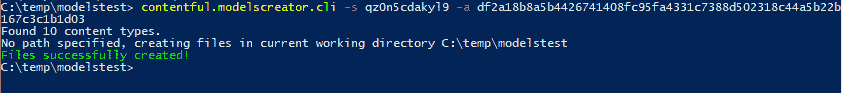
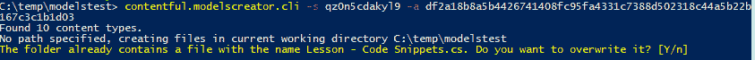
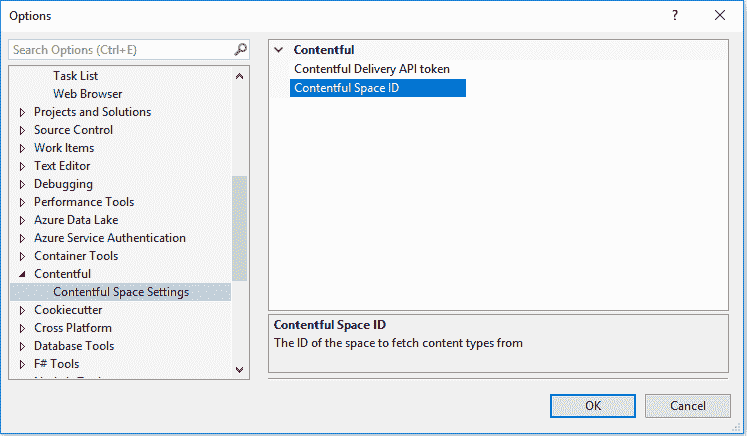
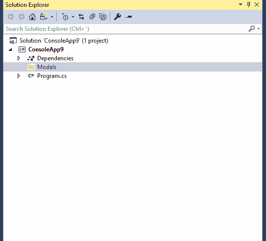
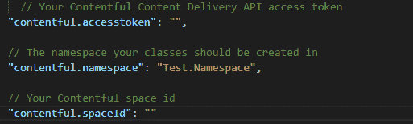
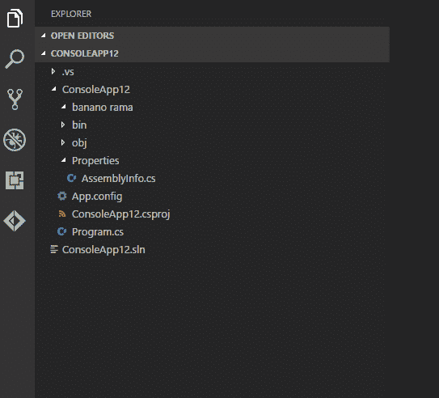

# 从您的内容模型创建类

> 原文：<https://dev.to/contentful_blog/creating-classes-from-your-content-model-4pe4>

[T2】](https://res.cloudinary.com/practicaldev/image/fetch/s--JgRNkSvN--/c_limit%2Cf_auto%2Cfl_progressive%2Cq_auto%2Cw_880/https://images.ctfassets.net/fo9twyrwpveg/5TFXhevTkkIQi06s20gm4g/81790f0d8e0423db1027dfaeb71539d3/27-June-Classes-from-your-content-model-update.png)

在我之前的文章中，我展示了如何使用 Contentful。CodeFirst 包，让你的 C#类作为 Contentful 中内容模型的基础。但是，如果您的内容模型已经存在，并且您想要创建相应的强类型 C#模型，会发生什么呢？要写的样板代码太多了——今天我很高兴发布一个新工具来帮助你做到这一点。

随着的发布。NET Core 2.1 中的“全球工具”是一项新功能，将会普遍提供。这意味着您可以运行`dotnet tool install -g your-tool-id`并直接从 NuGet 安装任何工具，以便可以从命令行调用它。

要安装 model creator 工具，请确保您拥有最新的[。安装了 NET Core SDK](https://www.microsoft.com/net/download/dotnet-core/) 版本，并从命令行运行`dotnet tool install -g contentful.modelscreator.cli`。

您现在应该能够运行`contentful.modelscreator.cli --help`来列出所有可用的命令。只有访问令牌和空间 ID 是必需的，但是还有一些其他命令很有趣:

*   `--namespace`或`-n`选项允许您指定应该在其中创建类的名称空间。
*   `--path`或`-p`选项允许您指定应该在硬盘上的什么位置创建类。

如果您使用我们示例应用程序中的凭证对其进行测试，您会得到以下结果:

```
contentful.modelscreator.cli -s qz0n5cdakyl9 -a df2a18b8a5b4426741408fc95fa4331c7388d502318c44a5b22b167c3c1b1d03 
```

[T2】](//images.ctfassets.net/fo9twyrwpveg/1uEbm5HDTSUki6i8EgwGS/69a787fc59d0251c342f07ff46e50cd8/first-result.PNG)

发生的情况是，这些类是在我的当前目录中创建的，例如，课程类是这样的:

```
using System;
using System.Collections.Generic;
using System.Linq;
using System.Text;
using System.Threading.Tasks;
using Contentful.Core.Models;

namespace Replace.Me.NameSpace
{
    public class Course
    {
        public SystemProperties Sys { get; set; }
        public string Title { get; set; }
        public string Slug { get; set; }
        public Asset Image { get; set; }
        public string ShortDescription { get; set; }
        public string Description { get; set; }
        public int Duration { get; set; }
        public string SkillLevel { get; set; }
        public List<Lesson> Lessons { get; set; }
        public List<Category> Categories { get; set; }
    }
} 
```

它自动将字段类型解析为正确的类型，并将属性的名称设置为与 Contentful 中字段的 id 相对应。它还试图通过检查字段的内容类型验证，将引用字段解析为正确的通用类型，例如`List<Lesson>`和`List<Category>`。如果只有一个内容类型验证，那么内容类型对应的类将被用作该属性的通用类型。

从上面的类中可以看出，命名空间将被设置为“Replace”。Me.NameSpace”，如果调用中没有提供的话。这可以很容易地搜索和替换。

要在初始调用中设置名称空间，只需像这样修改它...

```
contentful.modelscreator.cli -s qz0n5cdakyl9 -a df2a18b8a5b4426741408fc95fa4331c7388d502318c44a5b22b167c3c1b1d03 -n MyProject.Models 
```

...名称空间声明将如下所示:

```
namespace MyProject.Models
{
    public class Course
    {
          // Omitted for brevity
    }
} 
```

这与您使用-p 参数更改默认路径(当前目录)的方式相同。

```
contentful.modelscreator.cli -s qz0n5cdakyl9 -a df2a18b8a5b4426741408fc95fa4331c7388d502318c44a5b22b167c3c1b1d03 -n MyProject.Models -p c:\temp 
```

因此，现在将在 c:\temp 下创建这些类。

如果路径已经包含文件，系统将提示您覆盖(如果您做出了希望在现有类中反映的更改)或跳过(如果没有更改)该文件。

[T2】](//images.ctfassets.net/fo9twyrwpveg/627NbYxr4koWIGgOamsG6i/86224e8badaaf8ff33f6fc2e67c70523/skip-result.PNG)

如果想自动覆盖目录中的文件，可以使用`--force`或`-f`命令，文件将被覆盖，没有任何提示。

## 离开命令行

并不是每个人都热衷于使用命令行，而是更愿意在他们选择的 IDE 或编辑器中拥有一些东西。上面的 CLI 工具可以作为 Visual Studio 和 Visual Studio 代码的插件使用。

要在 Visual Studio 中安装它，请单击工具->扩展->更新，搜索 Contentful 并安装 Contentful。ModelsCreator 插件。

成功安装插件后，可以在工具->选项下找到新的设置。

[T2】](//images.ctfassets.net/fo9twyrwpveg/1hLeAAQFvyeimaWoUcoIKy/163fc022cdc95a9fe991d243a7e8d8ff/vs-settings.PNG)

一旦设置了访问令牌和空间 id，我现在可以右键单击我的解决方案中的任何文件夹，模型将在那里创建。

[T2】](//images.ctfassets.net/fo9twyrwpveg/1owVkTy7hC0gyseWiecmaI/87b9728394a5d53acee1b74d458cefba/models-creator-vs.gif)

类似地，您可以在 Visual Studio 代码中通过 Marketplace 安装插件，方法是单击 Extensions 选项卡并搜索 Contentful。一旦安装了扩展，还有类似数量的设置，您可以在其中指定 API 键、空间 id 和名称空间。

[T2】](//images.ctfassets.net/fo9twyrwpveg/2Y9O2BAO5aKMyQwoy6OeW/365fbff5389745faf23e1dfc4ef2fa3e/vs-code-settings.PNG)

之后，右键单击 Visual Studio 代码中的任何文件夹，并选择 Create Contentful Models 选项。

[T2】](//images.ctfassets.net/fo9twyrwpveg/1RhCsm84wogO6WMgiMAAak/dddbdee73fe3f529c332d5da78a53891/models-creator.gif)

## 发现更多，知足常乐

在本文中，我们研究了一个新的 CLI 工具和插件，它们可以帮助您直接从内容丰富的内容模型中创建强类型 C#类。如果你想了解更多，请在我们的 Github 库上查看 CLI 和 Visual Studio 代码插件。你也可以[了解更多。网芯 2.1](https://natemcmaster.com/blog/2018/05/12/dotnet-global-tools/)

如果你是 Contentful 的新手，你可以很容易地[创建一个免费账户](https://www.contentful.com/sign-up/?utm_campaign=classes-content-model&utm_medium=referral&utm_source=devto&utm_content=classes-content-model&utm_term=)来尝试我们在本教程中所学的内容。为您的内容获得一个空间，让您的静态网站启动和运行是轻而易举的事情；你自己试试吧！

编码快乐！