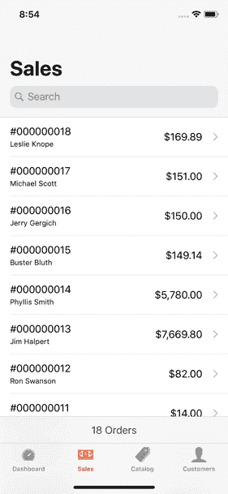

# 创建我的第一个应用程序:Mage To Go

> 原文：<https://dev.to/restoreddev/creating-my-first-app-mage-to-go-3c40>

2007 年 iPhone 刚出来的时候，我被这项技术惊呆了。看到一台界面漂亮的电脑放在你的手心里，真是不可思议。当应用商店在不久后创建时，智能手机的真正潜力开始显现。当时我觉得自己做一个 app 会很神奇。然而，我不知道如何编程。快进 10 年，编程是我的日常工作。所以，我决定试着实现这个梦想，作为一个副业。

白天，我做 web 开发，主要是用 PHP 和 JavaScript。我经常使用的一个框架是 Magento。Magento 是一个用于电子商务网站的完整 PHP 平台，与 WordPress 类似。Magento 最近发布了该应用程序的 2.0 版本，它具有现代 PHP 特性和更强大的 REST API。Magento 有一个类似于 WordPress 的管理界面，但是它是为桌面而建的，并没有为移动而优化。我看到了一个坚实的移动应用和 Mage To 的机会，这就是结果。

[T2】](https://res.cloudinary.com/practicaldev/image/fetch/s--4Q5Kh9IJ--/c_limit%2Cf_auto%2Cfl_progressive%2Cq_auto%2Cw_880/https://thepracticaldev.s3.amazonaws.com/i/vp0ukadyz6f8ba73t1vv.png)

[Mage To Go](http://magetogo.com) 是一个用 pure Swift 编写的 iOS 应用程序，它连接到 Magento REST API，允许用户以管理员身份登录并查看订单、产品和客户。我上周在[应用商店](https://itunes.apple.com/us/app/mage-to-go/id1332807419?ls=1&mt=8)发布了这个应用！这肯定是一个 1.0 产品，但我已经在开发下一轮功能了。我真的为我在这个应用上所做的工作感到骄傲，也为我将第一个副业项目发布到野外感到骄傲。

我计划写一篇文章，解释我是如何学习 Swift 的，以及我是如何准备应用程序的发布的，比如创建截图和设计网站(GitHub Pages 和 Nuxt.js 来拯救！).我真的很感谢任何关于该应用程序的想法或反馈。此外，如果你曾经在 app store 上发布过一个应用程序，我会喜欢你可能有的任何提示。

赢得胜利的辅助项目！