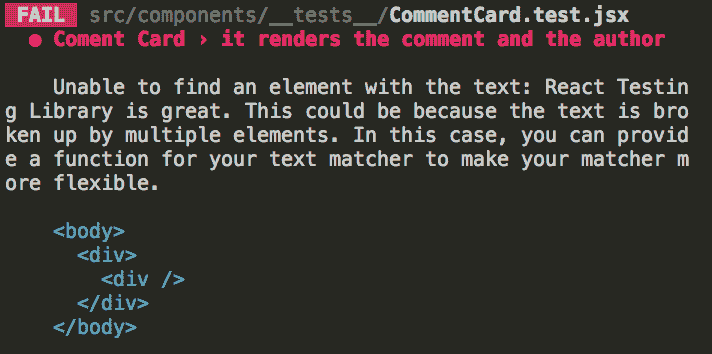

# 使用 React 测试库创建可读测试

> 原文：<https://dev.to/lukeghenco/creating-readable-tests-using-react-testing-library-577e>

## 了解如何用 BDD 测试来测试您的 React 代码。

[T2】](https://res.cloudinary.com/practicaldev/image/fetch/s--fqnh0Wqg--/c_limit%2Cf_auto%2Cfl_progressive%2Cq_auto%2Cw_880/https://cdn-images-1.medium.com/max/640/1%2AfA_cSQkUrV5Udj2075VQZg.png)

在 Flatiron School，我们已经开始使用 React 来构建几乎所有新的客户端项目，并将一些旧的主干+木偶应用程序转换为 React。这使得我们的前端代码更简洁、性能更高，并允许我们编写难以置信的应用程序，如我们的浏览器内学习 IDE(参见 [" **我们如何在浏览器中构建学习 IDE**"](https://medium.com/flatiron-labs/how-we-built-the-learn-ide-in-browser-d6db3ff39083))。

我们在代码库中使用 React 已经两年多了。我想说我们已经了解了关于反应测试的所有知识。然而，我们真正看到的只是围绕我们的组件规范中的实现细节的大量测试。这是我们之前的测试解决方案 Enzyme 的 API 所鼓励的。对于我们的 Redux 代码，也有大量经过良好测试的 reducer 规范。我们主要是测试实现细节(例如，Redux 中的存储变化是如何发生的，等等。)对比真正的集成测试，看看我们的前端代码实际上是否正常运行，这再次被认为是一种反模式。我们还尝试了快照测试，这仍然有它的用例，但可能是有限的(因为所有的事情都应该只需要开发人员键入“u”来更新)。

在研究更好的测试工具时，我们发现了一个名为 [**React 测试库**](https://github.com/kentcdodds/react-testing-library) (较新的 React 测试库之一)，由 [**Kent C. Dodds**](https://kentcdodds.com/) **提供。**这个库让我们能够专注于我们的应用程序的消费者如何使用我们的前端组件。它还确保我们测试的是功能，而不仅仅是实现细节。在其文件的指导原则部分，它指出，

> 你的测试越像你的软件被使用的方式，它们就越能给你信心。T3】
> 
> —肯特·c·多兹

这是我们团队在测试解决方案中寻找的核心。让我们构建一个简单的 React 应用程序，向您展示我通过使用 **React 测试库**所学到的东西。

### 现在！谁想用测试来构建一些东西？

让我们构建一个简单的评论应用程序，包含一个评论列表、评论卡和一个新的评论表单，以便对整个特性进行全面的测试。我们不会在这个应用程序中测试美丽，所以请随意你喜欢的风格。这是一个我们将建立的应用程序的例子样机:

[](https://res.cloudinary.com/practicaldev/image/fetch/s--7bpcqlnM--/c_limit%2Cf_auto%2Cfl_progressive%2Cq_auto%2Cw_880/https://cdn-images-1.medium.com/max/1024/1%2AwvO2Yzlm1Ry8llBQVTadVg.png) 

<figcaption>评论 App 汇总</figcaption>

我们将使用 [**Create React App**](https://github.com/facebook/create-react-app) 和 [**Yarn**](https://yarnpkg.com/en/) 作为我们的节点包管理器来引导一个快速 **React** 项目，然后使用**Arrange**->**Act**->**Assert**的通用测试模式。

### 引导应用程序

要开始，请运行以下命令:

```
$ create-react-app comments-app 
$ cd comments-app 
```

一旦 app 设置完成，我们需要添加 [**React 测试库**](https://github.com/kentcdodds/react-testing-library) 进行测试，添加 [**Axios**](https://github.com/axios/axios) 进行 API 请求，添加 [**PropTypes**](https://github.com/facebook/prop-types) 进行道具验证。

```
$ yarn add axios prop-types
$ yarn add react-testing-library --dev 
```

我们的。/package.json 文件现在应该看起来像这样:

```
//  package.json  {  //  ...  shortened  for  readability,  "dependencies":  {  //  versions  may  differ  depending  on  when  you  read  this,  //  but  this  should  work  with  any  16+  version  of  React  "axios":  "^0.18.0",  "react":  "^16.4.2",  "react-dom":  "^16.4.2",  "react-scripts":  "1.1.5"  },  "devDependencies":  {  "react-testing-library":  "^5.0.0"  },  //  ...  } 
```

让我们删除一些文件，然后开始构建一些新代码。

新目录应该如下所示:

```
node\_modules/ \* don't touch anything in this folder \*
public/ \* don't touch anything in this folder \*
src/
  index.js
.gitignore 
package.json 
README.md 
yarn.lock 
```

现在我们已经有了基础知识，我们可以开始计划我们的测试了。让我们来看看我们的应用程序分成组件后会是什么样子。

[](https://res.cloudinary.com/practicaldev/image/fetch/s--CARNxefb--/c_limit%2Cf_auto%2Cfl_progressive%2Cq_auto%2Cw_880/https://cdn-images-1.medium.com/max/1024/1%2AdKdr2l5vW4HBKvC-xC-elw.png) 

<figcaption>评论 App 组件细目</figcaption>

我们将在这个应用程序中构建三个核心组件。

1.  评语卡
2.  **评语列表**
3.  **注释格式**

我总是喜欢从最小的组件开始，然后逐步构建，所以让我们采用这种方法，为 **CommentCard** 组件编写我们的第一个测试。

### 评论卡组件测试

[](https://res.cloudinary.com/practicaldev/image/fetch/s--zhKG4Qar--/c_limit%2Cf_auto%2Cfl_progressive%2Cq_auto%2Cw_880/https://cdn-images-1.medium.com/max/1024/1%2Al259npUKJkjvmU1p2RydMw.png) 

<figcaption>**评论卡**组件</figcaption>

我们的 **CommentComponent** 看起来有两部分:评论和作者。我们的测试应该验证，如果给出了评论和作者，它会显示正确的信息。让我们编写我们的第一个测试！

首先，创建更多的文件夹和文件做好准备。

```
$ mkdir src/components 
$ mkdir src/components/__tests__
$ touch src/components/CommentCard.jsx
$ touch src/components/__tests__/CommentCard.test.jsx 
```

接下来，我们需要为成功的测试整理数据。在这种情况下，这意味着安排传递给要呈现的组件的道具。我们已经知道我们的 **CommentCard** 需要哪两个道具(“评论”&“作者”)，所以这应该是一个快速的安排过程。

```
// CommentCard.test.jsx v.1 

import React from 'react'

describe('Comment Card', () => {
  test('it renders the comment and the author', () => {

    // Arrange
    const props = {
      comment: 'React Testing Library is great',
      author: 'Luke Ghenco'
    }
  })
}) 
```

现在我们的道具已经定义好了，我们可以开始下一阶段的测试了: **Act** 。这将涉及到使用我们之前实现的道具来呈现组件。为此，我们需要来自**反应测试库**的 render()函数。让我们将它添加到组件中:

```
// CommentCard.test.jsx v.2

import React from 'react'
import { render } from 'react-testing-library'
import CommentCard from './CommentCard'

describe('Comment Card', () => {
  test('it renders the comment and the author', () => {

    // Arrange
    const props = {
      comment: 'React Testing Library is great',
      author: 'Luke Ghenco'
    }

    render(<CommentCard {...props} />)
  })
}) 
```

现在我们已经部分完成了第一个测试块，让我们启动测试运行程序。我们应该使用- watch 标志来避免不断地重启它。

运行以下命令:

```
$ yarn test --watch 
```

终端现在应该显示下图:

[T2】](https://res.cloudinary.com/practicaldev/image/fetch/s--E-X4I946--/c_limit%2Cf_auto%2Cfl_progressive%2Cq_auto%2Cw_880/https://cdn-images-1.medium.com/max/1024/1%2ASxTBkutXchkIcfofwzkkAQ.png)

哎呀！我们知道有一个测试正在运行，但看起来我们需要实际创建一个组件。遵循一次做一件事情的策略，让我们制作一个非常简单的 **CommentCard** 组件。

```
// CommentCard.jsx v.1 

import React from 'react'

const CommentCard = () => <div />

export default CommentCard 
```

现在我们有一个通过测试！

[T2】](https://res.cloudinary.com/practicaldev/image/fetch/s--AUcFq4b5--/c_limit%2Cf_auto%2Cfl_progressive%2Cq_auto%2Cw_880/https://cdn-images-1.medium.com/max/698/1%2Aqnwq5KXjPgN7ADrEuYW29w.png)

嗯……那通过了，但是我们真的在测试有用的东西吗？我们现在需要实现测试的最后阶段:**断言**。我们应该断言，我们实际上是在渲染评论和作者。为此，我们需要使用一个名为 getByText()的辅助函数来进行析构，这个函数是我们的 render()函数通过 **React 测试库**提供给我们的(如果这是你第一次学习 JS 中析构的魔力，[请在 MDN](https://developer.mozilla.org/en-US/docs/Web/JavaScript/Reference/Operators/Destructuring_assignment) 上阅读更多相关内容)。使用 getByText()方法，我们可以断言注释和作者属性在组件内部得到了正确的呈现。

```
// CommentCard.test.3.jsx v.3 

import React from 'react'
import { render } from 'react-testing-library'
import CommentCard from '../CommentCard'

describe('Coment Card', () => {
  test('it renders the comment and the author', () => {

    // Arrange
    const props = {
      comment: 'React Testing Library is great',
      author: 'Luke Ghenco'
    }

    // Act
    const { getByText } = render(<CommentCard {...props} />)

    // Assert
    const commentNode = getByText(props.comment)
    const authorTagNode = getByText(`- ${props.author}`)

    expect(commentNode).toBeDefined()
    expect(authorTagNode).toBeDefined()
  })
}) 
```

看一下测试运行程序，它应该显示如下:

[T2】](https://res.cloudinary.com/practicaldev/image/fetch/s--iF4dmfYv--/c_limit%2Cf_auto%2Cfl_progressive%2Cq_auto%2Cw_880/https://cdn-images-1.medium.com/max/712/1%2AbFm0QUHoMgMEJf57AHocJg.png)

注意它是如何在我们的 **CommentCard** 组件中只显示空的

的渲染的？为了通过这个测试，我们需要向组件添加内容。

```
// CommentCard.jsx v.2 

import React from 'react'
import PropTypes from 'prop-types'

const CommentCard = ({ comment, author }) => (
  <div style={styles.card}>
    <p>{comment}</p>
    <p style={styles.authorTag}>- {author}</p>
  </div>
)

CommentCard.propTypes = {
  comment: PropTypes.string.isRequired,
  author: PropTypes.string.isRequired
}

// FYI, I added some basic styling to make the 
// comment cards look more like the mock.
const styles = {
  card: {
    margin: '24px',
    padding: '2px 24px',
    fontFamily: 'Palatino',
    fontStyle: 'italic',
    backgroundColor: '#f5f5f5',
    height: '80px',
    position: 'relative',
    border: '1px solid #767676',
    borderRadius: '8px'
  },
  authorTag: {
    position: 'absolute',
    bottom: '0',
    right: '12px'
  }
}

export default CommentCard 
```

现在，您应该会在终端中看到一个通过的测试:

[T2】](https://res.cloudinary.com/practicaldev/image/fetch/s--Wqjnt1bU--/c_limit%2Cf_auto%2Cfl_progressive%2Cq_auto%2Cw_880/https://cdn-images-1.medium.com/max/686/1%2A1rM4B-qo7JcwUsFd-tGIhQ.png)

成功！我们创建了第一个组件测试。

### 注释列表组件测试

既然我们已经有了做第一个组件测试的一些基本经验，让我们尝试一下更高层次的集成测试。这个测试将验证我们的 **CommentList** 组件呈现了一个 **CommentCard** 组件的集合。

[](https://res.cloudinary.com/practicaldev/image/fetch/s--GRh9dh6j--/c_limit%2Cf_auto%2Cfl_progressive%2Cq_auto%2Cw_880/https://cdn-images-1.medium.com/max/1024/1%2ArbCVlBiaYEIxawBhNV06NA.png) 

<figcaption>评论列表</figcaption>

我们需要为这个测试创建两个新文件:一个组件和一个组件测试。

```
$ touch src/components/CommentList.jsx
$ touch src/components/\_\_tests\_\_/CommentList.test.jsx 
```

就像第一个测试一样，我们需要**安排**我们的模拟数据。在这种情况下，两个注释:

```
// CommentList.test.jsx v.1 

describe('Comment List', () => {
  test('It renders a list of comment cards with their comment and author tag', () => {

    // Arrange
    const comment1 = {
      id: 1,
      comment: 'I do love writing tests',
      author: 'The Notester'
    }
    const comment2 = {
      id: 2,
      comment: 'Nothing is better than a good comment app',
      author: 'Comment Hater'
    }
    const props = {
      comments: [comment1, comment2]
    }
  })
}) 
```

我们的测试赛跑者应该仍然通过所有的测试。现在让我们导入组件， **React** 和 **React 测试库**，并在我们的 **CommentList** spec 文件内的 **CommentList** 组件上调用 render。

```
// CommentList.test.jsx v.2

import React from 'react'
import { render } from 'react-testing-library'
import CommentList from '../CommentList'

describe('Comment List', () => {
  test('It renders a list of comment cards with their comment and author tag', () => {

    // Arrange
    const comment1 = {
      id: 1,
      comment: 'I do love writing tests',
      author: 'The Notester'
    }
    const comment2 = {
      id: 2,
      comment: 'Nothing is better than a good comment app',
      author: 'Comment Hater'
    }
    const props = {
      comments: [comment1, comment2]
    }

    // Act
    render(<CommentList {...props} />)
  })
}) 
```

我们现在正在呈现组件，如果我们看一下我们的测试运行程序，我们应该看到一个熟悉的愤怒的红色错误消息等待着我们——与我们在第一个测试文件中遇到的相同。

[T2】](https://res.cloudinary.com/practicaldev/image/fetch/s--8i7-2mv7--/c_limit%2Cf_auto%2Cfl_progressive%2Cq_auto%2Cw_880/https://cdn-images-1.medium.com/max/738/1%2AXGBGOi5lMcV9ZORsUhSpog.png)

就像我们的第一个测试一样，我们需要制作一个简单的组件来通过导入并呈现测试。

```
{ /\* CommentList.jsx v.1 \*/ }

import React from 'react'

const CommentList = () =\> \<div /\>

export default CommentList 
```

再看一下测试运行程序，所有测试都应该通过了。让我们进入第三阶段，断言**评论列表**实际上呈现了正确的信息。我们将再次使用 getByText()函数:

```
// CommentList.test.jsx v.3 

import React from 'react'
import { render } from 'react-testing-library'
import CommentList from '../CommentList'

describe('Comment List', () => {
  test('It renders a list of comment cards with their comment and author tag', () => {

    // Arrange
    const comment1 = {
      id: 1,
      comment: 'I do love writing tests',
      author: 'The Notester'
    }
    const comment2 = {
      id: 2,
      comment: 'Nothing is better than a good comment app',
      author: 'Comment Hater'
    }
    const props = {
      comments: [comment1, comment2]
    }

    // Act
    const { getByText } = render(<CommentList {...props} />)

    // Assert
    const firstCommentNode = getByText(comment1.comment)
    const firstAuthorTagNode = getByText(`- ${comment1.author}`)
    const secondCommentNode = getByText(comment2.comment)
    const secondAuthorTagNode = getByText(`- ${comment2.author}`)

    expect(firstCommentNode).toBeDefined()
    expect(firstAuthorTagNode).toBeDefined()
    expect(secondCommentNode).toBeDefined()
    expect(secondAuthorTagNode).toBeDefined()
  })
}) 
```

看一下测试运行程序:它应该显示搜索不存在于空的呈现 div 中的文本失败。

[T2】](https://res.cloudinary.com/practicaldev/image/fetch/s--3EUGn78P--/c_limit%2Cf_auto%2Cfl_progressive%2Cq_auto%2Cw_880/https://cdn-images-1.medium.com/max/714/1%2AOmH3a1NhLzLZ92mtTP3zsg.png)

让我们通过调整 **CommentList** 组件来为传递下来的道具中的每个评论呈现一个**评论卡**来完成这个测试。

```
// CommentList.jsx v.2 

import React from 'react'
import PropTypes from 'prop-types'
import CommentCard from './CommentCard'

const CommentList = ({ comments }) => (
  <div>
    {
      comments.map(comment =>
        <CommentCard key={comment.id} {...comment} />
      )
    }
  </div>
)

CommentList.propTypes = {
  comments: PropTypes.array.isRequired
}

export default CommentList 
```

测试跑步者现在应该通过了。我们现在有两个经过测试的组件。

[T2】](https://res.cloudinary.com/practicaldev/image/fetch/s--pmo3JYBn--/c_limit%2Cf_auto%2Cfl_progressive%2Cq_auto%2Cw_880/https://cdn-images-1.medium.com/max/710/1%2AScpjQi9vTiZKdNwq4VRuNA.png)

### 公共形式组件测试

[](https://res.cloudinary.com/practicaldev/image/fetch/s--mXHMAZQ2--/c_limit%2Cf_auto%2Cfl_progressive%2Cq_auto%2Cw_880/https://cdn-images-1.medium.com/max/814/1%2AQEO6vMrWIx2IFb3m9kGcPg.png) 

<figcaption>评论表单</figcaption>

对于这个组件，我们不打算运行一个完整的集成测试(例如，添加一个注释会将一个注释添加到注释列表中，等等。).我们想要测试的是“添加评论”按钮被禁用，直到“评论”文本字段和“你的名字”文本字段都被填写。

我们需要为这一步创建两个新文件。

```
$ touch src/components/CommentForm.jsx
$ touch src/components/\_\_tests\_\_/CommentForm.test.jsx 
```

这一次我将写出整个测试，然后在下面添加通过测试的代码:

```
// CommentForm.test.jsx 

import React from 'react'
import { render, fireEvent } from 'react-testing-library'
import CommentForm from '../CommentForm'

describe('Comment Form', () => {
  test('it has a disabled button until both comment textbox and "Your Name" field have a value', () => {

    // Arrange
    const comment = 'Never put off until tomorrow what can be done today.'
    const author = 'Sensei Wu'

    // Act
    const { getByLabelText, getByPlaceholderText, getByText } = render(<CommentForm />)

    // Assert
    const submitButton = getByText('Add Comment')

    expect(submitButton.disabled).toEqual(true)

    const commentTextfieldNode = getByPlaceholderText('Write something...')

    fireEvent.change(commentTextfieldNode, { target: { value: comment } })

    expect(submitButton.disabled).toEqual(true)

    const nameFieldNode = getByLabelText('Your Name')

    fireEvent.change(nameFieldNode, { target: { value: author } })

    expect(submitButton.disabled).toEqual(false)
  })
}) 
```

注意，上面的表单使用了一个名为 fireEvent()的新方法。这个函数让我们能够模拟 DOM 事件，比如改变输入中的文本或者点击一个按钮。我们还使用了两个新的文本查询方法:getByLabelText()，它从匹配的标签中查找输入，以及 getByPlaceholderText()，我们可以用它来查找我们的注释文本区域标签。

为了通过测试，让我们添加一个简单的表单组件。

```
// CommentForm.jsx v.1 

import React, { Component } from 'react'

export default class CommentForm extends Component {
  state = {
    comment: '',
    author: ''
  }

  handleOnChange = ({ target: { name, value } }) =>
    this.setState(_prevState => ({
      [name]: value
    }))

  hasInvalidFields = () => {
    const { comment, author } = this.state

    if (comment.trim() !== '' && author.trim() !== '') {
      return false
    }

    return true
  }

  render () {
    const { comment, author } = this.state
    const isDisabled = this.hasInvalidFields() ? 'true' : null

    return (
      <form style={styles.form}>
        <div>
          <textarea
            style={styles.commentBox}
            onChange={this.handleOnChange}
            placeholder="Write something..."
            name="comment"
            value={comment}
          />
        </div>
        <div>
          <label htmlFor="author" aria-labelledby="author">Your Name</label>
          <input
            style={styles.inputField}
            onChange={this.handleOnChange}
            id="author"
            type="text"
            name="author"
            value={author}
          />
        </div>
        <button style={styles.button} disabled={isDisabled}>
          Add Comment
        </button>
      </form>
    )
  }
}

const styles = {
  form: {
    margin: 'auto',
    padding: '0px',
    width: '500px'
  },
  commentBox: {
    width: '494px',
    height: '80px',
    marginBottom: '12px'
  },
  inputField: {
    width: '360px',
    float: 'right',
  },
  button: {
    marginTop: '12px',
    width: '500px',
    color: '#ffffff',
    backgroundColor: '#767676',
    padding: '6px',
    borderRadius: '8px'
  }
} 
```

测试现在应该通过了！

### 测试整个事情！

我们现在已经有了使用集成测试的一些简单工作组件的基础，但是我们仍然需要验证整个过程是否能够协同工作。

这些是我们想要测试的东西:

*   在应用程序加载时，它获取并呈现预先存在的注释
*   它成功地创建了一个新的注释，呈现它，然后重置表单数据

#### 测试应用程序负载时，它获取并呈现预先存在的注释

对于这个测试，我们需要创建一个名为 **Comments** 的新组件，它将位于/screens 目录中。它的作用是协调我们到目前为止构建的所有组件之间的呈现和状态。

在下面创建文件和目录:

```
$ mkdir src/screens
$ mkdir src/screens/__tests__
$ touch src/screen/Comments.jsx
$ touch src/screens/__tests__/Comments.test.jsx 
```

对于第一个测试，我们将做一些数据安排，使用 **Axios** 和 **Jest** 模拟 get 请求，并尝试呈现组件。此外，由于我们正在处理异步代码，我们将从 **React 测试库**中导入 wait()函数，并在测试块中使用 async/await。

```
// Comments.test.jsx v.1

import React from 'react'
import { render, fireEvent, wait, cleanup } from 'react-testing-library'
import axios from 'axios'
import Comments from '../Comments'

const comment1 = {
  id: 1,
  comment: 'I do love writing tests',
  author: 'The Notester'
}
const comment2 = {
  id: 2,
  comment: 'Nothing is better than a good comment app',
  author: 'Comment Hater'
}
const comments = [comment1, comment2]

describe('Comments Screen', () => {
  afterEach(cleanup)

  beforeEach(() => {
    axios.get = jest.fn(() => Promise.resolve(comments))
  })

  test('It fetches comments and renders them to the page', async () => {
    render(<Comments />)
  })
}) 
```

上面创建了两个新的注释，然后将它们放在一个数组中，当测试中调用 axios.get 时，我们将把这个数组传递给我们的 **Jest** 函数 mock。由于我们的**评论**组件不需要道具，所以我们不需要创建道具对象。不过，我们确实需要创建一个基本的**评论**组件来通过第一个失败的测试。

```
// Comments.jsx v.1 

import React, { Component } from 'react'

export default class Comments extends Component {

  render () {
    return <div />
  }
} 
```

这通过了我们的基本测试，但是，我们需要写完完整的测试。

```
// Comments.test.jsx v.2

// ... previous code

test('It fetches comments and renders them to the page', async () => {
  const { getByText } = render(<Comments />)

  await wait(() => getByText(comment1.comment))

  const firstCommentNode = getByText(comment1.comment)
  const firstAuthorTagNode = getByText(`- ${comment1.author}`)
  const secondCommentNode = getByText(comment2.comment)
  const secondAuthorTagNode = getByText(`- ${comment2.author}`)

  expect(firstCommentNode).toBeDefined()
  expect(firstAuthorTagNode).toBeDefined()
  expect(secondCommentNode).toBeDefined()
  expect(secondAuthorTagNode).toBeDefined()
}) 
```

现在我们有了断言，但是我们的测试失败了，因为代码 wait wait(()= > getByText(comment 1 . comment))。使用这段代码，我们告诉测试停止运行测试块中的代码，并等待组件呈现从我们的 API 请求返回的第一个注释。一旦呈现了注释，它将继续沿着断言列表向下，但是如果在超时(默认为 5 秒)之前没有呈现注释，它将无法通过测试。

这是我们通过测试所需的代码:

```
// Comments.jsx v.2 

import React, { Component } from 'react'
import axios from 'axios'
import CommentList from '../components/CommentList'

export default class Comments extends Component {

  state = {
    comments: null
  }

  componentDidMount () {
    this.fetchComments()
  }

  fetchComments () {
    axios.get('/api/comments')
      .then(comments => this.setState({ comments }))
      .catch(console.error)
  }

  render () {
    const { comments } = this.state

    return (
      <div>
        {
          comments && comments.length
          ? <CommentList comments={comments} />
          : null
        }
      </div>
    )
  }
} 
```

检查您的测试跑步者，您应该看到所有绿色:

[T2】](https://res.cloudinary.com/practicaldev/image/fetch/s--1qB9dG9Q--/c_limit%2Cf_auto%2Cfl_progressive%2Cq_auto%2Cw_880/https://cdn-images-1.medium.com/max/660/1%2AupzBbvsuPC_vypkRVX4_4w.png)

#### 它成功地创建了一个新的注释，呈现它，然后重置表单数据

对于最后的测试，我们将测试以确保它成功地创建了一个新的注释，呈现它，然后重置表单数据。

让我们添加以下模拟数据并劫持 axios.post 方法。

```
// Comments.test.jsx v.3 

// ... previous code

const newComment = {
  id: 3,
  comment: 'Brave new world of testing',
  author: 'Spongebob'
}

describe('Comments Screen', () => {
  afterEach(cleanup)

  beforeEach(() => {
    axios.get = jest.fn(() => Promise.resolve(comments))
    axios.post = jest.fn(() => Promise.resolve(newComment))
  })

  // ...
}) 
```

接下来，添加一个新的测试块，其中包含我们的特性的期望规格的断言。

```
// Comments.test.jsx v.4 

// ... previous code

test('it creates a new comment, renders it and clears out form upon submission', async () => {
  const { getByLabelText, getByPlaceholderText, getByText } = render(<Comments />)

  await wait(() => getByText(comment1.comment))

  const submitButton = getByText('Add Comment')
  const commentTextfieldNode = getByPlaceholderText('Write something...')
  const nameFieldNode = getByLabelText('Your Name')

  fireEvent.change(commentTextfieldNode, { target: { value: newComment.comment } })
  fireEvent.change(nameFieldNode, { target: { value: newComment.author } })
  fireEvent.click(submitButton)

  await wait(() => getByText(`- ${newComment.author}`))

  expect(commentTextfieldNode.value).toEqual('')
  expect(nameFieldNode.value).toEqual('')
})
// ... 
```

我们现在应该有新的模拟数据和新的测试块来测试我们的代码。测试运行程序不应显示以下错误:

[](https://res.cloudinary.com/practicaldev/image/fetch/s--zpTVbVqI--/c_limit%2Cf_auto%2Cfl_progressive%2Cq_auto%2Cw_880/https://cdn-images-1.medium.com/max/708/1%2AiC3ZX1mJlE17RZRFI1Tv1A.png) 

<figcaption>测试失败 4</figcaption>

我们需要做两件事。首先，为了修复这个错误，我们需要在**评论**组件中呈现**评论表单**组件。然后，我们需要向 **CommentForm** 传递一个回调函数，当一个新的评论应该添加到**评论**页面时，它将通知**评论**组件。

为了构建这个，让我们将 **Comments** 组件中的代码改为现在有一个 addComment()函数，该函数将在表单提交时用作 **CommentForm** 组件中的回调:

```
// Comments.jsx v.3

// ... previous code

export default class Comments extends Component {

// ...

  addComment = comment => this.setState(prevState => ({
    comments: prevState.comments.concat(comment)
  }))

  render () {
    const { comments } = this.state

    return (
      <div>
        <CommentForm addComment={this.addComment} />
        {/* ... previous code */}
      </div>
    )
  }
} 
```

现在我们应该修改 **CommentForm** 组件中的代码，以处理从 **Comments** 组件传递过来的新 addComment()函数属性。我们还将添加一个 clearForm()函数，该函数将在成功创建新注释并调用 this.props.addComment()后清除表单数据。代码更新应该如下所示:

```
// CommentForm.jsx v.2

import React, { Component } from 'react'
import axios from 'axios'

export default class CommentForm extends Component {
  initialState = {
    comment: '',
    author: ''
  }
  state = this.initialState

  // ... previous code

  handleOnSubmit = event => {
    event.preventDefault()
    const newComment = this.state

    this.createComment(newComment)
  }

  createComment = newComment => {
    axios.post('/api/comments', { newComment })
      .then(comment => {
        this.props.addComment(comment)
        this.clearForm()
      })
      .catch(console.error)
  }

  clearForm = () =>
    this.setState(_prevState => (this.initialState))

  // ... previous code

  render () {
    const { comment, author } = this.state
    const isDisabled = this.hasInvalidFields() ? 'true' : null

    return (
      <form onSubmit={this.handleOnSubmit} style={styles.form}>
        {/* ... previous code */}
      </form>
    )
  }
}

// ... 
```

我们现在有五个通过测试的应用程序和一个几乎 100%经过全面测试的应用程序。

### 结论

回顾我们的进展，我们已经构建了一个小型但功能强大的 **React** 应用程序，具有完整的测试覆盖范围。我们还将所有的测试策略集中在组件如何对用户交互做出反应，而不是测试实现细节。

你可能已经注意到了一件事，那就是我们从未真正在浏览器中查看过代码。这是故意的。我想向您展示如何编写测试，就好像您是与页面交互的用户一样。我想你会发现一切都很完美(除了 CSS 样式)。

如果你喜欢，可以随意扩展这个应用程序并围绕当前功能添加更多测试，或者开始在你自己的应用程序中使用这些方法。您需要首先将它连接到一个正常工作的 comments API，并将其安装在/src/index.js 中。

我希望你觉得这很有用。我很乐意听到您的评论或问题。

### 资源

1.  [反应测试库](https://github.com/kentcdodds/react-testing-library)
2.  肯特·c·多兹
3.  [酶](https://github.com/airbnb/enzyme)
4.  [是](https://jestjs.io/)
5.  [创建 React 应用](https://github.com/facebook/create-react-app)
6.  [轴](https://github.com/axios/axios)

P.S .你愿意在一个热爱冰淇淋和 JS 与 React 编程的任务驱动型团队中工作吗？ [**我们要招聘**](https://flatironschool.com/careers/) **！**

[T2】](https://res.cloudinary.com/practicaldev/image/fetch/s--8yzEjPtS--/c_limit%2Cf_auto%2Cfl_progressive%2Cq_auto%2Cw_880/https://cdn-images-1.medium.com/proxy/1%2AcN2uavSo9qa-SVEi6GAp2A.png)

**要了解更多关于熨斗学校的信息，请访问** [**网站**](http://www.flatironschool.com/) **，关注我们的** [**【脸书】**](http://www.facebook.com/flatironschool) **和** [**推特**](http://www.twitter.com/flatironschool) **，并访问我们的** [**即将举办的活动**](https://flatironschool.com/events/) **。**

**熨斗学校是** [**WeWork**](https://www.wework.com/) **家族的骄傲成员。看看我们的姐妹科技博客** [**WeWork 科技**](https://engineering.wework.com/) **和** [**制作 Meetup**](https://medium.com/making-meetup) **。**

[T2】](https://res.cloudinary.com/practicaldev/image/fetch/s--ccTTOxvY--/c_limit%2Cf_auto%2Cfl_progressive%2Cq_auto%2Cw_880/https://cdn-images-1.medium.com/proxy/1%2AvDaS9kLQz7Rf42nHubFrgw.png)

* * *