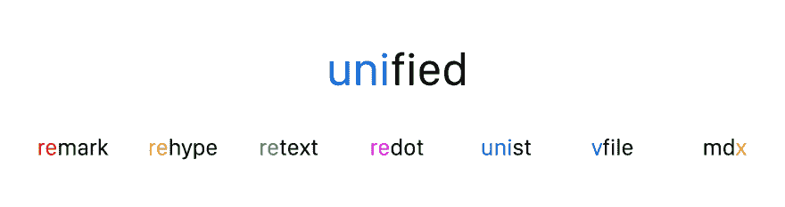

# 众包统一文本解析的发展

> 原文：<https://dev.to/murderlon/crowdsourcing-the-evolution-of-text-parsing-with-unified-5ao1>

> 新项目和你，像蔡特和盖茨比，如何能帮助解决问题

由[梅里恩](https://medium.com/@murderlon)和[泰特斯](https://medium.com/@wooorm)撰写，并得到[詹](https://medium.com/@jenweber)、[约翰](https://medium.com/@4lpine)以及无数其他人的帮助。最初发布在[媒体](https://medium.com/unifiedjs/collectively-evolving-through-crowdsourcing-22c359ea95cc)上。

unified 的接口用于将 markdown 转换为 HTML，同时添加其他功能 unified 是一个使用语法树操作内容的工具。MDX 是一个扩展，允许您在 JSX 使用 markdown。micromark 是一个新的解析器，我们计划让操作速度超快。今天，我们宣布成立联合基金来资助这三个项目的发展。我们希望你能参与进来。

## 一、什么是统一？

统一的是一个友好的界面，背后是一个为创建和操作内容而构建的插件生态系统。unified 通过采用 markdown、HTML 或纯文本散文，将其转换为结构化数据，并使其可用于 100 多个插件来实现这一点。像文本分析、预处理、拼写检查、林挺等任务都可以通过兼容的工具完成，甚至可以链接在一起。

多亏了 unified 的 plugin pipeline，这一切都成为可能，它允许你编写一行代码来将一个功能链接到这个过程中。还可以将不同来源的内容拼接在一起，作为单一来源输出。

**底线:使用 unified，您不需要手动处理语法或解析。**

## 今天是怎么用的

过去五年来，我们一直在积极开发 unified，但今年，它受到了更多关注。它被用来创建像 [freeCodeCamp](https://www.freecodecamp.org/) 、 [Node.js](https://nodejs.org/) 和 [WebFundamentals](https://developers.google.com/web/fundamentals/) (谷歌)这样的网站。它为新的令人兴奋的项目提供动力，如 [Gatsby](https://www.gatsbyjs.org/) 引入 markdown， [MDX](https://mdxjs.com/) 嵌入 JSX，以及[beautiful](https://prettier.io/)格式化它。它被用来检查[故事书](https://storybook.js.org/)、[debugger.html](https://github.com/devtools-html/debugger.html)(Mozilla)、[open source . guide](https://opensource.guide/)(GitHub)等等的代码。

为了进一步发挥想象力，以下是上述项目用来做有趣事情的更常见的插件:

*   [备注-目录](https://github.com/remarkjs/remark-toc) -生成目录
*   [retype-prism](https://github.com/mapbox/rehype-prism)-用 Prism 突出显示 HTML 中的代码
*   [复述-拼写](https://github.com/retextjs/retext-spell) -检查拼写
*   [备注-皮棉](https://github.com/remarkjs/remark-lint) -检查降价代码样式
*   [retext-equality](https://github.com/retextjs/retext-equality) -检查可能不敏感的语言
*   [备注-数学](https://github.com/Rokt33r/remark-math) -支持 markdown / html 中的数学
*   [重复文本-重复单词](https://github.com/retextjs/retext-repeated-words) -检查重复单词
*   [重新输入-缩小](https://github.com/rehypejs/rehype-minify) -缩小 HTML
*   …浏览所有的[备注](https://github.com/topics/remark-plugin)、[重排版](https://github.com/topics/rehype-plugin)或[重排版](https://github.com/topics/retext-plugin)插件

* * *

从维护者的角度来看，所有这些新的牵引都伴随着大量的客户支持，维护者花了一晚上的时间来回答提出的问题。在高度使用的开源生态系统上工作带来的压力和不断增加的问题导致更多的时间花在维护现有代码上，而不是创造新的东西。

## 宣布统一的集体

 
*统一旗下的组织*

今天，我们很高兴地宣布[统一集体](https://unified.js.org/)的成立。这是一种努力，通过无缝、可互换和可扩展的工具，将志同道合的组织聚集在一起，共同致力于内容的创新。我们构建解析器、转换器和实用程序，这样其他人就不必担心语法了。我们让开发者更容易开发。

### 人类

最初将带头推进统一集体的人有 Titus ( [@wooorm](https://github.com/wooorm) ，统一的原作者)、John ( [@johno](https://github.com/johno) ，mdx 的原作者)、Stephan ( [@zcei](https://github.com/zcei) )、Merlijn ( [@murderlon](https://github.com/Murderlon) )、Richard ( [@richardlit](https://github.com/RichardLitt) )、Victor ( [@vhf](https://github.com/vhf) )、Mudit ( [@zeusdeux](https://github.com/zeusdeux) )，

当然，我们也要感谢整个生态系统中所有可爱的贡献者，他们通过报告问题、编写实用程序和插件以及提交各种改进来帮助我们走到这一步！

* * *

为了能够实现我们的使命，我们需要开始以可持续的方式维护 unified，创建更好的生态系统，并通过添加新项目来实现增长。我们今天正在这么做:unified 正在扩张，有了 [MDX](https://github.com/mdx-js/mdx) 和 [micromark](https://github.com/micromark/micromark) 。

## MDX 联手统一

除了 unified 现有的低级组织之外——比如 markdown 的[remark](https://github.com/remarkjs/remark), HTML 的[retype](https://github.com/rehypejs/rehype),自然语言的[retext](https://github.com/retextjs/retext)——我们很兴奋地宣布我们也在与高级别的项目合作。 **MDX** 正在加盟**统一**🎉

> MDX 的成功很大程度上是利用了统一和备注生态系统。我能够在几个小时内得到一个工作的原型，因为我不必担心 markdown 解析:remark 免费给我的。它提供了构建的基础。这些项目走到一起，让彼此变得更好，这是有意义的。
> 
> — [约翰·奥坦德](https://github.com/johno),[mdx-js/mdx](https://github.com/mdx-js/mdx)的作者

**MDX** 功能强大。这是组件时代的降价。它可以让你编写嵌入 markdown 内部的 JSX。这是一个很好的组合，因为它允许你对小东西使用 markdown 通常简洁的语法(比如`# heading`),对更高级的组件使用 JSX。MDX 对于一个 [JAMStack](https://jamstack.org/) 应用程序很有用，可以将动态数据注入文档，或者在 mdx-deck 中构建幻灯片。

 

 *## 介绍微标

> micromark 是一个新的、小巧的、快速的 markdown 解析器，在统一的保护伞下用 TypeScript 编写。

我们认为，不断发展的统一不应该仅仅是新的高级功能，如 MDX，还应该重新思考核心机制。这就是 micromark 的用武之地。

2019 年 3 月 [markdown 将迎来 15 个](https://daringfireball.net/2004/03/introducing_markdown)。多年来，它已经变得无处不在，但由于它没有正式指定，许多口味出现了。这些口味中的大多数继续为他们的目的服务，但是自从 GFM ( [GitHub 风味降价](https://github.github.com/gfm/))决定使用 [CommonMark](https://commonmark.org/) 作为基础，它或多或少成为事实上的风格。

最初的 [Markdown.pl](https://daringfireball.net/projects/markdown/) ，以及 CommonMark，致力于让写网站像写电子邮件一样简单。**如今，减价被用来做各种不同的事情。它用于创建幻灯片或生成手册页。它在主要的 CMS 中得到支持，并且是大多数开发人员编写代码的语言。像 Gatsby 和 MDX 这样的东西证明了这样一个事实，即这种语法正在进入一个新时代。**

需要一个新的项目来支持像 CommonMark 和 GFM 这样的标准，同时也支持像 MDX 这样的扩展，同时还要快速、小巧和现代化。

类似于 rement 的东西，但是级别较低:一个 lexer(书呆子术语🤓).语法树有很多优点，但是它们也有不好的一面，内存占用很大，有时会超出你的需要。

我们推出 micromark 只是一个想法。第一行代码仍然需要编写。但是我们想象它是:

*   **文件大小小**，最大 10 kB 最小压缩，占用内存极小
*   与现实世界文档中现有的解析器相比，速度更快
*   为了使用安全，默认情况下，它应该可以安全地处理不可信的内容
*   **符合 CommonMark 的**，但**可扩展**用于 GFM、MDX 等。
*   **完成**，因为它应该能够访问源文档中的所有信息

*其实不是:*

*   创建 HTML 之类的东西:其他项目为此使用 micromark
*   创建语法树的东西:remark 将使用它来做这件事

* * *

除非你对解析器感兴趣，否则微标记可能不会是你直接与之交互的东西，但它会让高级工具变得更好。

## 成为变化的一部分

我们致力于让统一存储及其下的生态系统变得更好。我们认为 micromark 应该存在。我们需要你的帮助。

例如，您可以通过以下方式做出贡献:

*   **使用项目**，并通过[频谱](https://spectrum.chat/unified)或 GitHub 问题让我们知道什么是难以解决的，以便我们改进文档
*   **讨论**。只是兴奋，但现在想保持简单？前往[频谱](https://spectrum.chat/unified)并开始对话！
*   **解决现有问题**。你可以查看[生态系统中所有未解决的问题](https://github.com/search?q=user%3Amdx-js+user%3Amicromark+user%3Aremarkjs+user%3Arehypejs+user%3Aretextjs+user%3Aredotjs+user%3Aunifiedjs+user%3Asyntax-tree+user%3Avfile+state%3Aopen&type=Issues)。欢迎所有建议，无论多小！
*   **提交新想法**。unified 和 it 中的组织都有专门的[新想法储存库](https://github.com/unifiedjs/ideas)
*   **成为[公开赛](https://opencollective.com/unified)的支持者或赞助商，从经济上支持我们**

## 成为一个开放的集体

Open Collective 允许 unified 以透明的方式向支持者和赞助商收钱。我们需要您的支持…

*   **为项目领导支付核心维护人员**
*   **资助非编码工作**，如技术写作、社区咨询等。
*   **让我们的远程团队在现实生活中团结起来**
*   **为社区做一些有趣的事情**，比如给有贡献的人发贴纸

个人和公司都可以支持我们的使命。您可以通过成为每月 2 美元起价的支持者或每月 100 美元起价的官方 unified 赞助商来帮助 unified 实现可持续发展。作为感谢的方式，我们在主要的 GitHub 库上列出了支持者和赞助者。赞助商也将出现在 unified.js.org 的[上，并在推特上大声疾呼。🥈白银(500 美元以上)和🥇金牌(1000 美元以上)赞助商还可以获得与核心维护人员的聊天帮助。](https://unified.js.org/)

 
*早期通过开放集体统一的惊人发起人。*

通过开放集体统一的早期和惊人的发起人。
我们非常兴奋，因为[蔡特](https://zeit.co/)、[盖茨比](https://www.gatsbyjs.org/)、[排字工](http://compositor.io/)和[霍洛韦](https://www.holloway.com/)正在帮助我们变得可持续。

[**加入我们早期的发起人，共同维护 unified on open collective 的未来。**T3】](https://opencollective.com/unified)

## 这只是开始

有了早期的赞助，我们将能够从今天开始改善生态系统。micromark 将很快进入开发阶段，应该会在 markdown 的生日，2019 年 3 月 15 日准备好。与此同时，我们希望尽可能透明地公布我们将要做的事情，你可以期待更多的博客帖子让你了解最新情况。欲了解更多信息，请在 GitHub 上找到我们，并访问 unified.js.org 的 T2。如果你有任何问题，你可以在 [spectrum](https://spectrum.chat/unified) 上提问，或者发推特给我们 [@unifiedjs](https://twitter.com/unifiedjs) 。

总的来说，这是统一和开源的激动人心的时刻。我们努力提高组成可持续统一集体的组织的质量和可能性。用 micromark 重新思考它的核心，并与 MDX 这样的高层组织合作，这是我们要做的前两步。

总之，[感谢赞助商](https://opencollective.com/unified)，我们可以在内容格式之间建立最友好、安全、快速和广泛的桥梁。*