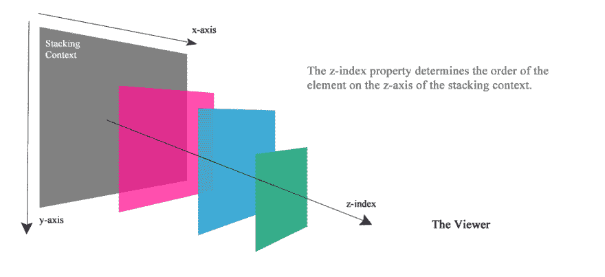
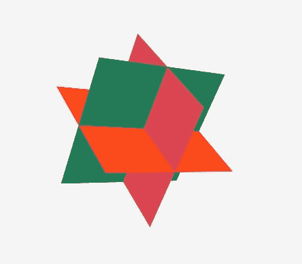

# CSS 3D 立方体

> 原文：<https://dev.to/mehraas/css-3d-cube--4lmh>

在这个简短的教程中，我将向你展示用 CSS 创建一个 3d 立方体是多么容易。

### 超文本标记语言

在 HTML 文件中，我们有一个父 div，它有一个 id 为**的包装器**，还有一个子 div，它有一个类**立方体**。最后，我们有六个子 div，代表一个立方体六个阶段。

```
<div id="wrapper">
  <div class="cube">
    <!--Front-->
    <div></div>
    <!--Back-->
    <div></div>
    <!--Left-->
    <div></div>
    <!--Right-->
    <div></div>
    <!--Top-->
    <div></div>
    <!--Bottom-->
    <div></div>
  </div>
</div> 
```

### 半铸钢ˌ钢性铸铁(Cast Semi-Steel)

在 CSS 中，首先，我们通过定位父 div 的 id **#wrapper** 来设置父 div 的样式，通过定位子 div 的类**来设置子 div 的样式。立方体**。

对于 wrapper，我们将它的宽度和高度设置为 300 像素，边距设置为 100 像素，自动将 div 放置在页面的中央，距离顶部 100 像素。

对于一个立方体，我们设置它的位置为相对的，宽度和高度等于 150 像素。我们还在 X 轴和 Y 轴上应用了一定程度的旋转，使它看起来像一个 3D 对象。

```
#wrapper{
  width:300px;
  height:300px;
  perspective:700px;
  -webkit-perspective:700px;
  margin:100px auto;
}

.cube{
  position:relative;
  width:150px;
  height:150px;
  transform-style:preserve-3d;
  transform:rotateY(35deg) rotatex(-38deg);
} 
```

在上面两种风格中，我们有两个新的属性，允许我们在浏览器中创建一个 3D 空间。

> 透视在我们的浏览器中创建 3d 空间。该值越低，3d 深度就越高。
> 
> 我们使用的是通用属性 transform-style，但我们将其值设置为 **preserve-3d** ，这将设置**的所有子元素。3d 空间中的立方体**。

这是我们制作的 3D 立方体的最后一部分。

```
.cube div{
  position:absolute;
  width:150px;
  height:150px;
  background:rgba(0,0,0,0.1);
} 
```

在这里，首先，我们将所有的子 div 作为目标，并将所有这些 div 的位置设置为 absolute，然后我们将 div 的高度和宽度设置为 100%，等于 **(150px * 150px)** 。

**将子 div 放置在 Z 轴上**

现在我们所有的子分区都在同一个 Z 轴上。3d 空间最好的部分是它允许我们把一个项目放在不同的 Z 轴上。

这是 Z 轴的样子:

[T2】](https://res.cloudinary.com/practicaldev/image/fetch/s--_5DDp3BR--/c_limit%2Cf_auto%2Cfl_progressive%2Cq_auto%2Cw_880/https://codropspz-tympanus.netdna-ssl.com/codrops/wp-content/uploads/2014/10/axes.png)

现在让我们做一些 CSS 工作来设置每个孩子的位置来制作一个立方体。

```
.cube div:nth-child(1){
  transform:translateZ(75px);
  background:#237A57;
}

.cube div:nth-child(2){
  transform: rotateX(180deg) translateZ(75px);
  background:#005AA7;
}

.cube div:nth-child(3){
  transform: rotateY(-90deg) translateZ(75px);
  background:#DA4453;
}

.cube div:nth-child(4){
  transform:rotateY(90deg) translateZ(75px);
  background:#a8c0ff;
}

.cube div:nth-child(5){
  transform: rotateX(90deg) translateZ(75px);
  background:#fc4a1a;
}

.cube div:nth-child(6){
  transform:rotateX(-90deg) translateZ(75px);
  background:#f7b733;
} 
```

这里我们用名为**n-child**的伪选择器定位每个子 div，并传递我们想要样式化的 div 的位置。

我们只需将所有 div 的 Z 轴**设置为 **75px** ，这是我们立方体宽度的一半，即 **150/2 = 75px** 。在为所有子元素设置了 Z 轴之后，我们还使用 **rotateX** 和 **rotateY** 将每个 div 放置在 Z 轴上的正确位置，以形成一个立方体。**

[T2】](https://res.cloudinary.com/practicaldev/image/fetch/s--s-UD2rJL--/c_limit%2Cf_auto%2Cfl_progressive%2Cq_auto%2Cw_880/https://thepracticaldev.s3.amazonaws.com/i/3you3axgwi84p0aq1n01.JPG)

> 如果你不给子 div 一个 Z 轴值，那么所有的 div 都将在相同的 Z 轴上旋转(默认为 0 ),这将创建一个如上图所示的图像。

###### 我的笔:

[https://codepen.io/mehra_as/embed/KRKPBq%20?height=500&default-tab=result&embed-version=2](https://codepen.io/mehra_as/embed/KRKPBq%20?height=500&default-tab=result&embed-version=2)