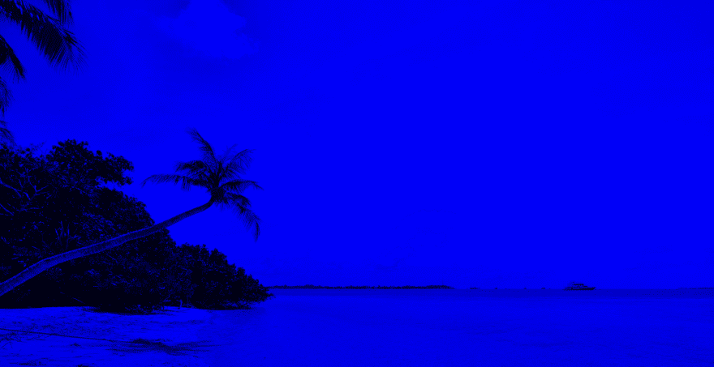
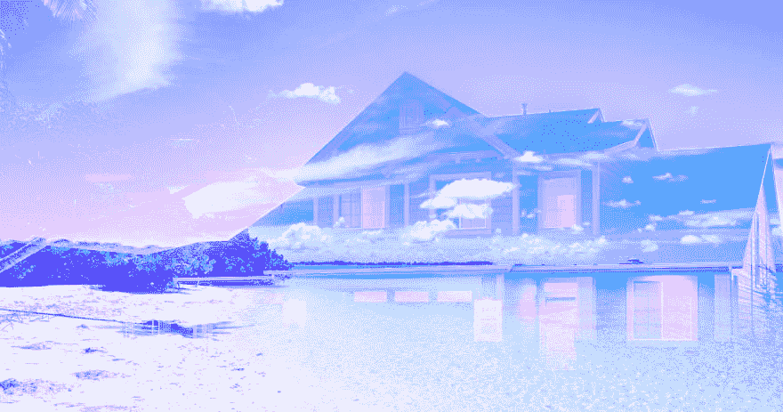
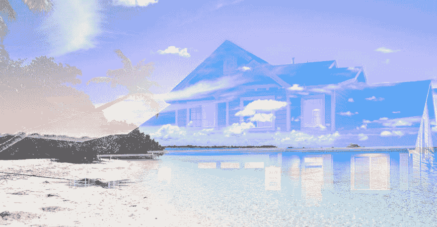

# CSS 混合模式[解释]

> 原文：<https://dev.to/neshaz/css-blend-mode-explained-2h51>

通常，在网站上添加图片时，我们在 Kolosek 做的第一件事就是在外部软件中编辑图片，比如 Photoshop。**混合模式**是否消除了使用这类软件的需要？不完全是。但是，在很多情况下，你可以直接用 CSS 给图像**添加特效。**

当创建你的设计时，你应该遵循一些最佳实践建议。

## 背景混合模式和混合混合模式

当使用[背景混合模式](https://www.w3schools.com/cssref/pr_background-blend-mode.asp)属性时，您可以混合元素的背景颜色或图像。混合模式被定义为一个值，它们指定**如何将背景图像的颜色**与其后面的颜色或其他背景图像混合。

另一方面， [mix-blend-mode](https://developer.mozilla.org/en-US/docs/Web/CSS/mix-blend-mode) 属性指定元素的**内容如何与其背景**和其直接父元素的内容混合。重叠层上的元素将与其下方的元素融合。在这种情况下，提到**隔离**属性很重要。它阻止具有 mix-blend-property 属性的元素与背景混合。

## 背景-混合-模式

让我们通过**混合**背景图像和背景颜色来展示背景混合模式的基本用法。

CSS

```
.image-blend{
  background: url(‘beach.png’);
  background-color: blue;
  background-blend-mode: multiply;
} 
```

[T2】](https://res.cloudinary.com/practicaldev/image/fetch/s--YOcv_Dl---/c_limit%2Cf_auto%2Cfl_progressive%2Cq_auto%2Cw_880/https://kolosek.com/conteimg/2018/02/beach.png)

[T2】](https://res.cloudinary.com/practicaldev/image/fetch/s--yC3dSHFc--/c_limit%2Cf_auto%2Cfl_progressive%2Cq_auto%2Cw_880/https://kolosek.com/conteimg/2018/02/background-blend-mode.png)

在顶部，您可以看到原始图像，而底部显示应用了混合模式的图像。

首先，**需要指定一个背景图像 URL** ，然后是图像将与之混合的背景颜色。有许多混合模式可供选择，这里添加了**乘**混合模式来演示它将如何影响图像。除了纯色背景，一个[背景渐变](https://kolosek.com/everything-you-need-to-know-about-gradient/)也可以用于混合。

现在，让我们来看看如何使用背景混合模式将两幅图像混合在一起。让我们把下面两张图片融合在一起:

[T2】](https://res.cloudinary.com/practicaldev/image/fetch/s--v0h7y3kX--/c_limit%2Cf_auto%2Cfl_progressive%2Cq_auto%2Cw_880/https://kolosek.com/conteimg/2018/02/images_for_blending.png)

CSS

```
.two-images-blend {
  background: url(‘beach.png’), url(‘house.png’);
  background-color: blue;
  background-blend-mode: lighten;
} 
```

[T2】](https://res.cloudinary.com/practicaldev/image/fetch/s--lYnpQiLq--/c_limit%2Cf_auto%2Cfl_progressive%2Cq_auto%2Cw_880/https://kolosek.com/conteimg/2018/02/blend_images_color.png)

CSS

```
.two-images-blend {
  background: url(‘beach.png’), url(‘house.png’);
  background-blend-mode: lighten;
} 
```

[T2】](https://res.cloudinary.com/practicaldev/image/fetch/s--HemCXwnH--/c_limit%2Cf_auto%2Cfl_progressive%2Cq_auto%2Cw_880/https://kolosek.com/conteimg/2018/02/blend_images.png)

在这种情况下，有两个示例，其中第一个添加了背景色，而第二个没有背景色。

我已经为背景混合模式演示了两个可能的值，但是它们有很多:

*   屏幕，
*   覆盖，
*   变暗，
*   减轻，
*   颜色-减淡，
*   烧色，
*   强光，
*   柔和的光线，
*   区别，
*   排外，
*   色调，
*   饱和度，
*   颜色和
*   光度。

## 混合-混合-模式

这种效果的一个流行用法是**创建剪切文本**。这样做的时候，记住[行高](https://kolosek.com/css-line-height/)属性的用法是很有用的。

HTML

```
<div class=”container”>
  <h1 class=”header-text”>Hello world</h1>
</div> 
```

CSS

```
.container {
  background-image: url(‘beach.png’);
  background-size: cover;
}

.header-text {
  font-size: 7rem;
  text-transform: uppercase;
  color: #fff;
  text-align: center;
  background-color: darkcyan;
  mix-blend-mode: multiply;
} 
```

[T2】](https://res.cloudinary.com/practicaldev/image/fetch/s--e91HxRPu--/c_limit%2Cf_auto%2Cfl_progressive%2Cq_auto%2Cw_880/https://kolosek.com/conteimg/2018/02/mix_blend.png)

## 支持

在使用这个属性之前，请务必查看[我可以使用](https://caniuse.com/#search=background-blend-mode)来获得更多关于它对这些属性的支持的详细信息。目前，**背景混合模式**属性的支持稍微好一点，希望混合混合模式能很快跟上。

## 总结

我已经解释了这两个属性的基础，现在就看你如何利用这些属性，为你的网站创造漂亮有趣的视觉效果了。

这篇文章最初发表在 [Kolosek 博客](https://kolosek.com/css-blend-mode/)上。