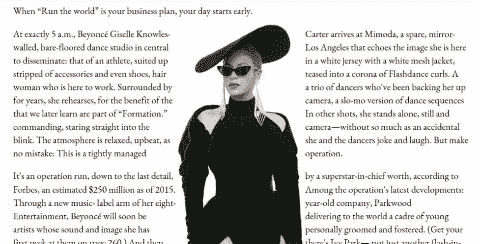

# 女王贝伊的 CSS 排除

> 原文：<https://dev.to/huijing/css-exclusions-with-queen-bey-2k4l>

我最近看到了 Ben Frain 的一个帖子，表达了他对 CSS 形状和排除的不满。尽管我可以理解他的观点(他在自己的例子中说得很清楚)，但我想谈谈他在结论中的陈述:

> 我不知道这是怎么回事。作为一个局外人，来到 2018 年的这些新功能，这种情况似乎有点像车祸。

从任何意义上来说，我都不是圈内人。我不为任何浏览器供应商工作，也不是 CSS 工作组的成员。但是我很幸运地认识了属于这两个阵营的人，通过与他们的交谈，我对幕后发生的事情有了更好的了解。

## 不全是独角兽和彩虹……

首先，我不否认情况不理想。但是我不同意这种“何苦呢？”。事实上，让我与你分享我的想法，为什么烦恼是一件伟大的事情。我真诚地相信，对 CSS 或一般浏览器行为的许多挫折，有时甚至是愤怒，都来自于对 CSS 特性是如何形成的缺乏理解。

所以我希望每个人都能满足我的这个请求，观看来自 [CSSConf 的](https://2017.cssconf.eu/) [Rachel Andrew](https://rachelandrew.co.uk/) 的精彩演讲。EU 2017 关于 CSS 从何而来。

[https://www.youtube.com/embed/cYGOv2ToZjY](https://www.youtube.com/embed/cYGOv2ToZjY)

正如 Rachel 所说，似乎有一种印象，浏览器厂商陷入了关于 CSS 的战斗。这是浏览器在功能上竞争的时代留下的遗产。但是今天，所有的浏览器供应商都参与其中，并且一起**制定规范**(以及[文档](https://blog.mozilla.org/blog/2017/10/18/mozilla-brings-microsoft-google-w3c-samsung-together-create-cross-browser-documentation-mdn/))。

规范可以来自浏览器供应商、其他 CSS 用户代理(如 ePUB)、Adobe 等公司或 CSS 工作组本身。一个新的特性可能是从一个很酷的想法或解决问题的方法开始的。这些想法中的一些被整合到编辑的草稿中。

如果浏览器供应商提出了规范，他们通常会在自己的浏览器中推出一个实验性的实现，就像概念验证一样，供 web 开发人员试用，充实需求并解决被忽略的问题。

但要记住的重要一点是，浏览器就像任何其他软件产品一样。有些功能需要添加，有些缺陷需要修复。猜猜谁会影响新特性的优先级？你认为浏览器厂商的“客户”是谁？

没错，你就是。

CSS 需要你！ 

## 但是你可以做点什么

我们不应该仅仅因为新的 CSS 特性有问题或者不被完全支持就回避使用它们。随着 evergreen 浏览器的出现，这些天功能和错误修复发布得更快了。因此，你在浏览器 X 中真正想要的一个特性可能会在一两个月后发布。听起来不错？只有当我们向浏览器厂商发出信号，告诉他们哪些功能是我们真正想要的，这种情况才会发生。

每个浏览器引擎都有一个非常开放的产生错误的过程。我在这里链接了主要浏览器的问题日志:

*   [铬问题日志](https://bugs.chromium.org/p/chromium/issues/list)
*   火狐 Bugzilla
*   Webkit Bugzilla
*   [边缘问题日志](https://developer.microsoft.com/en-us/microsoft-edge/platform/issues/)

如果有些东西在不同的浏览器上工作不一样，很可能是浏览器的错误。与其沮丧地把这个特性扔出你的项目，不如提出一个 bug。行动起来！如果开发人员仅仅因为功能有问题或没有得到很好的支持而不使用它们，我们就向浏览器供应商发出信号，这个功能并不需要。

相反，如果我们提出 bug，发关于我们的问题的 tweet，写博客和编写演示代码，我们就是在提高对某个特定特性的认识。并向浏览器供应商发出信号，要求他们优先考虑这一功能，修复它的缺陷，正确地实现它，因为我们想要使用它。

如果有些东西不在 CSS 规范中，但你认为它会有用，考虑在 [CSSWG 资源库](https://github.com/w3c/csswg-drafts)中提出一个 GitHub 问题，所有的工作草案都在这里开发。通过阅读各种问题线程，您还可以更好地了解 CSS 规范是如何制定的。

我很高兴 Ben 写出了他对 CSS 形状和排除的不满。我希望更多的人去尝试它，并谈论如果它在所有浏览器上都能正常工作，他们将如何在他们的项目中使用形状和排除。用例越多越好！

## 好了，现在我们来谈谈除外责任

很抱歉我对这个标题有点不满意，但是如果不在标题中提到碧昂斯，我还能怎么表达我的观点呢？然而，这并不完全是点击诱饵，因为我们将探索 CSS 排除，当然，在碧昂斯的帮助下。

CSS 排除定义了内联内容可以流动的任意区域，并且可以在任何 CSS 块级元素上定义。排除可以被认为比 CSS 形状更“强大”,因为它们不仅限于浮动。

<figcaption>基本术语</figcaption>

一个**排除元素**是一个*块级*元素，它是*而非浮点*，并生成一个排除框。一个排除元素建立了一个*新的块格式化上下文*。

当一个元素的`wrap-flow`属性被计算为除了它的初始值`auto`之外的值时，它就成为一个排除项。当一个元素成为排除项时，内联内容将环绕排除区域，但在它们自己的格式上下文中。

请注意，排除必须以某种方式进行定位，使用我们目前拥有的任何定位方案。除了花车。如果你浮动一个元素，它不会成为一个排除。否则，像绝对定位或 CSS 网格等方案都可以正常工作。

### `wrap-flow`地产

目前,`wrap-flow`属性有 7 个值可供我们使用，它们决定了内联内容流动的区域。

#### `auto`

未创建排除。照常生活。

#### `both`

内嵌流动内容可以在排除的所有边上流动。

[T2】](https://res.cloudinary.com/practicaldev/image/fetch/s--JJxcMF4q--/c_limit%2Cf_auto%2Cfl_progressive%2Cq_auto%2Cw_880/https://www.chenhuijing.com/asseimg/posts/css-exclusions/wf-both.jpg)

#### `start`

内嵌流动内容只能在禁止区域的起始边缘周围流动，但结束边缘是非流动区域。

[T2】](https://res.cloudinary.com/practicaldev/image/fetch/s--SqBr2is8--/c_limit%2Cf_auto%2Cfl_progressive%2Cq_auto%2Cw_880/https://www.chenhuijing.com/asseimg/posts/css-exclusions/wf-start.jpg)

#### `end`

内嵌流动内容只能围绕禁止区域的结束边缘流动，但开始边缘是非流动区域。

[T2】](https://res.cloudinary.com/practicaldev/image/fetch/s--tkQgOnnn--/c_limit%2Cf_auto%2Cfl_progressive%2Cq_auto%2Cw_880/https://www.chenhuijing.com/asseimg/posts/css-exclusions/wf-end.jpg)

#### `minimum`

内嵌流动内容只能围绕可用空间较少的边缘流动，而另一个边缘为空。

[T2】](https://res.cloudinary.com/practicaldev/image/fetch/s--mwYj6Q----/c_limit%2Cf_auto%2Cfl_progressive%2Cq_auto%2Cw_880/https://www.chenhuijing.com/asseimg/posts/css-exclusions/wf-min.jpg)

#### `maximum`

内联流动内容只能在具有更多可用空间的边缘流动，而另一个边缘为空。

[T2】](https://res.cloudinary.com/practicaldev/image/fetch/s--JSX8wxIe--/c_limit%2Cf_auto%2Cfl_progressive%2Cq_auto%2Cw_880/https://www.chenhuijing.com/asseimg/posts/css-exclusions/wf-max.jpg)

#### `clear`

没有任何东西沿着内嵌方向沿着排除的起始边和结束边流动。_(ツ)_/

[T2】](https://res.cloudinary.com/practicaldev/image/fetch/s--gPMMHRr0--/c_limit%2Cf_auto%2Cfl_progressive%2Cq_auto%2Cw_880/https://www.chenhuijing.com/asseimg/posts/css-exclusions/wf-clear.jpg)

### `wrap-through`地产

我们还可以使用`wrap-through`属性来控制应该在排除项周围流动的内容的行为。通过设置`none`的值，内容将流过排除项，就好像它一开始就不在那里一样。

<figcaption>绿色虚线显示`wrap-through:none`而蓝色虚线显示`wrap-through:wrap`</figcaption>

我试图通过重现碧昂斯在 2016 年发布常春藤公园系列时接受《ELLE》采访来展示`wrap-flow`和`wrap-through`的不同价值。如果你想用排除法构建一些东西，你必须使用 Edge 或 Internet Explorer 10 或更高版本，并在属性前加上`-ms-`。

[https://codepen.io/huijing/embed/JBORXW/?height=600&default-tab=result&embed-version=2](https://codepen.io/huijing/embed/JBORXW/?height=600&default-tab=result&embed-version=2)

另外，这里有[独立演示](https://www.chenhuijing.com/demos/exclusions/)，以及 GitHub 上的[源代码。](https://github.com/huijing/demos/tree/master/exclusions)

## 支持和退让

如果你尝试在 Edge 或 Internet Explorer 10 及以上版本之外的浏览器中查看我的 CodePen 或独立演示，你会在右上角看到一个红色的小消息，说明不支持排除。这也是本沮丧的原因。

我不否认这是一个麻烦的情况，Chrome、Safari 和 Opera 支持 CSS 形状但不支持排除，Edge 支持排除但不支持 CSS 形状，Firefox 在 v62 发布后只支持 CSS 形状，但也不支持排除。

[T2】](https://res.cloudinary.com/practicaldev/image/fetch/s--P1CMhkgY--/c_limit%2Cf_auto%2Cfl_progressive%2Cq_auto%2Cw_880/https://rawgit.com/huijing/slides/gh-pages/37-code-2018/img/caniuse-exclusions.png)

如果你在想，为什么我们在形状和排斥方面会处于如此尴尬的境地？相信我，我明白。我希望我的文字也能环绕碧昂斯的两个肘部。但不幸的是，似乎没有办法做到这一点。**尚未**。

### 历史的点滴

根据我的局外人的理解，CSS 形状和排除在 2011 年开始作为一个组合规范出现。当时的想法是允许 CSS 排除和 CSS 形状一起使用，通过让内容流入和/或围绕形状，甚至是任意复杂的形状，来创建复杂的布局。

但是这个想法的实际实现一点也不简单。仔细想想，让文本在形状中流动是很好的，但是如果文本超出了定义的形状中的可用空间，会发生什么呢？额外的内容会放在哪里？

我之前和 [Jen Simmons](http://jensimmons.com/) 聊过这个问题，并且了解到`shape-inside`不能被定义，直到有人提出一个解决方案来解决 [CSS 区域](https://www.w3.org/TR/css-regions-1/)试图解决的用例。目前关于 CSS 区域的提议并不理想，需要修改。

最终，CSS 形状和 CSS 排除被分割成它们自己的规范，CSS 形状的范围被进一步削减，这样至少`shape-outside`可以首先发布。

也许如果更多的人开始写用例，或者谈论和发微博，我们可以让事情向前发展。因为，拜托，看看大家对这个功能的普遍情绪就知道了。

天哪，我们发出的这些信号是什么？ 

公众的怀疑？？叹气。

再一次，这归结为浏览器供应商的优先事项，因为有太多的事情要做，如子网格，首字母，列跨度，flexbox 和 grid 的错误修复，这个列表几乎是无穷无尽的。但是，如果我们中有足够多的人对排除和形状感到兴奋，这绝对有可能把它推到优先列表上。

## 网络标准需要时间

谈到规范本身，Bruce Lawson 在他的文章[中总结得很好，为什么 web 标准如此缓慢](https://www.brucelawson.co.uk/2018/why-are-web-standards-so-slow/)，他说:

> 但是如果 CSS 工作组做错了，它将永远出现在网络上——并惹恼网络开发者。

如果你仍然不相信，这里有另一个视频，展示了精心制作一个规范需要考虑的因素，由 [Eric Meyer](https://meyerweb.com/) 在 [CSS Day 2018](https://cssday.nl/2018) 发布。

一旦制定出规范，浏览器供应商必须考虑如何在他们各自的引擎中实现该规范，以及是否值得尽早这样做。

## 包装完毕

长话短说，尝试所有新的 CSS 特性。制作演示，并尝试任何看起来有点意思的东西。即使该功能还处于早期阶段，或者仅由一个浏览器支持。然后谈论它，或者写下并在推特上发布你的体验，你的用例，你喜欢或不喜欢它的什么。

我们可以把网络塑造成我们想要的样子，但前提是我们必须参与其中。它需要我们所有人，从规范编写者和 CSS 工作组，到所有的浏览器供应商，到我们这些在 web 上构建东西的人。

让我们实现它，我的朋友们。💪

## 相关阅读

*   [CSS 排除模块一级编辑稿](https://drafts.csswg.org/css-exclusions/)
*   [CSS 排除和网格布局](https://rachelandrew.co.uk/archives/2016/03/16/css-exclusions-and-grid-layout/)
*   [Chrome 平台状态:CSS 排除](https://www.chromestatus.com/feature/6296903092273152)
*   [Internet Explorer 实现](https://msdn.microsoft.com/en-us/ie/hh673558(v=vs.94))

*<small>海报字体由敌子由[莱尔萨巴托](https://zapatopi.net/fonts/)</small>T5】*