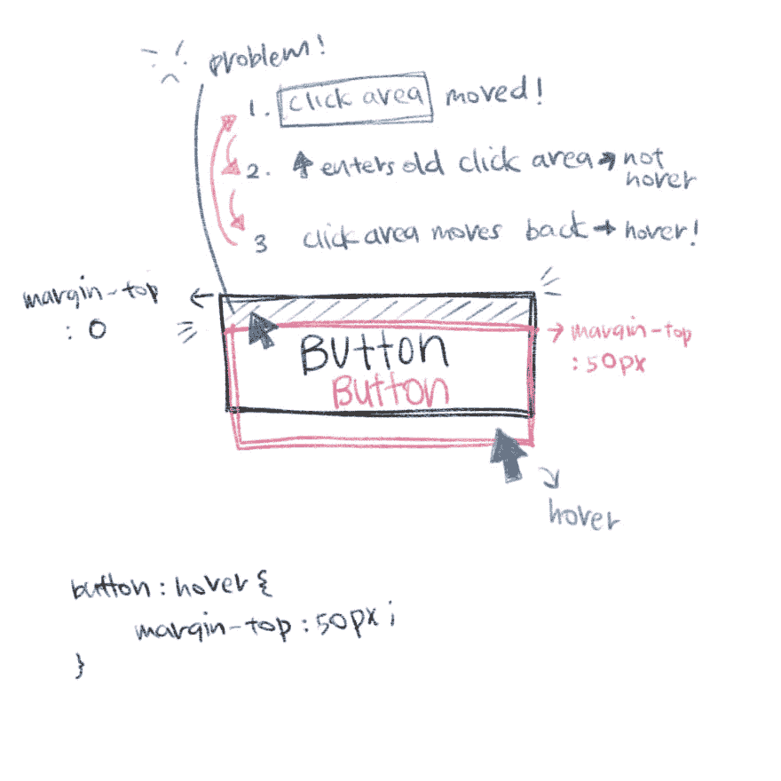

# CSS 在悬停时闪烁！

> 原文：<https://dev.to/annlin/css-flicker-on-hover-5gj5>

感觉很幸运，所以我决定做一个简单的悬停效果。一个非常简单的 CSS 样式。光标悬停在按钮上，按钮向下移动以模拟点击效果。如此简单，不会出错。我错了。

### 悬停并向下移动按钮，

```
button:hover {
    margin-top: 10px;
} 
```

Enter fullscreen mode Exit fullscreen mode

我的按钮强烈闪烁。我在不同的浏览器上检查了这个问题。Firefox 是唯一没有这个问题的。Chrome，opera，safari 都有同样的闪烁问题。(你去火狐！不知道你做了什么，但你可能不应该这样做。)

### 玩这里的闪烁，

[https://codepen.io/toomuchome/embed/ZMeLZN?height=600&default-tab=result&embed-version=2](https://codepen.io/toomuchome/embed/ZMeLZN?height=600&default-tab=result&embed-version=2)

### 到底怎么回事，

[T2】](https://res.cloudinary.com/practicaldev/image/fetch/s--pbOyjWzd--/c_limit%2Cf_auto%2Cfl_progressive%2Cq_auto%2Cw_880/https://thepracticaldev.s3.amazonaws.com/i/fm0bfwl69m8wui06pjbs.jpg)

### 我决定用推特发布这个问题，而不是谷歌搜索。

而 [@matthew_coxx](https://dev.to/matthew_coxx) 拿出了一个很甜的解决方案。(我现在越来越懒了。)

> 马修·考克斯[@马修 _ 考克斯](https://dev.to/matthew_coxx)[@ toomuchome _](https://twitter.com/toomuchome_)哦，那是一个 webkit 浏览器的预定动作。有点糟糕，但这就是原因。这就是我要做的来修复它。
> 
> 2018 年 9 月 01 日 20:11 点[](https://twitter.com/intent/tweet?in_reply_to=1035983393392082956)[](https://twitter.com/intent/retweet?tweet_id=1035983393392082956)[](https://twitter.com/intent/like?tweet_id=1035983393392082956)

想法是添加一个::after 伪元素来填充前面的可点击区域，这样即使按钮已经移动，光标仍然停留在可点击区域内。简单又甜蜜。

### 在这里玩解，

[https://codepen.io/toomuchome/embed/WgpXNO?height=600&default-tab=result&embed-version=2](https://codepen.io/toomuchome/embed/WgpXNO?height=600&default-tab=result&embed-version=2)

### 但是我还是谷歌了一下这个问题，

在那里，我设法找到了这篇 11 年前关于 CSS 抖动的文章。[https://css-tricks.com/avoid-css-jitter/](https://css-tricks.com/avoid-css-jitter/)

现在你知道是怎么回事了，抖动男的例子很搞笑。
[https://css-tricks.com/examples/CSS-Jitter/](https://css-tricks.com/examples/CSS-Jitter/)

### 好了，

再见。

在 [Twitter](https://twitter.com/toomuchome) 关注我