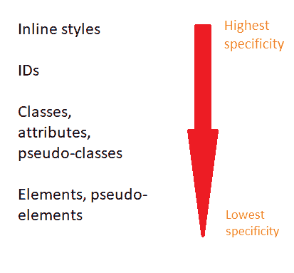
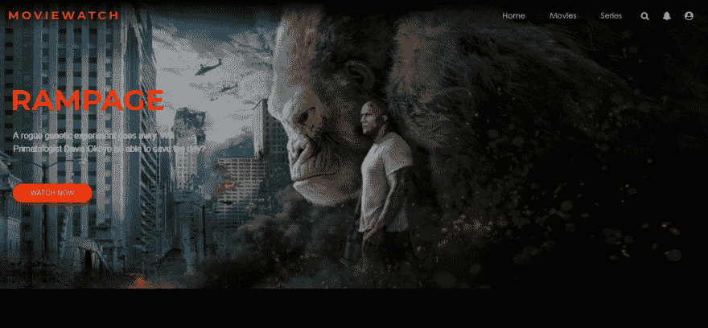

# CSS 的特异性和用途！重要:案例研究

> 原文：<https://dev.to/munamohamed94/css-specificity-and-the-use-of-important-a-case-study--11>

[T2】](https://res.cloudinary.com/practicaldev/image/fetch/s--krWbRMgm--/c_limit%2Cf_auto%2Cfl_progressive%2Cq_auto%2Cw_880/https://thepracticaldev.s3.amazonaws.com/i/3iycaann6j3r4bpsxs71.jpeg)

最近，Twitter 上流传着一个投票，用户问他们的追随者一个关于 CSS 特异性的问题。不幸的是，我无法找到原始推文(如果你碰巧找到了，请在下面评论！)但长话短说，大多数人的答案是错误的。

那次 Twitter 投票(及其后果)让我重温了我自己关于特殊性的知识，反过来，让我踏上了在自己的项目中解决特殊性问题的旅程，这也是我写这篇文章的目的。

在这篇文章中，我们将从我的一个项目中重构 CSS 代码，这个项目有 CSS 特殊性问题需要解决。

## **CSS 特异性**

#### **定义**

MDN Web Docs 将特异性描述为“浏览器决定哪些 CSS 属性值与某个元素最相关并因此被应用的方式。”

#### **规则**

当决定哪些 CSS 属性值最适合应用于某个元素时，浏览器使用 CSS 样式表的源顺序(即层叠)来决定。但是，当 CSS 选择器具有相同的特异性时，这条规则也适用。当一个 CSS 选择器的特异性高于另一个时会发生什么？

[T2】](https://res.cloudinary.com/practicaldev/image/fetch/s--oIU_UN07--/c_limit%2Cf_auto%2Cfl_progressive%2Cq_auto%2Cw_880/https://thepracticaldev.s3.amazonaws.com/i/nl683w6mstywo4ew66ic.png)

在这种情况下，浏览器将使用 CSS 选择器的特性来确定应用什么 CSS 语句。CSS 选择器的特异性越高，浏览器就越有可能将其 CSS 声明应用于另一个之上。

```
nav a {
  color: green;
}
a {
  color: red;
} 
```

例如，在上面的例子中，两个 CSS 选择器都指向同一个 HTML 元素，锚标记。为了确定将哪个 CSS 规则应用于锚标记，浏览器将计算特异性值并检查哪个是最高的。在这种情况下，第一个选择器具有更高的特异性值，因此，浏览器将使用其声明来应用于锚标记。

在这里我想指出的是，虽然！重要的不是 CSS 选择器，它是一个关键字，用于强制覆盖 CSS 规则，而不管 CSS 选择器的特性值、来源或来源顺序。一些使用案例包括:

*   临时措施(有点像在漏水的管道上贴胶带)

*   重写内联样式

*   测试/调试目的

就像使用！关键词可能看起来很重要，但它的使用可能问题多于用处。随着时间的推移，它会使维护 CSS 变得困难，并且会对样式表的可读性产生负面影响，特别是对于正在使用或者将来会使用样式表的人。

这就引出了我们今天要做的事情——解决项目中的特殊性问题。

## **项目**

[T2】](https://res.cloudinary.com/practicaldev/image/fetch/s--eDbugwcN--/c_limit%2Cf_auto%2Cfl_progressive%2Cq_auto%2Cw_880/https://thepracticaldev.s3.amazonaws.com/i/zz45hpwjyb111h7h6jh8.png)

关于我们将要重构的项目的一点背景——这是一个受网飞启发的登陆页面，使用了 MovieDB 的 API。

#### **样式表**

目的是除去“啊！重要”关键字，通过重构代码使其遵循特殊性规则，将该关键字应用于 CSS 规则。

下面，您可以看到项目的样式表。

```
@import url("https://fonts.googleapis.com/css?family=Montserrat:400,400i,700");
body {
  margin: 0;
  padding: 0;
  overflow-x: hidden;
}
.wrapper {
  width: 100%;
}
.wrapper #header {
  position: fixed;
  z-index: 300;
  padding: 15px;
  width: calc(100% - 30px);
  display: flex;
  justify-content: space-between;
  align-items: center;
  background: linear-gradient(to bottom, black 0%, transparent 100%);
}
.wrapper #header #brand-logo {
  color: #d32f2f;
  text-shadow: 1px 1px 2px black;
  letter-spacing: 5px;
  text-transform: uppercase;
  font-family: Montserrat;
  font-weight: bold;
  font-size: 22px;
}
.wrapper #header #menu-icon {
  display: none;
}
.wrapper #header .nav-link,
.wrapper #header .icon {
  color: #bdbdbd;
  cursor: pointer;
}
.wrapper #header .nav-menu {
  width: 400px;
  display: flex;
  justify-content: space-around;
  align-items: center;
}
.wrapper #header .nav-link {
  padding: 5px 10px;
  font-size: 15px;
  font-family: century gothic;
  text-decoration: none;
  transition: background-color 0.2s ease-in;
}
.wrapper #header .nav-link:hover {
  color: #c62828;
  background-color: rgba(0, 0, 0, 0.7);
}
.wrapper #header .icon {
  font-size: 16px;
}
.wrapper #header .icon:hover {
  color: #c62828;
}
.wrapper #site-banner,
.wrapper #categories {
  width: 100%;
}
.wrapper #site-banner {
  height: 550px;
  background-image: url("https://s1.gifyu.cimg/rampage_2018-1024x576.jpg");
  background-size: cover;
  background-position: center;
  background-repeat: no-repeat;
  background-attachment: fixed;
}
.wrapper #site-banner .main-movie-title,
.wrapper #site-banner .watch-btn,
.wrapper #site-banner .main-overview {
  position: absolute;
  z-index: 3;
}
.wrapper #site-banner .main-movie-title, .wrapper #site-banner .watch-btn {
  text-transform: uppercase;
}
.wrapper #site-banner .main-movie-title {
  top: 120px;
  left: 20px;
  background: -webkit-linear-gradient(#ff9100, #dd2c00);
  -webkit-background-clip: text;
  -webkit-text-fill-color: transparent;
  font-size: 55px;
  font-family: Montserrat;
  font-weight: bold;
}
.wrapper #site-banner .main-overview {
  width: 400px;
  top: 230px;
  left: 25px;
  color: #fafafa;
  line-height: 25px;
  font-family: helvetica;
}
.wrapper #site-banner .watch-btn {
  width: 150px;
  height: 35px;
  top: 350px;
  left: 25px;
  border: none;
  border-radius: 20px;
  color: #fafafa;
  cursor: pointer;
  transition: all 0.2s ease-in;
  background-color: #ff0000;
  box-shadow: 1px 5px 15px #940000;
}
.wrapper #site-banner .watch-btn:hover {
  color: #F5F5F5;
  background-color: #940000;
}
.wrapper .after {
  position: relative;
  top: 0;
  left: 0;
  z-index: 2;
  width: 100%;
  height: 100%;
  background-color: rgba(0, 0, 0, 0.3);
}
.wrapper #categories {
  padding: 30px 0;
  display: flex;
  flex-direction: column;
  background: linear-gradient(to top, #090909 0%, #000000 100%);
  overflow: hidden;
}
.wrapper #categories .category {
  margin: 30px 0;
}
.wrapper #categories .category-header, .wrapper #categories .content {
  margin-left: 20px;
  color: #B0BEC5;
  font-family: helvetica;
}
.wrapper #categories .category-header {
  margin-bottom: 50px;
  font-weight: normal;
  letter-spacing: 5px;
}
.wrapper #categories .content {
  position: relative;
  right: 0;
  display: flex;
  justify-content: flex-start;
  transition: all 3s ease-in-out;
}
.wrapper #categories .movie {
  margin-right: 10px;
  display: flex;
  flex-direction: column;
  align-items: center;
  justify-content: flex-start;
}
.wrapper #categories .movie-img {
  transition: all 0.2s ease-in;
}
.wrapper #categories .movie-img:hover {
  -webkit-filter: contrast(1.1);
          filter: contrast(1.1);
  -webkit-transform: scale(1.05);
          transform: scale(1.05);
  cursor: pointer;
}
.wrapper #footer {
  width: 100%;
  height: 120px;
  background-color: #090909;
  display: flex;
  align-items: flex-end;
  justify-content: flex-start;
}
.wrapper #footer #copyright-label {
  margin-left: 20px;
  padding: 10px;
  color: rgba(255, 255, 255, 0.3);
  opacity: 0.7;
  letter-spacing: 2px;
  font-family: helvetica;
  font-size: 12px;
}
//Media Query
@media (max-width: 750px) {
  .nav-menu {
    visibility: hidden;
  }
#menu-icon {
    display: block !important;
    font-size: 22px;
  }
.main-movie-title {
    font-size: 45px !important;
  }
.main-overview {
    width: 350px !important;
    font-size: 14px !important;
  }
.watch-btn {
    width: 130px !important;
    height: 25px !important;
    font-size: 13px;
  }
.movie-img {
    width: 170px;
  }
} 
```

所以，我们可以从样式表中看到！重要关键字主要集中在媒体查询部分，它概述了当屏幕宽度小于 750 像素时浏览器应该应用的样式。

那么，当我们移除！它所应用的 CSS 规则中的重要关键字？好吧，我们不再有一张“王牌”来强制覆盖其他 CSS 选择器针对相同 HTML 元素的 CSS 规则。因此，浏览器将查看样式表，看是否有任何冲突的 CSS 规则。

如果有，那么为了确定哪个 CSS 规则应用于另一个，浏览器将使用 CSS 选择器的源顺序、特殊性和重要性。如果具有冲突 CSS 规则的 CSS 选择器具有相同的特性，那么浏览器将使用源顺序规则，并应用样式表中位于较低位置的 CSS 选择器的 CSS 规则。使用这些信息，我们可以看到这种情况并不适用于我们的样式表。

但是，如果具有冲突 CSS 规则的 CSS 选择器不具有相同的特异性，那么浏览器将应用具有更高特异性的 CSS 选择器的 CSS 规则。从我们的样式表中可以看出，情况就是这样；媒体查询中的 CSS 选择器比样式表主要部分中的 CSS 选择器具有更低的特异性。

现在我们已经确定了问题，让我们来解决它吧！

首先，我们必须找到与媒体查询中的 CSS 选择器相匹配的相应 CSS 选择器。

```
.wrapper #header #menu-icon {
  display: none;
}
.wrapper #site-banner .main-movie-title {
  ...
  font-size: 55px;
  ...
}
.wrapper #site-banner .main-overview {
  width: 400px;
  ...
}
.wrapper #site-banner .watch-btn {
  width: 150px;
  height: 35px;
  ...
}
@media (max-width: 750px) {
#menu-icon {
    display: block !important;
    ...
  }
.main-movie-title {
    font-size: 45px !important;
  }
.main-overview {
    width: 350px !important;
    font-size: 14px !important;
  }
.watch-btn {
    width: 130px !important;
    height: 25px !important;
    ...
  }
} 
```

我们可以看到样式表主体部分的 CSS 选择器比媒体查询中相应的 CSS 选择器具有更高的特异性。尽管媒体查询中的 CSS 选择器后来出现在样式表中，但由于特殊性规则(优先于源顺序规则)，浏览器将应用它之前的 CSS 选择器的 CSS 规则。要解决这个问题，我们必须增加媒体查询中 CSS 选择器的特异性值。如果我们让针对相同 HTML 元素的 CSS 选择器具有相同的特异性，那么浏览器将遵循源顺序规则；当屏幕宽度小于 750 像素时，将应用媒体查询中概述的 CSS 规则(位于样式表的下方)。

最终结果将是这样的:

```
.wrapper #header #menu-icon {
  display: none;
}
.wrapper #site-banner .main-movie-title {
  ...
  font-size: 55px;
  ...
}
.wrapper #site-banner .main-overview {
  width: 400px;
  ...
}
.wrapper #site-banner .watch-btn {
  width: 150px;
  height: 35px;
  ...
}
@media (max-width: 750px) {
.wrapper #header #menu-icon {
    display: block;
    ...
  }
.wrapper #site-banner .main-movie-title {
    font-size: 45px;
  }
.wrapper #site-banner .main-overview {
    width: 350px;
    font-size: 14px;
  }
.wrapper #site-banner .watch-btn {
    width: 130px;
    height: 25px;
    font-size: 13px;
  }
} 
```

就是这样！我们已经清除了所有的痕迹！样式表中的重要关键字。我们已经可以看到样式表更容易阅读，并且可以想象我们重构的样式表将更容易使用和维护，特别是如果其他人也在使用它的话。

## **结论**

那么，我们学到了什么？

我们已经了解了浏览器如何通过使用选择器的源顺序、特异性和来源来确定应用哪种 CSS 样式。我们还了解了使用！这在你的 CSS 中很重要，为什么它的使用应该保持在最低限度。

我们没有必要诉诸使用！重要的是为了解决问题——有更好的解决方案。

特殊性的概念可能需要一段时间才能让你理解，但我希望通过记录这个过程并使用一个真实的项目，它可以帮助你更好地理解特殊性的概念以及如何在你自己的 CSS 中应用它。

#### **附加资源**

*   [MDN 网络文档](https://developer.mozilla.org/en-US/docs/Web/CSS/Specificity)
*   [批次](http://batificity.com/)作者[曼迪·迈克尔](https://twitter.com/Mandy_Kerr)
*   [CSS 特异性大战](https://stuffandnonsense.co.uk/archives/css_specificity_wars.html)由[安迪·克拉克](https://twitter.com/malarkey)
*   [特异性可视化器](https://isellsoap.github.io/specificity-visualizer/)作者[弗朗切斯科·施瓦茨](https://twitter.com/isellsoap)
*   [使用时！重要的是正确的选择](https://css-tricks.com/when-using-important-is-the-right-choice/)由[克里斯·科伊尔](https://twitter.com/chriscoyier)

你可以在这里找到我们一直在做的项目[。](https://codepen.io/Munamohamed94/pen/LJWzGr)

#### **希望你喜欢这篇帖子！如果你做了，❤️，💬并分享！下次见！** ✌️