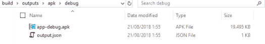

# 来自 Android Studio 的自定义 APK 输出文件名(gradle)

> 原文：<https://dev.to/egitsptr/custom-apk-output-filename-from-android-studio-gradle-1991>

* * *

[T2】](https://res.cloudinary.com/practicaldev/image/fetch/s--KANRYJVW--/c_limit%2Cf_auto%2Cfl_progressive%2Cq_auto%2Cw_880/https://esabook.files.wordpress.com/2018/07/capture.png%3Fw%3D525)

* * *

将这些标准的默认输出构建名称改为关键字。

公文[https://developer . Android . com/studio/build/configure-apk-splits](https://developer.android.com/studio/build/configure-apk-splits)。

```
android {
...
applicationVariants.all {
        variant ->
             variant.outputs.each {
                  output ->
                       output.outputFileName = "${defaultConfig.applicationId}-v${defaultConfig.versionName}_${variant.flavorName}_${defaultConfig.versionCode}_${new Date().format('yyyy-MM-dd_HH.mm.ss')}.apk"
             }
...
}

```