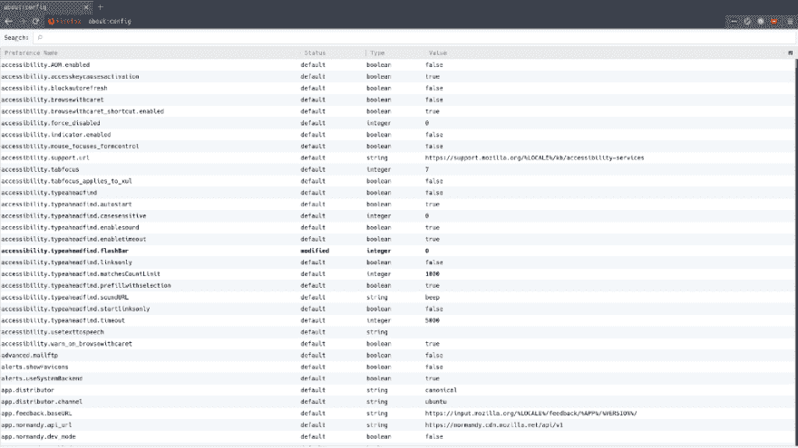

# 定制火狐量子的关于:配置

> 原文：<https://dev.to/johnphamous/customizing-firefox-quantums-aboutconfig-1542>

火狐的 about:config 是你访问火狐高级配置的地方。从动画到内存使用到实验特性，一切都可以在这里找到并配置。这些更改可以改善您的浏览器体验并提高性能。您可以通过在地址栏中键入 about:config 并按 enter 键来访问这些配置。

<figure> 

<figcaption>火狐的配置编辑器</figcaption>

</figure>

第一列显示配置的名称。第二列告诉你当前值是否是 Firefox 的默认值。第三列指定配置读取的值的类型。最后，第四列是您可以查看和修改配置值的地方。

要更改值，请双击要更改的配置行。小心你改变的配置，因为这可能会导致你的浏览器行为失常。

下面是几个配置供你考虑。

### 1。化妆动画

你喜欢那些好看的动画吗？动画使用大量的内存。如果你有一台旧机器，RAM 的每一个字节对流畅使用都很重要。考虑关闭 Firefox 的装饰动画。

toolkit . cosmetic animations . enabled:false

### 2。对所有文本字段进行拼写检查

Firefox 默认只对文本区域输入进行拼写检查。通过修改这个配置，您可以告诉 Firefox 对所有类型的文本输入进行拼写检查。

layout . spell check 默认值:2

### 3。缩放限制

当你在一个页面上放大或缩小太多的时候，你有过那些尴尬的时刻吗？默认情况下，您可以放大 300%，缩小 30%。你实际上可以改变这些限制。单位为百分比。

zoom.maxPercent: 150

儿子，百分之七十

### 4。在文本编辑器中查看页面源代码

Firefox 的开发者工具是查看和调试代码的最佳方式之一。如果你喜欢使用自己的文本编辑器或 IDE，你可以告诉 Firefox 在这些程序中打开源代码。

外部:true

view _ source . editor . path:/usr/bin/vim #编辑器/IDE 的路径

### 5。离线缓存

Firefox 的缓存为支持离线模式的网络应用程序存储数据。如果您正在使用不稳定的网络连接或通勤，增加离线缓存将允许浏览器存储更多数据以支持离线模式。高速缓存大小以千字节为单位指定。

容量:1024000 #这大约是 1GB 的缓存空间

这是我每次重装火狐时都会改变的 5 个配置。在我写这篇文章的时候，有超过 600 种不同的配置你可以改变！关于它们的文档实际上非常少。查看 Mozilla 的官方文档和 T2 的维基百科。