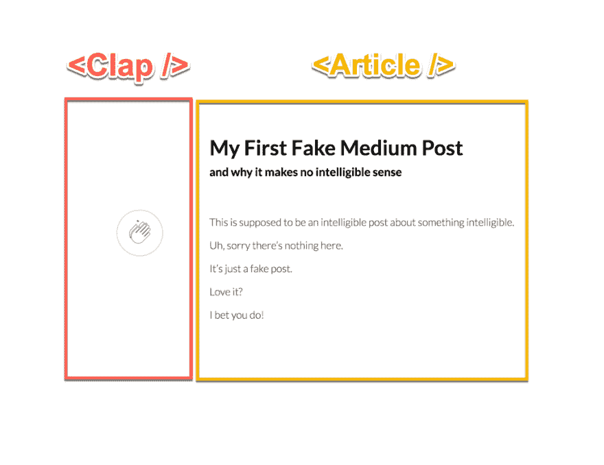
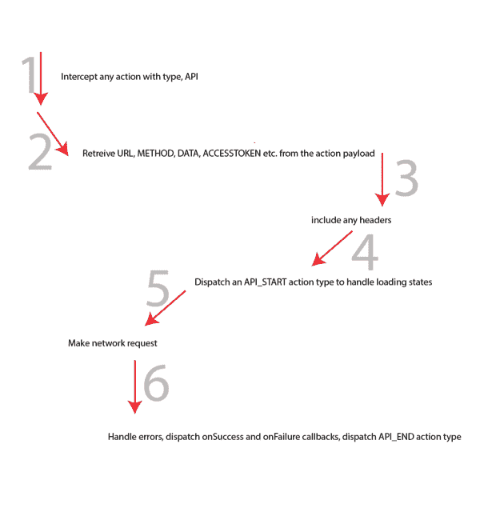

# Redux 应用程序中的数据获取——100%正确的方法

> 原文：<https://dev.to/bnevilleoneill/data-fetching-in-redux-apps-a-100-correct-approach-2e75>

### Redux 应用程序中的数据获取—100%正确的方法

[T2】](https://res.cloudinary.com/practicaldev/image/fetch/s--ghaduNUs--/c_limit%2Cf_auto%2Cfl_progressive%2Cq_auto%2Cw_880/https://cdn-images-1.medium.com/max/1024/1%2AcwMGXp22EktYENiWyfm1Qw.png)

Redux 是一个很棒的工具，它解决了 UI 框架的主要问题之一:*状态管理*。

客户端的状态管理可能会很快变成一场噩梦，而 Redux 实施的单向数据流使得理解事件如何改变应用程序的状态变得很容易。

太好了！

遗憾的是，在构建健壮的应用程序时，状态管理只是您必须处理的众多问题之一。如何处理副作用(比如最常见的网络请求)？

Redux 本身并没有提供现成的解决方案。幸运的是，社区有很多图书馆来解决这个问题。

[](https://res.cloudinary.com/practicaldev/image/fetch/s--BS4Xiosv--/c_limit%2Cf_auto%2Cfl_progressive%2Cq_auto%2Cw_880/https://cdn-images-1.medium.com/max/1024/1%2AEqq0Y7j1VkQq2SQaziMKNA.png) 

<figcaption>redux-thunk？redux-saga？redux-observable？redux-promise？</figcaption>

现在，哪一个适合你的项目呢？

事实是，这些解决方案都是用不同的方法、用例以及头脑中的思维模型构建的。

它们各有利弊。

我不打算讨论所有可能的方法，但是让我们用一个简单的应用程序来看看一些最常见的模式。

[T2】](https://logrocket.com/signup/)

### 一个假的介质，嗯？

[](https://res.cloudinary.com/practicaldev/image/fetch/s--i79ZiDpW--/c_limit%2Cf_auto%2Cfl_progressive%2Cq_auto%2Cw_880/https://cdn-images-1.medium.com/max/1024/1%2AwTdkQD5secWJOuE0vURqlA.png) 

<figcaption>这是我将带你浏览的小应用程序。 [Github 回购](https://github.com/ohansemmanuel/fake-medium)</figcaption>

看一下上面的应用程序截图。可以说非常简单。左边有一串文本和一个中等拍手图标。**你可以为这个 app 抓取**[**Github 回购**](https://github.com/ohansemmanuel/fake-medium) **。**

请注意，中拍手是可点击的。如果你感兴趣的话，下面是我如何构建 medium clap 克隆的。

[](https://res.cloudinary.com/practicaldev/image/fetch/s--znpUQvRN--/c_limit%2Cf_auto%2Cfl_progressive%2Cq_66%2Cw_880/https://cdn-images-1.medium.com/max/1024/1%2AfQgSEbxV076FnykmnseC1g.gif) 

<figcaption>带着[的 app 中拍拍克隆](https://medium.freecodecamp.org/how-i-re-built-the-medium-clap-effect-and-what-i-got-out-of-the-experiment-991672995fdf)</figcaption>

即使对于这个简单的应用程序，您也必须从服务器获取数据。显示所需视图所需的 JSON 有效负载可能如下所示:

```
{
  "numberOfRecommends": 1900,
  "title": "My First Fake Medium Post",
  "subtitle": "and why it makes no intelligible sense",
  "paragraphs": [
    {
      "text": "This is supposed to be an intelligible post about something intelligible."
    },
    {
      "text": "Uh, sorry there’s nothing here."
    },
    {
      "text": "It’s just a fake post."
    },
    {
      "text": "Love it?"
    },
    {
      "text": "I bet you do!"
    }
  ]
} 
```

该应用程序的结构确实很简单，有两个主要组成部分:文章和鼓掌

[T2】](https://res.cloudinary.com/practicaldev/image/fetch/s--feXZPVIK--/c_limit%2Cf_auto%2Cfl_progressive%2Cq_auto%2Cw_880/https://cdn-images-1.medium.com/max/1024/1%2AtLiHaiLqebLznmC05dzRCg.png)

在 [components/Article.js](https://github.com/ohansemmanuel/fake-medium/blob/master/src/components/Article.js) 中:

文章组件是一个无状态的功能组件，它接受标题、副标题和段落属性。渲染的组件看起来像这样:

```
const Article = ({ title, subtitle, paragraphs }) => {
  return (
    <StyledArticle>
      <h1>{title}</h1>
      <h4>{subtitle}</h4>
      {paragraphs.map(paragraph => <p>{paragraph.text}</p>)}
    </StyledArticle>
  );
}; 
```

其中 StyledArticle 是通过 CSS-in-JS 解决方案样式化的常规 div 元素， [styled-components](https://github.com/styled-components/styled-components) 。

不管你是否熟悉 JS 解决方案中的 CSS。StyledArticle 可以通过良好的 ol' CSS 替换为 div 样式。

让我们把那件事做完，不要开始争论😂

在 [components/Clap.js](https://github.com/ohansemmanuel/fake-medium/blob/master/src/components/Clap.js) 中:

medium clap 组件在此目录中导出。代码稍微复杂一些，超出了本文的范围。然而，你可以仔细阅读[我是如何构建 medium clap](https://medium.freecodecamp.org/how-i-re-built-the-medium-clap-effect-and-what-i-got-out-of-the-experiment-991672995fdf) 的——这是一个 5 分钟的阅读。

有了 Clap 和 Article 组件，App 组件就像在 [containers/App.js](https://github.com/ohansemmanuel/fake-medium/blob/master/src/containers/App.js)
中看到的那样组合了两个组件

```
class App extends Component {
  state = {};
  render() {
    return (
      <StyledApp>
        <aside>
**<Clap />**
        </aside>
        <main>
**<Article />**
        </main>
      </StyledApp>
    );
  }
} 
```

同样，您可以用常规 div 替换 StyledApp，并通过 CSS 对其进行样式化。

现在，到了这篇文章的核心部分。

### 考虑取数据的各种备选方案。

让我们看看在 Redux 应用程序中获取数据的一些不同方法，并考虑它们的优缺点。

最受欢迎的选项可以说是 redux-thunk 和 redux-saga。

准备好了吗？

### Redux Thunk 和 Redux-Promise

要记住的最重要的事情之一是，每个第三方库都有其学习曲线和潜在的可伸缩性问题。

在 Redux 中管理副作用的所有社区库中，像 Redux-thunk 和 Redux-promise 这样的是最容易上手的。

前提很简单。

对于 redux-thunk，您编写一个动作创建器，它不“创建”一个对象，而是返回一个函数。这个函数从 Redux 获得 getState 和 dispatch 函数。

让我们看看假媒体应用程序如何利用 [redux-thunk](https://github.com/reduxjs/redux-thunk) 库。

首先，安装 redux-thunk 库:

```
yarn add redux-thunk 
```

为了使库按预期工作，它必须作为中间件来应用。

在[store/index . js](https://github.com/ohansemmanuel/fake-medium/blob/master/src/store/index.js)T2】

```
import { createStore, applyMiddleware } from "redux";
import thunk from "redux-thunk";
const store = createStore(rootReducer, applyMiddleware(thunk)); 
```

上面代码块中的第一行从 redux 导入 createStore 和 applyMiddleware 函数。

第 2 行从 redux-thunk 导入 thunk。

第 3 行创建了商店，但是应用了中间件。

现在，我们准备发出一个实际的网络请求。

我将使用 [axios](https://github.com/axios/axios) 库来发出网络请求，但是可以自由地用您选择的任何 http 客户端来替换它。

使用 redux-thunk 发起网络请求实际上非常容易。你像这样创建一个动作创建器(即返回一个函数的动作创建器):

```
export function fetchArticleDetails() {
**return function** (dispatch) {
    return axios.get("https://api.myjson.com/bins/19dtxc")
      .then(({ data }) => {
      dispatch(setArticleDetails(data));
    });
  };
} 
```

在安装 App 组件时，您将分派这个动作创建者:

```
componentDidMount() {
    this.props.fetchArticleDetails();
 } 
```

仅此而已。请务必检查[完整的代码差异](https://github.com/ohansemmanuel/fake-medium/commit/589c2e1fb429659ee20131ed1d7558b03c8bf3f9)，因为我在这里只突出显示了关键行:

[](https://res.cloudinary.com/practicaldev/image/fetch/s--i79ZiDpW--/c_limit%2Cf_auto%2Cfl_progressive%2Cq_auto%2Cw_880/https://cdn-images-1.medium.com/max/1024/1%2AwTdkQD5secWJOuE0vURqlA.png) 

<figcaption>文章详情已成功从服务器获取。</figcaption>

这样，文章的细节就被提取出来并显示在应用程序中。

这种方法到底有什么问题？

如果您正在构建一个非常小的应用程序，redux-thunk 可以解决这个问题，它可能是最容易相处的。

然而，易用性是有代价的。我们来考虑三个弊端。

**1。每个动作创建者都有处理错误和设置标题的重复功能。**

这是我们之前写的动作创建器:

```
export function fetchArticleDetails() {
   return function(dispatch) {
     return axios.get("https://api.myjson.com/bins/19dtxc")
      .then(({ data }) => {
       dispatch(setArticleDetails(data));
     });
   };
} 
```

在大多数应用程序中，你需要用不同的方法发出多个请求，比如 GET、POST 等等。

假设您有另一个名为 recommedArticle 的动作创建器。现在看来也可能是这样:

```
export function recommendArticle (id, amountOfRecommends) {
  return function (dispatch) {
   return axios.post("https://api.myjson.com/bins/19dtxc, {
       id,
      amountOfRecommends
}) 
```

哦，如果你想获取一个用户的个人资料？

```
export function fetchUserProfile() {
    return function(dispatch) {
      return axios.get("https://api.myjson.com/bins/19dtxc")
       .then(({ data }) => {
        dispatch(setUserProfile(data));
      });
    };
 } 
```

不需要很长时间就可以看到有很多重复的功能。如果你想捕捉错误，你应该给每个动作创建者添加一个 catch 块？

**2。随着异步动作创建者越来越多，测试变得越来越困难。**

异步的东西通常更难测试。测试并非不可能或困难，只是让测试变得相当困难。

尽可能保持动作创建者的无状态性，并使它们成为简单的函数，这样更容易调试和测试。

随着应用程序中包含的动作创建器越来越多，测试变得越来越困难。

**3。改变服务器通信策略变得更加困难。**

如果一个新的高级开发人员来到这里，决定团队必须从 [axios](https://github.com/axios/axios) 转移到另一个 http 客户端，比如说 [superagent](https://github.com/visionmedia/superagent) ，那该怎么办？现在，你必须去改变不同的(多个)动作创建者。

不太容易，是吗？

### Redux 传奇和 Redux-可观察

这些比 redux-thunk 或 redux-promise 稍微复杂一些。

redux -saga 和 redux-observable 无疑可以更好地扩展，但是它们需要一个学习曲线。像 sagas 和 RxJS 这样的概念是必须学习的，这取决于团队中的工程师有多少经验，这可能是一个挑战。

所以，如果 redux-thunk 和 redux-promise 对于你的项目来说太简单了，而 redux-saga 和 redux-observable 会引入一层你想从你的团队中抽象出来的复杂性，你会转向哪里？

**定制中间件！**

像 redux-thunk、redux-promise 和 redux-saga 这样的大多数解决方案都使用了一个中间件。为什么你不能创造你的呢？

你刚才是不是说“为什么要重新发明轮子？”

### 这是完美的解决方案吗？

虽然重新发明轮子听起来确实像是一件坏事，但还是给它一个机会。

无论如何，许多公司已经建立了定制的解决方案来满足他们的需求。事实上，很多开源项目就是这样开始的。

那么，您对这种定制解决方案有什么期望？

1.  集中解决方案，即在一个模块中。
2.  **可以处理各种 http 方法，** **GET，** **POST，** **DELETE 和**** PUT**
3.  **可以处理设置自定义标题**
4.  **支持自定义错误处理，例如发送到外部日志服务，或处理授权错误。**
5.  **允许** **成功，** **失败时回调**
6.  **支持处理装载状态的标签**

同样，根据您的具体需求，您可能有一个更大的列表。

现在，让我带你走过一个体面的起点。您可以根据自己的具体使用情况进行调整。

redux 中间件总是这样开始:

```
const apiMiddleware = ({dispatch}) => next => action => {
 next (action)
} 
```

这里是定制 api 中间件的完整代码。一开始可能看起来很多，但我会很快解释每一行。

给你:

```
import axios from "axios";
import { API } from "../actions/types";
import { accessDenied, apiError, apiStart, apiEnd } from "../actions/api";

const BASE\_URL = process.env.REACT\_APP\_BASE\_URL || "";

const defaultHeaders = {};
let headers = { ...defaultHeaders };

const apiMiddleware = ({ dispatch }) => next => action => {
  next(action);

  if (action.type !== API) return;

  const {
    url,
    method,
    data,
    accessToken,
    onSuccess,
    onFailure,
    label,
    headersOverride
  } = action.payload;

  const dataOrParams = ["GET", "DELETE"].includes(method) ? 
  "params" : "data";

  if (accessToken) {
    headers = {
      ...headers,
      Authorization: `Bearer ${accessToken}`
    };
  }

  if (headersOverride) {
    headers = {
      ...headers,
      ...headersOverride
    };
  }

  if (label) {
    dispatch(apiStart(label));
  }

  axios
    .request({
      url: `${BASE_URL}${url}`,
      method,
      headers,
      [dataOrParams]: data
    })
    .then(({ data }) => {
      if (label) {
        dispatch(apiEnd(label));
      }
      dispatch(onSuccess(data));
    })
    .catch(error => {
      if (label) {
        dispatch(apiEnd(label));
      }
      dispatch(apiError(error));
      dispatch(onFailure(error));

      if (error.response && error.response.status === 403) {
        dispatch(accessDenied(window.location.pathname));
      }
    });
};

export default apiMiddleware; 
```

你可以从 GitHub 获得不到 100 行代码，你就有了一个定制的解决方案，它的流程很容易理解。

我答应解释每一行，所以首先，这里有一个中间件如何工作的概述:

[](https://res.cloudinary.com/practicaldev/image/fetch/s--YPzfbYAS--/c_limit%2Cf_auto%2Cfl_progressive%2Cq_auto%2Cw_880/https://cdn-images-1.medium.com/max/600/1%2AeHmu5cXTCSbbTbbPIJ1c-g%402x.png)T3】自定义中间件的一般流程

首先，你做了一些重要的导入，你很快就会看到它们的用法。

1.  **提取基础 URL**

导入后的下一行从某个环境变量中获取 BASE_URL。根据您的设置，获取环境变量的方式可能略有不同。在这里，我使用 react 应用程序中的默认方式来完成。

为什么要提取基本 url 呢？

相对于完整的 URL，在动作创建器中只包含特定的端点是很有意义的。

例如/动物而不是[https://facebook-api.com/animals](https://facebook-api.com/animals)

不对该值进行硬编码会带来更大的灵活性，并且便于将来进行更改。

**2。驳回无关动作类型**

```
if (action.type !== API) return; 
```

上述条件对于防止除 API 类型以外的任何操作触发网络请求非常重要。

**3。从行动载荷中提取重要变量**

```
const {
    url,
    method,
    data,
    accessToken,
    onSuccess,
    onFailure,
    label,
    headersOverride
  } = action.payload; 
```

为了发出成功的请求，需要从 action 有效负载中提取以下内容。

url 表示要点击的端点，method 表示请求的 HTTP 方法，data 表示要发送到服务器或查询参数的任何数据，在 GET 或 DELETE 请求的情况下，accessToken 表示授权令牌，在您的应用程序包括授权层的情况下，onSuccess 和 onFailure 表示您希望在请求成功或失败时调度的任何操作创建者，label 表示请求的字符串表示，最后，headersOverride 表示覆盖任何默认值的任何自定义头。

您将很快在一个实际例子中看到这些内容。

**4。处理任何 HTTP 方法**

```
const dataOrParams = ["GET", "DELETE"].includes(method) ? "params" : "data"; 
```

因为这个解决方案使用 axios，而且我认为大多数 HTTP 客户端都是这样工作的，所以 GET 和 DELETE 方法使用 params，而其他方法可能需要向服务器发送一些数据。

因此，变量 dataOrParams 将根据请求的方法保存任何值、参数或数据。

如果你有一些网络开发的经验，这应该不会奇怪。

**5。填充标题对象**

```
if (accessToken) {
    headers = {
      ...headers,
      Authorization: `Bearer ${accessToken}`
    };
  }

  if (headersOverride) {
    headers = {
      ...headers,
      ...headersOverride
    };
  } 
```

大多数像样的应用程序都会有一些授权层。这是用动作有效载荷中的任何特殊头填充头对象的好地方，也是设置默认值的好地方，例如上面看到的授权头。

第二个条件代表了一种边缘情况，即您需要在某个请求中覆盖一些头的情况。只需在 action 有效负载中包含一个 headersOverride 字段，这一点也会得到很好的解决。

**6。处理装载状态**

```
if (label) {
    dispatch(apiStart(label));
} 
```

标签只是一个字符串，用于标识某个网络请求动作。就像一个动作的类型。

如果标签存在，中间件将分派一个 apiStart 动作创建器。

下面是 apiStart 动作创建器的样子:

```
export const apiStart = label => ({
  type: API\_START,
  payload: label
}); 
```

活动类型为 API_START。

现在，在你的 reducers 中，你可以处理这个动作类型，知道一个请求何时开始。我将很快展示一个例子。

此外，在网络请求成功或失败时，也将调度 API_END 操作。这非常适合处理加载状态，因为您确切地知道请求开始和结束的时间。

我将再次展示一个例子。

7 .**。发出实际的网络请求，处理错误，并调用回调**

```
axios
    .request({
      url: `${BASE_URL}${url}`,
      method,
      headers,
      [dataOrParams]: data
    })
    .then(({ data }) => {
      if (label) {
        dispatch(apiEnd(label));
      }
      dispatch(onSuccess(data));
    })
    .catch(error => {
      if (label) {
        dispatch(apiEnd(label));
      }
      dispatch(apiError(error));
      dispatch(onFailure(error));

      if (error.response && error.response.status === 403) {
        dispatch(accessDenied(window.location.pathname));
      }
    }); 
```

它并不像看起来那么复杂。

axios.request 负责发出网络请求，并传递一个对象配置。这包括 url、方法、头和数据或参数字段，具体取决于请求是否是 GET、DELETE 请求。这些是您之前从 action 有效负载中提取的变量。

当请求成功时，如 then 块所示，分派一个 apiEnd 动作创建器。

看起来是这样的:

```
export const apiEnd = label => ({
  type: API\_END,
  payload: label
}); 
```

在您的 reducer 中，您可以监听这个消息，并在请求结束时终止任何加载状态。

完成之后，调度 onSuccess 回调。

onSuccess 回调在网络请求成功后返回您想要调度的任何操作。在成功的网络请求之后，几乎总会有分派动作的情况，例如将提取的数据保存到 redux 存储中。

如果出现错误，如 catch 块中所示，也触发 apiEnd 操作创建器，调度一个 apiError 操作创建器，并返回失败的错误:

```
export const apiError = error => ({
  type: API\_ERROR,
  error
}); 
```

您可能有另一个中间件来监听这种动作类型，并确保错误到达您的外部日志服务。

您还调度了一个 onFailure 回调。以防万一，你需要向用户展示一些视觉反馈。这也适用于 toast 通知。

最后，我展示了一个处理认证错误的例子:

```
if (error.response && error.response.status === 403) {
     dispatch(accessDenied(window.location.pathname));
  }
}); 
```

在这个例子中，我分派了一个 accessDenied action creator，它接收用户所在的位置。

然后，我可以在另一个中间件中处理这个 accessDenied 操作。

你真的不需要在另一个中间件中处理这些。它们可以在同一个代码块中完成，但是，为了仔细抽象，将这些关注点分开可能对您的项目更有意义。

就是这样！

### 自定义中间件在行动

我现在将重构这个假的中型应用程序，以使用这个定制的中间件。唯一要做的改变是包含这个中间件:

```
import apiMiddleware from "../middleware/api";

const store = **createStore** (rootReducer, **applyMiddleware** (apiMiddleware)); 
```

然后编辑 fetchArticleDetails 操作以返回一个普通对象。

```
export function fetchArticleDetails() {
**return {**
    type: API,
    payload: {
      url: "https://api.myjson.com/bins/19dtxc",
      method: "GET",
      data: null,
      accessToken: null,
      onSuccess: setArticleDetails,
      onFailure: () => {
        console.log("Error occured loading articles");
      },
      label: FETCH\_ARTICLE\_DETAILS,
      headersOverride: null
    }
**}** ;
}

function setArticleDetails(data) {
  return {
    type: SET\_ARTICLE\_DETAILS,
    payload: data
  };
} 
```

请注意 fetchArticleDetails 的有效负载如何包含中间件所需的所有信息。

但是有一个小问题。

一旦你超越了一个动作创建者，每次都编写有效负载对象就变得很痛苦。尤其是当一些值为空或者有一些默认值时。

为方便起见，您可以将动作对象的创建抽象为一个新的动作创建器，名为 apiAction

```
function **apiAction** ({
  url = "",
  method = "GET",
  data = null,
  accessToken = null,
  onSuccess = () => {},
  onFailure = () => {},
  label = "",
  headersOverride = null
}) {
  return {
    type: API,
    payload: {
      url,
      method,
      data,
      accessToken,
      onSuccess,
      onFailure,
      label,
      headersOverride
    }
  };
} 
```

使用 ES6 缺省参数，注意 apiAction 已经设置了一些合理的缺省值。

现在，在 fetchArticleDetails 中你可以这样做:

```
function **fetchArticleDetails** () {
  return apiAction({
    url: "https://api.myjson.com/bins/19dtxc",
    onSuccess: setArticleDetails,
    onFailure: console.log("Error occured loading articles"),
    label: FETCH\_ARTICLE\_DETAILS
  });
} 
```

使用 ES6:
这甚至会更简单

```
const **fetchArticleDetails** = () => ({
   url: "https://api.myjson.com/bins/19dtxc",
   onSuccess: setArticleDetails,
   onFailure: console. **log** ("Error occured loading articles"),
   label: FETCH\_ARTICLE\_DETAILS
}); 
```

简单很多！

而结果是一样的，一个工作应用！

[](https://res.cloudinary.com/practicaldev/image/fetch/s--znpUQvRN--/c_limit%2Cf_auto%2Cfl_progressive%2Cq_66%2Cw_880/https://cdn-images-1.medium.com/max/1024/1%2AfQgSEbxV076FnykmnseC1g.gif) 

<figcaption>某工作申请:)</figcaption>

为了了解标签如何对加载状态有用，我将继续处理 reducer 中的 API_START 和 API_END 动作类型。

```
case API\_START:
  if (action.payload === FETCH\_ARTICLE\_DETAILS) {
     return {
        ...state,
**isLoadingData: true**
     };
}

case API\_END:
   if (action.payload === FETCH\_ARTICLE\_DETAILS) {
      return {
        ...state,
**isLoadingData: false**
      };
 } 
```

现在，我基于 API_START 和 API_END 这两种动作类型在状态对象中设置一个 isLoadingData 标志

基于此，我可以在应用程序组件中设置加载状态。

结果如下:

[](https://res.cloudinary.com/practicaldev/image/fetch/s--Xu0ZjMjs--/c_limit%2Cf_auto%2Cfl_progressive%2Cq_66%2Cw_880/https://cdn-images-1.medium.com/max/1024/1%2ARj-xm8IPKBsLJAvbIX1-yA.gif) 

<figcaption>见“装载….”文字？</figcaption>

成功了！

请记住，我在这里分享的定制中间件只是作为您的应用程序的一个良好起点。评估以确保这适合你的具体情况。根据您的具体使用情况，您可能需要进行一些调整。

值得一提的是，我已经在相当大的项目中以此为起点，并不后悔这个决定。

### 结论

我强烈建议您在做出任何承诺之前，在 redux 应用程序中尝试各种可用的网络请求选项。

可悲的是，在为一个成熟的应用程序选择了策略之后，重构就变得很困难了。

最终，这是您的团队、您的应用程序、您的时间，最终，您可以自己做出选择。

不要忘记查看 Github 上的[代码库。](https://github.com/ohansemmanuel/fake-medium)

回头见！

### Plug: [LogRocket](https://logrocket.com/signup/) ，一款适用于网络应用的 DVR

[](https://logrocket.com/signup/)

<figcaption>[https://logrocket.com/signup/](https://logrocket.com/signup/)</figcaption>

LogRocket 是一个前端日志工具，可以让你回放问题，就像它们发生在你自己的浏览器中一样。LogRocket 不需要猜测错误发生的原因，也不需要向用户询问截图和日志转储，而是让您重放会话以快速了解哪里出错了。它可以与任何应用程序完美配合，不管是什么框架，并且有插件可以记录来自 Redux、Vuex 和@ngrx/store 的额外上下文。

除了记录 Redux 操作和状态，LogRocket 还记录控制台日志、JavaScript 错误、堆栈跟踪、带有头+正文的网络请求/响应、浏览器元数据和自定义日志。它还使用 DOM 来记录页面上的 HTML 和 CSS，甚至为最复杂的单页面应用程序重新创建像素级完美视频。

免费试用。

* * *