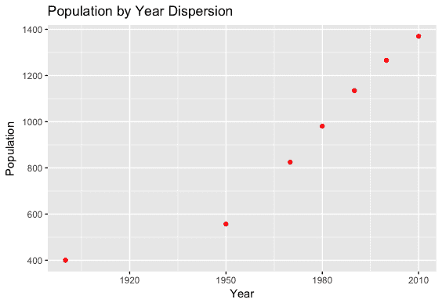
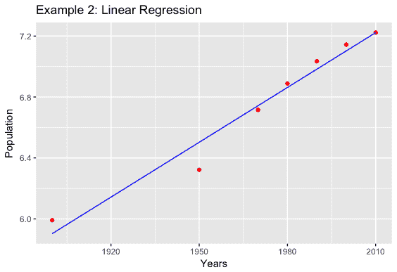
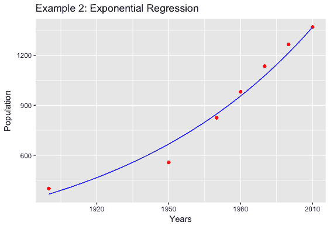

# 数据转化为知识，知识转化为力量

> 原文：<https://dev.to/marisarivera/data-transformed-into-knowledge--knowledge-into-power--3g6c>

***“是关于成为数学思想家，而不是计算器”***

每当有人问一群人，如果他们同意知识就是力量，你肯定会得到一个肯定的回答。21 世纪，正在经历第四次工业革命:[数据](https://hortonworks.com/blog/big-data-london-uk-readies-global-data-driven-upheaval/)。很少，我们认为我们每天都在创造大量的新数据而没有注意到它，由于一些数学思想家，线性回归可以用来给我们周围的数据赋予意义，并将其转化为知识，以便管理行业和公司的人可以为他们的业务做出正确的决定。

这一发现的背后又是数学:线性回归。这是一种属于称为**数值方法**一节的方法，这是一种迭代、高性能和高精度算法，旨在通过寻找收敛点来解决数值问题，收敛点是数学问题的近似解。线性回归所做的是找到自变量和因变量之间的近似关系，它们分别位于 x 轴和 y 轴。这种关系表现在一个方程中，该方程是根据最小二乘法标准测量和选择的，因为我们正在寻找一个足够精确的方程，可用于进行未来预测。例如，找出某个位置(如迈阿密)在某个时间段(如新年前夕)的预期车祸数量。

## 线性回归模型

现在我们知道了线性回归的用途，我将用一个简单的例子来描述实现它的步骤。首先，了解线性回归需要数据作为输入，以便给出统计结果作为输出，这一点很重要。接下来的步骤是:

*   为最小二乘法( *lsq* )创建一个函数
*   创建/导入数据
*   选择特征作为自变量
*   选择目标作为因变量
*   用 lsq 方法分配系数 m & c
*   定义回归线(线性、对数、指数)
*   用回归线绘制离差数据
*   创建一个近似预测表

如果您想用自己的方法运行线性回归模型，这是要遵循的过程，但是在 R 中有另一种方法，通过使用一些 R 包和函数来编码线性回归模型，其中您不必创建 lsq 方法，也不必分配系数 m & c。

## 线性回归示例

对于这个例子，我将导入一个数据集，显示从 1900 年到 2010 年中国的百万人口。我们将比较线性回归和指数回归，看看哪一个最适合，并预测中国未来几年的人口。

```
#Independent Variable  years  <-  c(1900,1950,1970,1980,1990,2000,2010)  years2  <-  seq(1900,2010,1)  #Dependent Variable  people  <-  c(400,557,825,981,1135,1266,1370)  people_ln  <-  log(people)  #Coefficients m & c  m2  <-  lsq_m(years,  people_ln)  c2  <-  lsq_c(years,  people_ln)  people2<-c()  i=1  while(i<(length(years2)+1))  {  value<-exp(c2)  *  exp(m2*years2[i])  people2<-c(people2,value)  i=i+1  } 
```

Enter fullscreen mode Exit fullscreen mode

#### 分散的数据

```
ggplot()  +  geom_point(aes(x  =  years,  y  =  people),  colour  =  'red')  +  ggtitle('Population by Year Dispersion')  +  xlab('Year')  +  ylab('Population') 
```

Enter fullscreen mode Exit fullscreen mode

[T2】](https://res.cloudinary.com/practicaldev/image/fetch/s--vmeIwtJ_--/c_limit%2Cf_auto%2Cfl_progressive%2Cq_auto%2Cw_880/https://thepracticaldev.s3.amazonaws.com/i/mfzen6ijqokxk1bsr7o5.png)

#### 线性回归模型

```
ggplot()  +  geom_point(aes(x  =  years,  y  =  people_ln),  colour  =  'red')  +  geom_line(aes(x  =  years,  y  =  m2*years  +  c2),  colour  =  'blue')  +  ggtitle('Example 2: Linear Regression')  +  xlab('Years')  +  ylab('Population') 
```

Enter fullscreen mode Exit fullscreen mode

[](https://res.cloudinary.com/practicaldev/image/fetch/s--wayJ6xi2--/c_limit%2Cf_auto%2Cfl_progressive%2Cq_auto%2Cw_880/https://thepracticaldev.s3.amazonaws.com/i/s0ps0d89ayzled02n0hy.png) 
它返回 91.06%的准确率，这意味着中国人口中 91.06%的方差是由于年份的方差。有了这个指标，我们可以接受它作为一个公平的模型，但没有这么快！在下结论之前，让我们看看它是如何表现指数回归模型的。

#### 指数回归模型

```
ggplot()  +  geom_point(aes(x  =  years,  y  =  people),  colour  =  'red')  +  geom_line(aes(x  =  years2,  y  =  people2),  colour  =  'blue')  +  ggtitle('Example 2: Exponential Regression')  +  xlab('Years')  +  ylab('Population') 
```

Enter fullscreen mode Exit fullscreen mode

[](https://res.cloudinary.com/practicaldev/image/fetch/s--AjLj_rqr--/c_limit%2Cf_auto%2Cfl_progressive%2Cq_auto%2Cw_880/https://thepracticaldev.s3.amazonaws.com/i/zhm6wz3tq6polpa195yp.png) 
正如我所怀疑的，指数回归模型返回了更好的百分之几的准确率。该模型表明，中国人口 96.27%的变异是由于年份的变异。

不要混淆，线性回归模型并不坏，但对于这种数据的分散，指数回归模型已被证明是一个更准确的模型。所以现在，我们可以得出结论，中国人口呈指数增长，而不是线性增长。

#### 预测

对于文章的这一部分，我们想预测 2011 年到 2020 年的中国人口。这是以下结果:

| 年 | 中国大约人口(百万) |
| --- | --- |
| Two thousand and eleven | One thousand three hundred and eighty-six point zero two three |
| Two thousand and twelve | One thousand four hundred and two point seven four |
| Two thousand and thirteen | One thousand four hundred and nineteen point six five eight |
| Two thousand and fourteen | One thousand four hundred and thirty-six point seven seven nine |
| Two thousand and fifteen | One thousand four hundred and fifty-four point one zero eight |
| Two thousand and sixteen | One thousand four hundred and seventy-one point six four five |
| Two thousand and seventeen | One thousand four hundred and eighty-nine point three nine four |
| Two thousand and eighteen | One thousand five hundred and seven point three five seven |
| Two thousand and nineteen | One thousand five hundred and twenty-five point five three seven |
| Two thousand and twenty | One thousand five hundred and forty-three point nine three six |

### 结论

我希望你能看到数据是如何转化为知识的，因为例如，拥有中国人口的准确近似值，可能对许多事情和许多个人都有用，比如政府、营销机构和投资者。就我个人而言，我认为这是线性回归的目标，用于探索你我和每个人都在生成的数据，以便我们可以发现没有正确信息我们无法发现的见解和结论。