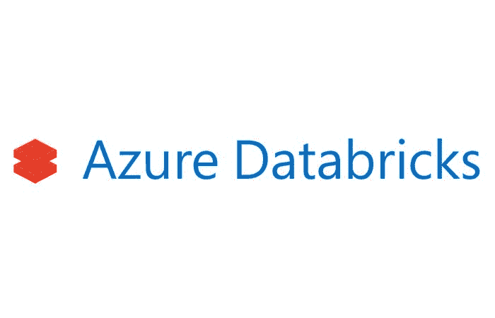
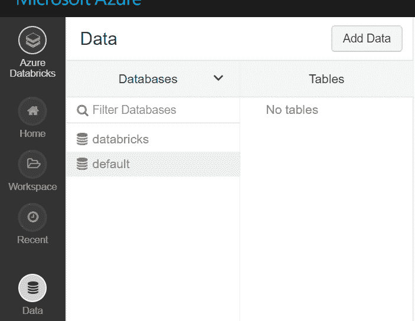
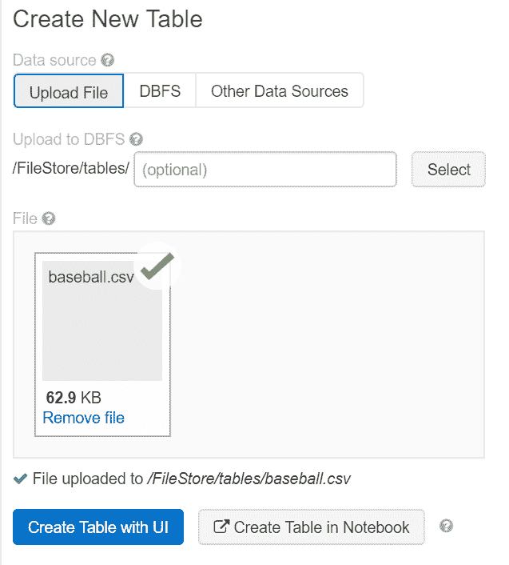
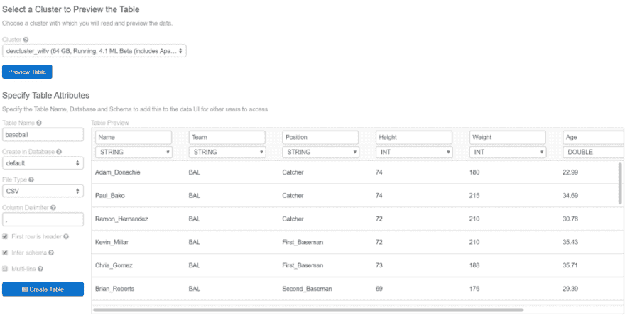
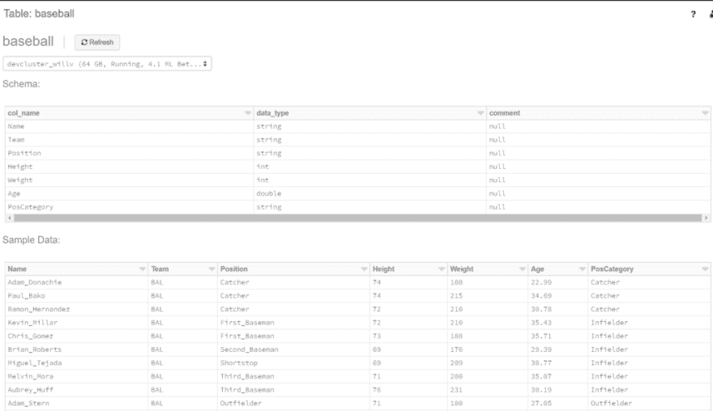
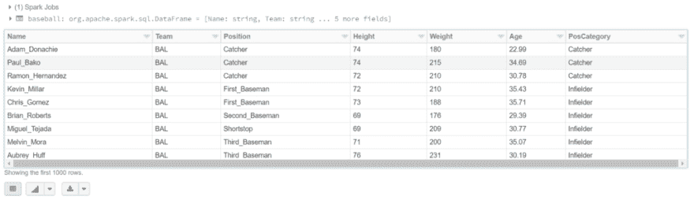
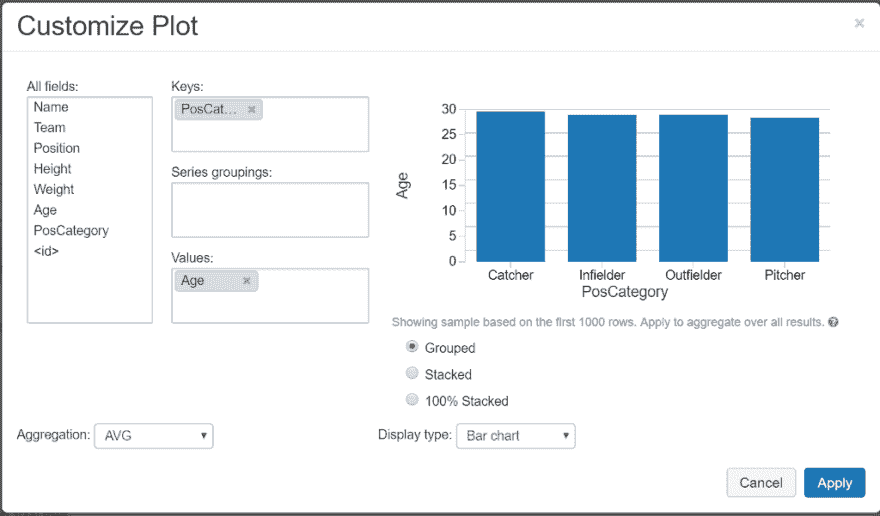
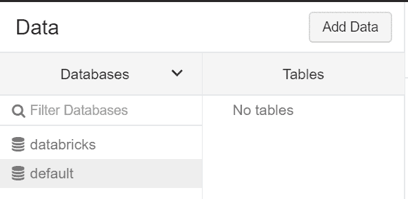

# Azure 数据块中的数据库和表

> 原文：<https://dev.to/willvelida/databases-and-tables-in-azure-databricks-41hn>

[T2】](https://res.cloudinary.com/practicaldev/image/fetch/s--kFobe8HD--/c_limit%2Cf_auto%2Cfl_progressive%2Cq_auto%2Cw_880/https://cdn-images-1.medium.com/max/700/0%2AdKTeyeT9Slg4jf5M.jpg)

在 Azure Databricks 中使用数据库和表格非常简单。让我们从概述几个概念开始。

Azure Databricks 中的数据库是表的集合，而表是结构化数据的集合。数据块中的表相当于 Apache Spark 中的数据帧。这意味着:

*   您可以对数据帧支持的表进行缓存、过滤和执行任何操作。
*   您还可以使用 Spark API 和 Spark SQL 查询表。

数据块中有两种类型的表格:

1.  **全局表。**这些在所有集群中都可用。在 Auzre 数据块中，全局表被注册到 Hive metastore。
2.  **本地表。**这些仅可用于创建它的集群，并且没有注册到配置单元 metastore。这些也称为临时表或视图。

在这篇博文中，我将快速浏览一下创建表格、阅读表格并在使用完毕后删除表格是多么简单。如果你想跟进，你需要一个 [Azure 订阅](https://azure.microsoft.com/en-us/free/)并且你需要[创建一个数据块实例](https://docs.microsoft.com/en-us/azure/azure-databricks/)。

**创建表格**

这在数据块中很容易做到。您可以使用它们提供的 UI 工具来创建表，也可以通过编程来创建表。对于这个例子，我将使用 UI 工具。

确保在执行此操作之前创建一个集群。

对于这个演示，我将上传一个包含棒球运动员数据的 csv 文件(您也可以从 JSON 和 Arvo 格式创建表格)。要将该文件添加为表格，点击侧边栏中的**数据**图标，点击要添加表格的数据库，然后点击**添加数据**

[T2】](https://res.cloudinary.com/practicaldev/image/fetch/s---xzAPnXy--/c_limit%2Cf_auto%2Cfl_progressive%2Cq_auto%2Cw_880/https://cdn-images-1.medium.com/max/703/1%2AqfdA_7Psfjjie0gqyR4mMQ.png)

我们现在想上传我们的文件到 DBFS。这非常简单，您可以将文件放在文件部分下，或者浏览到文件所在的目录。

您可以将 DBFS 中已有的表创建为表，也可以从现有数据源(如 Blob 存储)创建表。

[T2】](https://res.cloudinary.com/practicaldev/image/fetch/s--od_uMSqz--/c_limit%2Cf_auto%2Cfl_progressive%2Cq_auto%2Cw_880/https://cdn-images-1.medium.com/max/637/1%2Ai76zJKzX-7G1xZGvrbj8qA.png)

一旦完成了这些，您就可以使用 UI(我们将会这样做)创建表，或者使用 Databricks 笔记本创建表。

我们需要选择一个集群来预览我们想要创建的表。使用下拉菜单完成后，点击**预览表格。**

现在我们可以指定想要给出的表属性。我们可以指定名称、要将表添加到哪个数据库、文件类型以及是否要从文件中推断模式。

虽然这将为我们完成大部分繁重的工作，但我们可以指定数据类型、列名等。使用表格用户界面编辑器。

一旦你对一切都满意了，点击**创建表格**按钮。

[T2】](https://res.cloudinary.com/practicaldev/image/fetch/s--B5GAUw89--/c_limit%2Cf_auto%2Cfl_progressive%2Cq_auto%2Cw_880/https://cdn-images-1.medium.com/max/1024/1%2AJsdM-qL-21IT3943MgdGqA.png)

然后，您应该会看到创建的表的模式和一些示例数据。

[T2】](https://res.cloudinary.com/practicaldev/image/fetch/s--pMxcNhp4--/c_limit%2Cf_auto%2Cfl_progressive%2Cq_auto%2Cw_880/https://cdn-images-1.medium.com/max/1024/1%2AYYB_4QBm1aJs82ovFPT4xw.png)

**读表**

现在我们有了桌子，让我们创建一个笔记本并展示我们的棒球桌。对于这个例子，我将使用 Scala。

这是一个相当简单的过程。在我的集群上，我有几个数据库，所以我使用了一点 Spark SQL 来使用我们的默认数据库，就像这样

```
%sql

USE default; 
```

Databricks 支持 Scala、SQL、Python 和 r。您可以在一个笔记本中使用多种语言，以及 shell、markdown 和文件系统命令。就这个例子来说，让我们回到使用 Scala。

要读取一个表格并显示其内容，我们可以键入以下 Scala 代码:

```
val baseball = spark.table("baseball")
display(baseball.select("\*")) 
```

这将选择表中的所有内容(很像 SQL SELECT *查询)。以下是我们的输出(这通常会将输出限制在 1000 行):

[T2】](https://res.cloudinary.com/practicaldev/image/fetch/s--LGngddAF--/c_limit%2Cf_auto%2Cfl_progressive%2Cq_auto%2Cw_880/https://cdn-images-1.medium.com/max/1024/1%2AHIxh8bNuslPlhng0sWj4lQ.png)

从这里，我们可以用我称之为“廉价”的可视化来更好地理解我们的数据。我们可以将 Databricks 连接到 Power BI 或 Tableau 等可视化工具，但如果我们想在 Databricks 中快速完成任务，我们也可以选择这个选项。

让我们用一个例子来看看棒球在不同位置类别(PosCategory)之间的平均年龄是多少。我们可以通过单击数据下方的 plot 按钮来完成此操作，这将打开自定义绘图 UI。

在这个用户界面中，我们可以为我们的图选择轴，我们想要执行什么类型的聚合，以及我们想要使用什么类型的图表。

一旦我们完成，点击**应用**完成您的绘图。

[T2】](https://res.cloudinary.com/practicaldev/image/fetch/s--93qENhu8--/c_limit%2Cf_auto%2Cfl_progressive%2Cq_auto%2Cw_880/https://cdn-images-1.medium.com/max/1024/1%2AG25Qc8Lc-qmjVwBCAsyfEg.png)

就像我说的，如果你需要的话，这是一种非常便宜的制作简单视觉效果的方法。如果你愿意，你可以在你的 Databricks 笔记本中导入不同的可视化库，但是我将在另一个时间讨论这个问题。

**更新表格**

我们用于表的模式是不可变的(不能被改变)。但是，我们可以通过更改底层文件来更新表中的数据。一旦我们完成了这些，我们就可以使用下面的 Spark SQL 命令来刷新表:

```
%sql

REFRESH TABLE baseball; 
```

当我们访问表时，这将让 Spark SQL 读取正确的文件，即使它们发生了变化。

**删除表格**

现在我们已经完成了表，可以删除它了。同样，我们可以使用 UI 来完成，也可以通过编程来完成。让我们使用后一种方法来实现这一点。这里我们需要做的只是一个简单的 Spark SQL 操作:

```
%sql

DROP TABLE baseball; 
```

完成后，我们试图再次显示我们的表，我们将得到以下错误:

[T2】](https://res.cloudinary.com/practicaldev/image/fetch/s--epCb1BxG--/c_limit%2Cf_auto%2Cfl_progressive%2Cq_auto%2Cw_880/https://cdn-images-1.medium.com/max/932/1%2Ajl2-lLK7hQsB-OHciiuhgw.png)

我们还可以从 UI 中看到，我们的表不再存在:

[T2】](https://res.cloudinary.com/practicaldev/image/fetch/s--T4ZsKDON--/c_limit%2Cf_auto%2Cfl_progressive%2Cq_auto%2Cw_880/https://cdn-images-1.medium.com/max/592/1%2ATjINOr-Nz3gbe2oqhmzH_g.png)

**鳍**

这是一个关于如何在 Azure Databricks 中创建表格的快速指南。希望您可以看到，快速创建一个示例是相对容易的。在 Databricks 中，您可以对表做更多的事情，我将在以后的文章中介绍这些更好的细节。