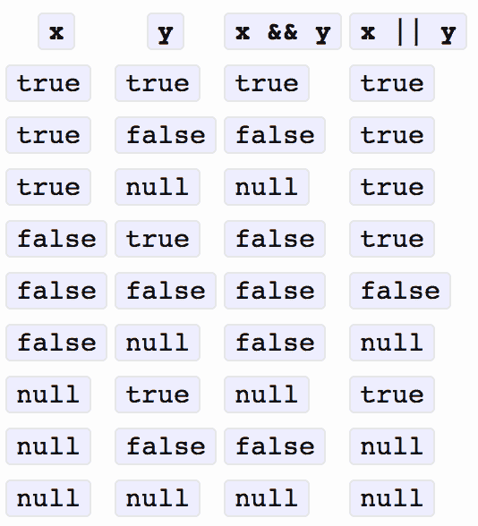

# 在 C#中不处理任何东西-可空

> 原文：<https://dev.to/balazsbotond/dealing-with-nothing-in-c---nullable-406k>

<small>这是我的[原帖](https://blog.lambdaklub.hu/2016/11/30/szembenezni-az-uresseggel-2-resz-nullable/)的匈牙利语英文版。照片由 Unsplash 拍摄。</small>

在本系列的前一期[中，我们看到了为什么`null`值会成为令人讨厌的错误来源。但是有些情况下，你确实希望一个变量，否则不能是`null`，能够有一个`null`值。例如，设想一个存储每个用户上次登录时间的网站。](https://dev.to/balazsbotond/dealing-with-nothing-in-c---the-null-object-pattern-2e9c) 

```
public class User
{
    public string NickName { get; set; }
    public string Email { get; set; }
    public string PasswordHash { get; set; }
    public DateTime LastLoginTime { get; set; }
} 
```

Enter fullscreen mode Exit fullscreen mode

如果用户刚刚注册，但他们还没有登录，我们希望`LastLoginTime`属性以某种方式为*空*。

```
var user = new User();
user.LastLoginTime = null; // Compile-time error 
```

Enter fullscreen mode Exit fullscreen mode

试图将`LastLoginTime`设置为`null`是徒劳的。`DateTime`是值类型，所以我们的代码甚至无法编译。

## 特殊值

我们解决这个问题的第一个想法是指定某个有效的`DateTime`值来表示丢失的登录时间。我们可以用，比如`DateTime.MinValue`。

```
var user = new User();
user.LastLoginTime = DateTime.MinValue; 
```

Enter fullscreen mode Exit fullscreen mode

这当然是可行的，但是我们为什么要使用这些神奇的价值却一点也不明显。引入常量或只读字段来解释文字值在代码中的用途总是一个好的做法，所以我们就这么做吧。

```
private readonly DateTime Never = DateTime.MinValue;

// later in a method:
var user = new User();
user.LastLoginTime = Never; 
```

Enter fullscreen mode Exit fullscreen mode

这个其实挺有可读性的。但是仅仅通过查看`User`类，是无法知道`DateTime.MinValue`有什么特殊含义的。当然，我们可以将它记录在属性的 XML 注释中，但是老实说，您最后一次阅读 XML 注释是什么时候？此外，虽然实际上不可能有人在公元 1 年登录我们的系统，并且从那以后再也没有返回，这使我们可以安全地使用那个日期来达到我们的目的，但这只是一个愉快的巧合。解决方案绝不是通用的。可能会有这样的情况，您需要所讨论的值类型的全部范围，而没有剩余的值被赋予特殊的含义。

## 布尔字段

这就引出了我们的第二个想法。我们可以将空状态转移到一个单独的布尔属性中，而不是使用幻值。

```
public DateTime LastLoginTime { get; set; }
public bool HasLastLoginTime { get; set; } 
```

Enter fullscreen mode Exit fullscreen mode

现在我们可以明确声明用户没有最后登录时间。

```
var user = new User();
user.HasLastLoginTime = false; 
```

Enter fullscreen mode Exit fullscreen mode

这解决了我们眼前的问题，但前一个问题仍然存在。`User`对象的消费者需要意识到他们的责任，每次他们需要实际的属性值时都要检查`HasLastLoginTime`。我们需要以某种方式强制检查。

## 引用包装类

我们的第三个想法正好解决了这个问题。如果我们真的需要这个字段表现得像一个引用类型，为什么不把它变成引用类型呢？那么尝试使用空值将会立即导致一个`NullReferenceException`，虽然令人不快，但它准确地指出了问题所在，并且不允许无效行为发生。

```
public object LastLoginTime { get; set; } 
```

Enter fullscreen mode Exit fullscreen mode

我们可以只使用 object 作为属性的类型，但是这样我们就失去了任何类型安全的暗示。如果我们已经使用了强类型语言，那么不要一看到问题就放弃使用类型系统。

一个更好的解决方案是定义一个包装类，一个引用类型，它可以保存日期时间值。

```
public class NullableDateTime
{
    public DateTime Value { get; }

    public NullableDateTime(DateTime value)
    {
        Value = value;
    }

    public static explicit operator DateTime(NullableDateTime ndt)
    {
        if (ndt == null)
            throw new NullReferenceException("Cannot convert null to DateTime");

        return ndt.Value;
    }

    public static implicit operator NullableDateTime(DateTime dt) =>
        new NullableDateTime(dt);
} 
```

Enter fullscreen mode Exit fullscreen mode

在大多数情况下，定义 DateTime 和 DateTime 之间的转换运算符使得使用这种类型变得非常自然。如果我们更新我们的`User`类，使用新的`NullableDateTime`类作为`LastLoginTime`属性的类型，

```
public NullableDateTime LastLoginTime { get; set; } 
```

Enter fullscreen mode Exit fullscreen mode

我们可以简单地给它分配一个`DateTime`值，因为类型之间存在隐式转换。将它赋给一个`DateTime`值只有使用显式强制转换才有可能；这就是我们如何警告调用者这不是一个普通的`DateTime`实例，并建议检查一下`null`。

```
var user = new User();
user.LastLoginTime = DateTime.Now;

DateTime lastLoginTime;
if (user.LastLoginTime != null)
{
    lastLoginTime = (DateTime)user.LastLoginTime;
} 
```

Enter fullscreen mode Exit fullscreen mode

这个设计一点也不差，事实上比我们以前做的任何设计都要好。但是它仍然有一个非常不方便的弱点。如果我们的代码中需要可空的整数、双精度数和其他值类型，我们需要为它们中的每一个定义相同的包装类。

## 通用包装类

使用泛型可以非常容易地解决这个问题。

```
public class Nullable<T> where T : struct
{
    public T Value { get; }

    public Nullable(T value)
    {
        Value = value;
    }

    public static explicit operator T(Nullable<T> nullable)
    {
        if (nullable == null)
            throw new NullReferenceException(
                "Cannot convert null to " + typeof(T).Name);

        return nullable.Value;
    }

    public static implicit operator Nullable<T>(T value) =>
        new Nullable<T>(value);
} 
```

Enter fullscreen mode Exit fullscreen mode

通过在我们之前使用`DateTime`的所有地方替换通用的`T`类型参数，我们得到了上面的解决方案，它工作得非常好。注意，我们将`T`约束为一个结构或值类型。这也防止了创建像`Nullable<Nullable<int>>`这样无意义的类型声明，因为我们的`Nullable`是一个引用类型。

通过将`LastLoginTime`属性的类型更改为我们新创建的

```
public Nullable<DateTime> LastLoginTime { get; set; } 
```

Enter fullscreen mode Exit fullscreen mode

我们可以像以前一样使用它，但是我们也可以声明无限数量的其他可空类型。如果我们也实现了`Equals`和`GetHashCode`，我们觉得已经没有太多需要改进的地方了，事实上这种类型可以成功地用在很多现实场景中。

## 通用包装结构

但是在性能方面还有一个小问题。随着我们的类的新实例的创建，大量使用这种可空类型将导致堆上的大量分配。如果我们使用我们包装的原始值类型，这就不会发生。如果我们将使用布尔属性的失败尝试与包装类的思想结合起来，我们可以创建一个具有更好性能特征的包装结构。

```
public struct Nullable<T> where T : struct
{
    private T value;

    public Nullable(T value)
    {
        this.value = value;
        hasValue = true;
    }       

    public bool HasValue { get; private set; }

    public T Value
    {
        get
        {
            if (!HasValue)
                throw new NullReferenceException();
            return value;
        }
    }

    public override bool Equals(object other)
    {
        if (!HasValue)
            return other == null;
        if (other == null)
            return false;

        return value.Equals(other);
    }

    public override int GetHashCode() => HasValue ? value.GetHashCode() : 0;

    public override string ToString() => HasValue ? value.ToString() : "";

    public static implicit operator Nullable<T>(T value) => new Nullable<T>(value);

    public static explicit operator T(Nullable<T> value) => value.Value;
} 
```

Enter fullscreen mode Exit fullscreen mode

注意，在这个结构的默认值中，`hasValue`是 false，这正是我们想要的。几乎完美，除了前面提到的一个问题。这样你就可以嵌套我们想要阻止的空值。

## 来自 C#编译器的支持

现在是时候承认我一直在欺骗你了。的。NET Framework 已经包含了一个`Nullable<T>`类型，它有一个几乎相同的实现，没有这个问题。[自己看。](https://referencesource.microsoft.com/#mscorlib/system/nullable.cs,ffebe438fd9cbf0e)

这是通过欺骗实现的:`where T: struct`泛型约束的含义在 C#规范中定义如下:

> 类型参数必须是值类型。可以指定除 Nullable 以外的任何值类型。

C#语言还为使用可空类型提供了一种方便的速记符号。不用写`Nullable<T>`，直接写`T?`就可以了。

```
public DateTime? LastLoginTime { get; set; } 
```

Enter fullscreen mode Exit fullscreen mode

C#还使得可空类型的行为更像一个*空对象*，而不是一个简单的`null`值。这是通过操作符提升实现的——任何已经为底层类型定义的操作符也可以用于可空类型，如果任何操作数是`null`，结果也将是`null`。

```
int? a = 2;
int? b = 3;
int? c = null;

int? d = 2 + 3; // d == 5
int? e = b * c; // e == null 
```

Enter fullscreen mode Exit fullscreen mode

所谓零合并运算符是一种二元运算符，如果不为空，则返回第一个操作数，否则返回第二个操作数。

```
int? a = null;
int? b = 5;

int c = a ?? 10; // c == 10
int d = b ?? 10; // d == 5 
```

Enter fullscreen mode Exit fullscreen mode

这个操作符的一个有趣的性质是它可以被链接。

```
int? x = null;
int? y = null;

int z = x ?? y ?? 10; // z == 10 
```

Enter fullscreen mode Exit fullscreen mode

类型有特殊的行为。下面是逻辑 and 和 or 运算符应用于可空值时的“真值表”:

[T2】](https://res.cloudinary.com/practicaldev/image/fetch/s---9s2sM1P--/c_limit%2Cf_auto%2Cfl_progressive%2Cq_auto%2Cw_880/https://thepracticaldev.s3.amazonaws.com/i/tjdlqpqz7lcjjnv3wtjb.png)

# 来自 CLR 的支持

到目前为止,`Nullable<T>`的所有特性都是由。NET 框架或 C#编译器。它们都不需要运行时本身的支持。但是有一个特殊的特性需要改变 CLR——可空类型的装箱行为。讨论这个问题超出了本文的范围，但是如果你感兴趣的话，[这个堆栈溢出回答](http://stackoverflow.com/a/1387605/943102)提供了一个很好的解释。