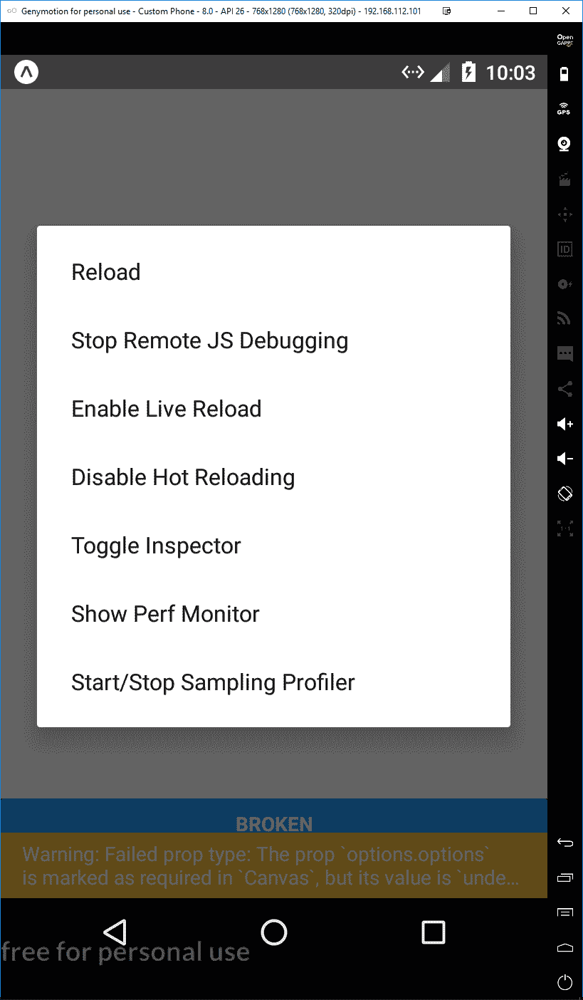
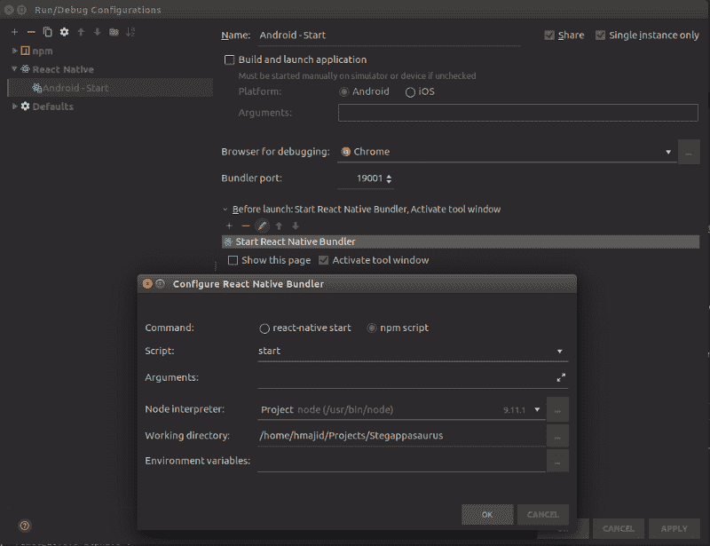
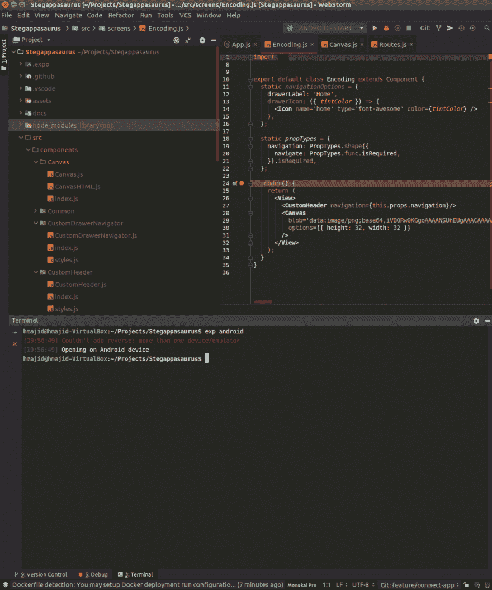

# 在 WebStorm 和 Visual Studio 代码中调试 Expo 应用程序

> 原文：<https://dev.to/ghost/debugging-expo-apps-in-webstorm-and-visual-studio-code-2kl3>

[](https://res.cloudinary.com/practicaldev/image/fetch/s--8oCqsi1B--/c_limit%2Cf_auto%2Cfl_progressive%2Cq_auto%2Cw_880/https://cdn-images-1.medium.com/max/512/1%2AnBbx0atmv-5B7k3czPRuAQ.png) 

<figcaption>图标由</figcaption>

制成

Visual Studio Code 和 WebStorm 是开发 React Native/Expo 应用的两个流行编辑器。这些编辑器有很多有用的特性，比如语法高亮、git 集成和自动完成。然而，调试 Expo 应用程序可能有点令人困惑。

在编辑器/IDE 中工作的主要优势之一(老实说，Visual Studio 代码非常接近 IDE)是能够使用调试器(和断点)逐行检查您的代码，并查看哪部分代码没有按预期运行。调试器是一个强大的工具，它可以在任何时候停止你的代码，检查状态，分析变量等等。

实际上，你可以在两种 ide(WebStorm 和 Visual Studio 代码)中调试 Expo 应用程序，包括断点和所有其他有趣的功能。我将在 Genymotion Android 模拟器上运行我的应用，[https://genymotion.com](https://genymotion.com)/。另外请注意，调试 React Native/Expo 应用程序可能有多种方法，我只是向您展示我能够运行调试器的方法。

[https://medium . com/media/FDC 0 efcc 223 BD 0536 f 0078 f1 c7b 49506/href](https://medium.com/media/fdc0efcc223bd0536f0078f1c7b49506/href)

### 先决条件

*   有 Expo/React 原生 app，[https://expo.io/learn](https://expo.io/learn)
*   在 android 设备上打开“远程调试 JS ”,如图 1 所示。在 Genymotion 中，您可以通过按 CTRL + M 打开“开发者菜单”菜单。更多信息，请点击这里，[http://facebook.github.io/react-native/docs/debugging](http://facebook.github.io/react-native/docs/debugging)
*   使用 ADB 连接到您的 Android 设备

```
adb connect 192.168.101.1 # Replace with your Device IP 
```

[](https://res.cloudinary.com/practicaldev/image/fetch/s--zc2iw1my--/c_limit%2Cf_auto%2Cfl_progressive%2Cq_auto%2Cw_880/https://cdn-images-1.medium.com/max/819/1%2Az721hvW08jI7qkd_DaP3kg.png) 

<figcaption>图 1:在安卓设备上打开“远程调试 JS”</figcaption>

### 网络风暴

*   在 chrome 中安装并打开 [*CORS*](https://chrome.google.com/webstore/detail/cors/dboaklophljenpcjkbbibpkbpbobnbld?hl=en) 插件，确保它与你在配置中使用的 Chrome 浏览器相同。(**注意**确保你意识到使用 CORS 的安全隐患，不使用时关闭插件)。
*   打开 WebStorm 和您的 Expo 项目
*   将下面几行代码添加到您的 *package.json* 文件中

```
"scripts": {
 "start": "exp start"
} 
```

*   使用图 3 所示的设置创建一个“React Native”类型的新配置。记住添加一个新的“启动前”配置，并选择配置类型“反应本机捆绑器”
*   在调试模式下运行您刚刚创建的配置(SHIFT + F9)
*   打开终端窗口并运行

```
exp android 
```

[](https://res.cloudinary.com/practicaldev/image/fetch/s--96Ss-tfD--/c_limit%2Cf_auto%2Cfl_progressive%2Cq_auto%2Cw_880/https://cdn-images-1.medium.com/max/800/1%2AzpnV-mA_ZmK4xvp6Fa3tcg.png) 

<figcaption>图 2:运行/调试配置设置</figcaption>

[](https://res.cloudinary.com/practicaldev/image/fetch/s--q7p-eN2I--/c_limit%2Cf_auto%2Cfl_progressive%2Cq_66%2Cw_880/https://cdn-images-1.medium.com/max/1024/1%2Aaz7HWKO2u2IPO_IrWW4Hhg.gif) 

<figcaption>图 3:WebStorm；启动调试器</figcaption>

### Visual Studio 代码

*   打开 Visual Studio 代码和您的 Expo 项目
*   在中创建一个新文件。名为 *settings.json* 的 vscode 文件夹，并添加以下内容

```
{
 "react-native": {
 "packager": {
 "port": 19001
 }
 }
} 
```

*   进入*调试*窗口(CTRL + SHIFT + D)
*   当提示环境选择“React Native”时，它应该给出这样一个 *launch.json* 文件，确保它包含以下内容

```
{
 [
 {
 "name": "Attach to packager",
 "program": "${workspaceRoot}/.vscode/launchReactNative.js",
 "type": "reactnative",
 "request": "attach",
 "sourceMaps": true,
 "outDir": "${workspaceRoot}/.vscode/.react"
 },

 ]
} 
```

*   打开集成终端(CTRL +`)并运行

 ``exp start`` 

 ``*   在调试菜单的顶部应该说“调试 Android ”,将它改为“附加到打包程序”,然后按“开始调试”
*   打开另一个终端并运行

 ``exp android`` 

 ``*   切换到*调试控制台*选项卡查看调试器

[](https://res.cloudinary.com/practicaldev/image/fetch/s--znmagVwQ--/c_limit%2Cf_auto%2Cfl_progressive%2Cq_66%2Cw_880/https://cdn-images-1.medium.com/max/1024/1%2ADyrR-59GutksX5IsGcyJpw.gif)T3】图 4: Visual Studio 代码；启动调试器

### 附录

*   [示例源代码](https://github.com/hmajid2301/medium/tree/master/Debugging%20Expo%20apps%20in%20WebStorm%20and%20Visual%20Studio%20Code)
*   用[https://www.screentogif.com/](https://www.screentogif.com/)创建的 gif
*   [*用 VSCode* 调试 create-react-native-app](https://www.youtube.com/watch?v=0_MnXPD55-E)
*   [*WebStorm 2018.1 EAP，181.3263.21:对 React Native，extract Vue 组件*T3】的改进](https://blog.jetbrains.com/webstorm/2018/02/webstorm-2018-1-eap-181-3263/)
*   *图标由*[*https://www.flaticon.com/authors/monkik*](https://www.flaticon.com/authors/monkik)*由*[*https://www.flaticon.com/*](https://www.flaticon.com/)*由*[*http://creativecommons.org/licenses/by/3.0/*](http://creativecommons.org/licenses/by/3.0/)授权