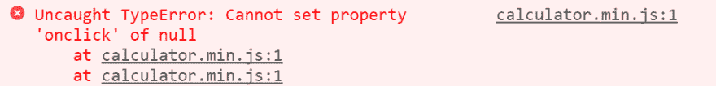
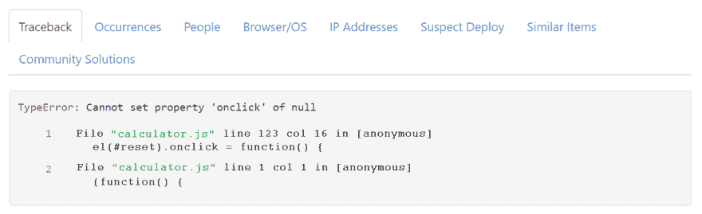

# 使用源地图调试 JavaScript

> 原文：<https://dev.to/themlsmith/debugging-javascript-with-source-maps--5bie>

我在调试 JavaScript 时经常遇到的一个令人沮丧的情况，就是追踪到 **[JavaScript 错误](https://dev.to/error-tracking/javascript/)** 到 ***line 23 col 63475*** 。我感觉好像我就要看到有问题的代码并能够修复它了。然后，现实崩溃了。我意识到我已经成功地将自己调试到一个缩小的 JavaScript 文件的中间😞。

还有一个更好的办法——源码地图。JavaScript 源代码映射是缩小代码范围的关键，然后能够将它们映射回源代码，这样您就可以查看并解决问题，而不必在缩小的代码中找出问题。

**[源文件图](https://www.html5rocks.com/en/tutorials/developertools/sourcemaps/)** 是 JavaScript 代码缩小后生成的。通过在生产中使用源图，您可以将问题追溯到源代码的确切行。它还允许您在调试问题时使用浏览器的开发人员控制台来单步调试源代码。我们将看看如何生成源地图，然后我们将看看它们是如何工作的，以及我们如何使用它们来使我们的生活更轻松。

您可以从下载或克隆以下演示的源代码。源包括原始的 JavaScript 文件、缩小的 JavaScript 文件和源映射。如果你已经知道如何生成一个源地图或者只是想使用生成的文件，你可以跳到 **[源地图是如何工作的？](#how-do-source-maps-work)**

## 生成源地图

对于这个例子，我将使用一个简单的 JavaScript 应用程序。保持简单将有助于保持演示的可管理性，并且这些概念适用于任何应用程序，无论大小。

我们首先需要的是一个缩减代码的工具。我将使用`UglifyJS`，但是大多数工具应该支持生成生产源地图的能力，作为缩小过程的一部分。如果您的工作站上安装了 npm，那么您可以安装带有 NPM 的`UglifyJS`。

```
$ npm install uglify-js -g 
```

Enter fullscreen mode Exit fullscreen mode

然后，您可以通过执行以下命令来验证安装:

```
$ uglifyjs --version
uglify-js 3.2.0 
```

Enter fullscreen mode Exit fullscreen mode

在某些情况下，您可能需要将安装文件夹添加到路径中。

现在我们已经安装了`uglifyjs`,并且已经验证了它可以工作，让我们来精简我们的代码。如果您使用的是示例项目，该命令将覆盖现有的缩小文件和源地图。

从演示项目的 JS 文件夹中，输入以下命令。

```
$ uglifyjs calculator.js --compress --mangle --source-map --output calculator.min.js 
```

Enter fullscreen mode Exit fullscreen mode

这个命令获取我们的 JavaScript 文件`calculator.js`并将其转换成一个缩小的版本`calculator.min.js`，以及一个源地图`calculator.min.js.map`。即使对于这个小文件，缩小过程也会将文件大小从 4KB 减小到 1KB。

## 源地图是如何工作的？

让我们打开源地图文件，看看里面有什么。为了便于阅读，我使用了 JSON 解析器对其进行格式化，并且用省略号缩短了一些行。

```
{  "version"  :  3,  "sources"  :  [calculator.js],  "names"  :  [resultNum,operator,el,element,charAt,document,querySelector,...],  "mappings"  :  CAAC,WACC,aAyGA,IAAK,IAvFHA,EACAC,EAhBEC,EAAK,SAASC,GAChB,MAA0B,MAAtBA,...  } 
```

Enter fullscreen mode Exit fullscreen mode

该文件指定所使用的映射版本，并标识源文件和参数名称。有用的部分是映射，尽管不幸的是，因为它们是在 64 进制 VLQ 中，所以对人脑不是很有用。

如果你想更多地了解映射是如何工作的，以及它们如何将精简的代码翻译回源代码，我推荐你阅读 **[源代码映射是如何工作的](http://www.mattzeunert.com/2016/02/14/how-do-source-maps-work.html)** 。现在，让我们看看如何在生产中利用源地图来简化调试。

如果你在 Chrome 或你选择的浏览器中打开`index.html`,你会注意到在我们缩小的文件的第一行有一个 JavaScript 错误。让我们更容易地识别和解决这个问题。

[T2】](https://res.cloudinary.com/practicaldev/image/fetch/s--nc_Q4x8L--/c_limit%2Cf_auto%2Cfl_progressive%2Cq_auto%2Cw_880/https://rollbar.com/assets/blimg/source-maps/can-not-set-property.png)

*缩小的 JavaScript 文件中的错误*

**注意:**要完成下一组步骤，您需要在一个可公开访问的 web 服务器上运行 JavaScript-calculator web 应用程序。对于这个演示，我创建了一个 AWS 实例，安装了一个 Apache Web 服务器，并从那里为 Web 应用程序提供服务。

## 在生产中使用源地图

当您调试生产应用程序时，会变得更加棘手，因为生产服务器通常不提供源地图。你想让你不认识的人更容易看到你的原始源代码吗？幸运的是，Rollbar 支持使用源映射来获得有意义的堆栈跟踪，同时仍然在生产中使用缩小的 JavaScript。

Rollbar 提供实时 **[生产错误监控](https://dev.to/features/)** ，支持大多数编程语言和框架，包括 **[JavaScript](https://dev.to/error-tracking/javascript)** 、 **[Angular](https://dev.to/error-tracking/angular)** 、 **[Node](///error-tracking/node.js)** 、React 等。因为 **[`rollbar,js`](https://github.com/rollbar/rollbar.js/)** 支持源代码映射，所以您可以看到每个错误起源的确切代码行以及堆栈跟踪。让我们来看一个它是如何工作的例子。

一旦你 **[创建了一个账户](https://dev.to/signup/)** 和你的第一个项目，你会得到一个客户端访问令牌。在`index.html`中的`<HEAD>`标签内添加**快速启动浏览器**部分包含的脚本。

你可以通过 **[API](https://dev.to/docs/)** 上传你的源地图。通常，我们会在部署时使用脚本自动完成这项工作，但在本教程中我们将手动完成。在 web 应用程序项目的根文件夹中，在将访问令牌和 minified_url 更新到您的令牌和 url 之后，执行下面的 curl 命令:

```
$ curl https://api.rollbar.com/api/1/sourcemap \
-F access_token=8888888888888888888888888 \
-F version=0.0.1 \
-F minified_url=http://ec2-52-43-138-168.us-west-2.compute.amazonaws.com/javascript-calculator/js/calculator.min.js \
-F source_map=@js/calculator.min.js.map \
-F calculator.js=@js/calculator.js 
```

Enter fullscreen mode Exit fullscreen mode

一旦完成，点击一个错误应该会把你带到一个带有堆栈跟踪的页面。在这里我们可以看到带有文件和行号的正确源代码。

[T2】](https://res.cloudinary.com/practicaldev/image/fetch/s--3fWGrnhP--/c_limit%2Cf_auto%2Cfl_progressive%2Cq_auto%2Cw_880/https://rollbar.com/assets/blimg/source-maps/Can-not-set-property-onClick-null.png)

*显示原始源代码的堆栈跟踪*

点击源文件链接，会打开到 **[GitHub，BitBucket，或者 Gitlab](https://dev.to/docs/source-control)** 中的文件和行号。在那里，您可以使用工具来查看在什么时候做了什么更改。要了解更多信息，请查看 **[源地图文档](https://dev.to/docs/source-maps/)** 了解更多细节和配置选项。

### 使用滚动条在生产和调试中使用源地图的提示

*   更新 JavaScript 时，不要忘记更新版本号。否则，文件名、行号和列号将会不正确。
*   `minified_url`的值必须是缩小文件的完整 URL。这应该从`http:`或`https:`开始，我们将去掉它们。
*   确保页面上的 JavaScript 代码片段中没有缺少一个或两个配置参数。设置`payload.client.javascript.source_map_enabled`和`payload.client.javascript.code_version`。
*   如果您正在使用 upload 方法，请检查以确保页面片段中使用的`code_version`与 upload 调用中提供的版本相匹配。
*   如果您使用的是下载方法，请确保您的源地图文件或简化的 JavaScript 源文件位于可从公共互联网访问的主机上，并且没有受到授权墙的限制。
*   如果您希望消除的 JavaScript 错误没有列号，并且您没有启用`guess_uncaught_frames`，我们将无法应用源映射。我们需要列号来应用源地图，而不需要猜测。
*   如果您的源地图文件将多个子地图合并到顶层地图的“部分”中，不幸的是，我们还不支持这种源地图格式(但我们计划很快支持)。

## TL；速度三角形定位法(dead reckoning)

总之，源代码映射帮助您在浏览器的开发人员控制台中调试生产代码。当出现错误时，它们会告诉您确切的文件和行号，并使您可以很自然地使用浏览器中的调试功能来单步调试代码。这使得找到问题的根本原因并快速修复它们变得容易得多。当监控生产系统时，一定要选择像 Rollbar 这样的解决方案，它们支持源代码映射，并使调试生产变得非常容易。

* * *

*注:这篇文章最初发表在 [Rollbar 的博客](https://rollbar.com/blog/top-10-javascript-errors/)上。*