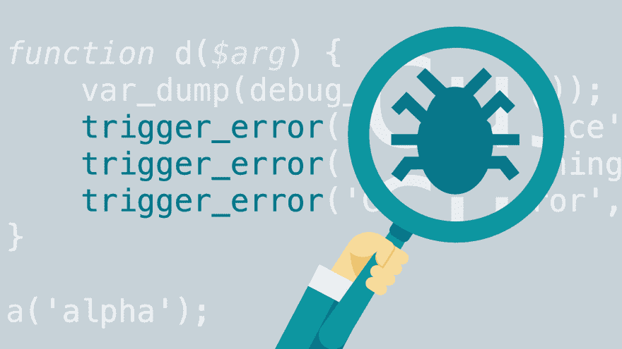

# 调试提示

> 原文：<https://dev.to/sadick/debugging-tips-2kla>

[T2】](https://res.cloudinary.com/practicaldev/image/fetch/s--IwTqfAKS--/c_limit%2Cf_auto%2Cfl_progressive%2Cq_auto%2Cw_880/https://cdn.lynda.com/course/112414/112414-636410882080313019-16x9.jpg)

程序员写代码。程序员不是完美的。程序员的代码并不完美。因此，第一次并不完美。所以我们有虫子。

我们应该始终采用合理的工程技术，最大限度地减少令人不快的意外发生的可能性。

调试比一开始写代码要难两倍。因此，如果你尽可能聪明地编写代码，从定义上来说，你没有足够的聪明去调试它。

### 提示

*   将 bug 减少到尽可能简单的复制步骤。
*   确保你只关注一个问题。
*   断言和日志记录(甚至是不起眼的 console.log)都是有效的调试工具。经常使用它们。
*   二进制 chop 问题空间，以获得更快的结果。
*   当你开发你的软件时，花时间写一套单元测试。
*   未经测试的代码是滋生 bug 的温床。测试是你的漂白剂。
*   学习如何使用好你的调试器。然后在适当的时候使用它。
*   尽快修复错误。不要让它们堆积起来，直到你陷入代码粪坑。

调试并不容易。但这是我们自己的错。我们写了 bug。