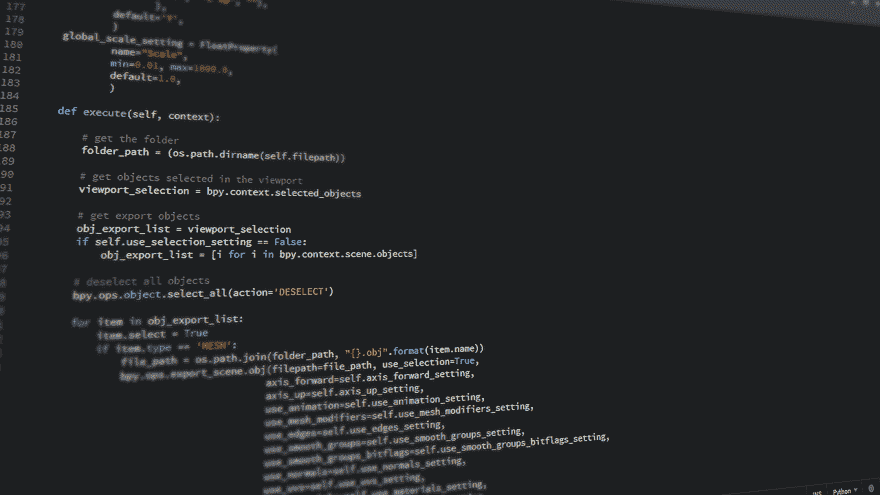

# 动态类型声明:Python

> 原文：<https://dev.to/himankbhalla/declaration-in-dynamically-typedpython-2do3>

[](https://res.cloudinary.com/practicaldev/image/fetch/s--ILvlt-LR--/c_limit%2Cf_auto%2Cfl_progressive%2Cq_auto%2Cw_880/https://thepracticaldev.s3.amazonaws.com/i/jt5dy283wrihazk1p81b.png) 
Python 变量赋值不同于一些流行的语言如 c、c++和 java。python 中没有变量声明，只有赋值语句。

C++中的变量是一个命名对象。它有一个特定的类型，告诉我们什么值是允许的，什么操作可以在这个命名的对象上执行。

当我们**在 C++或类似语言中声明一个变量**时。声明语句留出一块内存区域，用于保存被声明变量的**数据类型**所允许的值。数据类型定义了一组允许的值和一组在对象情况下可能的操作。分配的内存将按照数据类型的建议进行解释。如果它是一个整数变量，那么分配的内存将作为一个整数读取，依此类推。当我们给它赋值或者初始化的时候，这个值会被存储在那个内存位置。在编译时，初始值或赋值将与该数据类型的允许值相匹配。所以我们不能混合类型。示例:不允许将字符串值初始化为 int 变量，程序将无法编译。

我们来看看 python 有什么不同？

相反，Python 是一种**动态类型化的**语言。它不知道变量的类型，直到运行**代码**。所以声明是没有用的。它所做的是，将该值存储在某个内存位置，然后将该变量名绑定到内存容器。并通过该变量名访问容器的内容。所以数据类型无关紧要。变量可以绑定到任何数据类型的值。它将在运行时知道值的类型。一旦知道了数据类型，就只能对其执行有效的操作。程序员有责任确保所使用的操作数支持这些操作。

```
# This will store 6 in the memory and binds the 
# name x to it. After it runs, type of x will 
# be int. 
x = 6   

print(type(x)) 
# This will store 'hello' at some location int  
# the memory and binds name x to it. After it 
# runs type of x will be str. 
x = 'hello' 

print(type(x)) 
```

输出:

```
<class 'int'>
<class 'str'> 
```