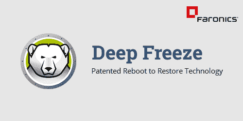

# 深度冻结——多用户计算环境的首选 Windows SteadyState 替代方案

> 原文：<https://dev.to/carlhand72/deep-freeze---a-preferred-windows-steadystate-alternative-for-multi-user-computing-environments-23k6>

多用户工作站是教室、公共图书馆和商务中心的常见场景。不是每个用户都以相同的方式与系统交互。有些人可能会在不知道或篡改管理员定义的系统设置的情况下下载恶意文件。因此，公共访问计算机容易受到病毒渗透、性能下降和配置漂移的影响。由于连接在共享网络上，潜在威胁仍有可能在整个网络中传播。因此，IT 团队花费了大量的时间、精力和资源来将系统恢复到正常工作状态，从而为用户提供不间断和不受限制的计算体验。T3】

像 Windows SteadyState 这样的内置系统恢复工具允许管理公共访问计算机的 IT 管理员将系统回滚到保存的配置状态，从而确保对 Windows 工作站的预期保护。然而，在 2010 年停产后，强效的 [<u><u>重启恢复</u></u>](http://www.faronics.com/technology/reboot-to-restore)解决方案像深度冷冻一样有效地填补了这一空白。作为最受欢迎的 Windows SteadyState 替代方案，Deep Freeze 提供即时 Windows 系统恢复解决方案，同时消除突然中断的影响。T19】

****Windows steady state:功能&局限性****

SteadyState 是微软为 32 位版本的 Windows XP 和 Vista 提供的免费工具。它帮助 It 人员管理和维护学校、机场、公共图书馆和医院中的共享计算机环境。Windows SteadyState 提供了完整的磁盘保护功能，可以通过重新启动来恢复最终用户所做的更改，并将系统配置恢复到 IT 管理员保存的所需状态。T3】

Windows SteadyState 的工作原理是将用户在硬盘上所做的所有更改重定向到一个临时缓存中。在其“丢弃模式”下，Windows SteadyState 可以在计算机重新启动时清除这些缓存，同时将其回滚到管理员定义的基线。启用“持久模式”后，它可以在重启后保持缓存完整，it 管理员可以选择保留更改。否则，缓存将在指定的持续时间后过期。在“提交模式”下，Windows SteadyState 不会将任何内容重定向到缓存，因此所有更改都会对系统产生永久影响。IT 经理也可以使用这个工具来定制用户环境。可以限制用户执行不适合特定计算环境的若干动作。例如，它允许禁用 Windows 注册表、命令提示符或关闭控制面板。T3】

Windows SteadyState 已于 2010 年被微软停产。这使得许多依赖 SteadyState 的公共工作站容易受到恶意软件、病毒和持久系统变更的攻击。Windows SteadyState 不支持任何 64 位版本的 Windows 操作系统(OS)。因此，管理运行在最新 Windows 版本上的系统的 IT 专业人员迫切需要具有类似 SteadyState 功能的替代解决方案。T3】

Faronics 的 Deep Freeze 是首选的 Windows SteadyState 替代方案，它利用获得专利的 重新启动以恢复 技术来填补 SteadyState 留下的空白，并确保每次重新启动时 100%的系统可用性。T11】

****深度冻结:管理多用户计算环境的可行 Windows SteadyState 替代方案****

********

Deep Freeze 是一款有效的系统恢复软件，允许 IT 管理员设置和控制基线配置。每次重新启动时，此 重新启动以恢复 解决方案可以将系统恢复到预定义的状态，同时消除所有用户引起的更改。通过保存和保护由 IT 管理员建立的配置状态，Deep Freeze 使端点几乎无法破解。T11】

Deep Freeze 提供的好处超过了 SteadyState 所能提供的。该解决方案与最新版本的 Windows(包括 Windows 7、Windows 8 和 Windows 10)兼容良好，这使其成为最全面、最可靠的Windows[<u><u>steady state 替代产品</u></u>](http://www.faronics.com/technology/windows-steadystate-software)。由于重启恢复技术的非限制性，用户可以不受限制地访问网络和系统。每次重新启动时，所有意外或恶意的更改都会被清除，而深度冻结会将系统回滚到其原始状态。因此，它使最终用户能够自己解决常见的系统问题。因此，对它的依赖减少了。

Deep Freeze 一直是全球组织中最受青睐的Windows steady state 替代方案 ，用于维护多用户计算环境。它提供的独特优势如下:

****所有常见系统问题的一个解决方案:****重新启动以恢复 深度冻结技术使管理员所需的基线配置的恢复成为一项即时且轻松的任务。它还消除了系统在重新启动时的所有不良变化。这有助于 IT 经理有效地处理反复出现的系统问题，如配置漂移、恶意软件/病毒攻击和未经授权的软件安装。T19】

****提供极大的易用性:****Deep Freeze 非常容易在任何工作站上安装和部署。IT 经理所要做的就是建立一个期望的配置状态，并在系统上启用它。Deep Freeze 允许 IT 经理安排各种维护任务，以便自动执行第三方软件更新和 Windows 更新。T11】

****集中管理所有工作站:****Deep Freeze 企业版自带强大的管理控制台，可以集中管理。这使 IT 管理员能够远程配置、更新和管理通过网络连接的所有 Windows 系统。因此，它为 It 经理提供了对目标工作站的迫切需要的控制，帮助他们及时采取预防措施，并减少任何系统错误的机会。T11】

Deep Freeze 的快速和高级系统恢复功能使其成为寻求在多用户计算环境中简化 it 运营的 IT 经理梦寐以求的Windows steady state 替代方案 。此解决方案的 重启恢复 功能和扩展功能可以帮助 IT 团队在很大程度上降低系统维护成本，并确保他们始终保持最佳性能。T19】