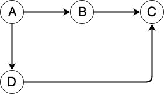

# 揭秘 Webpack

> 原文：<https://dev.to/sadarshannaiynar/demystifying-webpack-2f5n>

我们所有人肯定都曾经使用过 webpack。这是迄今为止最受欢迎的捆扎机，因为它为捆绑过程带来了无穷无尽的装载机和可定制性。在某种程度上，webpack 影响了某些 JavaScript 生态系统的发展。但是我们有多少次想过打开那个捆绑的文件，并且理解在捆绑时发生了什么。我的应用程序包含数百个单独的文件，它是如何从一个单独的捆绑文件中如此漂亮和连贯地工作的？让我们分解一下 webpack 的概念，并理解捆绑过程中发生了什么。我将不再赘述 webpack 配置中的元素，因为它们在 webpack 文档中已有详细介绍，而是讨论 webpack 的核心概念。

## 捆绑器是什么？

在我们继续之前，让我们了解一下什么是捆绑器。bundler 是一个实用程序/程序，它获取大量文件，并以不改变代码工作方式的方式将它们放在一起。这允许您以模块化的方式编写代码，但将它们作为一个整体文件。

## 我们为什么需要捆绑器？

如今，我们越来越多地将可维护性和可重用性放在心上，在模块中编写代码。如果应用程序很小，这种模块化风格就很好。但是，随着应用程序复杂性和规模的扩大，在运行这种模块化代码的同时，管理不断增加的依赖项和代码变得越来越困难。例如，假设您正在创建一个由 50 个 JS 模块组成的 HTML/JavaScript 应用程序。现在，从你的 HTML 来看，你负担不起在页面中使用 50 个脚本标签。这就是 bundler 的用武之地，它把所有的 50 个文件捆绑在一起，给出一个你可以用一个脚本标签在 HTML 中使用的文件。

## 揭秘 webpack

好了，基本知识已经讲得够多了，现在让我们开始学习 webpack。

考虑三个文件

```
// A.js

const B = require('./B');

B.printValue(); 
```

Enter fullscreen mode Exit fullscreen mode

```
// B.js

const C = require('./C.js')

const printValue = () => {
  console.log(`The value of C.text is ${C.text}`);
};

module.exports = {
  printValue,
}; 
```

Enter fullscreen mode Exit fullscreen mode

```
// C.js

module.exports = {
  text: 'Hello World!!!',
}; 
```

Enter fullscreen mode Exit fullscreen mode

我将`A.js`定义为 webpack 的入口点，输出为一个单独的捆绑文件。当您运行 webpack build 时，会发生这两件事。

1.  形成依赖图
2.  解析依赖图和树抖动

### 形成依赖图

webpack 要做的第一件事是分析存在的模块，并形成一个依赖图。依赖图是一个有向图，表示每个模块如何连接到另一个模块。它在 npm、maven、snap 等包管理器中非常流行。它从入口点`A.js`开始，我们的图最初看起来像这样，只有一个节点。

[T2】](https://res.cloudinary.com/practicaldev/image/fetch/s--r9r6jcKn--/c_limit%2Cf_auto%2Cfl_progressive%2Cq_auto%2Cw_880/https://thepracticaldev.s3.amazonaws.com/i/uf05r05cqru5f3xhugk1.png)

然后 webpack 知道`A.js`需要`B.js`，于是它在图中创建了一个从 A 到 B 的链接。

[T2】](https://res.cloudinary.com/practicaldev/image/fetch/s--vKpA-Nyp--/c_limit%2Cf_auto%2Cfl_progressive%2Cq_auto%2Cw_880/https://thepracticaldev.s3.amazonaws.com/i/0thvsy6zdg9yotszn2qz.jpg)

现在分析`B.js`，它发现它也需要`C.js`。所以在图中，它又创建了一个从 B 到 c 的链接。

[T2】](https://res.cloudinary.com/practicaldev/image/fetch/s---Uy1iwZ_--/c_limit%2Cf_auto%2Cfl_progressive%2Cq_auto%2Cw_880/https://thepracticaldev.s3.amazonaws.com/i/4vso7sum2pn65ytph50j.jpg)

现在假设如果`A.js`需要另一个名为`D.js`的文件，而这个文件又需要`C.js`，那么这个图就变成了

[T2】](https://res.cloudinary.com/practicaldev/image/fetch/s--VYjte1Vy--/c_limit%2Cf_auto%2Cfl_progressive%2Cq_auto%2Cw_880/https://thepracticaldev.s3.amazonaws.com/i/n38p3zplkk6o6bjy7jak.jpg)

看，这是相对简单的东西。现在在`C.js`中，webpack 意识到它没有更多的模块作为依赖关系，因此输出完整的依赖关系图。

### 解析模块

现在，webpack 有了图表和模块。它必须将它们全部放入一个文件中，因此它从根节点`A.js`开始一次从图中取出一个节点。它将`A.js`的内容复制到输出文件，将节点标记为已解析，然后转到`A.js`的子节点。假设之前已经解析过的模块再次出现，它会跳过它。同样，它不断地将模块的内容添加到输出文件中，直到遍历完依赖图。

### 惊天动地

树抖动是从输出中删除死代码的过程。当 webpack 创建图形时，它还标记该模块是否被使用。如果它没有在任何地方被使用，它会删除这个模块，因为它实际上是一个死代码。需要注意的一点是，webpack 只在生产模式下这样做。

我们来看看上面三个文件的捆绑代码。

```
/******/ (function(modules) { 
// webpackBootstrap 
/******/    // Load entry module and return exports
/******/    return __webpack_require__(__webpack_require__.s = 0);
/******/ })
/************************************************************************/
/******/ ([
/* 0 */
/***/ (function(module, exports, __webpack_require__) {

// A.js

const B = __webpack_require__(1);

B.printValue();

/***/ }),
/* 1 */
/***/ (function(module, exports, __webpack_require__) {

// B.js

const C = __webpack_require__(2)

const printValue = () => {
  console.log(`The value of C.text is ${C.text}`);
};

module.exports = {
  printValue,
};

/***/ }),
/* 2 */
/***/ (function(module, exports) {

// C.js

module.exports = {
  text: 'Hello World!!!',
};

/***/ })
/******/ ]); 
```

Enter fullscreen mode Exit fullscreen mode

你可以马上意识到这是一种生活。这些函数接受模块列表并执行命令，运行每个模块的代码。我们可以看到第一个模块是我们的入口文件`A.js`，第二个是`B.js`，第三个是`C.js`。我们可以看到每个模块都被修改为可以执行的功能。

`module`参数是默认节点`module`对象的替换。`exports`是对`exports`对象的替换，`__webpack_require__`是对我们程序中使用的`require`的替换。`// webpackBootstrap`包含了相当长的函数的实现。让我们来看看`__webpack_require__`和
的实现

```
function __webpack_require__(moduleId) {
/******/
/******/        // Check if module is in cache
/******/        if(installedModules[moduleId]) {
/******/            return installedModules[moduleId].exports;
/******/        }
/******/        // Create a new module (and put it into the cache)
/******/        var module = installedModules[moduleId] = {
/******/            i: moduleId,
/******/            l: false,
/******/            exports: {}
/******/        };
/******/
/******/        // Execute the module function
/******/        modules[moduleId].call(module.exports, module, module.exports, __webpack_require__);
/******/
/******/        // Flag the module as loaded
/******/        module.l = true;
/******/
/******/        // Return the exports of the module
/******/        return module.exports;
/******/    } 
```

Enter fullscreen mode Exit fullscreen mode

代码很容易理解，它接受一个`moduleId`并检查该模块是否存在于`installedModules`缓存中。如果它不存在，它会在缓存中创建一个条目。下一行`modules[moduleId].call(module.exports, module, module.exports, __webpack_require__);`实际上执行模块数组中的模块函数，我们之前已经将它传递给了父函数。将其与`fn.call()`语法进行比较，我们可以推断出`module`是之前创建的对象，`exports`和`this`范围是创建的模块对象的`exports`对象，`__webpack_require__`是函数本身。然后，它将模块设置为加载到缓存中，并返回模块的导出。

这就是 webpack 的基本工作原理。webpack 还有很多更强大的功能，比如通过以一种特殊的方式订购模块来最小化初始负载，我强烈建议你们去探索一下。

在我们开始使用一个工具之前，最好先了解它是如何工作的。这有助于编写更好的优化代码，记住我们使用的实用程序的内部工作方式和约束。