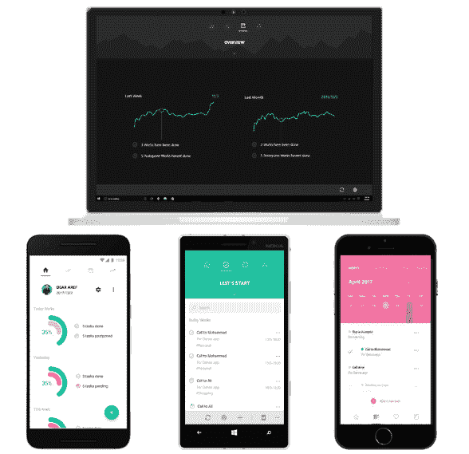
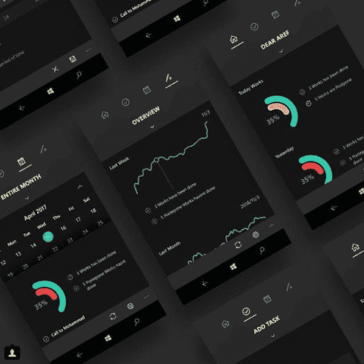

# 此应用程序到列表

> 原文：<https://dev.to/mohsens22/denna-to-do-list-app-45ap>

[T2】](https://www.microsoft.com/en-us/store/p/denna/9n9c2hwnzcft)

### 丹娜

Denna 是 Windows 10 设备的一个功能齐全且高效的待办事项列表。

 
[下载](https://www.microsoft.com/en-us/store/p/denna/9n9c2hwnzcft) [内部人士群](https://t.me/joinchat/EJ9gLURDAcbOxpoIGSdD8g) [GitHub 项目](https://github.com/MahStudio/Denna)

## 故事

Denna 的想法来自于我自己的需求。我一点也不守时，所以我需要一个工具来让我更在乎我所拥有的时间。因此，在 MahStudio 整个团队的帮助下，我们遇到了一个名为 *Project Plannel* 的项目，后来成为 **Denna** 。

丹纳是伊朗一座山的名字。关于*丹娜*的想法来自于我因为没有时间学习而没有通过考试的地方，那个错过的问题的答案是丹娜。

然后在团队和社区的帮助下，我们开发并发布了一个名为 **Denna** 的可爱工具。
Denna 的目的是帮助人们更关心他们所拥有的时间。因为时光飞逝！

容易进入和生产力是 Denna 的核心价值。

[T2】](https://res.cloudinary.com/practicaldev/image/fetch/s--mtMbfdLo--/c_limit%2Cf_auto%2Cfl_progressive%2Cq_auto%2Cw_880/https://user-images.githubusercontent.com/22152065/38919555-2566f7b2-4306-11e8-8a9c-95eb08eff28a.png)

### 这个在印刷机上

Denna 得到了用户和一些新闻网站的极大关注。你可以在下面阅读一些 Denna 的评论:

*   [Windows Central](https://www.windowscentral.com/denna-windows-10-do-list-improving-productivity)
*   [在 MSFT](https://www.onmsft.com/news/denna-is-a-well-rounded-universal-task-management-app-for-windows-10)
*   [关于 windows phone 的一切](http://allaboutwindowsphone.com/flow/item/22075_Denna_UWP.php)
*   [MS 超级用户](https://mspoweruser.com/developer-submission-denna-uwp-todo-list-app/)
*   [赢中央](https://thewincentral.com/denna-windows-phone-goes-free-myappfree-app-day/)
*   [Windows phone arena](http://www.windowsphonearea.com/3-new-windows-10-apps-march-2017/)

等等...

### 设计

该项目由资深建筑师兼设计师阿雷夫·M·艾哈迈迪和资深设计师穆罕默德·阿里杜斯特设计。
[T3】](https://res.cloudinary.com/practicaldev/image/fetch/s--uB-564P7--/c_limit%2Cf_auto%2Cfl_progressive%2Cq_auto%2Cw_880/https://user-images.githubusercontent.com/22152065/38919395-b3181f38-4305-11e8-8ead-161766d6148c.png)

[T2】](https://res.cloudinary.com/practicaldev/image/fetch/s--LHpGDaKe--/c_limit%2Cf_auto%2Cfl_progressive%2Cq_auto%2Cw_880/https://user-images.githubusercontent.com/22152065/38919478-f123c7b4-4305-11e8-9d7c-98d49b692b31.png)

你也可以在这里看到整个设计文件

## 投稿

Denna 寻找新的维护者和贡献者。我们下一次更新需要的关键功能是同步和设计中的功能。由于 Denna 是一个开源项目，所以欢迎任何形式的贡献。

> **注:**丹娜 V2 正在开发中。您可以通过给我们反馈来帮助我们。每晚的建设是[在丹纳内部电报聊天](https://t.me/joinchat/EJ9gLURDAcbOxpoIGSdD8g)

### 我们在 V1 有什么

*   管理您的任务
*   Cortana 互动
*   行动中心行动
*   管理你的爱好
*   能够推迟，编辑和删除您的任务
*   共享任务
*   备份任务
*   图形性能图表

### V2 有什么特色规划

*   离线-首次同步
*   新代码库
*   更好的性能
*   设计改进
*   支持 android 和 IOS
*   等等

你可以看到 V 2.0 里程碑[这里](https://github.com/MahStudio/Denna/milestone/1)

> 别忘了开始我们的项目。