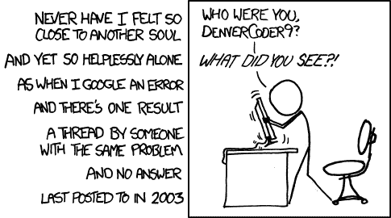
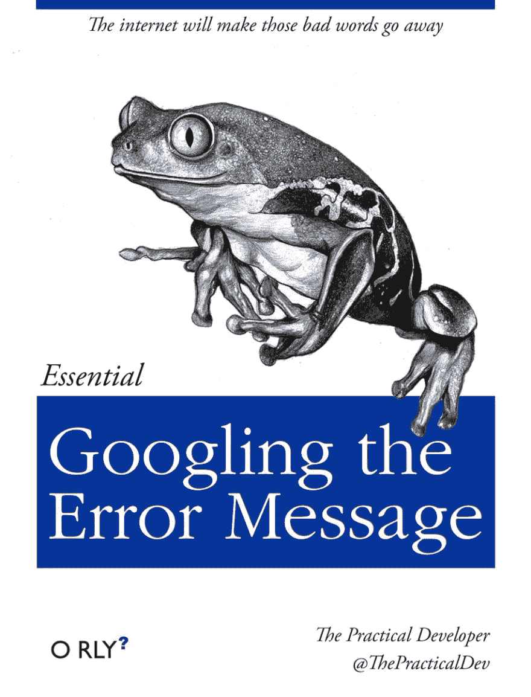

# DenverCoder9 和发展的未来

> 原文：<https://dev.to/devteam/denvercoder9-and-the-future-of-dev-44k3>

随着 DEV 越来越受欢迎，看到人们找到社区、鼓励和指导真的很令人兴奋。同样令人兴奋的是，人们正在寻找解决方案。DEV 是一种社会/功利的混合体。随着时间的推移，我们写的每一件事都会增加一个有用的知识库。

[T2】](https://res.cloudinary.com/practicaldev/image/fetch/s--ZXR6UWOh--/c_limit%2Cf_auto%2Cfl_progressive%2Cq_auto%2Cw_880/https://imgs.xkcd.com/comics/wisdom_of_the_ancients.png)

随着我们平台的成熟，我们将继续增加功能，扩大博客的形式因素。更多的上下文线索，指出一篇文章过时或半过时的能力，通过注释更有帮助的协作，更智能的书签，等等。

> 本哈尔彭🤗@ bendhalpern[dev . to](https://t.co/lWepprFqmW)所指链接随时间推移
> 
> 你见过这么漂亮的图吗？😍2018 年 11 月 09 日下午 14:02

有一些现有的资源专门用于构建这个“知识库”,但是我认为我们的方法——这种方法给予了个体创建者很多的代理和尊重——最终将对开发者生态系统非常有帮助。

我们 DEV 非常尊重软件开发是如何发生的。

> DEV 社区👩‍💻👨‍💻[@ thepracticaldev](https://dev.to/thepracticaldev)作为一个程序员，可能很难解释你一整天到底做了什么。2016 年 04 月 02 日 22 点 23 分

* * *

DEV 社区的 denvercoder 9 将是迄今为止最有帮助的 denvercoder 9。

快乐编码

*[当然是 XKCD 的漫画。](https://xkcd.com/979/)T3】*