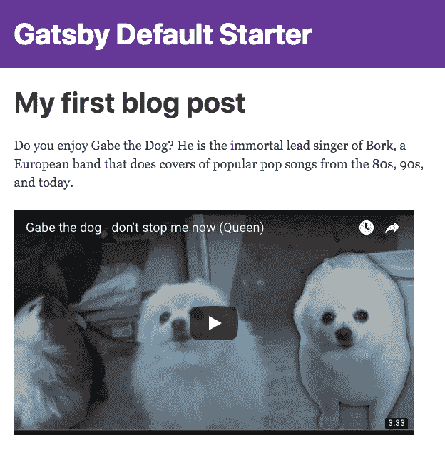

# 使用 GatsbyJS 和 Github 部署静态 React 博客

> 原文：<https://dev.to/whoisryosuke/deploy-a-static-react-blog-using-gatsbyjs-and-github-45gc>

我们将使用 [GatsbyJS](https://www.gatsbyjs.org) 为 [React](https://reactjs.org/) 创建一个静态站点生成器。GatsbyJS 获取您的内容，静态文件或来自 API 的外部数据，并生成用数据硬编码的页面。不是每次请求都调用 API 来获取最新的博客文章，而是将所有的文章预先缓存到单独的 HTML 文件中。这使得你可以通过 CDN 服务于你的整个网站。无需任何外部 API 调用，甚至无需服务器端渲染，网站加载速度快如闪电，而且是离线友好的。

今天我们将开发一个由 GatsbyJS 生成的静态博客，用 Markdown 编写，我们将部署在 Github 页面上来托管博客。

## 但是首先，盖茨比是什么？

GatsbyJS 是一个生成器，允许你编写 React 应用程序，并编译成静态资产(HTML + JS)。每个**页面**都是一个技术上的反应**组件**，当需要构建生产站点时，它会被转换成 HTML 和 JS 文件。如果你曾经使用过像 [Jekyll](https://jekyllrb.com/) 这样的生成器，它将像 *Liquid* 和 *Markdown* 这样的代码转换成 HTML，你会对这种概念很熟悉。

GatsbyJS 的特别之处在于它实现了 **[GraphQL](https://graphql.org/)** 。您的所有内容都通过开发端的 GraphQL 服务器提供。当需要编译静态资产时，GatsbyJS 会查询 GraphQL 服务器以获取数据，并将其插入到 HTML 文件中。

## 还有 JAMstack 到底是个什么鬼东西？

随着 JAMstack 革命的兴起，静态网站越来越受欢迎。JAM 代表 Javascript、API 和标记。这基本上意味着你的网站只包括:

*   Javascript (通常是像 React 这样的框架)
*   **API** (类似 RSS 提要，或 JSON API 端点)*可选*
*   **标记** (HTML，CSS，任何像图像这样的媒体)

我们的目标是创建一个只包含客户端 HTML + CSS + JS 的网站。不需要安装*节点*、 *Ruby* 、 *PHP* ，或者其他任何服务器端语言。这意味着我们甚至可以将它直接部署在 CDN 上，比如在 *AWS* 或[NetlifyT13】上的 *S3* 。](http://netlify.com)

> 当一个网站变得如此简单时，你几乎可以在任何地方部署它，因为大多数服务器支持 HTML、CSS 和 JS。

让你的网站静态化有很多好处，从**快速加载时间**到**降低服务器负载**，Gatsby 让*相当容易地推出你自己的网站。你可以在 GatsbyJS 官方网站上找到一个很棒的 [*【入门】*指南](https://www.gatsbyjs.org/tutorial/)，以及我们在本教程中传达的许多概念。如果你迷路了，我会在那里四处寻找，看看它是否有助于描绘一幅更清晰的画面。*

让我们构建和部署一个静态博客吧！

## 安装盖茨比

### 使用 CLI

您可以使用他们的 CLI 安装 Gatsby，建议:

`npm install --global gatsby-cli`

然后在项目所在的文件夹中运行此命令:

`gatsby new gatsby-blog`

### 经典的 Git 方式

或者您可以[从 Github](https://github.com/gatsbyjs/gatsby) 克隆 repo 并运行 NPM 安装:

`git clone https://github.com/gatsbyjs/gatsby.git gatsby-blog && cd gatsby-blog && npm install`

*注意，如果您选择不安装 CLI，那么在为开发或生产构建时，您将不得不运行 NPM 脚本，而不是`gatsby`命令。*

## 启动服务器

运行以下命令在本地启动您的 GatsbyJS 博客:

`gatsby develop`

这个命令运行构建过程，将代码编译成静态资产，并允许您访问位于 [http://localhost:8000/](http://localhost:8000/) 的 GatsbyJS 站点。为了使开发更容易，当你在运行时更新你的代码，它会重新编译——允许你刷新并立即看到变化。

## 创建内容

我们的博客将使用 Markdown 文件来包含和显示我们的帖子。我们将使用带有顶部标题的标准降价格式。在`src/blog/first-blog-post.md` :
中新建一个文件

```
---
title: My first blog post
date: "2018-04-20"
---

Do you enjoy Gabe the Dog? He is the immortal lead singer of Bork, a European band that does covers of popular pop songs from the 80s, 90s, and today.

<iframe width="560" height="315" src="https://www.youtube.com/embed/c--etqIJcow?ecver=1" frameborder="0" allowfullscreen></iframe> 
```

Enter fullscreen mode Exit fullscreen mode

现在我们有了一些内容，让我们在网站上展示它。

## 抓取我们的降价文件

GatsbyJS 使用组件来创建页面，所以我们可以为每篇博客文章创建新的 JS 文件。但那是杂乱且低效的。那我们该怎么做呢？Gatsby 提供了创建 *source* 插件的能力，这些插件从某些端点获取数据，比如 RSS、Medium 或 Github。我们将在与 Gatsby 项目相同的文件夹中创建 Markdown，因此我们将使用文件系统源代码插件来本地抓取文件。

我们还将安装一个 *transformer* 插件，它获取 GraphQL 数据并对其进行处理。在我们的特殊情况下，我们希望将数据和降价处理成 HTML。运行以下命令安装该插件:

`npm install --save gatsby-source-filesystem gatsby-transformer-remark`

并将以下 JSON 添加到您的配置中，以启用这两个插件。如果你仔细观察文件系统插件的`path`属性，我们从博客文件夹
加载我们的博客文章

```
plugins: [
    // react-helmet is included by default with gatsby
    `gatsby-plugin-react-helmet`,
    `gatsby-transformer-remark`,
    {
      resolve: `gatsby-source-filesystem`,
      options: {
        name: `src`,
        path: `${__dirname}/src/blog/`,
      },
    },
  ], 
```

Enter fullscreen mode Exit fullscreen mode

重启开发服务器以提交更改(按 CTRL + C 终止服务器，然后再次运行`gatsby develop`)。现在在您本地的 [GraphiQL 开发面板](http://localhost:8000/___graphql) :
上运行这个 GraphiQL 查询

```
{
 allFile {
  edges {
    node {
      name
      extension
    }
  }
 }
} 
```

Enter fullscreen mode Exit fullscreen mode

输入查询并按 CMD + Enter。您应该会在我们刚刚发布的博客文章的右侧看到一个 JSON 对象。

## 动态制作页面

我们可以很容易地开始在页面上查询这些数据，并显示我们的帖子。如果你把它粘贴到`src/pages/index.js`中，你会在你的控制台上看到你所有的文件打印出来:

```
import React from "react"

export default ({ data }) => {
  // displays an object of the query data in console
  // simply access what you need using a map function
  // data.allFile.edges.map()
  console.log(data)
  return <div>Hello world</div>
}

export const query = graphql`
  query MyFilesQuery {
    allFile {
      edges {
        node {
          relativePath
          prettySize
          extension
          birthTime(fromNow: true)
        }
      }
    }
  }
` 
```

Enter fullscreen mode Exit fullscreen mode

这就构成了一个很棒的首页，上面列出了我们所有的帖子，但是我们最终还是陷入了和以前一样的困境。如果我们希望每篇博客文章都有单独的页面，我们必须创建新的组件来单独查询每个页面。这就是 GatsbyJS API 发挥作用的地方。

GatsbyJS 能够接受 GraphQL 查询，并基于模板为每个对象创建页面。对于我们创建的每个 Markdown 文件，当我们建立 GatsbyJS 网站时，它将通过一个模板来创建一个页面。我们最终为每个页面生成 HTML 文件，并将降价解析成可读文本。

将此粘贴到您的`gatsby-node.js`文件中。

```
const path = require(`path`);
const { createFilePath } = require(`gatsby-source-filesystem`);

exports.onCreateNode = ({ node, getNode, boundActionCreators }) => {
    const { createNodeField } = boundActionCreators
    if (node.internal.type === `MarkdownRemark`) {
        const slug = createFilePath({ node, getNode, basePath: `pages` })
        createNodeField({
            node,
            name: `slug`,
            value: slug,
        })
    }
};

exports.createPages = ({ graphql, boundActionCreators }) => {
    const { createPage } = boundActionCreators
    return new Promise((resolve, reject) => {
        graphql(`
      {
        allMarkdownRemark {
          edges {
            node {
              fields {
                slug
              }
            }
          }
        }
      }
    `).then(result => {
                result.data.allMarkdownRemark.edges.forEach(({ node }) => {
                    createPage({
                        path: node.fields.slug,
                        component: path.resolve(`./src/templates/blog-post.js`),
                        context: {
                            // Data passed to context is available in page queries as GraphQL variables.
                            slug: node.fields.slug,
                        },
                    })
                })
                resolve()
            })
    })
}; 
```

Enter fullscreen mode Exit fullscreen mode

首先，我们将基于我们的 Markdown 文件名创建 slugs，并将它们添加到 GraphQL 查询结果中。然后，我们将使用`createPages` API 基于针对降价帖子的 GraphQL 查询创建新页面。然后，我们将使用`createPage`函数，基于新的文件路径和将充当模板的组件来实际生成页面。

当 Gatsby 运行构建过程时，它也会运行这个脚本，这将触发页面的创建。

这里没有太多的解释，因为这只是非常特定于 API 的代码。它简单到不言自明，任何不清楚的地方都可能是来自 API 的固执己见的决定。

## 博客模板

现在我们的博客文章已经准备好被转换成静态页面，让我们实际创建我们在上面提到的模板`./src/templates/blog-post.js`。在那里创建一个新文件，并将它粘贴到:

```
import React from "react";

export default ({ data }) => {
    const post = data.markdownRemark;
    return (
        <div>
            <h1>{post.frontmatter.title}</h1>
            <div dangerouslySetInnerHTML={{ __html: post.html }} />
        </div>
    );
};

export const query = graphql`
  query BlogPostQuery($slug: String!) {
    markdownRemark(fields: { slug: { eq: $slug } }) {
      html
      frontmatter {
        title
      }
    }
  }
`; 
```

Enter fullscreen mode Exit fullscreen mode

## 给我看看帖子！

我们已经将博客帖子作为 Markdown 准备好进行转换，我们已经有了 React 模板，剩下的唯一事情就是链接到帖子。

打开你的`index.js`文件，粘贴以下内容:

```
import React from "react";
import Link from "gatsby-link";

export default ({ data }) => {
  console.log(data);
  return (
    <div>
      <h1 style={{ display: 'inline-block', borderBottom: '1px solid' }}>
        Amazing Pandas Eating Things
      </h1>
      <h4>{data.allMarkdownRemark.totalCount} Posts</h4>
      {data.allMarkdownRemark.edges.map(({ node }) => (
        <div key={node.id}>
          <Link
            to={node.fields.slug}
            css={{ textDecoration: `none`, color: `inherit` }}
          >
            <h3 style={{ marginBottom: '4px' }}>
              {node.frontmatter.title}{" "}
              <span style={{ color: "#BBB" }}>— {node.frontmatter.date}</span>
            </h3>
          </Link>
            <p>{node.excerpt}</p>
        </div>
          ))}
    </div>
      );
      };

      export const query = graphql`
  query IndexQuery {
        allMarkdownRemark(sort: {fields: [frontmatter___date], order: DESC}) {
        totalCount
      edges {
        node {
      id
          frontmatter {
        title
            date(formatString: "DD MMMM, YYYY")
    }
          fields {
        slug
      }
      excerpt
    }
  }
}
}
`; 
```

Enter fullscreen mode Exit fullscreen mode

我们使用 MarkdownRemark 端点进行查询，并获取我们最新博客帖子的标题、slugs 和摘录。然后我们遍历数据来显示数据，同时使用`<Link>`组件直接链接到博客文章(使用 slug)。

> 不要忘记，您可以在 GraphiQL dev 面板中测试查询，以确保您拥有正确的属性。

如果您在此时重启您的 dev 服务器，您应该会看到您创建的 Markdown 文件的列表。如果你点击它们，它们会把你带到另一个有完整博文的页面。

**祝贺你！**你已经创建了你的第一个静态博客。你可以在这里停下来，运行`gatsby build`让你的博客的生产就绪版本在`public`文件夹中可用。直接上传到你的 FTP 或网络主机上，你就可以开始了。

[T2】](https://res.cloudinary.com/practicaldev/image/fetch/s--xIpPLeDd--/c_limit%2Cf_auto%2Cfl_progressive%2Cq_auto%2Cw_880/http://stayregular.net/content/2-blog/20180416-deploy-a-static-react-blog-using-gatsbyjs-and-github/gatsby-first-blog-gabe-the-dog.png)

但是为什么要止步于此呢？jam stack 的原则之一是使用 **Git** 进行版本控制。这允许你，或者你团队中的任何一个开发人员，轻松地克隆网站的存储库，并创建整个网站的精确副本。它还允许您将新的更改快速推送到服务器，而不是通过 FTP 单独上传文件。

## 让我们开始吧

如果你的电脑上还没有安装 Git，去官方网站下载吧。然后打开终端，`cd`到您的项目的根目录，并运行以下命令:

`git init`

这将在您的文件夹中创建一个新的 Git 存储库。现在让我们提交我们对新存储库所做的所有更改:

`git add -A && git commit -m "Your Message"`

这将获取文件夹中的所有文件，并将它们添加到 Git repo 中。当您进行更改时，您将能够在每次提交之前跟踪先前版本之间的差异(`git diff`)。您留下的消息通常暗示了对代码进行了什么样的更改。在这种情况下，类似“初始提交”或“1.0”是合适的。

## 连接 Github

与 Github 连接可以让你为希望访问网站源代码的开发者提供最高的可访问性，并利用 Github 的免费托管功能([https://pages.github.com/](https://pages.github.com/))。如果你还没有一个 Github 账户，你可以注册一个，创建一个公共 repo，并通过 Git 命令将项目文件推(或上传)到 Github。

### 在 Github 上注册

1.  在 [Github](http://github.com) 上创建一个新账户
2.  登录您的帐户。
3.  单击顶部菜单中的加号，然后从下拉菜单中单击“新建存储库”。
4.  给你的回购命名任何你喜欢的名字，然后点击绿色的“创建仓库”按钮。

### 用 Github 同步你的回购

为了一键同步到 Github，我们将安装`gh-pages`。这是一个 Github Pages 包，将更改推送到 Github 并更新页面。运行以下命令来安装该软件包:

`npm install gh-pages --save-dev`

您还需要用新的脚本修改`package.json`。这个脚本运行`gatsby build`进程，然后运行`gh-pages`命令部署到 Github。将下面一行添加到脚本部分:

```
{
        scripts: {
            // ...you'll see build, develop, format, etc above this....
            "deploy": "gatsby build --prefix-paths && gh-pages -d public",
        }
    } 
```

Enter fullscreen mode Exit fullscreen mode

由于 Github Pages 将博客放在子目录中(例如`yourname.github.io/this-subdirectory/`)，我们必须在配置中添加一个路径前缀`gatsby-config.js`，让 GatsbyJS 知道它不在根目录中:

```
{
  siteMetadata: {
    title: `Your site Name`,
  },
  pathPrefix: "/your-repo-name",
} 
```

Enter fullscreen mode Exit fullscreen mode

### 部署！

转到 Github 上的新 repo，点击 Clone 按钮，复制 URL(结尾为。git)。然后运行以下命令，将“远程”存储库添加到您的本地 git 存储库:

`git remote add origin http://github.com/username/repo-name.git`

现在我们可以建立网站并将其推送到 Github。键入以下命令，在提示时输入您的 Github 密码，然后获利！：

`npm run deploy`

您的博客的`public`文件夹将被上传到您的 repo 的`gh-pages`分支。如果你点击标有**分支:主**的下拉菜单，你应该会看到 gh-pages 分支。

### 浏览您的博客

回到你在 Github 上的存储库，看看你是否成功地推送(或上传)了你的文件。如果成功了，请转到项目设置页面。在这里，您需要确保 Github Pages 是启用的，并且它被设置到了`gh-pages`分支。

你应该可以通过去[http://yourusername.github.io/repo-name/](http://yourusername.github.io/repo-name/)访问这个博客。

## 也许不是 Wordpress 5 分钟安装

在安装`npm`软件包所花费的时间和你浪费在`git`上的时间之间，这可能不是最快的博客创建。尽管你不得不承认，在相当短的时间内，我们能够创建一个静态的博客生态系统，可以即时部署。看到 GatsbyJS 的潜力，以及与 Wordpress 或 Drupal 等标准 CMS 平台相比，你可以创造出不同的体验，这是令人难以置信的。

如果你曾经考虑过进入渐进式 web 应用程序(PWA ),你想尝试静态，或者你只是对迁移出 Wordpress 感兴趣——我希望这篇指南能帮助你发现主流博客体验的替代品。

## 潜力无穷

这是我们将撰写的以盖茨比为主题的系列文章的第一部分。我们刚刚在这里尝试了一下，这个框架还有大量的插件和潜力有待我们去探索。我们将着眼于创建探索或推动 JAMstack 局限性的项目，从使用 Behance API 的投资组合网站，到使用 Stripe 的静态电子商务商店，再到使用自动和原子构建在 CDN 上构建真正的 JAM 应用程序。

请关注 [#GatsbyJS](http://stayregular.net/blog/tag:gatsbyjs) 标签，看看我们的下一篇文章！

在这里 找到 [**样板间，在这里**](https://whoisryosuke.github.io/gatsby-blog-tutorial/) 找到 [**最终样板间回购。**](https://github.com/whoisryosuke/gatsby-blog-tutorial)

奥斯卡保持常规

* * *

**继续阅读:**

*   [Git 指南——启动一个新的 Git 存储库](http://kbroman.org/github_tutorial/pages/init.html)
*   [JAMstack.org](https://jamstack.org/best-practices/)
*   [盖茨比](https://www.gatsbyjs.org)
*   [GatsbyJS 教程](https://www.gatsbyjs.org/tutorial/)
*   [GatsbyJS 插件](https://www.gatsbyjs.org/packages/)
*   【GatsbyJS 如何使用 Github 页面
*   [盖茨比源文件系统](https://www.gatsbyjs.org/packages/gatsby-source-filesystem/?=filesy)
*   [盖茨比-变形金刚-备注](https://www.gatsbyjs.org/packages/gatsby-transformer-remark/?=remark)