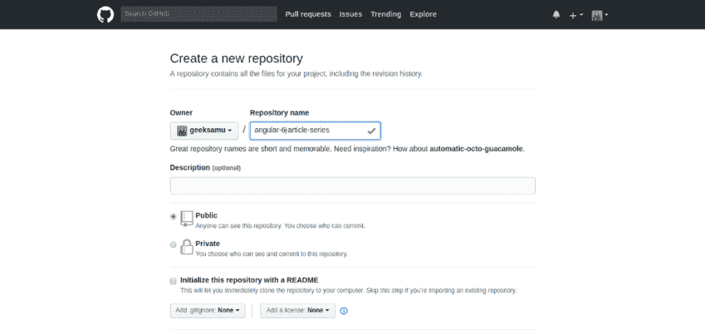
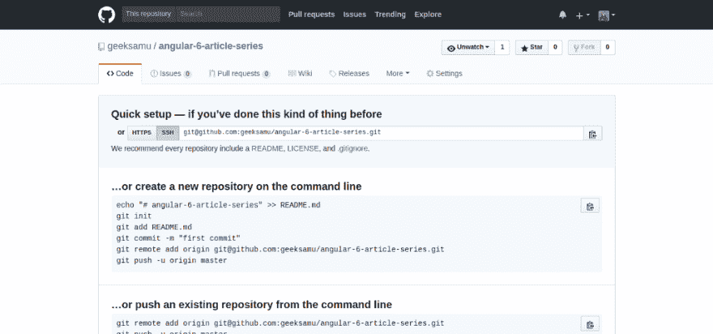
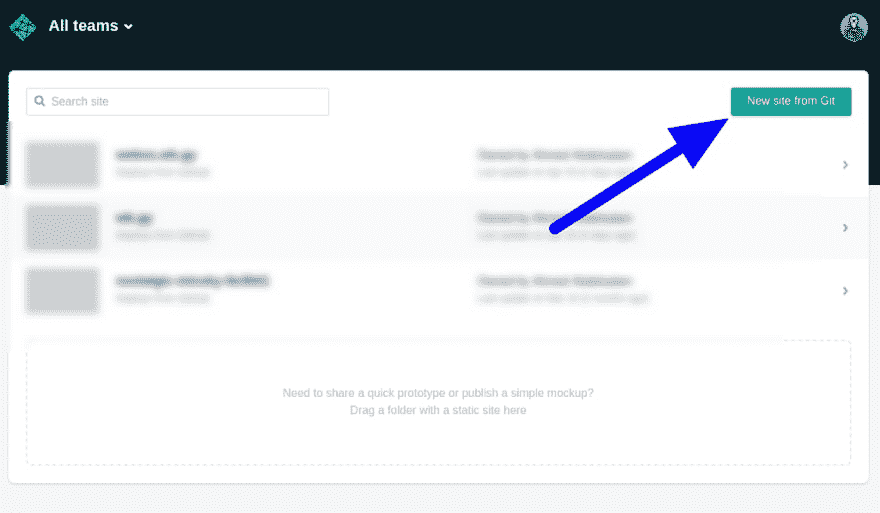
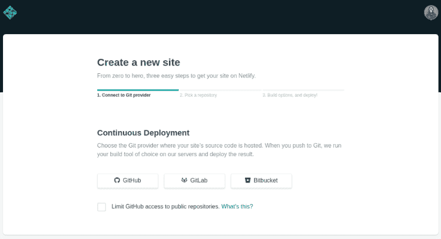
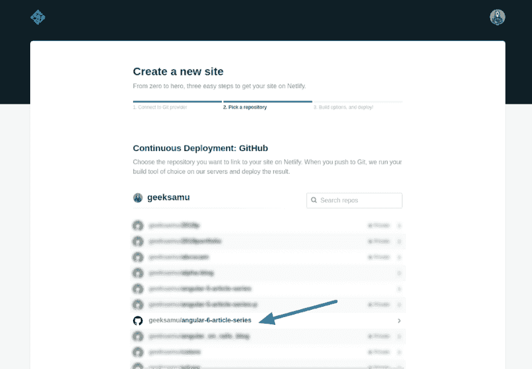
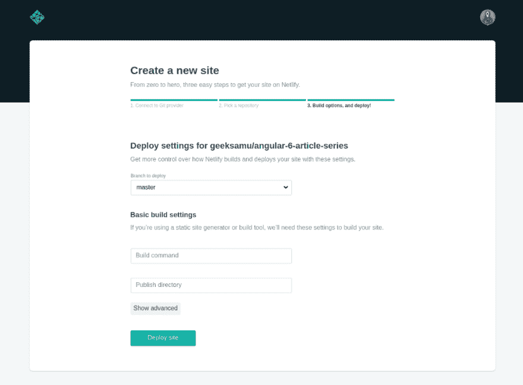
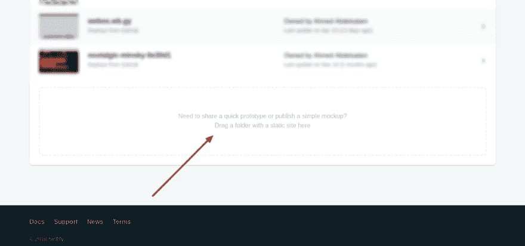

# 将 Angular 6 应用程序部署到 Netlify

> 原文：<https://dev.to/geeksamu/deploy-angular-6-application-to-netlify-48g2>

[](https://res.cloudinary.com/practicaldev/image/fetch/s--xlfbTJ3i--/c_limit%2Cf_auto%2Cfl_progressive%2Cq_auto%2Cw_880/https://cdn-images-1.medium.com/max/1024/1%2AByAhY7BtpARVPzkgM6yV1Q.png) 

<figcaption>**部署 Angular 6 应用到 Netlify**</figcaption>

这是关于 JavaScript 框架 Angular 6 的 n 部分[系列](https://dev.to/geeksamu/angular-6-article-series-2n26-temp-slug-5101921)的第四部分。

在这一部分，我们将回顾如何将 Angular 6 应用程序部署到 Netlify。

这并不是一个完整的指南，而是一个让你开始运行的基础概述，这样你就可以了解在 Netlify 上的部署，以及如何在其上部署你的 Angular 6 应用程序。

我将部署我们在前 3 篇文章中创建的应用程序，因此您必须先检查它们！

> *在我们开始之前，英语不是我的第一语言，所以如果你看到一些奇怪的东西，请冷静地在评论区指出来，或者* [*给我发邮件*](mailto:i@wb.gy) *，没必要使用暴力:)*

### 文章系列

1.  [棱角分明 6 篇系列文章](https://dev.to/geeksamu/angular-6-article-series-2n26-temp-slug-5101921)
2.  [建筑角 6 应用](https://dev.to/geeksamu/building-angular-6-application-bf9-temp-slug-3458718)
3.  [使用带角 6 的角形材料](https://dev.to/geeksamu/using-angular-material-with-angular-6-lob-temp-slug-9844819)
4.  将 Angular 6 应用程序部署到 Netlify ( **你在这里**)
5.  创建角度为 6 的 PWA(**很快**
6.  动态主题在棱角分明的 6 个素材中(**即将**)
7.  棱角分明 6 与 GSAP ( **不久**)
8.  有角 6 带火基(**即将**)

### 将我们的应用程序部署到 github

首先，我们需要将应用程序部署到我们的 github 帐户。

你必须从[这里](https://github.com/new)创建新的存储库

[T2】](https://res.cloudinary.com/practicaldev/image/fetch/s--4QY8v2JQ--/c_limit%2Cf_auto%2Cfl_progressive%2Cq_auto%2Cw_880/https://cdn-images-1.medium.com/max/1024/0%2AiTC5Dl8vgTIubNWR.png)

创建存储库后，您应该会看到这样的页面，但是存储库的名称会有所不同

[T2】](https://res.cloudinary.com/practicaldev/image/fetch/s--CURYm4EF--/c_limit%2Cf_auto%2Cfl_progressive%2Cq_auto%2Cw_880/https://cdn-images-1.medium.com/max/1024/0%2AGAAQJ2B3uWbGn-BZ.png)

现在打开你的终端，将你当前的目录切换到我们的应用程序目录。

并运行下一行代码，但你必须将回购名称改为你的回购名称。

添加我们所有的变化:

```
git add -A 
```

然后我们必须提交这些更改:

```
git commit -m "First commit before deployment" 
```

您可以根据需要更改提交标题。

接下来我们要运行:

==但是请不要忘记更改 repo-name 和用户名= =

```
git remote add origin git@github.com:your-username-here/your-repo-name-here.git 
```

~首先将前面代码中的-username-here 和-repo-name-here 更改为您的。

现在让我们来推动我们的变革:

```
git push -u origin master 
```

### Netlify

Netlify 是我最近见过的最美的东西之一。实际上，我希望我以前用过它。它提供了许多惊人的功能。

我在上面部署了自己的[投资组合](https://wb.gy)。你可以从这里查看 [wb.gy](https://wb.gy) 。

它为**前端**项目提供了多种选择。我无法在这篇文章中一一列举，所以你必须自己去核实。

### 部署到网络生活

让我们回到我们的部署，你必须在 [Netlify](https://app.netlify.com/) 上创建一个帐户，首先使用【Github、Gitlab、Bitbucket 或 Email】选择你想要的。

之后你会被重定向到创建你的站点

[T2】](https://res.cloudinary.com/practicaldev/image/fetch/s--KhLUnq0i--/c_limit%2Cf_auto%2Cfl_progressive%2Cq_auto%2Cw_880/https://cdn-images-1.medium.com/max/1024/0%2AzazFtXyv83YSkKrW.png)

点击 Git 中的新站点

[T2】](https://res.cloudinary.com/practicaldev/image/fetch/s--_83LSwtg--/c_limit%2Cf_auto%2Cfl_progressive%2Cq_auto%2Cw_880/https://cdn-images-1.medium.com/max/1024/0%2AsBifB82JSbM2qUrG.png)

现在选择 Github，如果你使用另一个 git 系统，选择它。

接下来，选择你的回购。我将部署名为 angular-6-article-series 的 repo

[T2】](https://res.cloudinary.com/practicaldev/image/fetch/s--_HQzptbD--/c_limit%2Cf_auto%2Cfl_progressive%2Cq_auto%2Cw_880/https://cdn-images-1.medium.com/max/1024/0%2AXWiOncSYjX9EGZCl.png)

接下来，我们必须为我们的部署设置一些设置。

1.  对于分支选择主，如果你使用不同的分支选择它。
2.  对于构建命令类型

```
ng build --prod 
```

这个命令我将在后面的系列文章中解释

对于发布目录，键入:dist/your-application-name

不要忘记用您的应用名称替换您的应用名称，这里我的应用名称是 angular-6 系列

在 angular 以前的版本中，它只是“dist”目录，但现在 CLI 将使用您的应用程序名称

在 dist 中创建新文件夹。确切地说，它是 Angular 在您运行 ng build 时创建的目录，因此它是我们的应用程序的目录。

[T2】](https://res.cloudinary.com/practicaldev/image/fetch/s--_pFTC71n--/c_limit%2Cf_auto%2Cfl_progressive%2Cq_auto%2Cw_880/https://cdn-images-1.medium.com/max/1024/0%2AUYyvLr7AdS0iT_nS.png)

然后单击 Deploy site

部署我们的站点并给出 URL 需要几分钟时间。

> 我解决了下一个问题！

这应该可以工作，您的应用程序将会成功部署，但是 mines 不能工作。不知道为什么！我没有看到错误。没问题。因此，如果您的应用程序提供 404 页面，我尝试使用任何方法

来部署它。您只能将最终的 dist 文件夹部署到 Nelify。

刚刚运行:

```
ng build --prod 
```

它将创建 dist 文件夹。只需将它拖放到“网络生活”页面的这一部分

[T2】](https://res.cloudinary.com/practicaldev/image/fetch/s--w_E_iotM--/c_limit%2Cf_auto%2Cfl_progressive%2Cq_auto%2Cw_880/https://cdn-images-1.medium.com/max/1024/0%2AwwzeBi2SWTSIVFvM.png)

这种解决方案可行，但不是最好的。我们将无法使用 Netlify 的持续部署

这是我的部署网址[https://angular6-series.netlify.com](https://angular6-series.netlify.com/)

我知道在这篇文章中用图像来解释可能很傻，但是我真的希望它能被理解，所以接下来的文章会更简单，任何没有多少经验的人都能够构建最终的应用程序。

下一步:创建角度为 6 的 PWA(**很快**)

### 如果你喜欢这篇文章，点击下面的按钮👏。查看我写的其他文章[在这里](https://blog.wb.gy)。如果你觉得这个故事有用。因为我不使用中型合作伙伴计划。给我买杯咖啡:)

给艾哈迈德·阿卜杜勒萨拉姆买杯咖啡。ko-fi.com/geeksamu

如果你有任何问题，请在下面评论，或者你可以在 Twitter 上找到我

[艾哈迈德·⚯͛(@ geeks amu)|推特](https://twitter.com/geeksamu)