# 使用带有自动 https 证书的 Jenkins CD 和 minio 将静态前端应用程序部署到 kubernetes 集群

> 原文：<https://dev.to/pongsatt/deploy-static-front-end-application-to-kubernetes-cluster-using-jenkins-cd-and-minio-with-automatic-https-cert-44gk>

在我们的虚拟机上设置 kubernetes 集群之后，我们设置 nginx ingress 自动使用 letsencrypt 申请证书。本帖我们将使用 Jenkins CD 和 minio 部署静态 web 应用程序。

借助 Jenkins CD，我们可以定义我们的构建和部署管道，借助 kubernetes 和 docker 的强大功能，我们的应用程序基础架构也可以与源代码一起定义。

有了 minio，一个文件存储服务器，我们可以像使用 AWS S3 一样，在我们自己的基础设施内，将静态网站托管为一个文件夹。

然后，通过我们在[前一篇文章](https://dev.to/pongsatt/set-up-nginx-ingress-with-letsencrypt-certificate-on-vms-or-bare-metal-kubernetes-cluster-j25)中设置的 nginx 入口，我们可以将网站 URL 指向 minio 文件服务。

**注:**

> 这个帖子假设你关注这个[系列](https://dev.to/pongsatt/setup-your-own-kubernetes-cluster-on-vms-5ln)的帖子
> 如果你关注这个[系列](https://dev.to/pongsatt/setup-your-own-kubernetes-cluster-on-vms-5ln)，你需要在主节点上才能关注这个帖子

## 先决条件:

*   运行中的 kubernetes 集群
*   头盔已安装
*   具有管道支持的 Jenkins 服务器

# 设置 minio

**注:**

> minio 需要访问密钥和密码。请用您自己的值替换“myaccesskey”和“mysecret”

### 1。使用 helm 安装 minio

这次运行将在“minio”名称空间
中安装 minio 服务器

```
helm install --name minio --namespace minio stable/minio \
--set accessKey=myaccesskey,secretKey=mysecret \
--set service.type=NodePort 
```

### 2。安装 minio web 客户端

使用以下命令安装 mc cli(需要 root 密码)。

```
wget https://dl.minio.io/client/mc/release/linux-amd64/mc && chmod +x mc && sudo mv mc /usr/local/bin/mc 
```

### 3。配置指向服务器的 minio

运行`kubectl get service -n minio`找到节点端口。

[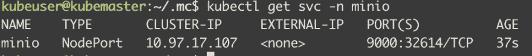T2】](https://res.cloudinary.com/practicaldev/image/fetch/s--Iu7W0V_I--/c_limit%2Cf_auto%2Cfl_progressive%2Cq_auto%2Cw_880/https://thepracticaldev.s3.amazonaws.com/i/4bap9h7cq3epurxujqwh.png)

运行命令以添加 minio 配置文件夹。

**注:**

> 替换为您的真实主节点 IP 地址
> 替换为上述步骤中的真实节点端口
> 用您自己的值替换“我的访问密钥”和“我的秘密”

```
mc config host add myminio http://<Master Node IP>:<NodePort> myaccesskey mysecret 
```

结果应该是这样的。

[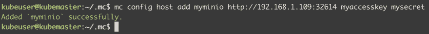T2】](https://res.cloudinary.com/practicaldev/image/fetch/s--9G7RZJbc--/c_limit%2Cf_auto%2Cfl_progressive%2Cq_auto%2Cw_880/https://thepracticaldev.s3.amazonaws.com/i/yq1znp7iiyekx5e7ebm5.png)

### 4。创建 minio 文件夹来存放静态文件

在本例中，我们将创建一个名为“public”的存储桶来托管所有静态文件夹。

```
mc mb -p myminio/public
mc policy download myminio/public 
```

运行`mc ls myminio`，你应该会看到一个空桶。

[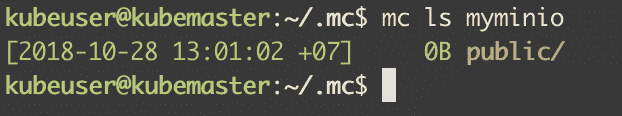T2】](https://res.cloudinary.com/practicaldev/image/fetch/s--To4dUotC--/c_limit%2Cf_auto%2Cfl_progressive%2Cq_auto%2Cw_880/https://thepracticaldev.s3.amazonaws.com/i/xwvg7gvps8dah6vwrodh.png)

# 设置 DNS 记录

为了申请 https 域证书，您需要将您的 DNS 记录“simpleapp.yourdomain.com”设置为您的入口服务 IP。你可以从[上一篇](https://dev.to/pongsatt/set-up-nginx-ingress-with-letsencrypt-certificate-on-vms-or-bare-metal-kubernetes-cluster-j25)看到我的例子。

# 建立一个静态网站

我们将使用 react 应用程序作为我们的静态网站示例。让我们建造它。

### 1。初始化应用程序

注意:您需要在您的机器上安装 nodejs。

```
npx create-react-app simpleapp
cd simpleapp
npm start 
```

打开“ [http://localhost:3000](http://localhost:3000) ”应该会看到。

[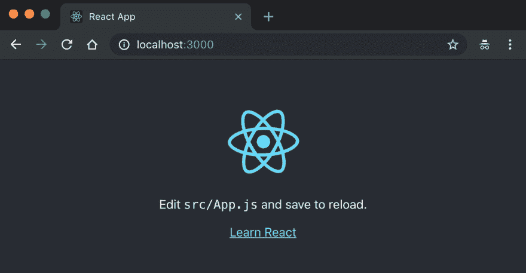T2】](https://res.cloudinary.com/practicaldev/image/fetch/s--puKkstgX--/c_limit%2Cf_auto%2Cfl_progressive%2Cq_auto%2Cw_880/https://thepracticaldev.s3.amazonaws.com/i/9ri3pp9z2kk5wyd41ywp.png)

### 2。添加 kubernetes 入口配置

在根文件夹的“k8s”文件夹下添加“ingress.yml”。

[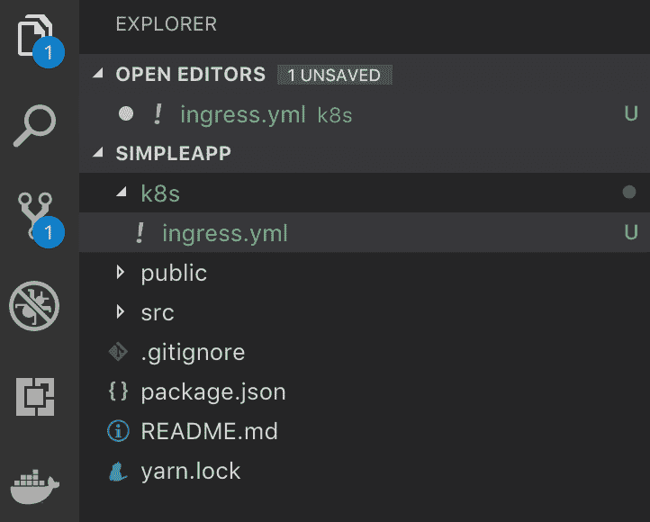T2】](https://res.cloudinary.com/practicaldev/image/fetch/s--I4AiODpm--/c_limit%2Cf_auto%2Cfl_progressive%2Cq_auto%2Cw_880/https://thepracticaldev.s3.amazonaws.com/i/yjwrfn0ladvwtlz83vfy.png)

内容:

**注:**

> 将“simpleapp.yourdomain.com”替换为真实域
> 本示例使用“dns01”协议获取 letsencrypt 证书。您可以通过注释/取消注释
> 将其更改为“http01”

```
apiVersion: extensions/v1beta1
kind: Ingress
metadata:
  name: simpleapp-ingress
  annotations:
    kubernetes.io/ingress.class: "nginx"

    # use http01 protocol. uncomment line below to use http01
    # kubernetes.io/tls-acme: "true"

    # use dns01 protocol. comment 2 lines below if use http01
    certmanager.k8s.io/acme-challenge-type: "dns01"
    certmanager.k8s.io/acme-dns01-provider: "aws-route53"

    nginx.ingress.kubernetes.io/rewrite-target: "/public/simpleapp"
    nginx.ingress.kubernetes.io/configuration-snippet: |
      rewrite ^/?$ /public/simpleapp/index.html break;
spec:
  tls:
  - hosts:
    - simpleapp.yourdomain.com
    secretName: simpleapp-tls
  rules:
  # The host must be identical to the above one
  - host: simpleapp.yourdomain.com
    http:
      paths:
      - path: /
        backend:
          # The name of your service
          serviceName: minio
          servicePort: 9000 
```

该配置将“simpleapp.yourdomain.com”指向 minio 上“public”bucket 下的一个文件夹，指向一个名为“simpleapp”的文件夹。还支持从“/”重定向到“/index.html”

### 3。添加 Jenkinsfile 管道

在根文件夹中创建文件名“Jenkinsfile”。

[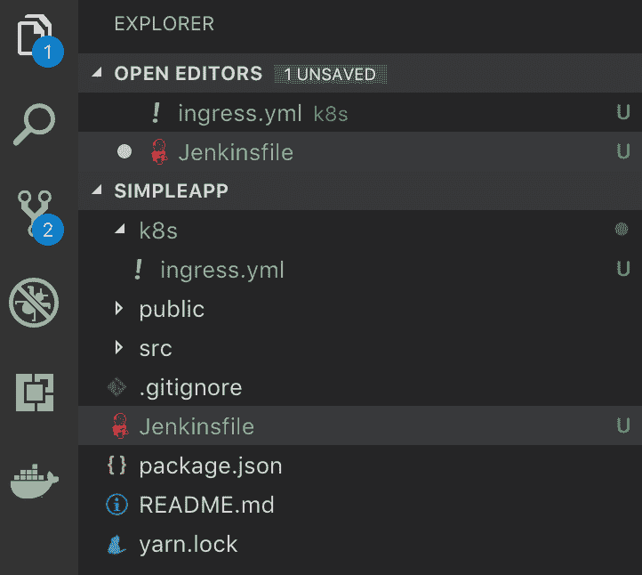T2】](https://res.cloudinary.com/practicaldev/image/fetch/s--pKKyaR6L--/c_limit%2Cf_auto%2Cfl_progressive%2Cq_auto%2Cw_880/https://thepracticaldev.s3.amazonaws.com/i/bzgr920qqiw7b88oetnu.png)

内容:

```
pipeline {
  environment {
    ENV = "minio"
    APP = "simpleapp"
  }
  agent { label 'docker' }

  stages {
    stage('build') {
      steps {
        withDockerContainer('node:8.4.0-alpine') { 
            sh 'yarn install'
            sh 'yarn build'
        }
      }
    }

    stage('publish to minio') {
      steps {
        sh "mc cp -r build/ myminio/public/${APP}"
      }
    }

    stage('deploy ingress to kubernetes') {
        steps {
            sh("kubectl --namespace=${ENV} apply -f k8s/ingress.yml")
        }
    }

  }

} 
```

在配置中，我有一个带有标签“docker”的 Jenkins 构建代理，它包含“kubernetes”和“MC”CLI。

有 3 个阶段。

1.  构建:将项目反应到“构建”文件夹
2.  发布到 minio:将文件夹“build”复制到 minio“public/simple app”
3.  将 ingress 部署到 kubernetes:将“k8s/ingress.yml”部署到集群

### 4。发布到 git repo

您可以将您的项目发布到任何 git 存储库。

# 准备詹金斯环境

在本例中，您的 jenkins 需要支持以下 cli。

*   kubectl:用”。指向我们的 kubernetes 服务器的配置文件夹
*   司仪:用”。mc”配置文件夹，它指向我们的 minio 实例

**注:**

> 安装这些工具将取决于您的 jenkins 环境

### 1。忽必烈配置

复制“~/”就可以了。kube/config "从主节点到"/home/jenkins/。kube/config”。

### 2。mc 配置

复制“~/”就可以了。mc/config.json "从主节点到"/home/jenkins/。mc/config.json "

如果所有配置都正常，您应该能够在 Jenkins 代理中运行下面的命令。

[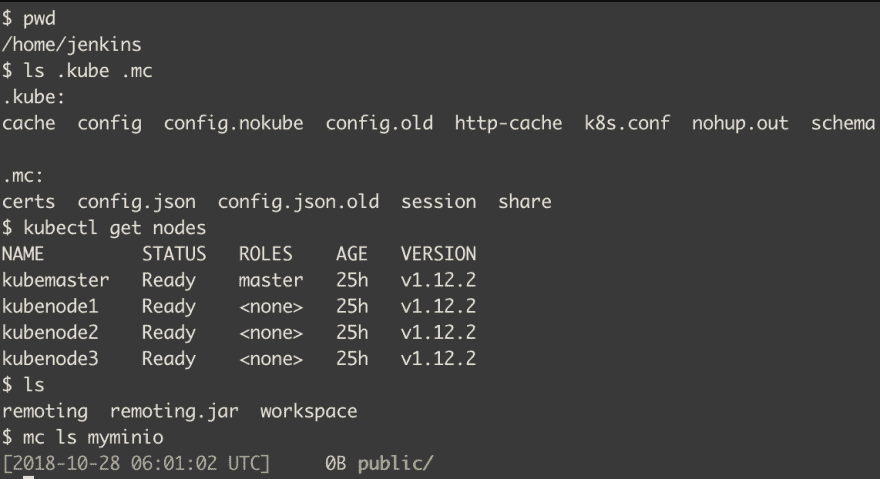T2】](https://res.cloudinary.com/practicaldev/image/fetch/s--n6fTea8Q--/c_limit%2Cf_auto%2Cfl_progressive%2Cq_auto%2Cw_880/https://thepracticaldev.s3.amazonaws.com/i/qpbx9zegw7nvwhn3a6zz.png)

# 建立詹金斯管道

在本例中，我们将创建指向存储库中 Jenkinsfile 的 Jenkins 管道。

### 1。创建詹金斯管道项目

创建“simpleapp”项目。

[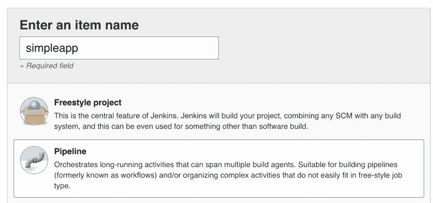T2】](https://res.cloudinary.com/practicaldev/image/fetch/s--aa3Hts7O--/c_limit%2Cf_auto%2Cfl_progressive%2Cq_auto%2Cw_880/https://thepracticaldev.s3.amazonaws.com/i/fhj5l8f5yqc2z89wgq5m.png)

输入您的 git repo url 和凭据。

[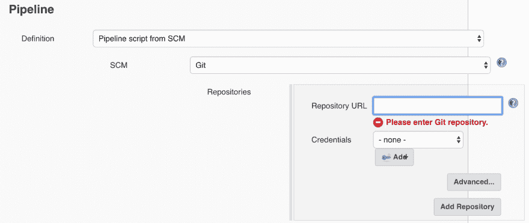T2】](https://res.cloudinary.com/practicaldev/image/fetch/s--9exopFf1--/c_limit%2Cf_auto%2Cfl_progressive%2Cq_auto%2Cw_880/https://thepracticaldev.s3.amazonaws.com/i/cnh2c1qzayuknhz126yu.png)

### 2。构建管道

通常，管道构建应该在源代码更新时自动触发。这个例子将使用手动触发。

构建结果。

[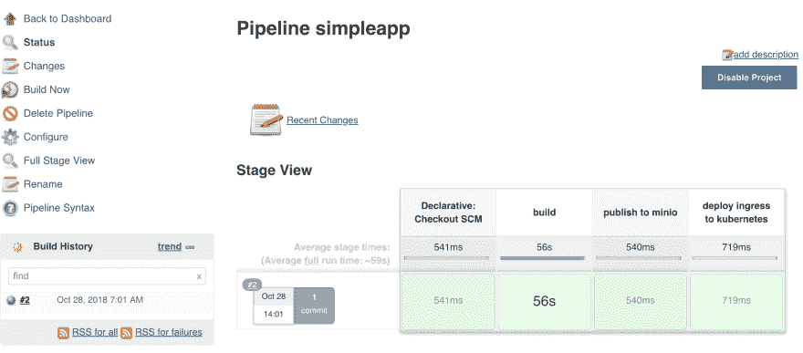T2】](https://res.cloudinary.com/practicaldev/image/fetch/s--Sq9oMp5S--/c_limit%2Cf_auto%2Cfl_progressive%2Cq_auto%2Cw_880/https://thepracticaldev.s3.amazonaws.com/i/0hzksadfi1pvceagfdwz.png)

# 测试您的应用程序

等到`kubectl get secret -n minio`返回秘密名“simpleapp-tls”。

[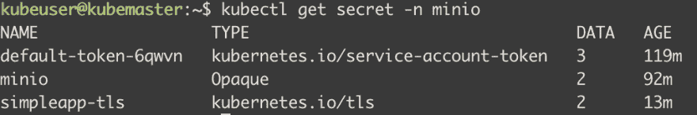T2】](https://res.cloudinary.com/practicaldev/image/fetch/s--A7bWuOBv--/c_limit%2Cf_auto%2Cfl_progressive%2Cq_auto%2Cw_880/https://thepracticaldev.s3.amazonaws.com/i/qrqxmg0ca9d0wkn5ts71.png)

如果一切正常，你应该可以打开网址"[https://simpleapp.yourdomain.com](https://simpleapp.yourdomain.com)"并看到如下结果。

[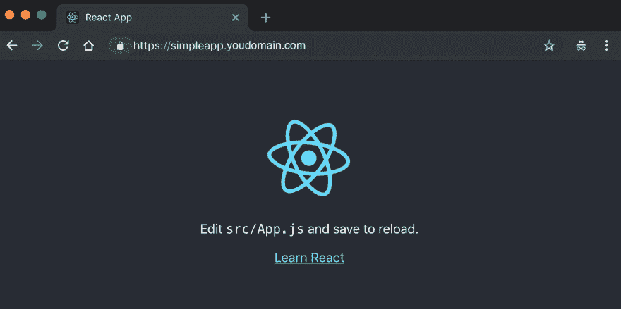T2】](https://res.cloudinary.com/practicaldev/image/fetch/s--RF4n58MZ--/c_limit%2Cf_auto%2Cfl_progressive%2Cq_auto%2Cw_880/https://thepracticaldev.s3.amazonaws.com/i/1635katlu1g8nmizhdii.png)

# 总结

我们用 Jenkins CD 建立静态网站，然后部署到 minio 文件服务器和 kubernetes。[下一个](https://dev.to/pongsatt/deploy-back-end-api-application-with-database-to-the-kubernetes-cluster-with-jenkins-cd-51j7)，我们将使用后端代码和 kubernetes 集群做 CD。