# 将您的安全 Vue.js 应用程序部署到 AWS

> 原文：<https://dev.to/oktadev/deploy-your-secure-vuejs-app-to-aws-5g5>

编写 Vue 应用程序直观、简单、快速。凭借较低的准入门槛、基于组件的方法以及热重装和 webpack 等内置功能，Vue 允许您专注于开发应用程序，而不是担心您的开发环境和构建流程。但是，当您准备将应用程序部署到生产环境中时，会发生什么呢？选择可能是无穷无尽的，有时甚至是不直观的。

作为 AWS 认证解决方案架构师，我经常被问到如何将 Vue 应用部署到 AWS。在本教程中，我将带您构建一个小型、安全的 Vue 应用程序，并将其部署到 Amazon Web Services (AWS)。如果你从未使用过 AWS，不要担心！我将从创建一个 AWS 帐户开始，引导您完成每一步。

## 关于 AWS

亚马逊网络服务(AWS)是一个云平台，提供众多[按需云服务](https://aws.amazon.com/products/)。这些服务包括云计算、文件存储、关系数据库、内容分发网络等等。AWS 的出现并不是作为一种零售产品，而是亚马逊对支撑 Amazon.com 及其电子商务运营的基础设施日益复杂的内部解决方案。亚马逊很快意识到他们基于云的基础设施是一个引人注目的、经济高效的解决方案，并于 2006 年向公众开放。

在撰写本文时，AWS 的价值估计为 2500 亿美元(是的，这是十亿美元的 B ),被全球数千家公司和开发者使用。

[T2】](https://res.cloudinary.com/practicaldev/image/fetch/s--s7C2KCVL--/c_limit%2Cf_auto%2Cfl_progressive%2Cq_auto%2Cw_880/https://developer.okta.com/assets/blog/vue-aws/aws-vue-aws-services-f3354108f66c27351ccccb6ca56b01a402de9ce59e2e9f7c9640dfd4612f7e1b.png)

## 你将建造什么

我觉得最好的学习方法是实践。我将带您构建一个带有 Express REST 服务器的小型 Vue 应用程序。您将使用 [Okta 的 OpenID Connect (OIDC)](https://developer.okta.com/docs/api/resources/oidc) 来保护您的应用程序，只需几行代码即可实现用户身份验证和授权。

您将从构建 Vue 前端开始，并将其部署到亚马逊 S3。然后，您将利用 Amazon CloudFront 将您的 Vue 前端分发到世界各地的边缘服务器。最后，您将创建一个 Express API 服务器，并使用[无服务器](https://serverless.com/)部署它。这个 API 服务器将包含一个获取“安全数据”(只是一些虚拟数据)的方法，这需要来自客户端的有效访问令牌来检索。

本文的目标是向您展示如何利用多个 AWS 服务，而不仅仅是构建一个 EC2 实例来服务您的应用程序。借助这种基于服务的方法，您可以获得无限的规模、零维护以及在云中部署应用的经济高效的方式。

## 什么是 Okta？

Okta 是一种云服务，允许开发人员管理用户认证，并将他们与一个或多个应用程序连接起来。Okta API 使您能够:

*   [认证](https://developer.okta.com/product/authentication/)和[授权](https://developer.okta.com/product/authorization/)您的用户
*   存储用户数据
*   执行基于密码的[社交登录](https://developer.okta.com/authentication-guide/social-login/)
*   通过[多重身份验证](https://developer.okta.com/use_cases/mfa/)保护您的应用
*   还有更多！查看我们的[产品文档](https://developer.okta.com/documentation/)

[注册一个免费的开发者帐户](https://developer.okta.com/signup/)，完成后，请回来，这样我们可以了解更多关于将 Vue 应用部署到 AWS 的信息。

## 引导前端

你将首先为你的安全应用构建 Vue 前端，并将其部署到亚马逊 S3 和亚马逊 CloudFront。亚马逊 S3(简单存储服务)是一个高度冗余的、基于对象的文件存储，它既强大又[有特色](https://docs.aws.amazon.com/AmazonS3/latest/dev/Introduction.html#S3Features)。在这篇文章的范围内，我们将集中在 S3 提供的最好的功能之一:静态网站托管。

要快速开始，您可以使用 [vue-cli](https://github.com/vuejs/vue-cli) 中的脚手架功能快速启动并运行您的应用。对于本文，您可以使用包含热重载、CSS 提取、林挺和集成构建工具的 [webpack 模板](https://github.com/vuejs-templates/webpack)。

安装`vue-cli`运行:

```
npm install -g vue-cli@2.9.6 
```

Enter fullscreen mode Exit fullscreen mode

接下来是初始化您的项目。当您运行下面的`vue init`命令时，接受所有的默认值。

```
vue init webpack secure-app-client
cd ./secure-app-client
npm run dev 
```

Enter fullscreen mode Exit fullscreen mode

init 方法还应该安装应用程序的依赖项。如果由于某种原因没有安装，您可以通过`npm install`安装它们。最后，打开你最喜欢的浏览器，导航到`http://localhost:8080`。你应该看到前端活了过来！

[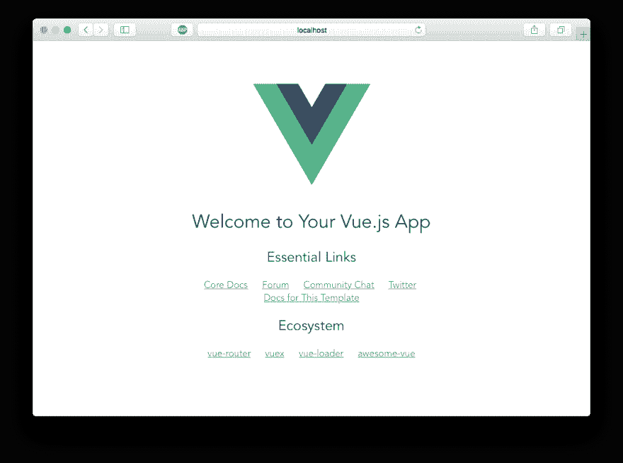T2】](https://res.cloudinary.com/practicaldev/image/fetch/s--wLPTboXT--/c_limit%2Cf_auto%2Cfl_progressive%2Cq_auto%2Cw_880/https://developer.okta.com/assets/blog/vue-aws/aws-vue-2-3b599d0abb7e513ff101f9ae7c1f1d221b709c60b704272c451938b5dfbde9c5.png)

## 关于单页应用

当您使用 Vue 创建应用程序时，您正在开发一个单页面应用程序(或“SPA”)。与传统的多页面、服务器渲染的应用相比，spa 有许多优势。理解 SPAs 和多页面 web 应用程序之间的区别很重要——尤其是在部署时。

水疗应用通常被称为“静态应用”或“静态网站”在这个上下文中，静态意味着您的应用程序将其所有代码编译成静态资产(HTML、JS 和 CSS)。有了这些静态资产，就不需要专门的 web 服务器来为您的用户提供应用程序。

传统的 web 应用程序需要专门的 web 服务器来将每个请求提交给客户端。对于这些请求中的每一个，都会传输页面的整个有效负载(包括静态资产)。

相反，在 SPA 中，只有对静态文件的初始请求，然后 JavaScript 动态地重写当前页面。当你的用户浏览你的应用程序时，对后续页面的请求在本地被解析，不需要对服务器进行 HTTP 调用。

[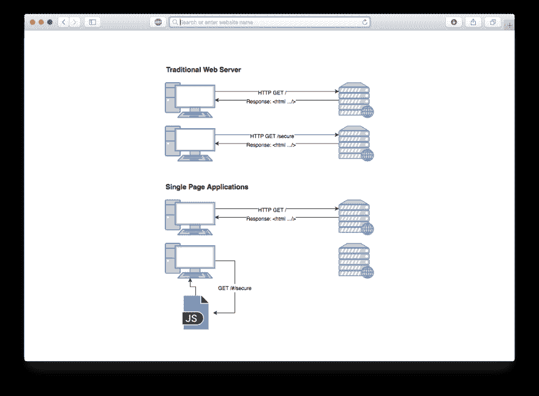T2】](https://res.cloudinary.com/practicaldev/image/fetch/s--lg8vOoru--/c_limit%2Cf_auto%2Cfl_progressive%2Cq_auto%2Cw_880/https://developer.okta.com/assets/blog/vue-aws/aws-vue-3-0a209e13e3a4db06c3b4f2b833fb872475de7413aa8dcc5c2e7c74bcda327afa.png)

## Vue-路由器和创建附加路由

动态重写当前页面所需的 SPA 组件通常被称为“路由器”。路由器根据 URL 中的路径以编程方式计算页面的哪些部分应该发生变化。

Vue 有一个官方路由器，被恰当地命名为 [vue-router](https://router.vuejs.org/) 。因为您使用了 vue-cli 引导程序，所以您的应用程序具有这种依赖性并定义了一个路由器文件(`./src/router/index.js`)。在定义其他路由之前，我们需要创建您希望路由器呈现的页面(或组件)。在项目中创建以下文件:

首页:`./src/components/home.vue`

```
<template>
  <div>
    <h1>Home</h1>
    <div>
      <router-link to="/secure">Go to secure page</router-link>
    </div>
  </div>
</template> 
```

Enter fullscreen mode Exit fullscreen mode

安全页面(不安全…还没有！)`./src/components/secure.vue`

```
<template>
  <div>
    <h1>Secure Page</h1>
    <div>
      <router-link to="/">Go back</router-link>
    </div>
  </div>
</template> 
```

Enter fullscreen mode Exit fullscreen mode

使用 [vue-router](https://router.vuejs.org/) ，您可以通知应用程序根据路径呈现每个页面。

修改`./src/router/index.js`以匹配下面的代码片段:

```
import Vue from 'vue'
import Router from 'vue-router'
import Home from '@/components/home'
import Secure from '@/components/secure'

Vue.use(Router)

let router = new Router({
  routes: [
    {
      path: '/',
      name: 'Home',
      component: Home
    },
    {
      path: '/secure',
      name: 'Secure',
      component: Secure
    }
  ]
})

export default router 
```

Enter fullscreen mode Exit fullscreen mode

试试吧！回到你的浏览器，你应该会看到新的主屏幕。如果你点击“转到安全页面”链接，你会注意到页面(和网址)的变化，但没有请求被发送到服务器！

## 了解哈希历史

当您在上面的两个页面之间导航时，您可能会看到 URL 看起来与预期的不同(您注意到路径开头的“#/”了吗？)

`http://localhost:8080/#/`和`http://localhost:8080/#/secure`

URL 看起来像是因为 vue-router 的默认模式是*哈希模式*。哈希模式模拟新的 URL 更改，而不指示浏览器重新加载页面。这种行为允许 SPA 导航页面，而不会迫使您的浏览器发出任何额外的 HTTP 请求。Vue-router 监听 URL 散列部分的变化(“#”之后的所有内容)，并根据配置的路由做出相应的响应。

您可以更改 vue-router 的模式，以利用*历史模式*，这将为您的应用程序提供“漂亮的 URL ”,如:

`http://localhost:8080/secure`

但是，这有一个很大的缺点——尤其是在部署时。因为您的 SPA 编译成静态资产，所以只有一个入口点`index.html`。如果您试图访问不是`index.html`页面的页面方向(即；`http://localhost:8080/secure`)网络服务器会返回 404 错误。*为什么是*？浏览器正在向服务器发送 GET `/secure`请求，并试图解析到文件系统“/secure”(该文件不存在)。当你从主页导航到`/secure`时，它确实工作，因为 vue-router 阻止了浏览器的默认行为，并指示路由器实例在任何模式下触发。

通过使用历史模式，您必须采取额外的步骤来确保页面刷新正常工作。可以阅读更多关于 [HTML5 历史模式](https://router.vuejs.org/guide/essentials/history-mode.html#html5-history-mode)的内容。为了简单起见，我将向您展示一个简单的技巧，以确保您的刷新与 AWS CloudFront 一起工作。

通过用以下设置修改`./router/index.js`启用历史模式。

```
let router = new Router({
  mode: 'history',
}) 
```

Enter fullscreen mode Exit fullscreen mode

**注意:**开发服务器(`npm run dev`)自动为您将 URL 重写为`index.html`。所以你在本地看到的行为就是它在生产中应该如何工作。

## 构建您的单页应用程序

现在，您已经有了一个简单的、两页的本地前端，是时候构建您的应用程序并将其部署到 AWS 了！

因为您使用了 vue-cli 搭建，所以只需调用一次包含的构建脚本。从您的项目根目录，运行`npm run build`，webpack 会将您的应用程序构建到目标`./dist`目录中。如果 dev 服务器仍然在您的控制台中运行，您可以按 CTRL+C。

如果您打开`./dist`文件夹，您应该会看到构建过程的结果:

*   这是你水疗中心的入口。这是一个缩小的 HTML 文档，链接到 CSS 和 JS 应用程序。
*   这个文件夹包含了所有你编译过的静态资产(JS 和 CSS)

在构建过程中，您可能已经注意到下面的通知:**提示:构建的文件应该通过 HTTP 服务器提供。通过文件打开 index.html://不行**。如果想在本地测试新编译的应用程序，可以使用`serve`(通过`npm install -g serve`安装)。运行`serve ./dist`，它会输出一个 URL 供你加载到浏览器中。

这也给了你一个使用 vue-router 的历史模式的主要警告的实践经验。运行`serve ./dist`后，点击“转到安全页面”。您应该会看到一个 404 错误。

[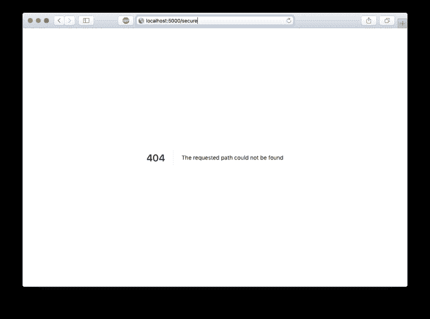T2】](https://res.cloudinary.com/practicaldev/image/fetch/s--TTcv_6Kj--/c_limit%2Cf_auto%2Cfl_progressive%2Cq_auto%2Cw_880/https://developer.okta.com/assets/blog/vue-aws/aws-vue-4-4e2d642816a7f7e0dc0cdfd5b8fed1775a577dceb7fc83dce9f9fa424625975b.png)

## AWS 入门

您将需要一个 AWS 帐户继续超过这一点。如果您已经有一个 AWS 帐户，您可以直接跳过。如果你没有，这是一个简单的过程，只需要几分钟。

*   导航到[亚马逊网络服务主页](https://aws.amazon.com)
*   点击**注册**(或者如果你最近已经登录 AWS，选择**登录控制台**)
*   如果出现提示，您可以选择“个人”作为帐户类型
*   填写所需信息，添加付款方式，并验证您的电话号码
*   创建帐户后，您应该会收到一封确认电子邮件
*   登录！

*注意:*亚马逊要求您输入付款方式，然后才能创建您的帐户。本文中讨论的所有服务都包含在 [AWS 免费等级](https://aws.amazon.com/free/)中，该等级为您提供 12 个月的免费服务。

## 在亚马逊 S3 托管您的应用

由于您的 SPA 仅由静态资产组成，我们可以利用亚马逊 S3(简单存储服务)来存储和提供您的文件。

首先，您需要创建一个存储桶。在 S3，存储桶是一个逻辑存储单元，默认情况下，每个 AWS 帐户最多可以有 100 个存储桶(如果您正在学习 AWS 认证解决方案架构师考试，您应该知道这一点！).每个存储桶可以有自己的配置，并包含无限的文件和嵌套文件夹。

登录 AWS 控制台后，导航到 S3 控制台(您可以在 AWS 服务下搜索“S3”)。

*   单击“创建存储桶”并输入存储桶名称。 ***重要*** :桶名在整个 AWS 平台上是唯一的。我为这篇文章选择了`bparise-secure-app-client`,但是你可能需要在命名上有所创新！
*   点击左下方的“创建”。

[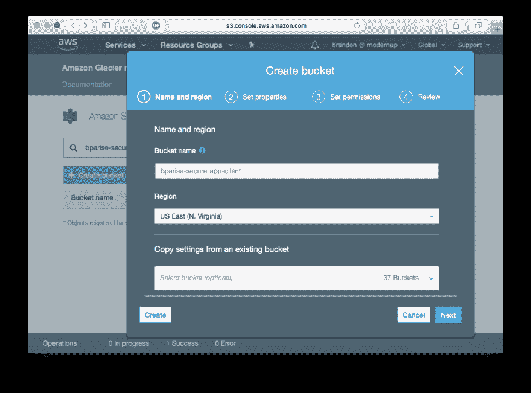T2】](https://res.cloudinary.com/practicaldev/image/fetch/s--bEDGR1Vf--/c_limit%2Cf_auto%2Cfl_progressive%2Cq_auto%2Cw_880/https://developer.okta.com/assets/blog/vue-aws/aws-vue-create-bucket-a5ffc62fd50b798e0aacc01e348f4b2e9b0b39b6166406125258ffb2cd067165.png)

现在，您应该看到您的存储桶已列出。接下来，让我们将其配置为静态网站托管。

*   单击您的存储桶名称，然后选择“属性”选项卡。
*   点击“静态网站托管”框
*   选取“使用此桶来托管网站”，并将“index.html”添加为索引文稿。点击“保存”。

[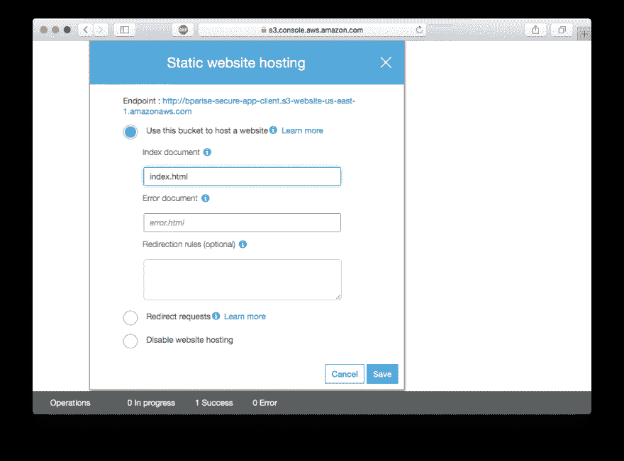T2】](https://res.cloudinary.com/practicaldev/image/fetch/s--uRHnJCJe--/c_limit%2Cf_auto%2Cfl_progressive%2Cq_auto%2Cw_880/https://developer.okta.com/assets/blog/vue-aws/aws-vue-5-c1c882a4a2c6234f4458ada7b1a93e9f54def19f77668363fe17d92284914413.png)

在静态网站托管框的顶部，您应该会看到一个“端点”的 URL。这是可公开访问的 URL，用于查看您的静态网站。在新的浏览器窗口中打开链接，您应该会看到以下内容:

[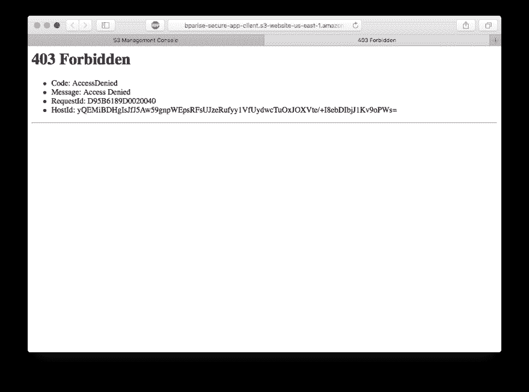T2】](https://res.cloudinary.com/practicaldev/image/fetch/s--8bFSzIdU--/c_limit%2Cf_auto%2Cfl_progressive%2Cq_auto%2Cw_880/https://developer.okta.com/assets/blog/vue-aws/aws-vue-6-695d376b9163579abc838bd663abfcddbf34fee2f48a42c157a3bf5f13cd4341.png)

#### 拒绝访问和 S3 斗策略

是的，你应该看到一个 403 禁止错误！默认情况下，S3 的斗权限是*拒绝所有*。要访问您的存储桶的内容，您必须明确定义谁可以访问您的存储桶。这些存储桶权限称为存储桶策略。

要添加存储桶策略，请单击“权限”选项卡，然后单击顶部的“存储桶策略”按钮。以下策略允许任何人读取您的存储桶中的任何文件。确保将“您的存储桶名称”替换为您的实际存储桶名称。

```
{
    "Version": "2012-10-17",
    "Statement": [
        {
            "Sid": "PublicReadAccess",
            "Effect": "Allow",
            "Principal": "*",
            "Action": "s3:GetObject",
            "Resource": "arn:aws:s3:::YOUR-BUCKET-NAME/*"
        }
    ]
} 
```

Enter fullscreen mode Exit fullscreen mode

存储桶策略可能非常复杂和强大。但是，您应该了解该政策的主要部分:

*   `"Effect": "Allow"`
*   `"Principal": "*"` -保单覆盖的对象(“*”表示所有人)
*   `"Action": "s3:GetObject"` -允许的操作(s3:GetObject 允许对 bucket 中的所有对象进行只读访问)
*   `"Resource": "arn:aws:s3:::YOUR-BUCKET-NAME/*"` -该策略与哪个存储桶和对象有关。

在存储桶策略编辑器上单击“保存”。如果正确设置了策略，您应该会注意到显示了一个新错误:

[T2】](https://res.cloudinary.com/practicaldev/image/fetch/s--f6012PrH--/c_limit%2Cf_auto%2Cfl_progressive%2Cq_auto%2Cw_880/https://developer.okta.com/assets/blog/vue-aws/aws-vue-8-868ab6f4049d3c34e9b56032e678b2bdb784bbec76a95d67507b6980b79f3874.png)

这个警告是一个很好的建议，也是所有 S3 人的经验法则。但是，因为我们的 bucket 专门用于托管静态网站，所以我们不必担心任何人访问 bucket 中的文件，他们不应该这样做。

返回浏览器并刷新端点。您现在应该会看到 404 Not Found 错误。这个错误更容易解决，因为您的 bucket 中还没有任何文件。

[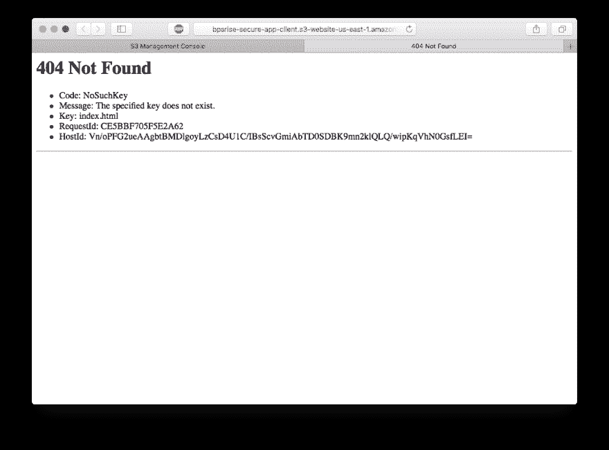T2】](https://res.cloudinary.com/practicaldev/image/fetch/s--aOIxaeEH--/c_limit%2Cf_auto%2Cfl_progressive%2Cq_auto%2Cw_880/https://developer.okta.com/assets/blog/vue-aws/aws-vue-9-2f229a3c2e4316c75d8ac17205baf6f51fc94cb6aa1d535967e6d37ffc81a8c1.png)

## 使用 aws-cli 部署到 AWS

现在您已经创建了一个 bucket 并正确设置了权限，是时候上传您的静态资产了。虽然你可以通过界面使用“上传”按钮手动完成，但我觉得使用 [aws-cli](https://aws.amazon.com/cli/) 更有效。

安装`asw-cli`因操作系统而异。选择一个:

*   windows:[https://aws.amazon.com/cli/](https://aws.amazon.com/cli/)
*   Mac/linux 运行`pip install awscli`

安装完`aws-cli`之后，您需要在 AWS 中生成密钥，这样您就可以通过 CLI 执行操作。

*   在导航栏中选择您的帐户名称，然后选择我的安全凭据。(如果您看到有关访问 AWS 帐户的安全凭据的警告，请选择继续访问安全凭据。)
*   展开访问密钥(访问密钥 ID 和秘密访问密钥)部分。
*   选择创建新的访问键。警告说明您只有这一次机会查看或下载秘密访问密钥。以后就无法检索了。
*   如果您选择显示访问密钥，您可以从浏览器窗口复制访问密钥 ID 和密钥，并将其粘贴到其他地方。
*   如果选择 Download Key File，您将收到一个名为`rootkey.csv`的文件，其中包含访问密钥 ID 和秘密密钥。将文件保存在安全的地方。

注意:如果您有一个现有的 AWS 帐户或者没有使用根凭据。您可以在 IAM 中查看和生成您的密钥。

现在您已经有了访问密钥和秘密访问密钥，您需要配置 cli。在你的控制台上运行`aws configure`并粘贴你的密钥。

```
$ aws configure
AWS Access Key ID [None]: YOUR KEY
AWS Secret Access Key [None]: YOUR SECRET
Default region name [None]: us-east-1
Default output format [None]: ENTER 
```

Enter fullscreen mode Exit fullscreen mode

现在，您可以使用`aws-cli`将您的`./dist`文件夹同步到您的新 bucket。同步会将你的`./dist`文件夹中的内容与桶中的内容进行区分，并且只上传需要的更改。

```
aws s3 sync ./dist s3://your-bucket-name 
```

Enter fullscreen mode Exit fullscreen mode

标签回到你的 S3 桶端点，你应该看到你的网站托管在 S3！

[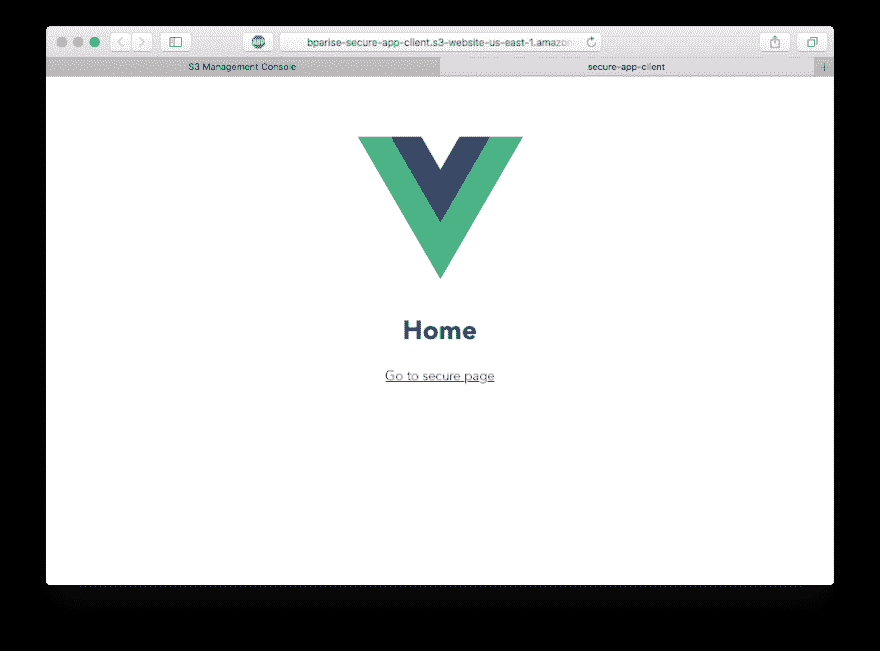T2】](https://res.cloudinary.com/practicaldev/image/fetch/s--uJ9Axneo--/c_limit%2Cf_auto%2Cfl_progressive%2Cq_auto%2Cw_880/https://developer.okta.com/assets/blog/vue-aws/aws-vue-10-8999e46b88d1e6624a4ff379427e6e4539dcb485e4406812e81d5b5c5ecdfd71.png)

为了方便起见，将下面的脚本条目添加到`package.json`中，这样当您想要同步文件时就可以运行`npm run deploy`。

```
"scripts": {
  "deploy": "aws s3 sync ./dist s3://your-bucket-name"
} 
```

Enter fullscreen mode Exit fullscreen mode

## 使用亚马逊 CloudFront CDN 分发您的应用

如果你在地理上靠近你的桶所在的区域，亚马逊 S3 静态虚拟主机具有超低的延迟。但是，您希望确保所有用户都能快速访问您的网站，无论他们位于何处。为了加快你的站点的交付，你可以 AWS CloudFront CDN。

CloudFront 是一个全球内容交付网络(CDN ),可以安全地向全球用户交付内容(网站、文件、视频等)。在撰写本文时，CloudFront 支持超过 50 个边缘位置:

[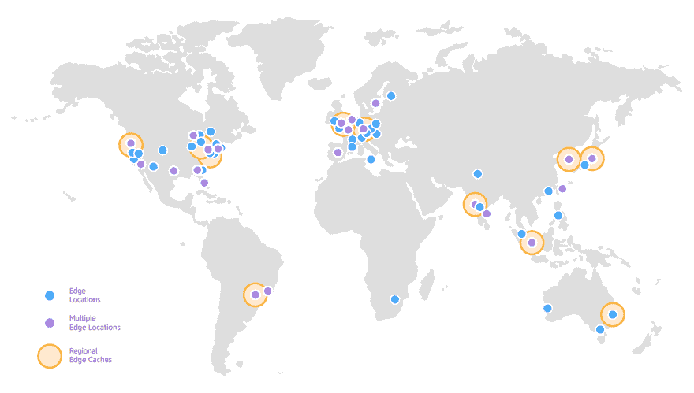T2】](https://res.cloudinary.com/practicaldev/image/fetch/s--4joFvhNI--/c_limit%2Cf_auto%2Cfl_progressive%2Cq_auto%2Cw_880/https://developer.okta.com/assets/blog/vue-aws/aws-vue-11-0c4ee34a848353bfdbfefe5177c30dfd0c05f94d5d4f61e5b8c48b22b0173f0a.png)

设置一个 CloudFront 发行版只需要几分钟，因为你的文件已经存储在 S3 了。

*   前往[云锋家园](https://console.aws.amazon.com/cloudfront/home)
*   点击**创建分发**，在 Web 设置下选择**开始**
*   在“源域名”中，您应该会在下拉列表中看到您的存储桶名称。选择该存储桶并进行以下更改:
*   查看器协议策略:“将 HTTP 重定向到 HTTPS”。(这个是安全 app 吧！？)
*   对象缓存:“自定义”。并将最小 TTL 和默认 TTL 都设置为“0”。您可以稍后对此进行调整，以最大化缓存。但是，将它设置为“0”允许我们部署更改并快速看到它们。
*   默认根对象:“index.html”
*   点击**创建分销**

该过程可能需要 5-15 分钟来完全配置您的发行版。

在您等待的时候，您需要配置您的发行版来处理 vue-router 的历史模式。单击新发行版的 ID，然后单击“错误页面”选项卡。添加以下错误页面。

[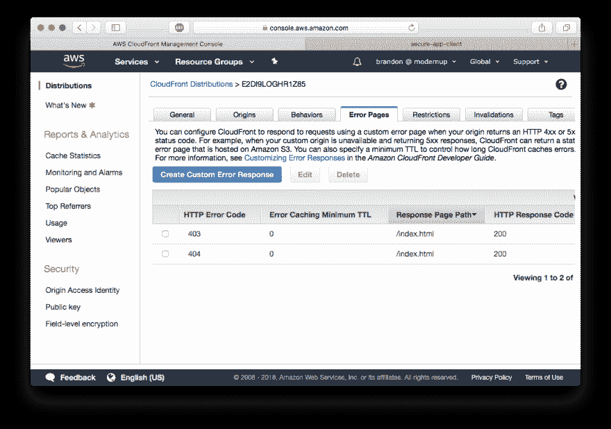T2】](https://res.cloudinary.com/practicaldev/image/fetch/s--XVBofIiQ--/c_limit%2Cf_auto%2Cfl_progressive%2Cq_auto%2Cw_880/https://developer.okta.com/assets/blog/vue-aws/aws-vue-1-b91c1744fddb9b2bf0ab94e3852ce891eb55538b2211d26777c78933df4b18af.png)

这些错误页面配置将指示 CloudFront 用`./index.html`响应任何 404/403。瞧啊。

单击“General”选项卡，您应该会看到一个“Domain Name”条目。域名是您的发行版可以公开访问的 URL。在新发行版的状态被部署后，将 URL 粘贴到您的浏览器中。

通过导航到安全页面并刷新浏览器，进行测试以确保历史模式正常工作。

## 用 Okta 添加认证

要使用 Okta，首先要有一个 Okta 开发者账号。如果您没有帐户，您可以[创建一个免费帐户](https://developer.okta.com/signup/)。登录后，单击导航栏中的“应用程序”，然后单击“添加应用程序”按钮。确保选择“单页应用程序”作为平台，然后单击下一步。

你需要将你的 CloudFront URL 添加到 URIs 基地和 URIs，否则 Okta 不会允许你认证。您的应用程序设置应该与此类似(除了您的 CloudFront URL)。

**注意:**确保在输入您的 CloudFront URL 时使用 HTTPS。

[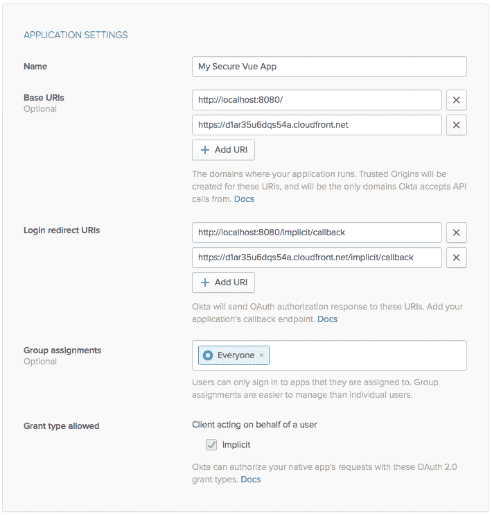T2】](https://res.cloudinary.com/practicaldev/image/fetch/s--EL8NQVTg--/c_limit%2Cf_auto%2Cfl_progressive%2Cq_auto%2Cw_880/https://developer.okta.com/assets/blog/vue-aws/aws-vue-13-77fb3edeab511e863be11ac8d61e7ba759ffe574ee4010ebf3896cbfbbe63cd9.png)

记下“常规”选项卡底部的“客户端 ID ”,因为您将需要它来配置您的应用程序。

## 为您的应用添加安全认证

Okta 有一个方便的 Vue 组件来处理与他们的服务集成的所有繁重工作。要安装 Okta Vue SDK，运行以下命令:

```
npm i @okta/okta-vue@1.0.1 
```

Enter fullscreen mode Exit fullscreen mode

打开`src/router/index.js`并将其修改成如下代码。另外，一定要把`{yourClientId}`和`{yourOktaDomain}`改成你的！

```
import Vue from 'vue'
import Router from 'vue-router'
import Home from '@/components/home'
import Secure from '@/components/secure'
import Auth from '@okta/okta-vue'

Vue.use(Auth, {
  issuer: 'https://{yourOktaDomain}/oauth2/default',
  client_id: '{yourClientId}',
  redirect_uri: window.location.origin + '/implicit/callback',
  scope: 'openid profile email'
})

Vue.use(Router)

let router = new Router({
  mode: 'history',
  routes: [
    {
      path: '/',
      name: 'Home',
      component: Home
    },
    {
      path: '/implicit/callback',
      component: Auth.handleCallback()
    },
    {
      path: '/secure',
      name: 'Secure',
      component: Secure,
      meta: {
        requiresAuth: true
      }
    }
  ]
})

router.beforeEach(Vue.prototype.$auth.authRedirectGuard())

export default router 
```

Enter fullscreen mode Exit fullscreen mode

下一步是将`/secure`路由锁定给经过认证的用户。Okta 的 Vue SDK 附带了方法`auth.authRedirectGuard()`,该方法检查关键字`requiresAuth`的路由元数据，并将未经认证的用户重定向到 Okta 的认证流。

最后，对`App.vue`
做一些样式的修改

```
<template>
  <div id="app">
    <div>
      <a href="#" v-if="!activeUser" @click.prevent="login">Login</a>
      <div v-else>
        Welcome - <a href="#" @click.prevent="logout">Logout</a>
      </div>
    </div>
    <router-view/>
  </div>
</template>

<script>
  export default {
    name: 'app',
    data () {
      return {
        activeUser: null
      }
    },
    async created () {
      await this.refreshActiveUser()
    },
    watch: {
      // everytime a route is changed refresh the activeUser
      '$route': 'refreshActiveUser'
    },
    methods: {
      login () {
        this.$auth.loginRedirect()
      },
      async refreshActiveUser () {
        this.activeUser = await this.$auth.getUser()
      },
      async logout () {
        await this.$auth.logout()
        await this.refreshActiveUser()
        this.$router.push('/')
      }
    }
  }
</script>

<style>
#app {
  font-family: 'Avenir', Helvetica, Arial, sans-serif;
  -webkit-font-smoothing: antialiased;
  -moz-osx-font-smoothing: grayscale;
  text-align: center;
  color: #2c3e50;
  margin-top: 60px;
}
</style> 
```

Enter fullscreen mode Exit fullscreen mode

在您的终端中，通过`npm run dev`重启开发服务器。切换到您的浏览器并打开`http://localhost:8080`。如果你点击“登录”或“转到安全页面”(受保护的`/secure`路线)，你应该得到 Okta 的认证流程。

[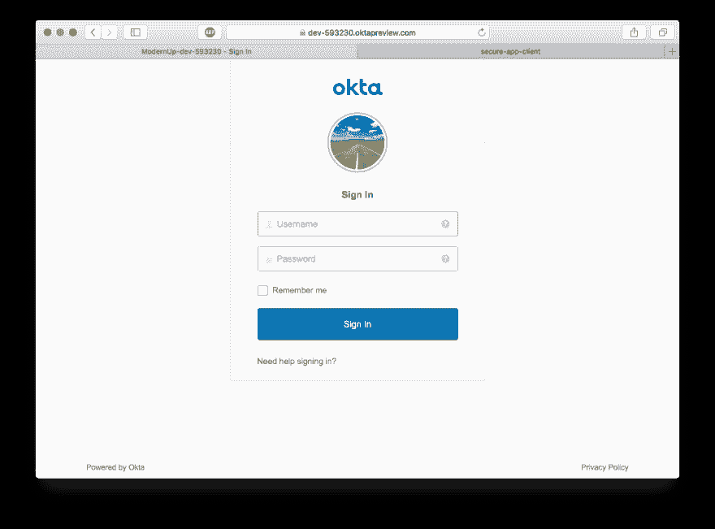T2】](https://res.cloudinary.com/practicaldev/image/fetch/s--ubrkBBRI--/c_limit%2Cf_auto%2Cfl_progressive%2Cq_auto%2Cw_880/https://developer.okta.com/assets/blog/vue-aws/aws-vue-14-4de9c6592c4f072f5ee738fc56334a47da9bc205a8c65a87b9fdb3c355b01ac7.png)

单击其中任何一个都应该显示您已登录，并且应该能够访问安全页面。

## 构建安全的 Express REST 服务器

最后，我们将构建一个 [Express](https://expressjs.com/) 服务器来响应`/hello`和`/secure-data`请求。`/secure-data`将受到保护，并需要来自前端的认证令牌。由于 Okta 的 Vue SDK，此令牌可通过`$auth.getUser()`获得。

首先，为您的服务器创建一个新目录。

```
mkdir secure-app-server
cd secure-app-server
npm init -y 
```

Enter fullscreen mode Exit fullscreen mode

然后安装所需的依赖项。

```
npm install -s express cors body-parser @okta/jwt-verifier aws-serverless-express 
```

Enter fullscreen mode Exit fullscreen mode

接下来是创建一个定义应用程序的文件。将以下代码复制到`app.js`中，并将`{yourClientId}`和`{yourOktaDomain}`改为您的代码。

```
const express = require('express')
const cors = require('cors')
const bodyParser = require('body-parser')
const OktaJwtVerifier = require('@okta/jwt-verifier')

const oktaJwtVerifier = new OktaJwtVerifier({
  clientId: '{yourClientId}',
  issuer: 'https://{yourOktaDomain}/oauth2/default'
})

let app = express()
app.use(cors())
app.use(bodyParser.json())

// verify JWT token middleware
const authRequired = () => {
  return (req, res, next) => {
    // require request to have an authorization header
    if (!req.headers.authorization) {
      return next(new Error('Authorization header is required'))
    }
    let parts = req.headers.authorization.trim().split(' ')
    let accessToken = parts.pop()
    oktaJwtVerifier.verifyAccessToken(accessToken)
      .then(jwt => {
        req.user = {
          uid: jwt.claims.uid,
          email: jwt.claims.sub
        }
        next()
      })
      .catch(next) // jwt did not verify!
  }
}

// public route that anyone can access
app.get('/hello', (req, res) => {
  return res.json({
    message: 'Hello world!'
  })
})

// route uses authRequired middleware to secure it
app.get('/secure-data', authRequired(), (req, res) => {
  return res.json({
    secret: 'The answer is always "A"!'
  })
})

module.exports = app 
```

Enter fullscreen mode Exit fullscreen mode

创建最后一个加载应用程序并监听端口 8081 的文件。创建`./index.js`并复制下面的代码。

```
const app = require('./app')

app.listen(8081, () => {
  console.log('listening on 8081')
}) 
```

Enter fullscreen mode Exit fullscreen mode

通过在控制台中运行`node ./`来启动服务器。切换到您的浏览器并打开`http://localhost:8081/hello`。你应该看到我们的 JSON 有效载荷。但是，加载`http://localhost:8081/secure-data`会导致一个错误。

### 从 Vue.js 前端调用安全 API 端点

在您的 secure Express REST 服务器仍在运行的情况下，导航回您的客户端并安装 axios，以便您可以调用`/secure-data`端点。

```
npm i axios 
```

Enter fullscreen mode Exit fullscreen mode

修改`./src/components/secure.vue`,这样它将从 Okta Vue SDK 获得访问令牌，并将请求发送给 API。

```
<template>
  <div>
    <h1>Secure Page</h1>
    <h5>Data from GET /secure-data:</h5>
    <div class="results">
      <pre></pre>
    </div>
    <div>
      <router-link to="/">Go back</router-link>
    </div>
  </div>
</template>

<script>
import axios from 'axios'

export default {
  data () {
    return {
      data: null
    }
  },
  async mounted () {
    let accessToken = await this.$auth.getAccessToken()
    const client = axios.create({
      baseURL: 'http://localhost:8081',
      headers: {
        Authorization: `Bearer ${accessToken}`
      }
    })
    let { data } = await client.get('/secure-data')
    this.data = data
  }
}
</script>

<style>
  .results {
    width: 300px;
    margin: 0 auto;
    text-align: left;
    background: #eee;
    padding: 10px;
  }
</style> 
```

Enter fullscreen mode Exit fullscreen mode

返回浏览器并重新加载 web 应用程序。导航到`http://localhost:8080/secure`，您应该会看到 API 调用的结果。

[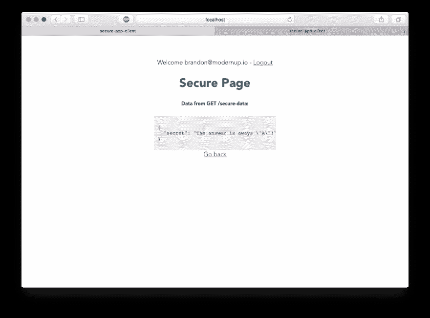T2】](https://res.cloudinary.com/practicaldev/image/fetch/s--zfpzwfXG--/c_limit%2Cf_auto%2Cfl_progressive%2Cq_auto%2Cw_880/https://developer.okta.com/assets/blog/vue-aws/aws-vue-15-399903d818429474627b456f22f6ea56422f3d64706d55a797024092f0126c38.png)

## 配置无服务器，部署 Express API

[无服务器](https://serverless.com/)是一个开源的 AWS Lambda 和 API 网关自动化框架，允许您将应用部署到 AWS 上的无服务器基础设施中。术语“无服务器”(不要与软件无服务器混淆)用于描述在云中运行的应用程序，它不需要开发人员提供专用服务器来运行代码。

无服务器使用 [AWS Lambda](https://aws.amazon.com/lambda/) 和 [AWS API Gateway](https://aws.amazon.com/api-gateway/) 仅使用托管服务在云中运行您的 express API。AWS Lambda 是一项服务，让您可以在云中运行代码，而无需配置或管理服务器。此外，AWS API Gateway 是一项服务，使开发人员能够轻松创建、发布、更新、监控和保护大规模 API。将这两种服务结合起来，可以为您提供一个健壮的平台来托管安全的 API。

要开始使用无服务器，请全局安装。

```
npm install -g serverless 
```

Enter fullscreen mode Exit fullscreen mode

接下来，您需要在 server 应用程序中创建一个无服务器配置。在您的`./secure-app-server`项目中使用以下命令。

```
serverless create --template aws-nodejs --name secure-app-server 
```

Enter fullscreen mode Exit fullscreen mode

打开`serverless.yml`并将其修改成如下所示。当您创建无服务器配置时，它包含许多样板代码和注释。以下结构是部署应用程序所需的全部内容。

```
service: secure-app-server

provider:
  name: aws
  runtime: nodejs8.10
  stage: dev

functions:
  api:
    handler: handler.handler
    events:
      - http: 
          path: "{proxy+}"
          method: ANY
          cors: true 
```

Enter fullscreen mode Exit fullscreen mode

`provider`规范通知 Serverless 您的应用程序运行 NodeJS 并以 AWS 上的部署为目标。`functions`概述了一个处理程序，它应该处理任何 HTTP 请求并将它们转发到您的应用程序。

要完成无服务器配置，请将`handler.js`修改为以下代码。它使用了 [aws-serverless-express](https://github.com/awslabs/aws-serverless-express) ，这是一个简洁的小软件包，将所有 API 请求代理到一个本地 express 应用程序。

```
'use strict';

const awsServerlessExpress = require('aws-serverless-express')
const app = require('./app')
const server = awsServerlessExpress.createServer(app)
exports.handler = (event, context) => { awsServerlessExpress.proxy(server, event, context) } 
```

Enter fullscreen mode Exit fullscreen mode

最后，您应该准备好通过无服务器部署您的应用程序。运行以下命令。

```
serverless deploy 
```

Enter fullscreen mode Exit fullscreen mode

此过程最初需要几分钟来调配堆栈。完成后，您应该会在“服务信息”下看到一个`endpoints`条目(您的 URL 与我的略有不同)。

```
endpoints:
  ANY - https://YOUR_END_POINT.amazonaws.com/dev/{proxy+} 
```

Enter fullscreen mode Exit fullscreen mode

要测试它，请导航到`https://YOUR_END_POINT.amazonaws.com/dev/hello`，您应该会看到我们的 hello world 消息。试图转到`https://YOUR_END_POINT.amazonaws.com/dev/secure`会导致错误。

### 改变前端 Vue 使用生产 API

到目前为止，您的前端应用程序已经配置为调用本地托管在`http://localhost:8081`上的 API。对于生产，您需要将它作为您的无服务器端点。打开`./src/components/secure.vue`，在`mounted()`内用你的端点替换`baseURL`。

```
baseURL: 'https://YOUR_END_POINT.amazonaws.com/dev', 
```

Enter fullscreen mode Exit fullscreen mode

最后，构建您的应用程序并将其部署到 CloudFront。

```
npm run build
npm run deploy 
```

Enter fullscreen mode Exit fullscreen mode

导航到您的 CloudFront URL，您应该有一个工作应用程序！祝贺你出色地完成了工作！

如果您的 CloudFront URL 无法获取最新版本的 web 应用程序，您可能需要使 CDN 缓存无效。转到您的发行版，点击**失效**选项卡。点击**创建无效**，无效路径“/*”。这将需要几分钟的时间，但一旦完成，您应该能够获得最新版本。

## 最后的想法

亚马逊网络服务是一个强大的平台，几乎可以做任何事情。但是，它有一个相对陡峭的学习曲线，可能不适合所有云初学者。尽管如此，我还是鼓励您深入研究 AWS 提供的功能，并找到适合您开发需求的平衡点。

你可以在[https://github . com/okta developer/okta-secure-vue-AWS-client-example](https://github.com/oktadeveloper/okta-secure-vue-aws-client-example)和[https://github . com/okta developer/okta-secure-vue-AWS-server-example](https://github.com/oktadeveloper/okta-secure-vue-aws-server-example)找到本教程的完整源代码。

下面是我推荐的几篇文章，以了解更多关于使用通用 SPA 框架进行用户身份验证的信息。

*   [用 Vue.js 和节点](https://dev.to/blog/2018/02/15/build-crud-app-vuejs-node)构建一个基本的 CRUD App
*   [在 20 分钟内为您的普通 JavaScript 应用添加身份验证](https://dev.to/blog/2018/06/05/authentication-vanilla-js)
*   [在 15 分钟内构建带有用户认证的 React 应用](https://dev.to/blog/2017/03/30/react-okta-sign-in-widget)
*   [用 Okta 的签到工具在 15 分钟内创建一个 Angular 应用](https://dev.to/blog/2017/03/27/angular-okta-sign-in-widget)

请务必[关注 Twitter 上的@ oktadev](https://twitter.com/oktadev)以便在更多类似文章发表时获得通知。