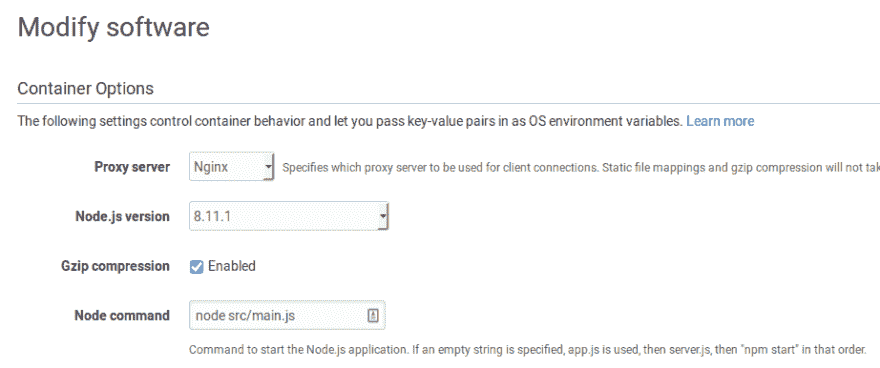

# 在 AWS Beanstalk 上部署 NestJS 应用程序

> 原文：<https://dev.to/antogarand/deploying-a-nestjs-application-on-aws-beanstalk-4no1>

# 简介

NestJS 是一个渐进式 web 框架，用于使用 TypeScript 构建后端应用程序。
我一直用它来构建我的项目， [BrawlDB](https://gitlab.com/BrawlDB/backend) ，发现在 Beanstalk 上部署比预期的要难。
这促使我撰写了本指南，希望它能帮助您完成部署之旅！

# 本地工作流

在本地运行应用程序非常简单:`npm start`
这在`src/main.ts`文件上运行`ts-node`，在默认的 nest/express 端口 3000 上启动服务器。
`ts-node`让我们不用先用`tsc`手动编译就可以执行类型脚本文件，加快了开发周期。

# 应用端口

我们需要在代码中更改的第一件事是我们的应用程序监听的端口。
Beanstalk 和许多其他生产环境都希望我们使用 PORT 环境变量。默认模板上还不是这种情况，因此我们需要更新`src/main.ts`文件来监听正确的端口。
这就像用`process.env.PORT || 3000`代替之前硬编码的 3000 一样简单。
这将使用端口变量(如果它存在的话),如果它没有被设置，将返回到 3000。
[T8】](https://res.cloudinary.com/practicaldev/image/fetch/s--KJuGVWVy--/c_limit%2Cf_auto%2Cfl_progressive%2Cq_auto%2Cw_880/https://thepracticaldev.s3.amazonaws.com/i/rx7dbe0bmuj3cegijn4q.png)

# 打字稿

在 AWS Beanstalk 的 NodeJS 环境中，没有安装 dev 依赖项。这是正常的，因为`--only=production`标志被赋予了`npm install`命令，以防止安装不必要的代码。
这意味着`ts-node`不会被安装，因此`npm start`会失败。

幸运的是，编译 typescript 很容易！ [NestJS 的 starter](https://github.com/nestjs/typescript-starter) 应用程序为我们提供了一个默认的工作`tsconfig.json`，因此我们需要做的就是在安装了 TypeScript 的终端上运行`tsc`！运行`tsc`会将我们所有的 typescript 文件构建到 dist 文件夹中。因此，应用入口点将是`dist/src/main.js`。

# 丢失文件

虽然 dist 文件夹将包含已编译的 Javascript 文件，但它不足以运行和部署应用程序。
为了知道要安装的依赖项，NodeJS 需要`package.json`文件。
在我的项目中，我将配置文件存储在`config/config.json`文件中，这些文件也没有复制到 dist 文件夹中，因为它们不是`ts`。
为了部署应用程序，我们需要将所有非类型脚本的配置文件，包括`package.json`复制到 dist 文件夹中。

# 豆茎配置

最后，一旦我们准备好在 Beanstalk 上部署所有东西，我们需要更改一个设置。
由于默认的`npm start`不能用于我们的文件夹，考虑到既没有安装`main.ts`也没有安装`ts-node`，我们需要告诉 Beanstalk 运行`node src/main.js`。
该设置为`Node command`，可以在豆茎配置界面的`Container Options`下找到。

一旦环境启动，应用程序应该在给定的 beanstalk URL 上启动并运行！

# 结论

一旦理解了前面部署 NestJS 应用程序的步骤，更新和重新部署就很容易了。希望这份指南对你有所帮助，你会继续开发出令人惊叹的应用程序！