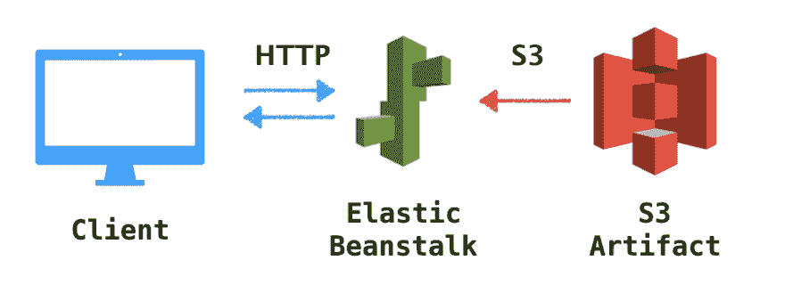
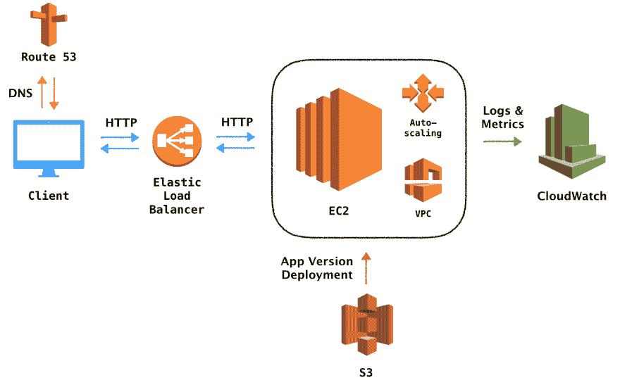

# 使用 Elastic Beanstalk 在 AWS 上部署 HTTP API

> 原文：<https://dev.to/frosnerd/deploying-an-http-api-on-aws-using-elastic-beanstalk-5dh7>

这篇博文是我的 AWS 系列的一部分:

*   [基础设施作为使用 Terraform 的代码管理 AWS](https://dev.to/frosnerd/infrastructure-as-code---managing-aws-with-terraform-i9o)
*   [使用 Lambda 和 API 网关在 AWS 上部署 HTTP API](https://dev.to/frosnerd/deploying-an-http-api-on-aws-using-lambda-and-api-gateway-g61)
*   [**使用弹性豆茎在 AWS 上部署 HTTP API**](#)
*   [部署 AWS RDS MySQL 实例并进行基准测试](https://dev.to/frosnerd/deploying-and-benchmarking-an-aws-rds-mysql-instance-2faf)
*   [AWS 中使用社交网络、SQS 和 Lambda 的事件处理](https://dev.to/frosnerd/event-handling-in-aws-using-sns-sqs-and-lambda-2ng)
*   [使用 Terraform 和 Travis CI 在 AWS 上连续交付](https://dev.to/frosnerd/continuous-delivery-on-aws-with-terraform-and-travis-ci-3914)
*   [使用物联网核心、Kinesis 和 ElastiCache 在 AWS 上处理传感器数据](https://dev.to/frosnerd/sensor-data-processing-on-aws-using-iot-core-kinesis-and-elasticache-26j1)
*   [使用 CloudWatch 监控 AWS Lambda 功能](https://dev.to/frosnerd/monitoring-aws-lambda-functions-with-cloudwatch-1nap)

# 简介

在前一篇文章中，我们研究了 AWS Lambda 和 AWS API Gateway 如何实现 HTTP API。在这篇文章中，我们想做同样的事情，但使用 PaaS 的概念，而不是 FaaS。

AWS 提供了一项名为 [*弹性豆茎*](https://aws.amazon.com/elasticbeanstalk/) 的服务。Elastic Beanstalk 可以用于部署和扩展 web 应用程序。它允许您上传代码，并透明地处理负载平衡、日志和指标管理、警报、应用程序版本管理和 DNS 解析。

本文的范围是重新创建与上一个示例相同的 API，这次使用 Akka HTTP 作为嵌入式 web 服务器，并使用 Elastic Beanstalk 部署应用程序。

该员额的其余部分结构如下。首先，我们将给出应用程序架构的概述。由于 Elastic Beanstalk 捆绑了许多不同的 AWS 服务，我们将更详细地介绍它们是如何组成的，以及每个服务的用途是什么。下一节将指导您使用 Elastic Beanstalk 和 Terraform 实现和部署 HTTP API。我们通过总结主要观点和简要讨论这种方法的优点和缺点来结束这篇文章。

# 建筑

下图说明了目标体系结构。客户机向弹性 Beanstalk 应用程序发送一个 HTTP 请求。然后，Elastic Beanstalk 将让部署的应用程序版本处理请求并返回响应。与前一篇文章中的架构类似，S3 用于存储不同的应用程序版本。

[T2】](https://res.cloudinary.com/practicaldev/image/fetch/s--M6Kbgm8B--/c_limit%2Cf_auto%2Cfl_progressive%2Cq_auto%2Cw_880/https://thepracticaldev.s3.amazonaws.com/i/xn3rrxz9gc8dpk0os7dn.png)

虽然这看起来很简单，但实际上发生了很多事情。弹性豆茎捆绑了 AWS 生态系统的许多不同组件。下图展示了弹性 Beanstalk 应用程序的内部结构。

[T2】](https://res.cloudinary.com/practicaldev/image/fetch/s--zxdAGP3v--/c_limit%2Cf_auto%2Cfl_progressive%2Cq_auto%2Cw_880/https://thepracticaldev.s3.amazonaws.com/i/lk4zkkbto2hzcxmt6x4g.png)

Elastic Beanstalk 在一个[自动扩展组](https://aws.amazon.com/autoscaling)和一个可配置数量的可用区域内启动 [EC2](https://aws.amazon.com/ec2) 实例。这些实例用于运行您的应用程序。它将实例放在 [VPC](https://aws.amazon.com/vpc) 中，并配置一个[安全组](https://docs.aws.amazon.com/AmazonVPC/latest/UserGuide/VPC_SecurityGroups.html)来保护您的实例，默认情况下只接受端口 80 上的连接。

应用程序版本保存在一个单独的 [S3](https://aws.amazon.com/s3) 桶中，可以直接导入，也可以从另一个 S3 桶导入。

弹性豆茎支持[不同平台](https://docs.aws.amazon.com/elasticbeanstalk/latest/dg/concepts.platforms.html)，如 Java SE、。NET、Node.js、PHP 或 Python。在每个平台上，您可以选择预定义的解决方案堆栈，指定执行运行时的确切软件堆栈，例如*64 位 Amazon Linux 2018.03 v2.7.1 运行 Java 8* 。

域名通过[路由 53](https://aws.amazon.com/route53) 进行管理。传入的流量将被发送到一个[弹性负载平衡器](https://aws.amazon.com/elasticloadbalancing)，它充当应用程序的入口点。负载平衡器将请求转发到您的 EC2 实例，结合自动伸缩组允许水平可伸缩性。但是请注意，从今天开始，`eu-central-1`似乎不支持自动缩放。

为了支持操作，Elastic Beanstalk 还会根据 EC2 实例的负载创建[云监控](https://aws.amazon.com/cloudwatch)警报。如果启用了自动缩放，警报将触发新 EC2 实例的创建。CloudWatch 还可以用于监控和日志管理。

整个基础架构堆栈及其配置作为[云形成](https://aws.amazon.com/cloudformation/)模板进行内部管理。所有组件都可以通过[不同设置](https://docs.aws.amazon.com/elasticbeanstalk/latest/dg/command-options.html)进行配置。

在我们的具体例子中，我们将使用 Scala 开发程序逻辑。汇编后的`jar`文件将被发布到 S3，并用于处理请求。下一节将逐步介绍实现。

# 实现

## 开发工具栈

为了开发该解决方案，我们使用了以下工具:

*   Terraform v0.11.7
*   SBT 1.0.4
*   Scala 2.12.6
*   IntelliJ + Scala 插件+ Terraform 插件

[源代码](https://github.com/FRosner/lambda-vs-beanstalk)可以在 GitHub 上获得。但是请注意，该项目包含两个模块，一个用于 AWS 弹性 Beanstalk 部署，另一个是我正在试验的 [AWS Lambda](https://aws.amazon.com/lambda/) 。

## 开发 HTTP API

HTTP API 是在 [Akka HTTP](https://doc.akka.io/docs/akka-http/current/) 之上实现的。要使用 Akka，我们需要创建一个新的 [`ActorSystem`](https://doc.akka.io/api/akka/current/akka/actor/ActorSystem.html) 和 [`ActorMaterializer`](https://doc.akka.io/api/akka/current/akka/stream/ActorMaterializer.html) 。这是任何 Akka 应用程序都需要的，我们不会在这篇文章中详细讨论 Akka 的内部结构。

我们的 API 的路由逻辑相当简单。我们只公开一个名为`question`的资源，它对任何请求都返回 42。

```
val route =
    path("question") {
      complete(42.toString)
    } 
```

Enter fullscreen mode Exit fullscreen mode

服务器监听接口`0.0.0.0`并通过`$PORT`环境变量绑定到一个由 Elastic Beanstalk 给定的端口。使用适当的配置文件并通过 [`Procfile`](https://docs.aws.amazon.com/elasticbeanstalk/latest/dg/java-se-procfile.html) 传递端口参数会更干净，但是这样我就能够部署`jar`而不需要任何额外的文件或目录结构。

```
val interface = "0.0.0.0"
val port = Try(System.getenv("PORT").toInt) match {
  case Success(i) => i
  case Failure(t) =>
    println("Failed to read $PORT: " + t)
    println(s"Using default port: 80")
    80
}
val bindingFuture = Http().bindAndHandle(route, interface, port)
println(s"Server online at http://$interface:$port/") 
```

Enter fullscreen mode Exit fullscreen mode

与我们在上一篇文章中开发的 Lambda 函数相比，我们的`jar`文件将作为应用程序被调用，因此需要在清单中定义一个`main`方法。这可以在`build.sbt`文件中完成:

```
mainClass in assembly := Some("de.frosner.elbvsl.elb.Main") 
```

Enter fullscreen mode Exit fullscreen mode

下一步我们需要做的是打包这个函数，并使它可用于 Elastic Beanstalk。我们将使用与[上一篇](https://dev.to/frosnerd/deploying-an-http-api-on-aws-using-lambda-and-api-gateway-g61)相同的方法。 [sbt-assembly](https://github.com/sbt/sbt-assembly) 将构建一个 fat `jar`并且 [fm-sbt-s3-resolver](https://github.com/frugalmechanic/fm-sbt-s3-resolver) 将它上传到`s3://s3-eu-central-1.amazonaws.com/lambda-elb-test/elb`。关于这个步骤的更多细节，请参考之前的帖子。

现在有了在 S3 可用的工件，我们可以继续使用 Terraform 创建弹性 Beanstalk 应用程序。

## 创建弹性豆茎应用程序

一个弹性豆茎*应用*是一个*环境*和应用*版本*的集合。应用程序本身更像是不同环境和版本的容器或文件夹。环境和*环境配置*一起定义了一组 AWS 组件和资源，即 EC2 实例等等，它们可以运行一个版本。版本是存储在 S3 的可部署代码的标记工件。在所有环境中，版本都是唯一的。

一个环境一次可以运行一个应用程序版本，但是一个应用程序版本可以同时在几个环境中运行。在 Terraform 中创建新的基本应用程序时，我们只需选择一个名称:

```
resource "aws_elastic_beanstalk_application" "lambda-elb-test" {
  name        = "lambda-elb-test"
} 
```

Enter fullscreen mode Exit fullscreen mode

接下来，我们可以定义一个环境，并将其链接到我们的应用程序。

## 设置弹性豆茎环境

创建新环境时，我们选择名称、创建环境的应用程序以及解决方案堆栈。可以通过在环境资源定义中重复`setting`节来定义环境设置。因为我们要运行一个 Scala 应用程序，所以我们选择 Java 8 解决方案堆栈。

```
resource "aws_elastic_beanstalk_environment" "lambda-elb-test" {
  name                = "lambda-elb-test"
  application         = "${aws_elastic_beanstalk_application.lambda-elb-test.name}"
  solution_stack_name = "64bit Amazon Linux 2018.03 v2.7.1 running Java 8"
} 
```

Enter fullscreen mode Exit fullscreen mode

我们将保留所有设置的默认值。然而，我们需要提供一个*实例概要文件*。实例配置文件是角色的容器。在我们的例子中，我们需要为我们的 EC2 服务器关联一个角色，以便能够与 AWS 的其他服务如 S3、CloudWatch 等进行对话。幸运的是，已经有一个名为 [`AWSElasticBeanstalkWebTier`](https://docs.aws.amazon.com/elasticbeanstalk/latest/dg/iam-instanceprofile.html) 的托管策略，我们可以将它附加到我们的角色，然后创建实例概要文件。

```
resource "aws_iam_role" "elb" {
  name = "lambda-elb-test_elb"

  assume_role_policy = <<EOF
{
  "Version": "2008-10-17",
  "Statement": [
    {
      "Effect": "Allow",
      "Principal": {
        "Service": "ec2.amazonaws.com"
      },
      "Action": "sts:AssumeRole"
    }
  ]
}
EOF
}

data "aws_iam_policy" "AWSElasticBeanstalkWebTier" {
  arn = "arn:aws:iam::aws:policy/AWSElasticBeanstalkWebTier"
}

resource "aws_iam_role_policy_attachment" "elb-attach" {
  role       = "${aws_iam_role.elb.name}"
  policy_arn = "${data.aws_iam_policy.AWSElasticBeanstalkWebTier.arn}"
}

resource "aws_iam_instance_profile" "elb-profile" {
  name = "elb_profile"
  role = "${aws_iam_role.elb.name}"
} 
```

Enter fullscreen mode Exit fullscreen mode

现在我们只需要将新配置的实例概要文件设置为我们环境的实例概要文件:

```
resource "aws_elastic_beanstalk_environment" "lambda-elb-test" {
  name                = "lambda-elb-test"
  application         = "${aws_elastic_beanstalk_application.lambda-elb-test.name}"
  solution_stack_name = "64bit Amazon Linux 2018.03 v2.7.1 running Java 8"

  setting {
    namespace = "aws:autoscaling:launchconfiguration"
    name      = "IamInstanceProfile"
    value     = "${aws_iam_instance_profile.elb-profile.name}"
  }
} 
```

Enter fullscreen mode Exit fullscreen mode

创建并配置好环境后，让我们创建一个包含 HTTP API 的新应用程序版本。

## 管理应用版本

为了创建一个新的应用程序版本，我们需要指定一个名称，即 Elastic Beanstalk 应用程序，以及原始工件的 S3 位置。注意，Elastic Beanstalk 会将工件复制到它自己生成的 S3 桶中。为了更加灵活，我们将版本字符串定义为一个变量。

```
variable "version" {
  type = "string"
  default = "0.1-SNAPSHOT"
}

resource "aws_elastic_beanstalk_application_version" "default" {
  name        = "elastic-beanstalk-vs-lambda_2.12-${var.version}"
  application = "${aws_elastic_beanstalk_application.lambda-elb-test.name}"
  description = "application version created by terraform"
  bucket      = "${data.aws_s3_bucket.lambda-elb-test.id}"
  key         = "${data.aws_s3_bucket_object.application-jar.key}"
}

data "aws_s3_bucket" "lambda-elb-test" {
  bucket = "lambda-elb-test"
}

data "aws_s3_bucket_object" "application-jar" {
  bucket = "${data.aws_s3_bucket.lambda-elb-test.id}"
  key    = "elb/de/frosner/elastic-beanstalk-vs-lambda_2.12/${var.version}/elastic-beanstalk-vs-lambda_2.12-${var.version}-assembly.jar"
} 
```

Enter fullscreen mode Exit fullscreen mode

这是我们为示例 Elastic Beanstalk powered HTTP API 定义的所有内容。我们现在可以运行`terraform apply`，它将创建应用程序、实例概要文件、版本和环境。创建环境需要花一点时间，因为它由一个`t2.micro` EC2 实例和所有其他需要引导和配置的组件组成。

```
aws_elastic_beanstalk_application.lambda-elb-test: Creating...
aws_iam_role.elb: Creating...
aws_elastic_beanstalk_application.lambda-elb-test: Creation complete after 1s (ID: lambda-elb-test)
aws_elastic_beanstalk_application_version.default: Creating...
aws_iam_role.elb: Creation complete after 1s (ID: lambda-elb-test_elb)
aws_iam_role_policy_attachment.elb-attach: Creating...
aws_iam_instance_profile.elb-profile: Creating...
aws_elastic_beanstalk_application_version.default: Creation complete after 0s (ID: elastic-beanstalk-vs-lambda_2.12-0.1-SNAPSHOT)
aws_iam_role_policy_attachment.elb-attach: Creation complete after 2s (ID: lambda-elb-test_elb-20180615071854874500000001)
aws_iam_instance_profile.elb-profile: Creation complete after 2s (ID: elb_profile)
aws_elastic_beanstalk_environment.lambda-elb-test: Creating...
aws_elastic_beanstalk_environment.lambda-elb-test: Still creating... (10s elapsed)
aws_elastic_beanstalk_environment.lambda-elb-test: Still creating... (20s elapsed)
aws_elastic_beanstalk_environment.lambda-elb-test: Still creating... (30s elapsed)
aws_elastic_beanstalk_environment.lambda-elb-test: Still creating... (40s elapsed)
aws_elastic_beanstalk_environment.lambda-elb-test: Still creating... (50s elapsed)
aws_elastic_beanstalk_environment.lambda-elb-test: Still creating... (1m0s elapsed)
aws_elastic_beanstalk_environment.lambda-elb-test: Still creating... (1m10s elapsed)
aws_elastic_beanstalk_environment.lambda-elb-test: Still creating... (1m20s elapsed)
aws_elastic_beanstalk_environment.lambda-elb-test: Still creating... (1m30s elapsed)
aws_elastic_beanstalk_environment.lambda-elb-test: Still creating... (1m40s elapsed)
aws_elastic_beanstalk_environment.lambda-elb-test: Still creating... (1m50s elapsed)
aws_elastic_beanstalk_environment.lambda-elb-test: Still creating... (2m0s elapsed)
aws_elastic_beanstalk_environment.lambda-elb-test: Still creating... (2m10s elapsed)
aws_elastic_beanstalk_environment.lambda-elb-test: Still creating... (2m20s elapsed)
aws_elastic_beanstalk_environment.lambda-elb-test: Still creating... (2m30s elapsed)
aws_elastic_beanstalk_environment.lambda-elb-test: Still creating... (2m40s elapsed)
aws_elastic_beanstalk_environment.lambda-elb-test: Still creating... (2m50s elapsed)
aws_elastic_beanstalk_environment.lambda-elb-test: Still creating... (3m0s elapsed)
aws_elastic_beanstalk_environment.lambda-elb-test: Still creating... (3m10s elapsed)
aws_elastic_beanstalk_environment.lambda-elb-test: Still creating... (3m20s elapsed)
aws_elastic_beanstalk_environment.lambda-elb-test: Creation complete after 3m28s (ID: e-xkradrhtff)

Apply complete! Resources: 6 added, 0 changed, 0 destroyed. 
```

Enter fullscreen mode Exit fullscreen mode

太神奇了！但是我们如何访问我们的 HTTP API 呢？Elastic Beanstalk 要求您将一个版本链接到一个环境。这叫做*部署*。不幸的是，Terraform 目前不支持版本部署，所以我们必须在 Terraform 之外进行。

## 部署 HTTP API

要部署该版本，我们可以使用 AWS 控制台或 AWS CLI。由于我们可能希望自动化我们的整个部署，我们将使用 CLI。

幸运的是，我们不必自己想出命令，但可以让 Terraform 为我们填充参数:

```
output "aws_command" {
  value = "aws elasticbeanstalk update-environment --application-name ${aws_elastic_beanstalk_application.lambda-elb-test.name} --version-label ${aws_elastic_beanstalk_application_version.default.name} --environment-name ${aws_elastic_beanstalk_environment.lambda-elb-test.name}"
} 
```

Enter fullscreen mode Exit fullscreen mode

现在`terraform apply`将打印 AWS CLI 命令以部署该版本，我们可以立即执行它。如果您想要一种机器可读的输出格式，例如在您的构建管道中使用该命令，您可以运行`terraform output -json aws_command`来获得输出变量的 JSON 表示。下面是开始部署的结果:

```
$ aws elasticbeanstalk update-environment --application-name lambda-elb-test --version-label elastic-beanstalk-vs-lambda_2.12-0.1-SNAPSHOT --environment-name lambda-elb-test

{
    "ApplicationName": "lambda-elb-test",
    "EnvironmentName": "lambda-elb-test",
    "VersionLabel": "elastic-beanstalk-vs-lambda_2.12-0.1-SNAPSHOT",
    "Status": "Updating",
    "EnvironmentArn": "arn:aws:elasticbeanstalk:eu-central-1:195499643157:environment/lambda-elb-test/lambda-elb-test",
    "PlatformArn": "arn:aws:elasticbeanstalk:eu-central-1::platform/Java 8 running on 64bit Amazon Linux/2.7.1",
    "EndpointURL": "awseb-e-s-AWSEBLoa-1IJ0QGEG44NME-197415464.eu-central-1.elb.amazonaws.com",
    "SolutionStackName": "64bit Amazon Linux 2018.03 v2.7.1 running Java 8",
    "EnvironmentId": "e-spvtgywyi2",
    "CNAME": "lambda-elb-test.cpmxg3eddt.eu-central-1.elasticbeanstalk.com",
    "AbortableOperationInProgress": true,
    "Tier": {
        "Version": "1.0",
        "Type": "Standard",
        "Name": "WebServer"
    },
    "Health": "Grey",
    "DateUpdated": "2018-06-14T12:56:02.263Z",
    "DateCreated": "2018-06-14T09:54:05.362Z"
} 
```

Enter fullscreen mode Exit fullscreen mode

我们可以像预期的那样访问 API:

```
$ curl lambda-elb-test.cpmxg3eddt.eu-central-1.elasticbeanstalk.com/question

42 
```

Enter fullscreen mode Exit fullscreen mode

# 结论

在这篇文章中，我们看到 AWS Elastic Beanstalk 是管理可伸缩和可维护的云部署背后的复杂性的一种便捷方式。由于合理的默认值，它允许您快速开始并根据需要调整配置。您将获得开箱即用的负载平衡、日志记录、指标、警报、应用程序版本管理和 DNS 解析。

与 Lambda 方法相比，Elastic Beanstalk 让您对软件栈和周围环境有更多的控制。然而，这使得架构有点复杂，增加了更多的东西。尽管如此，我感觉复杂性是可管理的，并且由于合理的缺省值，实际上使用 Elastic Beanstalk 比使用 Lambda 和 API Gateway 更快。

一个缺点是，目前并非所有地区都支持自动缩放。此外，使用 Terraform 时，我们无法完全管理整个生命周期，因为当前版本的 Terraform 不支持部署。就部署速度而言，如果您需要快速扩展，使用 EC2 可能也不是最佳选择。为了支持这一点，可以考虑基于容器的解决方案，例如使用 [AWS ECS](https://aws.amazon.com/ecs/) 。

你以前用过弹性豆茎吗？你什么时候更喜欢使用 FaaS (Lambda + AWS Gateway)而不是 PaaS (Elastic Beanstalk)？请在评论中告诉我你的想法！