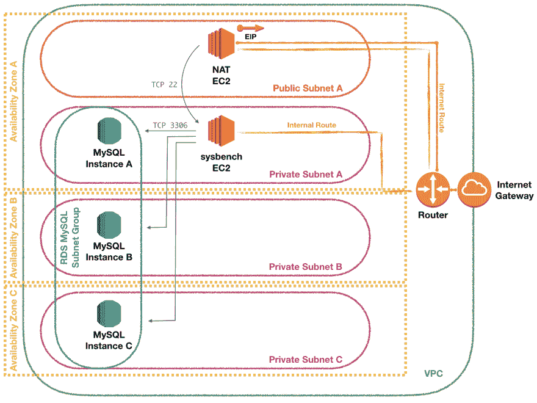
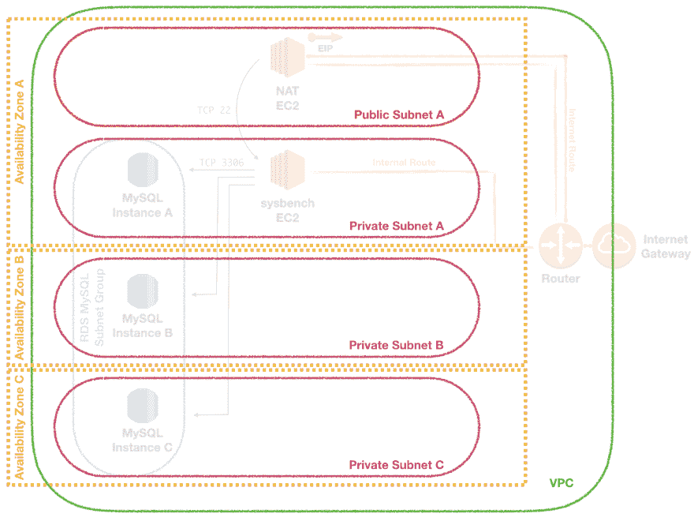
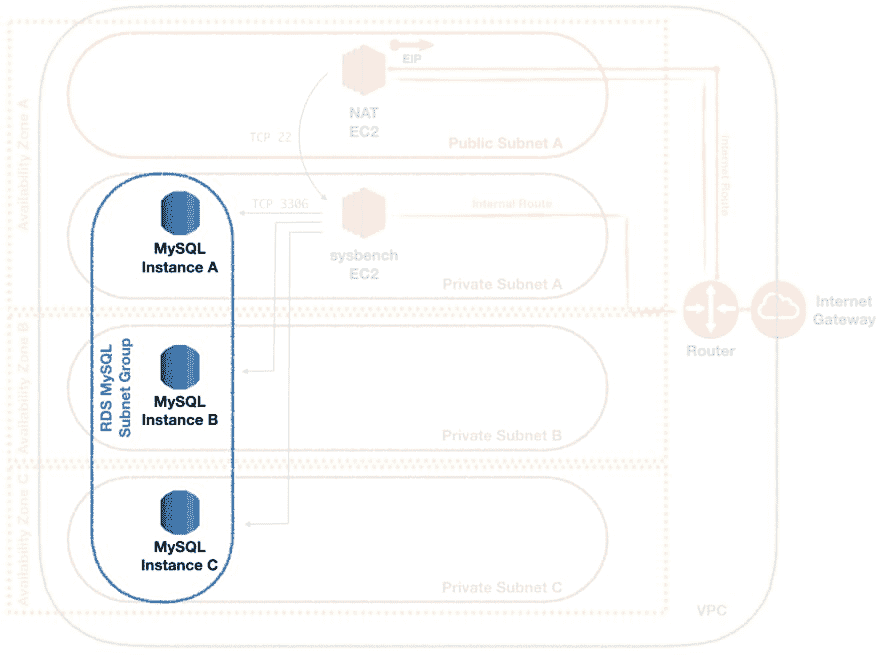
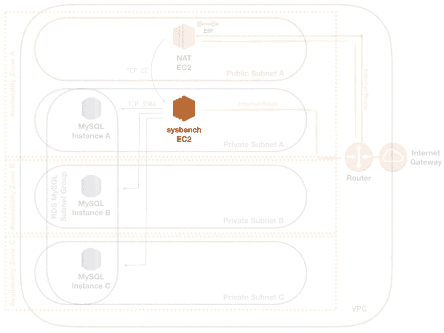
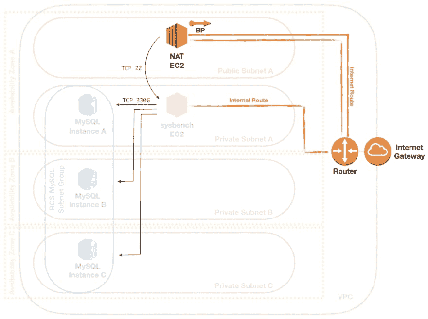

# 部署 AWS RDS MySQL 实例并进行基准测试

> 原文：<https://dev.to/frosnerd/deploying-and-benchmarking-an-aws-rds-mysql-instance-2faf>

这篇博文是我的 AWS 系列的一部分:

*   [基础设施作为使用 Terraform 的代码管理 AWS](https://dev.to/frosnerd/infrastructure-as-code---managing-aws-with-terraform-i9o)
*   [使用 Lambda 和 API 网关在 AWS 上部署 HTTP API](https://dev.to/frosnerd/deploying-an-http-api-on-aws-using-lambda-and-api-gateway-g61)
*   [使用 Elastic Beanstalk 在 AWS 上部署 HTTP API](https://dev.to/frosnerd/deploying-an-http-api-on-aws-using-elastic-beanstalk-5dh7)
*   [**部署 AWS RDS MySQL 实例并进行基准测试**](#)
*   [AWS 中使用社交网络、SQS 和 Lambda 的事件处理](https://dev.to/frosnerd/event-handling-in-aws-using-sns-sqs-and-lambda-2ng)
*   [使用 Terraform 和 Travis CI 在 AWS 上连续交付](https://dev.to/frosnerd/continuous-delivery-on-aws-with-terraform-and-travis-ci-3914)
*   [使用物联网核心、Kinesis 和 ElastiCache 在 AWS 上处理传感器数据](https://dev.to/frosnerd/sensor-data-processing-on-aws-using-iot-core-kinesis-and-elasticache-26j1)
*   [使用 CloudWatch 监控 AWS Lambda 功能](https://dev.to/frosnerd/monitoring-aws-lambda-functions-with-cloudwatch-1nap)

# 简介

在之前的帖子中，我们重点关注 AWS 的计算和应用程序部署部分。尽管我们在这里或那里使用了一些 S3，但我们并没有过多地讨论其他持久性机制。我们也没怎么接触网络部分。AWS 为包括网络在内的许多组件提供了合理的默认值，因此您可以快速入门。

在这篇博文中，我们将看看如何使用 [AWS RDS](https://aws.amazon.com/rds) 部署关系数据库。为了更加有趣，我们将添加一个 EC2 实例，它能够连接数据库并在其上运行一个示例性的基准测试。这需要创建自定义的网络组件，如子网、路由表和安全组。[的源代码](https://github.com/FRosner/aws_rds_test)可以在 GitHub 上获得。

该职位的其余部分结构如下。首先是目标架构的概述，包括 RDS 和 EC2 实例，以及所有需要的网络资源。然后——你可能已经猜到了——我们将一步一步地详细介绍如何使用 Terraform 进行设置。我们通过讨论主要发现来结束这篇文章。

# 建筑

我们基础设施的核心组件将是一个由 RDS 管理的 MySQL 数据库和一个 EC2 实例，我们可以从中运行基准测试。为了以我们可以使用的方式设置它，我们将使用以下体系结构:

[T2】](https://res.cloudinary.com/practicaldev/image/fetch/s--3OTBjLVk--/c_limit%2Cf_auto%2Cfl_progressive%2Cq_auto%2Cw_880/https://thepracticaldev.s3.amazonaws.com/i/7fr9it72kyor0in4owe0.png)

让我们详细研究一下各个部分。我们所有的实例都放在一个 [VPC](https://docs.aws.amazon.com/AmazonVPC/latest/UserGuide/VPC_Introduction.html) 中。VPC 是一个虚拟网络，它与云中的其他租户相隔离，拥有自己的私有 IP 地址范围。在 VPC 内将有[子网](https://docs.aws.amazon.com/AmazonVPC/latest/UserGuide/VPC_Subnets.html)。我们正在创建三个专用子网(A - C)和一个公共子网(A)。公共子网是通过[互联网网关](https://docs.aws.amazon.com/AmazonVPC/latest/UserGuide/VPC_Internet_Gateway.html)到互联网的子网。

创建子网时，我们必须选择一个[可用区域](https://docs.aws.amazon.com/AWSEC2/latest/UserGuide/using-regions-availability-zones.html)。每个区域，例如在我们的例子中的`eu-central-1`,有多个可用区域。可用性区域映射到物理上分离的硬件，例如位于不同的建筑物中。通过为我们的子网选择不同的可用性区域，我们允许 AWS 在一个可用性区域中断的情况下在 MySQL 实例之间配置故障转移机制。

RDS 的设置需要定义一个[子网组](https://docs.aws.amazon.com/AmazonRDS/latest/UserGuide/USER_VPC.WorkingWithRDSInstanceinaVPC.html)。通过对跨越三个可用性区域的三个私有子网进行分组，我们允许 AWS 在这些子网内启动冗余实例。

我们将要从中运行 [sysbench](https://github.com/akopytov/sysbench) 基准测试的 EC2 实例被放置在一个私有子网内，因为我们不需要它具有高可用性。为了 SSH 到那台机器，我们需要通过一个在公共子网中运行的实例。我们使用一个 [NAT 实例](https://docs.aws.amazon.com/AmazonVPC/latest/UserGuide/VPC_NAT_Instance.html)作为我们的[堡垒主机](https://en.wikipedia.org/wiki/Bastion_host)。

除了正确的[路由](https://docs.aws.amazon.com/AmazonVPC/latest/UserGuide/VPC_Route_Tables.html)在互联网网关和 NAT 实例之间，以及 NAT 实例和 sysbench 实例所在的私有子网之间，我们还需要相应地设置[安全组](https://docs.aws.amazon.com/AWSEC2/latest/UserGuide/using-network-security.html)。

安全组对应于一组资源，这些资源在网络方面共享相同的访问规则。你可以把它想象成一个防火墙配置。我们将使端口 22 上来自互联网的 TCP 流量通过 NAT 实例流向我们的专用子网 a。此外，我们的 sysbench 实例将通过端口 3306 访问 MySQL RDS 安全组，以便连接到数据库。

现在我们已经熟悉了整体架构，让我们看看如何使用 Terraform 创建基础设施。

# 实现

## 基本联网

首先，我们将创建基本的网络资源，将技术部分排除在外。我们需要一个有一个公有子网和三个私有子网的 VPC。下图突出显示了我们现在正在创建的零件。

[T2】](https://res.cloudinary.com/practicaldev/image/fetch/s--FAy-RlwX--/c_limit%2Cf_auto%2Cfl_progressive%2Cq_auto%2Cw_880/https://thepracticaldev.s3.amazonaws.com/i/c95gy9xa6j8acg1bbx21.png)

### VPC

VPC 的配置很简单。我们需要做的就是在子网前缀的 [CIDR 符号](https://en.wikipedia.org/wiki/Classless_Inter-Domain_Routing)中为我们的虚拟网络指定一个 IP 范围。我们将使用`10.0.0.0/16`，它为我们提供了从`10.0.0.1`到`10.0.255.254`的 65534 个不同的主机 IP 地址。如果你想仔细检查，我推荐使用一个子网掩码计算器工具，比如 [ipcalc](http://jodies.de/ipcalc) 。

```
resource "aws_vpc" "rds_test" {
  cidr_block = "10.0.0.0/16"
} 
```

Enter fullscreen mode Exit fullscreen mode

### 可用性区域

目前`eu-central-1`支持三个可用区:`eu-central-1a`、`eu-central-1b`和`eu-central-1c`。我们可以使用`data`节在 Terraform 中访问它们。我们没有定义`resource`，因为可用性区域本身不是由 Terraform 创建或销毁的，而是被引用的。

```
data "aws_availability_zone" "eu-central-1a" {
  name = "eu-central-1a"
}

data "aws_availability_zone" "eu-central-1b" {
  name = "eu-central-1b"
}

data "aws_availability_zone" "eu-central-1c" {
  name = "eu-central-1c"
} 
```

Enter fullscreen mode Exit fullscreen mode

### 子网

接下来，我们将 VPC 划分为多个子网。由于我们的 VPC ( `10.0.0.0/16`)只有 65534 个可用地址，我们需要以某种方式分配它们。幸运的是，Terraform 提供了一种方便的方法，使用 [`cidrsubnet`](https://www.terraform.io/docs/configuration/interpolation.html#cidrsubnet-iprange-newbits-netnum-) 内置函数来实现。

将您的可用 IP 地址平均分配给更小的子网。它需要三个参数:

1.  要划分成子网的网络，例如`10.0.0.0/16`。
2.  较小网络的大小由子网掩码的差异给出，例如`4`将`10.0.0.0/16`划分成大小为`/20`的子网。
3.  子网的索引。

给定三个参数，包括索引 *i* ，它将输出对应于原始网络内给定大小的第 *i* 子网的新 CIDR 块。使用这些信息，我们可以根据子网所在的可用性区域为子网分配一个索引，再加上一个公共子网的索引，从而方便地枚举子网。我们可以使用类型为`map`的变量在 Terraform 中实现这一点。

```
variable "az_number" {
  type = "map"
  # 1 = public subnet
  default = {
    a = 2
    b = 3
    c = 4
  }
} 
```

Enter fullscreen mode Exit fullscreen mode

现在我们可以定义公共子网和三个私有子网:

```
resource "aws_subnet" "eu-central-1a-public" {
  vpc_id = "${aws_vpc.rds_test.id}"
  cidr_block = "${cidrsubnet(aws_vpc.rds_test.cidr_block, 4, 1)}"
  availability_zone = "${data.aws_availability_zone.eu-central-1a.id}"
}

resource "aws_subnet" "rds_test_a" {
  vpc_id     = "${aws_vpc.rds_test.id}"
  cidr_block = "${cidrsubnet(aws_vpc.rds_test.cidr_block, 4, var.az_number[data.aws_availability_zone.eu-central-1a.name_suffix])}"
  availability_zone = "${data.aws_availability_zone.eu-central-1a.id}"
}

resource "aws_subnet" "rds_test_b" {
  vpc_id     = "${aws_vpc.rds_test.id}"
  cidr_block = "${cidrsubnet(aws_vpc.rds_test.cidr_block, 4, var.az_number[data.aws_availability_zone.eu-central-1b.name_suffix])}"
  availability_zone = "${data.aws_availability_zone.eu-central-1b.id}"
}

resource "aws_subnet" "rds_test_c" {
  vpc_id     = "${aws_vpc.rds_test.id}"
  cidr_block = "${cidrsubnet(aws_vpc.rds_test.cidr_block, 4, var.az_number[data.aws_availability_zone.eu-central-1c.name_suffix])}"
  availability_zone = "${data.aws_availability_zone.eu-central-1c.id}"
} 
```

Enter fullscreen mode Exit fullscreen mode

接下来，让我们创建 MySQL RDS。

## RDS

为了创建一个新的 MySQL 数据库，我们需要首先创建一个子网组和一个我们可以将它分配到的安全组。下图突出显示了我们现在正在创建的组件。

[T2】](https://res.cloudinary.com/practicaldev/image/fetch/s--PdXJzcUv--/c_limit%2Cf_auto%2Cfl_progressive%2Cq_auto%2Cw_880/https://thepracticaldev.s3.amazonaws.com/i/vmp86ozhr6o5blaqjsb4.png)

当创建一个新的 MySQL RDS 实例时，您必须指定一个至少跨越两个可用区域的子网组。首先，我们创建子网组，并为其分配三个专用子网。

```
resource "aws_db_subnet_group" "rds_test" {
  name       = "rds_test"
  subnet_ids = ["${aws_subnet.rds_test_a.id}", "${aws_subnet.rds_test_b.id}", "${aws_subnet.rds_test_c.id}"]
} 
```

Enter fullscreen mode Exit fullscreen mode

为了控制进出数据库的访问，我们还需要一个安全组。它还没有任何相关联的规则。

```
resource "aws_security_group" "rds_test_mysql" {
  name = "rds_test_mysql"
  description = "RDS Test MySQL Security Group"
  vpc_id = "${aws_vpc.rds_test.id}"
} 
```

Enter fullscreen mode Exit fullscreen mode

接下来，我们可以定义 MySQL 资源。除了实例名称之外，我们还需要提供以下信息:

*   我们要分配的存储量(GB)和类型。
*   数据库引擎和版本，在我们的例子中是 MySQL 5.7。AWS 还支持其他引擎，如 PostgreSQL 或 Amazon Aurora。
*   [EC2 实例类型](https://docs.aws.amazon.com/AmazonRDS/latest/UserGuide/Concepts.DBInstanceClass.html)，取决于你的内存和 CPU 需求。
*   初始登录凭据。强烈建议将秘密注入到您的脚本中，而不要将它们存储在您的源代码库中的任何地方。另外，请确保将 Terraform 状态文件存储在安全的地方，因为它也可能包含这些秘密。
*   要使用的[参数组](https://docs.aws.amazon.com/AmazonRDS/latest/UserGuide/USER_WorkingWithParamGroups.html)。参数组允许您重用数据库配置，但我们坚持使用默认配置。
*   我们之前创建的子网组和安全组。
*   决定删除策略。我们可以选择一个`final_snapshot_identifier`，它将用于在数据库被删除之前创建数据库的最终快照，或者将`skip_final_snapshot`设置为 true，以便丢弃没有任何快照的数据库。

此外，我们将传递一个名为`apply_immediately`的参数，该参数指示对数据库的更改是应该在发出后立即应用，还是应该排队到下一个维护窗口。为了方便起见，我把它编码成一个变量。

```
variable "apply_immediately" {
  default = "false"
  description = "Whether to deploy changes to the database immediately (true) or at the next maintenance window (false)."
}

resource "aws_db_instance" "rds_test_mysql" {
  allocated_storage      = 10
  storage_type           = "gp2"
  engine                 = "mysql"
  engine_version         = "5.7"
  instance_class         = "db.t2.micro"
  name                   = "rds_test_mysql"
  username               = "foo"
  password               = "foobarbaz"
  parameter_group_name   = "default.mysql5.7"
  db_subnet_group_name   = "${aws_db_subnet_group.rds_test.name}"
  vpc_security_group_ids = ["${aws_security_group.rds_test_mysql.id}"]
  apply_immediately      = "${var.apply_immediately}"
  skip_final_snapshot    = true
} 
```

Enter fullscreen mode Exit fullscreen mode

现在是 sysbench EC2 实例的时候了。

## Sysbench 实例

为了进行 sysbench MySQL 基准测试，我们需要安装`sysbench`和`mysql-client-core-5.7`包。为此，我们首先使用[打包器](https://www.packer.io/)创建一个新的 AMI，并将其部署在 EC2 实例上。

[T2】](https://res.cloudinary.com/practicaldev/image/fetch/s--GITsQ4cQ--/c_limit%2Cf_auto%2Cfl_progressive%2Cq_auto%2Cw_880/https://thepracticaldev.s3.amazonaws.com/i/iq6m3wb6rob1rqeck2f1.png)

### 阿美创作

要创建一个新的 AMI，我们需要指定关于如何构建 AMI 以及如何提供它的信息。Packer 支持不同的[置备程序](https://www.packer.io/docs/provisioners/index.html)，这些置备程序可用于在构建的映像被推送到 AWS 并可供使用之前对其进行定制。

在这一点上，我不想详细介绍 Packer，但是大多数参数或多或少都是不言自明的。我们可以将下面的 JSON 传递给`packer build`来接收一个安装了 sysbench 和 MySQL 5.7 客户端的 Ubuntu 映像。

```
{  "builders":  [{  "type":  "amazon-ebs",  "region":  "eu-central-1",  "source_ami_filter":  {  "filters":  {  "virtualization-type":  "hvm",  "name":  "ubunimg/*ubuntu-xenial-16.04-amd64-server-*",  "root-device-type":  "ebs"  },  "owners":  ["099720109477"],  "most_recent":  true  },  "instance_type":  "t2.micro",  "ssh_username":  "ubuntu",  "ami_name":  "rds_test_sysbench {{timestamp}}"  }],  "provisioners":  [{  "type":  "shell",  "inline":  [  "sudo apt-get update",  "sudo apt-get install -y sysbench",  "sudo apt-get install -y mysql-client-core-5.7"  ]  }]  } 
```

Enter fullscreen mode Exit fullscreen mode

### 实例定义

创建 EC2 实例的方式与第一次发布中的方式相同。我们需要指定映像、实例类型、授权的公钥以及子网和安全组。将创建安全组，但是与 RDS 安全组类似，还没有任何与之关联的规则。

```
data "aws_ami" "rds_test_sysbench" {
  most_recent      = true
  name_regex = "rds_test_sysbench.*"
  owners     = ["195499643157"]
}

resource "aws_security_group" "rds_test_sysbench" {
  name = "rds_test_sysbench"
  vpc_id = "${aws_vpc.rds_test.id}"
}

resource "aws_key_pair" "my-key" {
  key_name = "my-key"
  public_key = "${file("~/.ssh/id_rsa.pub")}"
}

resource "aws_instance" "rds_test_sysbench" {
  ami           = "${data.aws_ami.rds_test_sysbench.id}"
  instance_type = "t2.micro"
  key_name = "${aws_key_pair.my-key.key_name}"
  vpc_security_group_ids = ["${aws_security_group.rds_test_sysbench.id}"]
  subnet_id = "${aws_subnet.rds_test_a.id}"
} 
```

Enter fullscreen mode Exit fullscreen mode

## 在网络中找路

最后但同样重要的是，我们需要连接所有不同的组件，并授予自己访问系统的方法。为此，我们需要在公共子网中设置我们的堡垒主机，配置互联网网关，调整互联网网关、公共子网和私有子网之间的路由逻辑，以及向我们的安全组添加规则。

[T2】](https://res.cloudinary.com/practicaldev/image/fetch/s--wPGsHfiT--/c_limit%2Cf_auto%2Cfl_progressive%2Cq_auto%2Cw_880/https://thepracticaldev.s3.amazonaws.com/i/5m971kvh0q8vnj03nmdh.png)

### EC2 NAT 实例

我们的堡垒主机将运行 AMI。建议始终使用最新的 NAT AMI 来利用配置更新。

默认情况下，EC2 实例对网络数据包的来源或目的地执行检查，确保它是该数据包的来源或目的地。要使 NAT 实例正常工作，我们必须禁用此检查。

像以前一样，我们必须提供一个安全组。这一次，我们已经可以填充传入和传出 SSH 流量的规则了。

```
resource "aws_security_group" "rds_test_nat" {
  name = "rds_test_nat"
  description = "Allow SSH"

  ingress {
    from_port = 22
    to_port = 22
    protocol = "tcp"
    cidr_blocks = ["0.0.0.0/0"]
  }
  egress {
    from_port = 22
    to_port = 22
    protocol = "tcp"
    cidr_blocks = ["${aws_vpc.rds_test.cidr_block}"]
  }

  vpc_id = "${aws_vpc.rds_test.id}"
} 
```

Enter fullscreen mode Exit fullscreen mode

接下来是 EC2 实例。

```
data "aws_ami" "nat" {
  most_recent      = true
  name_regex = "amzn-ami-vpc-nat-hvm-2018.03.0.20180508-x86_64-ebs"
  owners     = ["137112412989"]
}

resource "aws_instance" "rds_test_nat" {
  ami = "${data.aws_ami.nat.id}"
  availability_zone = "${data.aws_availability_zone.eu-central-1a.id}"
  instance_type = "t2.micro"
  key_name = "${aws_key_pair.my-key.key_name}"
  vpc_security_group_ids = ["${aws_security_group.rds_test_nat.id}"]
  subnet_id = "${aws_subnet.eu-central-1a-public.id}"
  associate_public_ip_address = true
  source_dest_check = false
} 
```

Enter fullscreen mode Exit fullscreen mode

### 互联网网关和路由表

因特网网关是子网公开的原因。准确地说，它是一个在子网和互联网网关之间路由流量的路由表，这使得它被视为公共的。我们可以通过提供它应该运行的 VPC 来创建一个互联网网关。

```
resource "aws_internet_gateway" "rds_test" {
  vpc_id = "${aws_vpc.rds_test.id}"
} 
```

Enter fullscreen mode Exit fullscreen mode

需要一个路由表将所有非子网流量路由到互联网网关，一个路由表将所有流量路由到我们的 NAT 实例。

```
resource "aws_route_table" "eu-central-1a-public" {
  vpc_id = "${aws_vpc.rds_test.id}"

  route {
    cidr_block = "0.0.0.0/0"
    gateway_id = "${aws_internet_gateway.rds_test.id}"
  }
}

resource "aws_route_table" "eu-central-private" {
  vpc_id = "${aws_vpc.rds_test.id}"

  route {
    cidr_block = "0.0.0.0/0"
    instance_id = "${aws_instance.rds_test_nat.id}"
  }
} 
```

Enter fullscreen mode Exit fullscreen mode

通过将路由表关联到子网，它变得有效。我们将把 internet 网关路由表分配给公共子网，把 NAT 路由表分配给包含 sysbench 主机的私有子网。

```
resource "aws_route_table_association" "eu-central-1a-public" {
  subnet_id = "${aws_subnet.eu-central-1a-public.id}"
  route_table_id = "${aws_route_table.eu-central-1a-public.id}"
}

resource "aws_route_table_association" "eu-central-1a-private" {
  subnet_id = "${aws_subnet.rds_test_a.id}"
  route_table_id = "${aws_route_table.eu-central-private.id}"
} 
```

Enter fullscreen mode Exit fullscreen mode

### 添加安全组规则

我们需要做的最后一件事是调整 MySQL 和 sysbench 安全组的防火墙规则。在 Terraform 中，您可以像我们为 NAT 实例所做的那样，直接在`aws_security_group`节中提供安全组规则，或者您可以将规则作为单独的`aws_security_group_rule`资源添加。

首先，让我们配置 MySQL 安全组，允许来自 sysbench 安全组的流量通过端口 3306 进入。

```
resource "aws_security_group_rule" "mysql_in" {
  type            = "ingress"
  from_port       = 3306
  to_port         = 3306
  protocol        = "tcp"
  source_security_group_id = "${aws_security_group.rds_test_sysbench.id}"

  security_group_id = "${aws_security_group.rds_test_mysql.id}"
} 
```

Enter fullscreen mode Exit fullscreen mode

然后，我们还需要向 sysbench 安全组添加一个面向 MySQL 组的传出规则。此外，我们需要接受传入的 SSH 流量。这里我们将从任何地方接受 SSH，尽管此时 bastion 主机是唯一能够到达我们的 sysbench 主机的实例。

```
resource "aws_security_group_rule" "mysql_out" {
  type            = "egress"
  from_port       = 3306
  to_port         = 3306
  protocol        = "tcp"
  source_security_group_id = "${aws_security_group.rds_test_mysql.id}"

  security_group_id = "${aws_security_group.rds_test_sysbench.id}"
}

resource "aws_security_group_rule" "sysbench_ssh_in" {
  type            = "ingress"
  from_port       = 22
  to_port         = 22
  protocol        = "tcp"
  cidr_blocks = ["0.0.0.0/0"]

  security_group_id = "${aws_security_group.rds_test_sysbench.id}"
} 
```

Enter fullscreen mode Exit fullscreen mode

## 通过 SSH 隧道连接

现在一切都差不多设置好了，让我们通过 SSH 连接吧！但是连接到哪里呢？堡垒主机的地址是什么？

为了方便起见，我们将为我们的 NAT 实例分配一个[弹性 IP](https://docs.aws.amazon.com/AmazonVPC/latest/UserGuide/vpc-eips.html) 。在创建弹性 IP 之前，要求互联网网关可用，否则子网不会被视为公共子网。我们可以使用`depends_on`键显式声明这种依赖性。

```
resource "aws_eip" "rds_test_nat" {
  instance = "${aws_instance.rds_test_nat.id}"
  depends_on = ["aws_internet_gateway.rds_test"]
  vpc = true
} 
```

Enter fullscreen mode Exit fullscreen mode

我们还可以生成我们需要使用的 SSH 命令，以便通过 bastion 主机到达 sysbench 实例。首先，我们通过隧道将指向本地端口 2201 的流量转发到端口 22 上的 sysbench 私有 IP。然后我们连接到本地端口 2201。

```
output "ssh-tunnel" {
  value = "ssh ec2-user@${aws_eip.rds_test_nat.public_ip} -L 2201:${aws_instance.rds_test_sysbench.private_ip}:22"
}

output "ssh" {
  value = "ssh -o UserKnownHostsFile=/dev/null -o StrictHostKeyChecking=no ubuntu@localhost -p 2201"
} 
```

Enter fullscreen mode Exit fullscreen mode

我们跑完之后，一切都准备好了。我们可以在两个终端窗口中运行 SSH 命令。

```
$ ssh ec2-user@18.185.78.248 -L 2201:10.0.36.116:22

__|  __|_  )
_|  (     /   Amazon Linux AMI
___|\___|___|

https://aws.amazon.com/amazon-linux-ami/2018.03-release-notes/
[ec2-user@ip-10-0-22-123 ~]$ 
```

Enter fullscreen mode Exit fullscreen mode

```
$ ssh -o UserKnownHostsFile=/dev/null -o StrictHostKeyChecking=no ubuntu@localhost -p 2201

Welcome to Ubuntu 16.04.4 LTS (GNU/Linux 4.4.0-1060-aws x86_64)
ubuntu@ip-10-0-33-52:~$ 
```

Enter fullscreen mode Exit fullscreen mode

## 运行基准

Sysbench 支持测试系统的不同组件，如 RAM、CPU 和磁盘。它还支持 MySQL 数据库的基准测试。我们需要做的是:

1.  创建一个名为`sbtest`的新数据库
2.  为我们的基准测试准备数据库
3.  运行基准测试
4.  ？？？
5.  利润

我再次使用 Terraform 输出变量来生成每个步骤所需的命令。

```
output "sysbench_cmd_1" {
  value = "mysql -u${aws_db_instance.rds_test_mysql.username} -p${aws_db_instance.rds_test_mysql.password} -h${aws_db_instance.rds_test_mysql.address} -P${aws_db_instance.rds_test_mysql.port} -e 'create database sbtest;'"
}

output "sysbench_cmd_2" {
  value = "sysbench --test=oltp --oltp-table-size=250 --mysql-user=${aws_db_instance.rds_test_mysql.username} --mysql-password=${aws_db_instance.rds_test_mysql.password} --db-driver=mysql --mysql-host=${aws_db_instance.rds_test_mysql.address} --mysql-port=${aws_db_instance.rds_test_mysql.port} prepare"
}

output "sysbench_cmd_3" {
  value = "sysbench --db-driver=mysql --num-threads=4 --max-requests=10 --test=oltp --mysql-table-engine=innodb --oltp-table-size=250 --max-time=300 --mysql-engine-trx=yes --mysql-user=${aws_db_instance.rds_test_mysql.username} --mysql-password=${aws_db_instance.rds_test_mysql.password} --mysql-host=${aws_db_instance.rds_test_mysql.address} --mysql-port=${aws_db_instance.rds_test_mysql.port} run"
} 
```

Enter fullscreen mode Exit fullscreen mode

然后我们可以一步一步地执行它们。我将选择一个非常小的表，并大幅限制线程和请求的数量。如果您真的想了解数据库的性能，不建议这样做。但是我不想把所有的请求都交给我的 RDS 实例😉。

```
# Create sbtest database
mysql -ufoo -pfoobarbaz \
  -hterraform-20180619122208519900000001.cuz2lrjuxtf2.eu-central-1.rds.amazonaws.com \
  -P3306 -e 'create database sbtest;' 
```

Enter fullscreen mode Exit fullscreen mode

```
# Prepare database for OLTP workload
sysbench --test=oltp --oltp-table-size=250 --db-driver=mysql \
  --mysql-user=foo --mysql-password=foobarbaz \
  --mysql-host=terraform-20180619122208519900000001.cuz2lrjuxtf2.eu-central-1.rds.amazonaws.com \
  --mysql-port=3306 prepare 
```

Enter fullscreen mode Exit fullscreen mode

```
# Run OLTP benchmark
sysbench --num-threads=4 --max-requests=10 \
  --db-driver=mysql --test=oltp --mysql-table-engine=innodb \
  --oltp-table-size=250 --max-time=300 --mysql-engine-trx=yes \
  --mysql-user=foo --mysql-password=foobarbaz \ --mysql-host=terraform-20180619122208519900000001.cuz2lrjuxtf2.eu-central-1.rds.amazonaws.com \
  --mysql-port=3306 run 
```

Enter fullscreen mode Exit fullscreen mode

```
OLTP test statistics:
queries performed:
    read:                            210
    write:                           58
    other:                           25
    total:                           293
transactions:                        10     (103.26 per sec.)
deadlocks:                           5      (51.63 per sec.)
read/write requests:                 268    (2767.31 per sec.)
other operations:                    25     (258.14 per sec.) 
```

Enter fullscreen mode Exit fullscreen mode

就这样。很简单，不是吗？我相信这就足够了。完成实验后，不要忘记摧毁你的基础设施。

# 讨论

我们已经看到在 AWS 中生成一个高度可用的关系数据库是多么容易。但我们也看到了自己管理网络会变得多么复杂。当然，尽可能多地使用默认组件总是可能的，但是如果你试图构建一些安全的东西，在这一部分投入一些时间是有意义的。

我真的很喜欢 AWS 允许您配置网络的粒度。即使你更新了现有的规则，它的运行速度也非常快。Terraform 通过其内置函数支持。

Packer 允许您创建自定义 ami，以防您找不到任何符合您需求的公开可用 ami。这是一个简单但强大的工具，每个使用 Terraform 的 AWS 工作人员都应该知道。

请注意，通常您会设置一个 NAT 实例来授权我们的私有子网访问互联网，而不会直接暴露于互联网。但是，我们没有以允许流量从私有子网内的组件流向 NAT 实例的方式配置防火墙。我们主要使用 NAT 实例作为堡垒主机。如果您需要从私有实例内部访问 internet，则需要修改 NAT 安全组。有关详细信息，请参见 AWS 文档中的章节[创建 NATSG 安全组](https://docs.aws.amazon.com/AmazonVPC/latest/UserGuide/VPC_NAT_Instance.html)。

您自己是否配置过虚拟私有云环境？与其他主要云提供商的网络机制相比，AWS 网络机制如何？请在评论中告诉我你的想法！