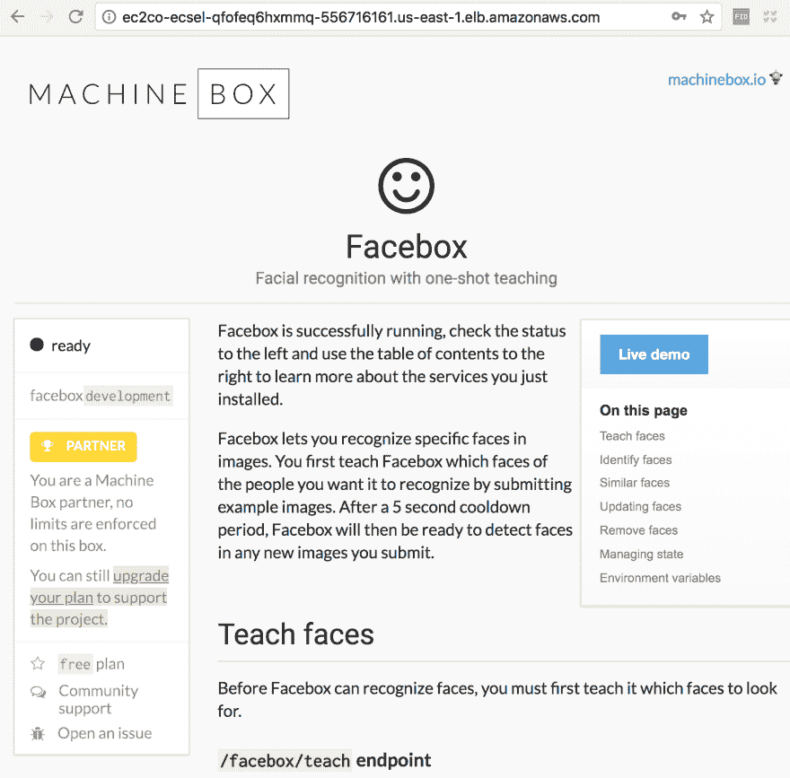

# 将 Facebox 部署到 AWS ECS

> 原文：<https://dev.to/plutov/deploying-facebox-to-aws-ecs-fhn>

[T2】](https://res.cloudinary.com/practicaldev/image/fetch/s--fcChtmC8--/c_limit%2Cf_auto%2Cfl_progressive%2Cq_auto%2Cw_880/https://pliutau.com/facebox-ecs.png)

目前我正在构建一个基于人脸识别功能的产品，我正在使用 [Facebox](https://machinebox.io/docs/facebox) 和 [go-sdk](https://github.com/machinebox/sdk-go/tree/master/facebox) ，因为这是将人脸识别功能添加到您的项目中的最简单方法。而且对开发者超级友好:

```
docker run -p 8080:8080 -e "MB_KEY=$MB_KEY" machinebox/facebox 
```

Enter fullscreen mode Exit fullscreen mode

今天是我部署项目的时候了。由于我们使用 AWS，我必须将我的 Facebox 实例部署到 ECS(弹性容器服务)。在这篇文章中，我将用几分钟时间告诉你如何做。

### 创建集群

进入服务-> ECS 并点击[开始](https://console.aws.amazon.com/ecs/home?region=us-east-1#/firstRun)(我使用的是 N. Virginia 地区，但它应该也适用于其他地区)。

选择`custom`图像，点击`Configure`。

[T2】](https://res.cloudinary.com/practicaldev/image/fetch/s--gZBQ4v5r--/c_limit%2Cf_auto%2Cfl_progressive%2Cq_auto%2Cw_880/https://pliutau.com/facebox-ecs1.png)

### 容器配置

设置容器名称和`machinebox/facebox`图像，ECS 将从 Docker Hub 中提取一个。机器盒子团队[建议](https://machinebox.io/docs/setup/docker)为你的盒子设置至少 4GM 内存，所以我们将内存限制设置为 4096。Facebox API 运行在容器端口 8080 上，所以我们应该公开它。Fargate 模式不允许为映射指定不同的主机端口，所以稍后我们将在 EC2 负载平衡部分修复它。

[T2】](https://res.cloudinary.com/practicaldev/image/fetch/s--N-AmzGHP--/c_limit%2Cf_auto%2Cfl_progressive%2Cq_auto%2Cw_880/https://pliutau.com/facebox-ecs2.png)

### 环境变量

当你在 [machinebox.io](https://machinebox.io) 上注册时，你会得到一个 MB_KEY，你应该在`Advanced container configuration`部分将其设置为环境变量。

同样，由于我们的 Facebox 可以通过公共 IP 访问，最好用[基本授权](https://machinebox.io/docs/machine-box-apis#basic-authentication)来保护它，所以我们设置了`MB_BASICAUTH_USER`和`MB_BASICAUTH_PASS`环境变量。对机器的所有请求现在都必须包括基本身份验证 HTTP 头。

[T2】](https://res.cloudinary.com/practicaldev/image/fetch/s--sMiQIgTZ--/c_limit%2Cf_auto%2Cfl_progressive%2Cq_auto%2Cw_880/https://pliutau.com/facebox-ecs3.png)

### 任务定义

点击任务定义->编辑，设置`Task memory: 4GB (4096)`和`Task CPU: 2 vCPU (2048)`，也给我们的任务定义起一个名字。点击`Next`。

### 服务定义

在这里，您只需要使用侦听器端口 8080 启用应用程序负载平衡，并为您的服务命名。

[T2】](https://res.cloudinary.com/practicaldev/image/fetch/s--96JvF6nz--/c_limit%2Cf_auto%2Cfl_progressive%2Cq_auto%2Cw_880/https://pliutau.com/facebox-ecs4.png)

### 搞定

设置一个集群名称，点击`Create`。ECS 提取映像并运行它需要几分钟时间，一段时间后，您将看到您的群集已启动，任务正在运行:

[T2】](https://res.cloudinary.com/practicaldev/image/fetch/s--b_rMaU9t--/c_limit%2Cf_auto%2Cfl_progressive%2Cq_auto%2Cw_880/https://pliutau.com/facebox-ecs5.png)

### 查看一下

现在让我们将监听器端口从 8080 更改为 80，打开 EC2 ->负载平衡器，转到 Listeners 选项卡，找到 8080 监听器并单击`Edit`。把 8080 改成 80。

[T2】](https://res.cloudinary.com/practicaldev/image/fetch/s--Ade2gXPC--/c_limit%2Cf_auto%2Cfl_progressive%2Cq_auto%2Cw_880/https://pliutau.com/facebox-ecs7.png)

由于我们启用了应用程序负载平衡，您将能够通过公共端点访问您的 Facebox 控制台。您可以在 ECS 服务或负载平衡器描述中找到它。

输入您的基本验证用户名/密码，您将能够看到控制台。

[T2】](https://res.cloudinary.com/practicaldev/image/fetch/s--Sesgaymq--/c_limit%2Cf_auto%2Cfl_progressive%2Cq_auto%2Cw_880/https://pliutau.com/facebox-ecs6.png)