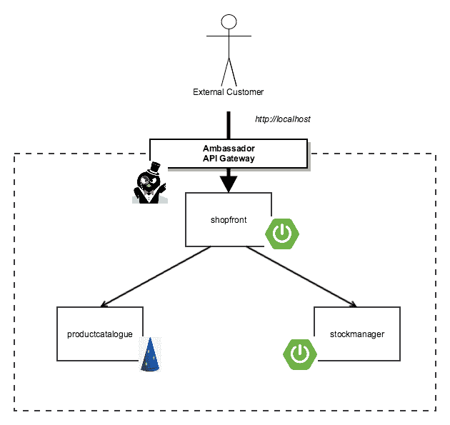

# 使用 Kubernetes 和 Ambassador API 网关部署 Java 应用程序

> 原文：<https://dev.to/datawireio/deploying-java-apps-with-kubernetes-and-the-ambassador-api-gateway--6pn>

在本文中，您将了解如何将三个简单的 Java 服务部署到 Kubernetes 中(通过新的 Docker for Mac/Windows 集成在本地运行)，并通过 Kubernetes-native Ambassador API 网关向最终用户公开前端服务。所以，拿起你选择的含咖啡因的饮料，在你的终端前舒服地休息一下吧！

## 快速回顾:架构和部署

去年 10 月，我用 [Kubernetes 支持](https://www.oreilly.com/ideas/how-to-manage-docker-containers-in-kubernetes-with-java)扩展了我的简单的基于 Java 微服务的“ [Docker Java Shopping](https://github.com/danielbryantuk/oreilly-docker-java-shopping) ”容器部署演示。如果您有时间完成本教程，您应该已经在 Docker images 中打包了三个简单的 Java 服务 shopfront 和 stockmanager Spring Boot 服务，以及产品目录 Java EE DropWizard 服务，并将生成的容器部署到本地的 [minikube 支持的](https://github.com/kubernetes/minikube) Kubernetes 集群中。我还向您展示了如何通过使用[节点端口服务](https://kubernetes.io/docs/concepts/services-networking/service/#type-nodeport)映射和公开 Kubernetes 集群端口，向最终用户开放店面服务。虽然这对于演示来说是可行的，但是许多人问如何在 API 网关后面部署应用程序。这是一个很好的问题，因此我渴望在本教程系列中添加另一篇文章，目标是在开源的 Kubernetes-native[Ambassador API Gateway](https://www.getambassador.io/)后面部署“Docker Java Shopping”Java 应用程序。

[](https://res.cloudinary.com/practicaldev/image/fetch/s--HfAtQJv5--/c_limit%2Cf_auto%2Cfl_progressive%2Cq_auto%2Cw_880/https://www.datawire.io/wp-content/uploads/2018/02/ambassador-tutorial.png) 
**图 1。使用 Ambassador API 网关部署的“Docker Java 购物”应用程序**

## 快速旁白:为什么要使用 API 网关？

我相信你们中的许多人以前都用过(或者至少碰到过)API 网关的概念。Chris Richardson 在 [microservices.io](http://microservices.io/patterns/apigateway.html) 上写了一篇很好的细节概述，而创建大使 API 网关 [Datawire](https://www.datawire.io/) 的团队也谈到了使用 [Kubernetes-native API 网关](https://www.getambassador.io/about/why-ambassador)的好处。简而言之，API 网关允许你为你的应用程序集中许多横切关注点，比如负载平衡、安全和速率限制。运行 Kubernetes-native API 网关还允许您将一些与部署和维护网关相关的操作问题——比如实现弹性和可伸缩性——转移到 Kubernetes 本身。

可供 Java 开发者选择的 API 网关有很多，比如开源[网飞的 Zuul](https://github.com/Netflix/zuul) 、[春云网关](https://cloud.spring.io/spring-cloud-gateway/)、 [Mashape 的 Kong](https://getkong.org/)；有云厂商的实现(比如[亚马逊的 API 网关](https://aws.amazon.com/api-gateway/))；当然还有传统热门的 [NGINX](https://www.nginx.com/) 和[ha proxy](http://www.haproxy.org/)；最后，还有更现代的变体，如 [Traefik](https://traefik.io/) 。为您的用例选择最佳的 API 网关需要做大量的工作——这是您基础设施的一个关键部分，它将触及进入您应用的每一点流量。与任何关键的技术选择一样，有许多权衡需要考虑。特别是，要注意潜在的高耦合点——例如，我已经看到将[动态部署“过滤器”](https://github.com/Netflix/zuul/wiki/zuul-simple-webapp) (Groovy 脚本)到网飞的 Zuul 中的能力使业务逻辑能够在服务和网关之间传播(耦合)—以及随着最终用户流量的增加部署复杂数据存储的需求——例如，Kong 需要 [Cassandra 集群或 Postgres 安装](https://getkong.org/about/faq/#how-does-it-work)来进行水平扩展。

为了简单起见，本文中我将使用开源的 Kubernetes-native Ambassador API 网关。我喜欢 Ambassador，因为实现的简单性降低了意外耦合任何业务逻辑的能力，而且我可以通过声明性方法(我在其他所有 Kubernetes 配置中使用该方法)指定服务路由，这让人感觉更“云原生”——我还可以轻松地在版本控制中存储路由，并将其与所有其他代码更改一起发送到 CI/CD 构建管道。

## 入门:节点端口和负载平衡器 101

首先，确保您从一个新的(空的)Kubernetes 集群开始。因为我喜欢每隔一段时间拥抱一下我内心的潮人，所以我将使用 Docker for Mac 中新的 Kubernetes 集成来运行这个演示。如果你想跟着做，你需要确保你已经安装了 Mac 版的 Docker 的 Edge 版本或者 Windows 版的 Docker 的 T2 版本，并且按照 T4 Docker 的 Kubernetes 文档中的说明来启用 Kubernetes 支持。

接下来克隆我的[“Docker Java shop front”GitHub 库](https://github.com/danielbryantuk/oreilly-docker-java-shopping)。如果您想探索目录结构并了解组成应用程序的三个服务中的每一个，那么我推荐您看一看本系列的[以前的文章](https://www.oreilly.com/ideas/how-to-manage-docker-containers-in-kubernetes-with-java)或相关的迷你书“[Java 中的容器化连续交付](https://www.nginx.com/resources/library/containerizing-continuous-delivery-java/)”。成功克隆回购后，您可以导航到 kubernetes 目录。如果您按照教程进行操作，那么您将在这个目录中进行修改，因此欢迎您派生您自己的 repo 副本并创建一个分支，您可以将您的工作推进到这个分支。我不建议跳过(或作弊)，但如果你想检查你的工作，kubernetes-ambassador 目录包含了完整的解决方案！

```
$ git clone git@github.com:danielbryantuk/oreilly-docker-java-shopping.git
$ cd oreilly-docker-java-shopping/kubernetes
(master) kubernetes $ ls -lsa
total 24
0 drwxr-xr-x   5 danielbryant  staff  160  5 Feb 18:18 .
0 drwxr-xr-x  18 danielbryant  staff  576  5 Feb 18:17 ..
8 -rw-r--r--   1 danielbryant  staff  710  5 Feb 18:22 productcatalogue-service.yaml
8 -rw-r--r--   1 danielbryant  staff  658  5 Feb 18:11 shopfront-service.yaml
8 -rw-r--r--   1 danielbryant  staff  677  5 Feb 18:22 stockmanager-service.yaml 
```

Enter fullscreen mode Exit fullscreen mode

如果您在您选择的编辑器/IDE 中打开 [shopfront-service.yaml](https://github.com/danielbryantuk/oreilly-docker-java-shopping/blob/master/kubernetes/shopfront-service.yaml) ，您会看到我将 shopfront 服务公开为一个可通过 TCP 端口 8010 访问的节点端口。这意味着可以通过任何公开的群集节点 IP(不受防火墙阻止)上的端口 8010 访问该服务。

```
--------
apiVersion: v1
kind: Service
metadata:
 name: shopfront
 labels:
 app: shopfront
spec:
 type: NodePort
 selector:
 app: shopfront
 ports:
 — protocol: TCP
 port: 8010
 name: http 
```

Enter fullscreen mode Exit fullscreen mode

通过 minikube 运行此服务时，NodePort 允许您通过集群外部 IP 访问服务。当通过 Docker 运行服务时，NodePort 允许您通过 localhost 和 Kubernetes 分配的端口访问服务。假设 Docker for Mac 或 Windows 已经配置为成功运行 Kubernetes，您现在可以部署这个服务:

```
(master) kubernetes $ kubectl apply -f shopfront-service.yaml
service "shopfront" created
replicationcontroller "shopfront" created
(master) kubernetes $
(master) kubernetes $ kubectl get services
NAME         TYPE        CLUSTER-IP     EXTERNAL-IP   PORT(S)          AGE
kubernetes   ClusterIP   10.96.0.1      <none>        443/TCP          19h
shopfront    NodePort    10.110.74.43   <none>        8010:31497/TCP   0s 
```

Enter fullscreen mode Exit fullscreen mode

您可以看到已经创建了 shopfront 服务，虽然没有列出 external-ip，但是您可以看到 stockmanager-service.yaml (8010)中指定的端口已经映射到端口 31497(您的端口号在这里可能不同)。如果你正在使用 Docker for Mac 或 Windows，你现在可以从本地主机获取数据(因为 Docker 应用程序在幕后发挥了一些神奇的作用)，如果你正在使用 minikube，你可以通过在终端中键入`minikube ip`来获取集群 IP 地址。

假设您使用的是 Docker，并且您只部署了单个店面服务，那么您应该会看到来自 curl 的这个响应，它使用了从`kubectl get svc`命令中可以看到的端口号(对我来说是 31497):

```
(master) kubernetes $ curl -v localhost:31497
* Rebuilt URL to: localhost:31497/
* Trying ::1…
* TCP_NODELAY set
* Connected to localhost (::1) port 31497 (#0)
> GET / HTTP/1.1
> Host: localhost:31497
> User-Agent: curl/7.54.0
> Accept: */*
>
< HTTP/1.1 500
< X-Application-Context: application:8010
< Content-Type: application/json;charset=UTF-8
< Transfer-Encoding: chunked
< Date: Tue, 06 Feb 2018 17:20:19 GMT
< Connection: close
<
* Closing connection 0
{“timestamp”:1517937619690,”status”:500,”error”:”Internal Server Error”,”exception”:”org.springframework.web.client.ResourceAccessException”,”message”:”I/O error on GET request for \”http://productcatalogue:8020/products\": productcatalogue; nested exception is java.net.UnknownHostException: productcatalogue”,”path”:”/”} 
```

Enter fullscreen mode Exit fullscreen mode

您会注意到这个 curl 会得到一个 HTTP 500 错误响应，这是意料之中的，因为您还没有部署所有的支持服务。但是，在部署其余服务之前，您需要将所有服务的节点端口配置更改为 ClusterIP。这意味着每个服务只能在群集内的其他网络上访问。当然，您可以使用防火墙来限制 NodePort 公开的服务，但是通过在我们的本地开发环境中使用 ClusterIP，您将不得不通过除了我们将部署的 API 网关之外的任何方式来访问我们的服务。

在编辑器中打开 shopfront-service.yaml，并将节点端口更改为 ClusterIP。您可以在下面看到文件内容的相关部分:

```
--------
apiVersion: v1
kind: Service
metadata:
 name: shopfront
 labels:
 app: shopfront
spec:
 type: ClusterIP
 selector:
 app: shopfront
 ports:
 — protocol: TCP
 port: 8010
 name: http 
```

Enter fullscreen mode Exit fullscreen mode

现在，您可以将 productcatalogue-service.yaml 和 stockmanager-service.yaml 文件中包含的服务修改为 ClusterIP。

现在，您还可以删除现有的 shopfront 服务，为在本教程的下一部分中部署整个堆栈做好准备。

```
(master *) kubernetes $ kubectl delete -f shopfront-service.yaml
service “shopfront” deleted
replicationcontroller “shopfront” deleted 
```

Enter fullscreen mode Exit fullscreen mode

## 部署全栈

再次使用空的 Kubernetes 集群，您现在可以部署完整的三个服务的堆栈，并获得每个服务的相关 Kubernetes 信息:

```
(master *) kubernetes $ kubectl apply -f .
service "productcatalogue" created
replicationcontroller "productcatalogue" created
service "shopfront" created
replicationcontroller "shopfront" created
service "stockmanager" created
replicationcontroller "stockmanager" created
(master *) kubernetes $
(master *) kubernetes $ kubectl get services
NAME               TYPE        CLUSTER-IP      EXTERNAL-IP   PORT(S)    AGE
kubernetes         ClusterIP   10.96.0.1       <none>        443/TCP    20h
productcatalogue   ClusterIP   10.106.8.35     <none>        8020/TCP   1s
shopfront          ClusterIP   10.98.189.230   <none>        8010/TCP   1s
stockmanager       ClusterIP   10.96.207.245   <none>        8030/TCP   1s 
```

Enter fullscreen mode Exit fullscreen mode

您可以看到服务中声明的端口按指定可用(即 8010、8020、8030) —每个运行的 pod 都有自己的集群 IP 和关联的端口范围(即每个 pod 都有自己的“网络名称空间”)。我们无法在集群外部访问该端口(就像我们可以使用 NodePort 一样)，但是在集群内部，一切都按预期工作。

您还可以看到，使用 ClusterIP 并没有通过尝试卷曲端点来对外公开服务(这一次您应该会收到“连接被拒绝”):

```
(master *) kubernetes $ curl -v localhost:8010
* Rebuilt URL to: localhost:8010/
* Trying ::1…
* TCP_NODELAY set
* Connection failed
* connect to ::1 port 8010 failed: Connection refused
* Trying 127.0.0.1…
* TCP_NODELAY set
* Connection failed
* connect to 127.0.0.1 port 8010 failed: Connection refused
* Failed to connect to localhost port 8010: Connection refused
* Closing connection 0
curl: (7) Failed to connect to localhost port 8010: Connection refused 
```

Enter fullscreen mode Exit fullscreen mode

## 部署大使 API 网关

现在是时候部署 Ambassador API 网关了，以便向最终用户公开您的店面服务。其他两个服务可以在集群中保持私有，因为它们是支持服务，不必公开。

首先，创建一个 LoadBalancer 服务，该服务使用 Kubernetes 注释将来自集群外部的请求路由到适当的服务。将以下内容保存在名为`ambassador-service.yaml`的新文件中。请注意`getambassador.io/config`注释。您可以使用 [Kubernetes annotations](https://kubernetes.io/docs/concepts/overview/working-with-objects/annotations/) 将任意的非标识性元数据附加到对象上，并且像 Ambassador 这样的客户端可以检索这些元数据。你能理解这个注释在做什么吗？