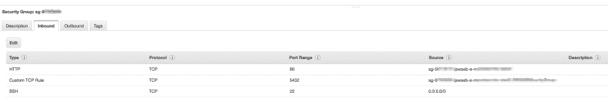

# 基于 RDS 的自动气象站弹性豆茎配置理由

> 原文：<https://dev.to/bloom/deploying-reason-on-aws-ebs-with-rds-2koc>

这不是一个循序渐进的指南。这更像是作者花了太多时间夸大的一些观点，现在已经写下来，希望一些可怜的同道中人(包括同一作者)不必再经历仅仅是为了在 AWS EBS 上运行 Reason 服务所必需的痛苦。

首先要做的是安装`eb`实用程序(当然，`eb`代表“弹性豆茎”)。你可以在`homebrew`或者`pip`上得到它。细节你完全可以自己琢磨出来(祝你好运！).

运行这些命令并按照提示进行操作。大多数情况下，默认值是可以的。

*   `eb init`
*   `eb create`

那都是正常的东西。扣好安全带，了解有趣的细节:

# 捆绑

编译的原因代码取决于包含在`bs-platform` NPM 包中的 javascript。问题是，上述软件包还将构建一个完整的 OCaml 编译器，如果您试图在任何比不小的服务器更小的服务器上部署代码，您将有一段非常艰难的时间。

一个相对简单的解决方案是在发布代码之前做一点捆绑。在部署到 EBS 之前，您将使用`webpack`将编译好的原因代码打包成一个简洁的包。

当读到提到 Webpack 时，你可能会擦擦额头上的汗水，焦虑地告诉自己，一想到必须研究另一个 Webpack 配置，你不会感到后脑勺隐隐作痛。但是不用担心。这是一个很小的文件，很容易理解:

*web pack . config . js*->T2】

```
var nodeExternals = require('webpack-node-externals');

module.exports = {
  entry: './src/index.js',
  target: "node",
  output: {
    filename: 'bundle.js',
    libraryTarget: 'commonjs2',
    path: __dirname
  },
  externals: [nodeExternals({
    whitelist: [/^bs-platform/, /\.bs\.js$/]
  })],
  mode: "development",
  devtool: "sourcemap"
}; 
```

Enter fullscreen mode Exit fullscreen mode

你包含了一个 Webpack 插件，它会自动告诉 Webpack *不要捆绑`node_modules`文件夹中的任何东西。哪个好！因为大部分内容将在部署过程运行时提供`npm install`，这也很好，因为其中的一些内容不会被愉快地捆绑在一起。*

您需要使用下面的命令将该插件添加到您的项目中(假设您使用的是 Yarn)。如果你用的是 NPM，那你就太倒霉了。开玩笑的。你知道该怎么做):

```
yarn add -D webpack-node-externals 
```

Enter fullscreen mode Exit fullscreen mode

[T2】](https://res.cloudinary.com/practicaldev/image/fetch/s--LbTkEQuk--/c_limit%2Cf_auto%2Cfl_progressive%2Cq_auto%2Cw_880/https://thepracticaldev.s3.amazonaws.com/i/0ptcuig2u7zhbngat8w9.jpg)

但是当用键`whitelist`调用`nodeExternals(..)`时，您会看到您已经传递了一个 config 对象。这是你*想要捆绑*的一系列东西。

所以，用更简单的话来重复，你建立了 Webpack，并使用一个插件来说“不要在 node_modules *中捆绑任何东西，除了这个列表*。

这份清单看起来像这样:

`[/^bs-platform/, /\.bs\.js$/]`

这是两个正则表达式。第一个包括从`bs-platform`模块使用的任何 JS，第二个是在 node_modules 内部引用的使用扩展名`.bs.js`的任何文件。

第二个条目很重要，因为当你在开发过程中运行`bsb`编译器时，编译后的 JS 工件会被放到`node_modules`文件夹中(例如像`node_modules/bs-foo/lib/js/foo.bs.js`)。

现在只是:

```
yarn add -D webpack-command
#^ this is smaller and faster than webpack-cli AFAIK 
```

Enter fullscreen mode Exit fullscreen mode

然后是`yarn webpack`，你应该在你的项目的根目录下得到一个生成的`bundle.js`。

然后，您可以将`node bundle.js`添加到 json 包中的`start`命令中，EBS 应该在您部署时执行预期的操作。顺便说一句，您可能希望让您的服务器代码监听`8081`，或者监听`PORT` ENV var 设置的任何内容。

## 清理你的 deps

现在，打开你的 package.json，将每个不是严格的*运行时*依赖的包从`dependencies`移动到`devDependencies`。包括你已经安装的所有 Bucklescript 包(因为你已经把它们打包了)，还有*尤其是*包括`bs-platform`。

# 正在部署

当我第一次尝试部署时，EBS 试图压缩我的整个代码文件夹，包括节点模块，并将其交付部署。这显然是庞大而笨拙的，根本不是我们想要部署的。因此，请这样做:

创建一个名为`.ebignore`的文件，并放入:

 `node_modules/` 

确保尾部的斜线在那里！

之后应该可以`eb deploy`，有一个相对快速的部署。

# RDS

如果不是这个 Node 和 AWS EBS 的前端硕士课程:[https://frontendmasters.com/courses/production-node-aws](https://frontendmasters.com/courses/production-node-aws)，这篇帖子的作者可能还在努力不让自己脸上的小血管爆裂。以下信息摘自该课程。所以如果你有钱想学，考虑给那些 peeps 一些。

第一步，添加 RDS 数据库。这应该很容易自己解决。

下面是更详细的内容。

*   部署 EB 应用程序时，会为它创建一个新的安全组，您可以在 EB 应用程序的配置控制台中找到该安全组的名称。
*   您需要在其配置控制台中将 RDS 实例添加到同一个安全组中。

这可能是令人惊讶的部分。看起来，如果 RDS 实例和 EB 实例在同一个安全组中，它们应该是亲密的安全伙伴，并对各种通信开放。但是没有。

*   您需要编辑该安全组的传入权限，并打开数据库正在监听的端口，以接收来自同一个安全组的传入流量*。你需要告诉它，它可以访问自己！*

[T2】](https://res.cloudinary.com/practicaldev/image/fetch/s--iIFCx-Um--/c_limit%2Cf_auto%2Cfl_progressive%2Cq_auto%2Cw_880/https://thepracticaldev.s3.amazonaws.com/i/p05voxx5uvldy8ul98ax.jpeg)

您将在上面的快照中看到，安全组`sg-9...`现在指定它应该允许端口 5432 上来自安全组`sg-9...`(同一个组)的流量。

完成这些后，EB 和 RDS 应该可以对话了。

## S3

如果您的应用程序使用 S3，您可能会担心您必须做一些愚蠢的恶作剧来允许这个连接，但是它应该“正常工作”(tm)。

# 故障排除小技巧

*   您可以通过键入`eb ssh`SSH 到一个正在运行的 EB 实例
*   流程在用户`nodejs`下运行，但是你不能`su`到那个用户。不要尝试。有人申请了，但被拒绝了。被拒绝很痛苦。
*   节点进程的日志保存在`/var/logs/nodejs/nodejs.log`中
*   您可以使用这个命令`tail -f /var/logs/nodejs/nodejs.log`跟踪这些日志
*   试图手工运行类似`npm start`的东西是一件痛苦的事情。
*   您可以运行`npm install`，首先用`sudo su`切换到根用户，然后运行这个命令:`/opt/elasticbeanstalk/containerfiles/ebnode.py --action npm-install`
*   部署时，您可以在`/tmp/deploy/...`中找到您的应用程序代码
*   部署之后，您可以在`/var/app`中找到您的应用程序代码
*   如果你很难从你的实例连接到其他的机器和端口，你可以从你的 EB 机器运行`nc -vf <host> <port>`看看它是否能到达那个端口。这在弄清楚 EB 和 RDS 之间的联系时帮助很大。

[T2】](https://res.cloudinary.com/practicaldev/image/fetch/s--wfKEBH9R--/c_limit%2Cf_auto%2Cfl_progressive%2Cq_auto%2Cw_880/https://thepracticaldev.s3.amazonaws.com/i/ygoyrhjlpz3nru1nqoi5.jpg)